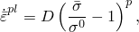
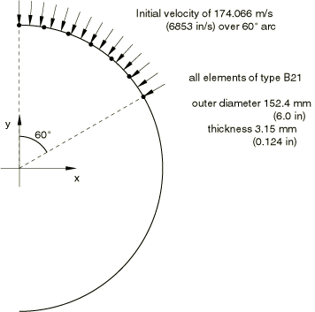
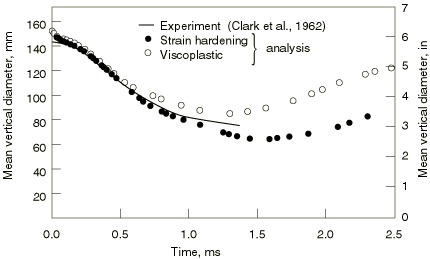
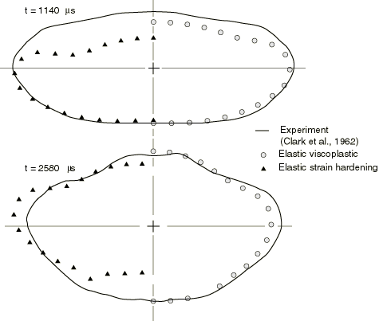
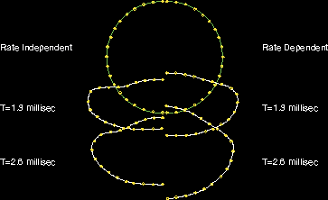
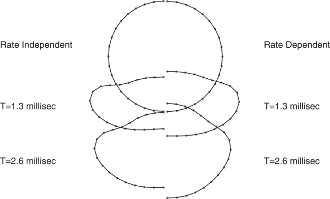
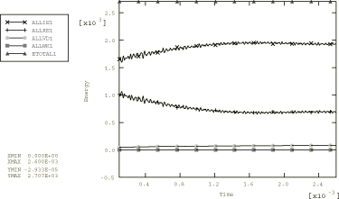
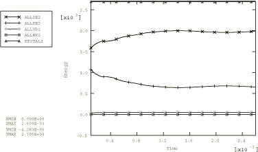

# 1.3.4 Free ring under initial velocity: comparison of rate-independent and rate-dependent plasticity

**Products: **Abaqus/Standard  Abaqus/Explicit  

This example concerns the prediction of the transient response of a free circular ring subjected to a severe explosive loading over a 120 sector of its arc (see [Figure 1.3.4--1](ch01s03ach23.md#sxmfreering-mesh)). This problem is interesting to study numerically because detailed, well-documented results of carefully performed experiments are available (Clark et al., 1962, and Witmer et al., 1963). Furthermore, the case is ideal experimentally because there are no boundary conditions: the ring is unconstrained. Thus, the only possible causes for discrepancy between analysis and experiment are the approximations in the geometric and time-stepping discretizations, the constitutive assumptions, and the initial velocity measurement. In this case we find remarkably good agreement between the numerical results obtained with a strain-rate-dependent (viscoplastic) model and the experimental results. It is presumed that this level of agreement is somewhat fortuitous, since some of the parameters used in the constitutive model are chosen rather arbitrarily. Nevertheless, the trend of the response is so clearly followed by the numerical model that the analysis is certainly encouraging. The primary purpose of the analysis, aside from acting as a benchmark, is to illustrate the sensitivity of the results to different constitutive models, in this case by comparing rate-independent and rate-dependent plasticity models. To this end a reasonably fine geometric model and close tolerance on the automatic time stepping scheme are used to reduce the possibility of these discretizations giving rise to significant errors.

### Problem description

The model is shown in [Figure 1.3.4--1](ch01s03ach23.md#sxmfreering-mesh). The ring has an outer diameter of 152.4 mm (6 in) and thickness of 3.15 mm (0.124 in). The width of the ring is 30.36 mm (1.195 in). Half of the ring is modeled with 18 equal-sized elements, with symmetry boundary conditions at the ends of the model. B21 (linear interpolation beam for planar motion) elements are used in the Abaqus/Standard analysis; the Abaqus/Explicit analysis is first carried out with beam elements (B21) and then with shell elements (S4R). The cross-section integration (for material nonlinearity) is chosen as a seven-point Simpson rule: this should provide reasonable accuracy for a case like this where only a few cycles of reversal plasticity are expected.

The material is 6061–T6 aluminum alloy at room temperature. Its density is 2672 kg/m3 (2.50  104 lb s2/in4). Young's modulus is assumed to be 72.4 GPa (10.5  106 lb/in2), Poisson's ratio is 0.30, and the static yield stress is 295.1 MPa (42800 lb/in2). Two plasticity models are used: one with no rate dependence, but isotropic strain hardening, with a constant tangent modulus of 542.6 MPa (78700 lb/in2); and the standard elastic, viscoplastic model in Abaqus, with the static response assumed to be perfectly plastic and the yield stress given above. When the stress magnitude exceeds this static yield value, the plastic strain rate is given by

where  is the magnitude of the stress,  is the static yield stress,  6500 per second, and  4.

### Initial nodal velocities

The dynamic loading is prescribed by assigning initial velocities to the nodes in the 120 arc on which the explosive is detonated in the experiment. The values of these initial velocities are chosen as 174.1 m/s (6853 in/s) for all nodes except the node at the end of the arc (at the 60 point in the symmetric half-model), where a value of 130.55 m/s (5139.7 in/s) is used. This is done because the velocity field contains a step discontinuity that cannot be reproduced exactly in the finite element model. We adjust the initial velocity at the node corresponding to the velocity discontinuity to match the total kinetic energy. This can be done analytically, since we know the element type (B21) chosen is based on linear interpolation, and so the velocity will vary linearly over each element. Alternatively we can match the energy by numerical trial and error (with some interpolation) by guessing values for this one nodal velocity and running one small dynamic increment, requesting the energy print. In this problem the value is chosen by trial and error, based on matching the initial kinetic energy in the discrete, finite element model to the actual initial kinetic energy in the experiment. The trials used are summarized in [Table 1.3.4--1](ch01s03ach23.md#table-freering-kematchtests).

### Solution controls in Abaqus/Standard

Automatic time stepping is used. An initial time step of 1s is suggested, and the half-increment residual tolerance is set to 27600 N (6210 lb). This is based on a typical force value being the yield force in tension for the ring: about 27600 N (6210 lb). HAFTOL is set to this value to provide a dynamic solution of reasonable accuracy.

### Results and discussion

The results for the two Abaqus/Standard analyses are shown in [Figure 1.3.4--2](ch01s03ach23.md#sxmfreering-meandia-time) and [Figure 1.3.4--3](ch01s03ach23.md#sxmfreering-predict). [Figure 1.3.4--2](ch01s03ach23.md#sxmfreering-meandia-time) shows the mean vertical diameter as a function of time, while [Figure 1.3.4--3](ch01s03ach23.md#sxmfreering-predict) compares deformed shapes against the experimentally recorded shapes at 1.140 ms and at 2.580 ms. The results for the two-dimensional Abaqus/Explicit case using beam elements are shown in [Figure 1.3.4--4](ch01s03ach23.md#exxring-meshes-b21). The original shape and the deformed shapes at 1.3 milliseconds and 2.6 milliseconds are shown. The results for the three-dimensional Abaqus/Explicit case using shell elements are shown in [Figure 1.3.4--5](ch01s03ach23.md#exxring-meshes-shell). The original shape and the deformed shapes at 1.3 milliseconds and 2.6 milliseconds are shown. Results with pipe elements are consistent with those using beam elements.

These plots indicate that the analyses based on the rate-dependent yield model correlate quite well with the experiment: the configuration predictions in [Figure 1.3.4--3](ch01s03ach23.md#sxmfreering-predict) are particularly strong evidence for this. However, as was pointed out above, whether 6061–T6 aluminum has much strain rate dependence is not well-established: the values used for *D* and *p* in the material model are rather arbitrary.

The sensitivity of structural problems of this type to rate dependence is apparent from the difference in the solutions shown here. This, combined with the difficulty of obtaining reliable measurements of the viscoplastic material behavior, points out a limitation on the reliability of such numerical solutions. It should be noted that the problem discussed here is an extreme case of high strain rates; larger, more massive structures (such as large pipes or automobile frames) should not see such high rates, except very locally.

The energy content at the end of the Abaqus/Standard runs is shown in [Table 1.3.4--2](ch01s03ach23.md#table-freering-enrgytotals). At this time (2.6 ms) in both cases about 74% of the total energy has been dissipated as plastic work. The total energy differs from the initial kinetic energy by only 0.02%, indicating that almost no numerical dissipation has occurred. This is because of the small values used for the half-increment residual tolerance and the consequent small time steps. The energy histories for the two-dimensional rate-independent Abaqus/Explicit case are shown in [Figure 1.3.4--6](ch01s03ach23.md#exxring-energyhists-beam). The energy histories for the three-dimensional rate-independent Abaqus/Explicit case are shown in [Figure 1.3.4--7](ch01s03ach23.md#exxring-energyhists-shell).

You can use a C++ program to reduce the amount of data in an output database by extracting results data from only specified frames and copying the data to a new output database that contains identical model data. An example of running this script for the output database generated by the three-dimensional rate-dependent case is given in ["Decreasing the amount of data in an output database by retaining data at specific frames," Section 10.15.4 of the Abaqus Scripting User's Guide](../cmd/cmd-link.md#cmd-odb-intro-exa-odbfilter-cpp).

### Input files

##### **Abaqus/Standard input files**

[freering_plastic.inp](../eif/freering_plastic.inp)

Elastic-plastic model.

[freering_viscoplastic.inp](../eif/freering_viscoplastic.inp)

Elastic, viscoplastic model.

Restart data are requested in both input files, as recommended in cases involving a fairly large number of time steps and nonlinearity to allow for recovery from unanticipated effects.

##### **Abaqus/Explicit input files**

[ringb21.inp](../eif/ringb21.inp)

Two-dimensional rate-independent case using beam elements.

[ringb21_pipe_xpl.inp](../eif/ringb21_pipe_xpl.inp)

Two-dimensional rate-independent case using pipe elements.

[ringshell.inp](../eif/ringshell.inp)

Three-dimensional rate-independent case using shell elements.

[ringb21a.inp](../eif/ringb21a.inp)

Two-dimensional rate-dependent case using beam elements.

[ringb21a_pipe_xpl.inp](../eif/ringb21a_pipe_xpl.inp)

Two-dimensional rate-dependent case using pipe elements.

[ringshella.inp](../eif/ringshella.inp)

Three-dimensional rate-dependent case using shell elements.

[ringb31.inp](../eif/ringb31.inp)

Three-dimensional rate-independent case using beam elements.

[ringb31_pipe_xpl.inp](../eif/ringb31_pipe_xpl.inp)

Three-dimensional rate-independent case using pipe elements.

[ringb31a.inp](../eif/ringb31a.inp)

Three-dimensional rate-dependent case using beam elements.

[ringb31a_pipe_xpl.inp](../eif/ringb31a_pipe_xpl.inp)

Three-dimensional rate-dependent case using pipe elements.

### References

Clark,  E. N., R. H. Schmitt, and D. B. Ellington, “Explosive Impulse of Structures, Picatinny Arsenal,” MIRP (33–616), G1–31, no.5 and 6, 1962.

Witmer,  E. A., H. A. Balmer, J. W. Leach, and T. H. H. Pian, “Large Dynamic Deformations of Beams, Rings, Plates and Shells,” AIAA Journal, vol. 1, no.8, pp. 1848–1857, 1963.

### Tables

**Table 1.3.4–1** Initial velocity kinetic energy matching tests. Experimental kinetic energy value: 302.2 N-m (2675 lb-in).
| Discrete model | 60 node |
| --- | --- |
| kinetic energy | radial velocity |
| N-m | lb-in | m/s | in/s |
| 287.7 | 2547.0 | 87.03 | 3426.5 |
| 303.3 | 2685.0 | 130.55 | 5139.7 |
| 306.2 | 2710.0 | 136.94 | 5391.5 |
| 311.6 | 2758.0 | 148.59 | 5850.0 |
| The second row of the table is used in the analysis. |

**Table 1.3.4–2** Energy totals at 2.6 ms.
| Abaqus/Standard Model | Kinetic energy | Strain energy | Plastic work |
| --- | --- | --- | --- |
| N-m | lb-in | N-m | lb-in | N-m | lb-in |
| Viscoplastic | 72.6 | 643 | 4.9 | 43.1 | 220.9 | 1955 |
| Rate independent | 74.4 | 659 | 2.2 | 19.1 | 221.9 | 1964 |

### Figures

**Figure 1.3.4–1** Mesh for Abaqus/Standard free ring problem.

**Figure 1.3.4–2** Mean diameter of the ring as a function of time, Abaqus/Standard.

**Figure 1.3.4–3** Comparison of predicted configurations for the ring, Abaqus/Standard.

**Figure 1.3.4–4** Original shape and deformed meshes for B21 elements, Abaqus/Explicit.

**Figure 1.3.4–5** Original shape and deformed meshes for shell elements, Abaqus/Explicit.

**Figure 1.3.4–6** Energy histories for the beam model, Abaqus/Explicit.

**Figure 1.3.4–7** Energy histories for the shell model, Abaqus/Explicit.

