# 1.3.6 Motion of a rigid body in Abaqus/Standard

**Product: **Abaqus/Standard  

This problem illustrates the accuracy of the integration of rotations during implicit dynamic calculations on a rotating body whose rotary inertia is different in different directions. ["Implicit dynamic analysis," Section 2.4.1 of the Abaqus Theory Guide](../stm/stm-link.md#stm-anl-dynamics), and ["Rotary inertia element," Section 3.9.7 of the Abaqus Theory Guide](../stm/stm-link.md#stm-elm-rotinertelem), are pertinent to this example. We consider two cases of rigid body dynamics:
- force-free motion of a rigid body; and
- forced motion of a rigid body.

The Euler's equations for the motion of a rigid body in a rotating coordinate system attached to the body are

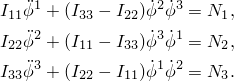

In these relations 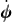 is the body's angular velocity; 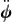 is its angular acceleration; 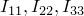 are the second moments of inertia along the principal axes of the body; and 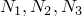 are the torque components acting on the rigid body.

### Force-free motion of a rigid body

We consider here the force-free motion of a symmetric rigid body spinning about its axis of symmetry. The response of such a system is described by Goldstein (1950).

### Problem description

The problem is shown in [Figure 1.3.6--1](ch01s03ach25.md#sxmrigidbodymotion-free-example). An arbitrary symmetric body whose rotary inertia about its axis of symmetry is different from its value along the two other principal axes spins around its axis of symmetry with an initial angular velocity 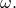 The body is modeled with a ROTARYI element whose second moments of inertia along its principal axes,  (1, 2, 3), have the values 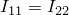 and 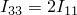. The axis of symmetry is . Dummy nodes are attached rigidly to the ROTARYI element along the principal axes by using a BEAM MPC so that their displacements can be tracked. Since ROTARYI elements have only rotational degrees of freedom, a MASS element is needed on top of the ROTARYI element to activate translational degrees of freedom at these dummy nodes. Initial conditions are taken from the analytical solution presented below.

For the force-free symmetric body 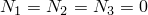 and ; therefore, the Euler's equations reduce to 

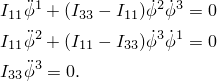

The last equation can be integrated to give 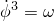, where  is a constant, defined as an initial condition of the problem.

To determine 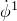, we take the time derivative of the first equation: 

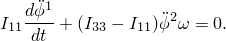

Using the second equation to solve for 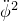 gives 

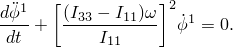

Similarly, 

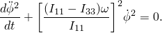

These equations describe simple harmonic motion with angular frequency 

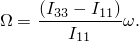

With appropriate initial conditions the solution is 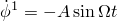, where *A* is a constant. The corresponding solution for 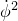 can be found by substituting this solution for  into the first of the Euler equations, giving 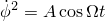. The corresponding initial conditions are 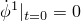, 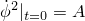, 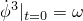. We also choose 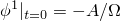, 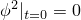, and 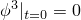. These initial rotation conditions give rise to the local orientation indicated in [Figure 1.3.6--1](ch01s03ach25.md#sxmrigidbodymotion-free-example). The directions of the principal axes of inertia of the body are defined. We choose 0.25, 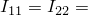1, 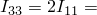2, so that 

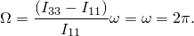

Initial angular velocities, 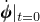, must be applied to node 1, and translational velocities, 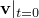, must be applied to the dummy nodes lying along the legs of the axes of the body. The translational velocity components are obtained from 

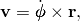

where  is the vector connecting the center of the body (node 1) to one of the nodes along the principal axes (node 2, 3, or 4). This latter initial velocity calculation is performed internally by Abaqus for each dummy node as a result of applying the BEAM MPCs mentioned previously. The model is shown in [rigidbodymotion_free.inp](../eif/rigidbodymotion_free.inp).

The dynamic response of the body subjected to the above initial conditions is tracked for two seconds. Large-rotation theory is used, so the principal axes of inertia rotate with the rotation of the ROTARYI element. Rigid body rotary inertia contributes nonsymmetric terms to the system matrix when the motion is in three dimensions. Therefore, we use the unsymmetric equation solver. Numerical damping is removed from the implicit dynamic operator.

### Results and discussion

The harmonic response for the angular velocity relative to the global coordinate system is obtained in the Abaqus solution and is plotted in [Figure 1.3.6--2](ch01s03ach25.md#sxmrigidbodymotion-free-angvel1), [Figure 1.3.6--3](ch01s03ach25.md#sxmrigidbodymotion-free-angvel2), and [Figure 1.3.6--4](ch01s03ach25.md#sxmrigidbodymotion-free-angvel3). These angular velocity values are obtained from node 1. Noting that 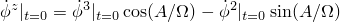, 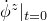 can be calculated as 6.268. This is shown accurately in [Figure 1.3.6--4](ch01s03ach25.md#sxmrigidbodymotion-free-angvel3).

The solutions for  and  obtained above indicate that the vector 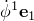 + 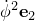 is of constant magnitude and precesses about the body 3-axis with the angular frequency 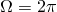. The evolution of this vector with respect to the global coordinate system is plotted in [Figure 1.3.6--5](ch01s03ach25.md#sxmrigidbodymotion-free-pre-vel) as an *X–Y* plot of the history of 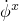 versus the history of 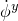 for node 1. As expected, the result traces a circle of diameter *A*. [Figure 1.3.6--6](ch01s03ach25.md#sxmrigidbodymotion-free-pre-rot) shows a similar plot of 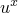 versus 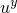 for node 4, viewed by looking down the global *z*-axis.

The precession described by Goldstein is relative to the body axes, which are themselves rotating in space at a frequency of . In large-displacement analysis in Abaqus (geometric nonlinearities considered in the step) the principal axes of inertia rotate with the rotation of the node to which the ROTARYI element is attached. This explains why the period of the motion observed in the figures is 0.5 and not 1.0.

The analysis is completed in 200 increments, with each increment requiring only 1 iteration to satisfy the moment equilibrium criterion.

### Input file

[rigidbodymotion_free.inp](../eif/rigidbodymotion_free.inp)

Implicit force-free motion analysis.

### Figures

**Figure 1.3.6–1** Rigid body rotation example.

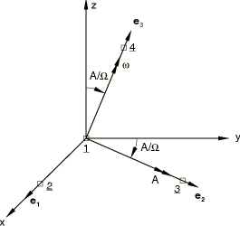

**Figure 1.3.6–2** Angular velocity response (node 1).

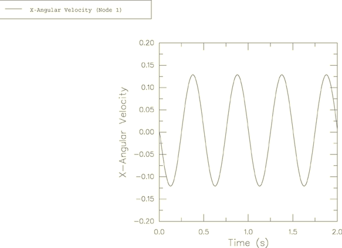

**Figure 1.3.6–3** Angular velocity response (node 1).

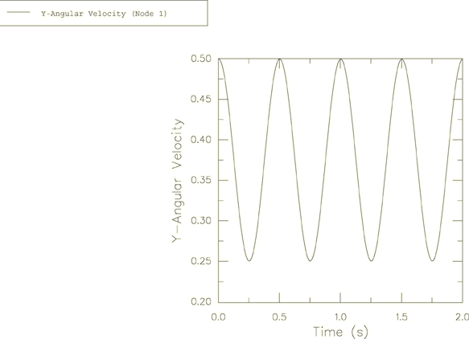

**Figure 1.3.6–4** Angular velocity response (node 1).

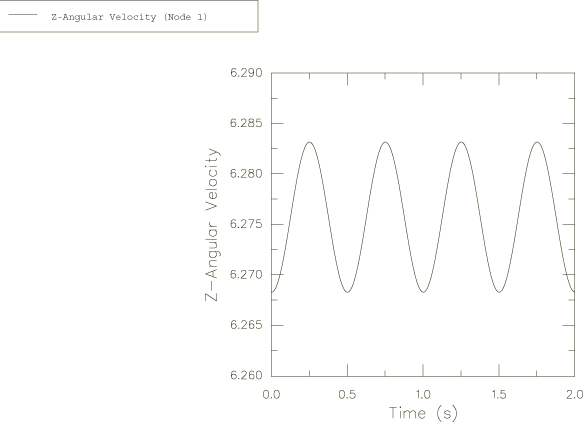

**Figure 1.3.6–5** Precession of angular velocity (node 1).

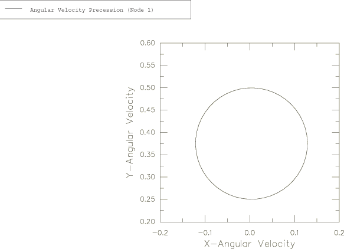

**Figure 1.3.6–6** Precession of rotation (node 4).

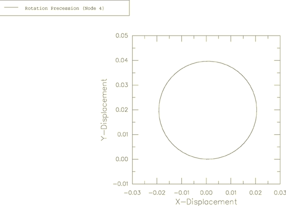

### Forced motion of a rigid body

In this section we study the forced motion of the same symmetrical rigid body. The rigid body is now free to turn about a fixed point; that is, a simple gyroscope (or top) as shown in [Figure 1.3.6--7](ch01s03ach25.md#sxmrigidbodymotion-top). The top is loaded by gravity, which creates a torque around point O. A wide variety of physical systems are approximated by this model.

The torque about the point O, resulting from the action of the gravitational field, is of magnitude 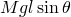, where *l* is the distance from the fixed point O to the center of mass C and  is the inclination of the -axis from the vertical. The Euler equations governing the motion of the top under the action of the gravitational field are

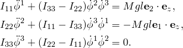

### Problem description

The top is modeled with a ROTARYI element, and a local coordinate system is used to prescribe the second moments of inertia along the principal axes . A 2-node rigid beam element RB3D2 is used to connect the fixed point of the top, O, with its center of mass, C. The effect of the gravitational field is considered by applying a concentrated load of magnitude 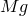 in the *z*-direction at point C. The initial conditions for the angular velocity, , are prescribed in the global system of coordinates. For postprocessing and visualization purposes only, a second RB3D2 element is added at point C in a direction perpendicular to the axis of rotation. The Abaqus solution is compared to the analytical solution, which is outlined in the next section. 

The problem is also solved using connector elements. A CONN3D2 element of type BEAM is used to model the top. A CONN3D2 element of type EULER is used to obtain the Euler angles.

### Analytical solution

The solution for the motion of the symmetric top is described in Goldstein (1980), Whittaker (1988), and Macmillan (1936).

The analytical solution is described in terms of the Euler angles: , where  measures the inclination of the -axis from the vertical,  measures the azimuth of the top about the vertical, and  is the rotation angle of the top around its own -axis. Since the system is conservative, the total energy is constant in time. By denoting , and , the energy conservation equation gives

where  since the body is symmetrical.

The energy equation can be arranged in the following form:

 where  and the constants  have the following form:

In these relations *K* is the moment of momentum with respect to the *z*-axis. Its value is constant in time and is given by

where in terms of Eulerian angles the direction cosines are

The equation of motion for  is an elliptic function of time, and the integration is not straightforward since the function presents singularities.

We can arrange this equation in the following form . The function  has two real roots  and  situated between 1 and +1. The third root  is greater than +1. The top will move such that  always remains between the roots  and , which are called turning angles.

The equation of motion for  can be expressed in terms of these three roots as follows:

By expressing the constants of integration in terms of the three roots, one can obtain the analytical solution of this equation by reducing the elliptic integral to a normal form. This solution is given in Macmillan (1936):

where

In the above equation  and  are elliptic integrals of the first kind and have the following expressions:

where

The values of the elliptic integrals are usually tabulated in calculus books or in mathematical tables. As soon as the roots of the polynomial  are found, we know the solution for the equation of motion.

After determining  from the above equation, the remaining Euler's angles,  and , can be found from

The coordinates of the center of mass of the top in the *x*–*y* plane can be obtained if the first two Euler's angles  and  are known:  and .

### Results and discussion

In this section we will present the comparative results between Abaqus and the analytical solution for two situations often discussed in the literature. Many different response characteristics are possible depending on the initial conditions and inertia properties.

#### Case 1

Let us consider first that the symmetric top is spinning about its own axis , which is fixed in some direction 20. At time  the symmetry or figure axis is released, and the top rotates around the -axis with angular velocity  50. In addition to the angular velocity around the symmetry axis, we prescribe an angular velocity  0.5 around the - or -axis. Usually the motion of the top is depicted by tracing the curve of the intersection of the -axis on a sphere of unit radius. This curve is called the “locus” of the figure axis. In our representation we will trace the projection of the locus in the *x*–*y* plane. According to the analytical solution, the ratio  lies between the roots  and , and the locus of the top axis exhibits loops (Goldstein, 1980).

We have chosen the length of the top axis  1 and  20. The initial velocities in Abaqus are prescribed in the global coordinate system; therefore, the two components of the angular velocities  17.101 and  46.9846 in the global system will create a resultant angular velocity  50 in the local system ([Figure 1.3.6--7](ch01s03ach25.md#sxmrigidbodymotion-top)). The initial velocity in the global *x*-direction is the same as the initial velocity in the local -direction. The turning angles, obtained by solving the equation , are  0.9517 and  0.9112 or  24.32 and  17.88, respectively. Based on the fact that the first Euler angle, , is equal to the spherical angle used in the polar representation, the variation of this angle in time is obtained in Abaqus from the displacements. The turning angles are reproduced accurately in Abaqus, and the analytical solution is in good agreement with the Abaqus solution. This comparison is shown in [Figure 1.3.6--8](ch01s03ach25.md#sxmrigidbodymotion-theta1).

The numerical damping coefficient ALPHA was taken equal to zero in the direct integration scheme used in Abaqus. It is worth mentioning that the analytical solution is an approximate solution since the accuracy of this solution will depend on the number of terms taken in the expansion series and on the accuracy with which the elliptic integrals are evaluated. The projection on the *x*–*y* plane of the top's locus is depicted in [Figure 1.3.6--9](ch01s03ach25.md#sxmrigidbodymotion-locus1), where the analytical solution and the Abaqus solution are shown. The locus exhibits loops along with precession in the counterclockwise direction. The Abaqus solution agrees with the analytical solution; however, the analytical solution is extremely sensitive to the values of the elliptic integrals taken from the tables. 

The averaged precession frequency prediction can be found from the analytical solution for a fast top; that is, a top that has a large initial kinetic energy compared to the maximum change in the potential energy. The theoretical averaged precession frequency is

The total time for the complete precession in the *x*–*y* plane is 15 s, and the precession frequency given by Abaqus is, therefore, .

The change in the potential energy is reflected in the external work; due to the small applied force and small displacements, the exernal work has small values. Therefore, the total energy is approximately equal to the kinetic energy of the system. The total energy and the external work obtained in Abaqus are presented in [Figure 1.3.6--10](ch01s03ach25.md#sxmrigidbodymotion-totale1) and [Figure 1.3.6--11](ch01s03ach25.md#sxmrigidbodymotion-wk1), respectively. For better visualization, the time variation of the external work is shown in [Figure 1.3.6--11](ch01s03ach25.md#sxmrigidbodymotion-wk1) only for the first 3 s of the spinning process.

#### Case 2

A second case assumes that the top is spinning only about its own axis. For this case the ratio  coincides with one of the roots of the polynomial , and the locus of the top axis exhibits cusps touching circles (Goldstein, 1980). In this case we prescribe only the angular velocity around the -axis,  50. All of the other parameters are kept the same as before. The “turning” angles are obtained by solving again the equation  with the new coefficients and are found to be  21.76 and  20, respectively. The variation in time of the first Euler angle, , is presented in [Figure 1.3.6--12](ch01s03ach25.md#sxmrigidbodymotion-theta2) the first 3 s of the process. The projection of the top's locus on the *x*–*y* plane, obtained in Abaqus, is presented in the [Figure 1.3.6--13](ch01s03ach25.md#sxmrigidbodymotion-locus2) where the analytical solution is also shown. The total energy and external work done for this case are presented in [Figure 1.3.6--14](ch01s03ach25.md#sxmrigidbodymotion-totale2) and [Figure 1.3.6--15](ch01s03ach25.md#sxmrigidbodymotion-wk2).

Abaqus/Explicit is also used to study the forced motion of the rigid top presented in this section. Due to the explicit time integration, the running time is less in Abaqus/Explicit. The top is modeled using a rigid R3D4 element and a ROTARYI element. The rigid body reference node is identical to the node of the ROTARYI element.

The problem is also solved in Abaqus/Explicit and Abaqus/Standard using connector elements. The Euler angles are obtained directly (in radians) as output variable CPR. The solution obtained using connector elements agrees well with the analytical solution.

### Input files

[rigidbodymotion_forced_std.inp](../eif/rigidbodymotion_forced_std.inp)

Implicit forced motion analysis.

[rigidbodymotion_verify.f](../eif/rigidbodymotion_verify.f)

Code used to generate the analytical solution.

[rigidbodymotion_forced_xpl.inp](../eif/rigidbodymotion_forced_xpl.inp)

Forced motion analysis with Abaqus/Explicit.

[rigidbodymotion_conn_f_std.inp](../eif/rigidbodymotion_conn_f_std.inp)

Forced motion analysis in Abaqus/Standard, using connector elements.

[rigidbodymotion_conn_f_xpl.inp](../eif/rigidbodymotion_conn_f_xpl.inp)

Forced motion analysis in Abaqus/Explicit, using connector elements.

### References

Goldstein,  H., *Classical Mechanics, *Second Edition, Addison-Wesley, 1980.

Fowles,  G. R., *Analytical Mechanics, *Third Edition, Holt, Rinehart and Winston, 1977.

MacMillan,  W. D., *Dynamics of Rigid Bodies, *First Edition, McGraw-Hill Book, 1936.

### Figures

**Figure 1.3.6–7** Symmetric top.

**Figure 1.3.6–8** The variation of the first Euler angle, , for the first 3 s of the process—case 1.

**Figure 1.3.6–9** The locus of the top in the *x*–*y* plane—case 1.

**Figure 1.3.6–10** Total energy—case 1.

**Figure 1.3.6–11** The external work done for the first 3 s of the process—case 1.

**Figure 1.3.6–12** The variation of the first Euler angle, , for the first 3 s of the process—case 2.

**Figure 1.3.6–13** The locus of the top in the *x*–*y* plane—case 2.

**Figure 1.3.6–14** Total energy—case 2.

**Figure 1.3.6–15** The external work done for the first 3 s of the process—case 2.

