# 1.3.7 Rigid body dynamics with Abaqus/Explicit

**Product: **Abaqus/Explicit  

### Problem description

This section verifies the rigid body dynamic behavior predicted with Abaqus/Explicit by comparison with analytical solutions. [Figure 1.3.7--1](ch01s03ach26.md#exxrigiddyn-inertia-1dof) shows the geometry of the system considered. A single rigid body is under the action of two springs, with one attached to the rigid body and the other in contact with the rigid body. A point load is also applied to the rigid body. The rigid body is constrained at the reference node to undergo planar motion. Several two-dimensional and three-dimensional analyses based on this geometry are performed. For all cases a dummy continuum element is used to control the time incrementation.

In the first problem only rotation about the out-of-plane axis is allowed at the reference node and all the translational degrees of freedom are constrained. The inertial properties of the rigid body are represented with mass 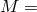 20 and inertia about the axis normal to the plane of motion  65 at the reference node. The two springs each have a stiffness equal to 1.0  106. The mass, *m*, where the spring node comes in contact with the rigid body, is 5. The force applied, *F*, is 1.0  105. The initial angular velocity of the rigid body, 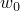, is 10. The end of the spring that is in contact with the rigid body has an initial velocity such that contact is already established at time  0. The various quantities above are in a consistent set of units.

A variation of the first problem is considered (see [Figure 1.3.7--2](ch01s03ach26.md#exxrigiddyn-mass-1dof)) in which the rigid body reference node location does not correspond to the center of mass of the rigid body. Point masses are specified on the rigid body surface nodes, 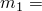 10, 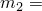 10 (in three dimensions the surface node masses are each 5 since there are twice as many surface nodes); and the rotary inertia and the mass elements at the reference node are removed. The magnitude of the point masses is chosen such that the moment of inertia of the rigid body about the location of the pin constraint is the same as in the original problem; thus, the analytical solution for the rotational response is also the same.

Another variation of the original problem considered here, shown in [Figure 1.3.7--3](ch01s03ach26.md#exxrigiddyn-inertia-2dof), is to allow translation parallel to the spring elements in addition to the rotation about the out-of-plane axis. The force applied is changed to  1.0  105; the initial angular velocity, , is 10; and the initial velocity, , is 15. The initial velocity for the spring node in contact is chosen such that contact is already established at time  0.

A final variation of the problem is obtained by replacing the mass element and inertia element specified at the reference node with the surface masses forming the problem shown in [Figure 1.3.7--4](ch01s03ach26.md#exxrigiddyn-mass-2dof). The analytical solutions for the two active degrees of freedom are not the same for the last two problems since the reference node is allowed to translate.

### Results and discussion

[Figure 1.3.7--5](ch01s03ach26.md#exxrigiddyn-rotate-1dof) shows numerical solutions of the rotational response from the four analyses in which only rotation is allowed at the reference node and compares these solutions with a corresponding analytical solution based on the small-rotation assumption. For the problem shown in [Figure 1.3.7--3](ch01s03ach26.md#exxrigiddyn-inertia-2dof) the rotational and translational solutions are compared with the analytical solutions in [Figure 1.3.7--6](ch01s03ach26.md#exxrigiddyn-trans-1dof) and [Figure 1.3.7--7](ch01s03ach26.md#exxrigiddyn-rotate-2dof), respectively. Comparisons for the problem shown in [Figure 1.3.7--4](ch01s03ach26.md#exxrigiddyn-mass-2dof) are presented in [Figure 1.3.7--8](ch01s03ach26.md#exxrigiddyn-trans-2dof) and [Figure 1.3.7--9](ch01s03ach26.md#exxrigiddyn-rotate-2dof-mass). The results are in close agreement for all cases. The deviations from the analytical solutions observed in [Figure 1.3.7--8](ch01s03ach26.md#exxrigiddyn-trans-2dof) and [Figure 1.3.7--9](ch01s03ach26.md#exxrigiddyn-rotate-2dof-mass) as the analysis progresses are the result of effects from the observed large rotations, which are not accounted for in the analytical solution.

### Input files

[rbd_2d_i_xybc.inp](../eif/rbd_2d_i_xybc.inp)

Two-dimensional model with only a rotation active in the rigid body and a rotary inertia element at the reference node.

[rbd_2d_i_xbc.inp](../eif/rbd_2d_i_xbc.inp)

Two-dimensional model with one rotation and one translational degree of freedom active in the rigid body and a rotary inertia element at the reference node.

[rbd_2d_sm_xybc.inp](../eif/rbd_2d_sm_xybc.inp)

Similar to rbd_2d_i_xybc.inp but with the rigid body modeled using point masses distributed on the surface nodes.

[rbd_3d_i_xybc.inp](../eif/rbd_3d_i_xybc.inp)

Three-dimensional analysis similar to rbd_2d_i_xybc.inp.

[rbd_3d_sm_xybc.inp](../eif/rbd_3d_sm_xybc.inp)

Three-dimensional analysis similar to rbd_2d_i_xybc.inp but with the rigid body modeled using point masses distributed on the surface nodes.

[rbd_2d_sm_xbc.inp](../eif/rbd_2d_sm_xbc.inp)

Similar to rbd_2d_i_xbc.inp but with the rigid body modeled using point masses distributed on the surface nodes.

[rbd_3d_i_xbc.inp](../eif/rbd_3d_i_xbc.inp)

Three-dimensional analysis similar to rbd_2d_i_xbc.inp.

[rbd_3d_sm_xbc.inp](../eif/rbd_3d_sm_xbc.inp)

Three-dimensional analysis similar to rbd_2d_i_xbc.inp but with the rigid body modeled using point masses distributed on the surface nodes.

### Figures

**Figure 1.3.7–1** Rigid body with an inertia element and having only rotation about the out-of-plane axis active at the reference node.

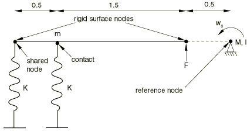

**Figure 1.3.7–2** Rigid body with mass distributed at the surface nodes and having only rotation about the out-of-plane axis active at the reference node.

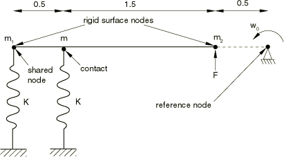

**Figure 1.3.7–3** Rigid body with an inertia element and having one rotation and one translation active at the reference node.

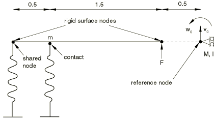

**Figure 1.3.7–4** Rigid body with mass distributed at the surface nodes and having one rotation and one translation active at the reference node.

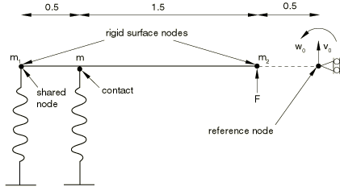

**Figure 1.3.7–5** Predicted rigid body rotation compared with the analytical solution when only one rotational degree of freedom is active for the rigid body.

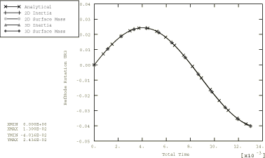

**Figure 1.3.7–6** Predicted rigid body translation compared with the analytical solution when rotary inertia is specified and two degrees of freedom are active at the reference node.

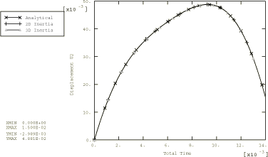

**Figure 1.3.7–7** Predicted rigid body rotation compared with the analytical solution when rotary inertia is specified and two degrees of freedom are active at the reference node.

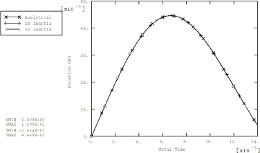

**Figure 1.3.7–8** Predicted rigid body translation compared with the analytical solution when mass is distributed at the rigid body surface nodes and two degrees of freedom are active at the reference node.

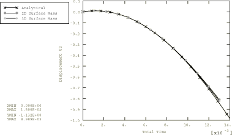

**Figure 1.3.7–9** Predicted rigid body rotation compared with the analytical solution when mass is distributed at the rigid body surface nodes and two degrees of freedom are active at the reference node.

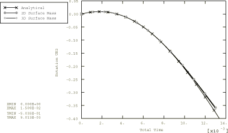

