# 1.3.10 Impact of a copper rod

**Product: **Abaqus/Explicit  

This example simulates the high velocity impact of a copper rod onto a rigid wall. Such tests are performed to determine the material constants for high-pressure equations of state. The test is sometimes described as the Taylor bar experiment. Extremely high plastic strains develop at the crushed end of the rod, resulting in severe local mesh distortion.

### Problem description

The problem consists of a 32.4 mm long cylindrical rod with a radius of 3.2 mm, impacting a rigid wall with an initial velocity of 227 m/sec. The rod is made of copper, with Young's modulus of 110 GPa and Poisson's ratio of 0.3. The density is 8970 kg/m3. A von Mises elastic, perfectly plastic material model is used with a yield stress of 314 MPa.

The rod is modeled first using a 10  36 mesh of axisymmetric quadrilateral elements (type CAX4R), as shown in [Figure 1.3.10--1](ch01s03ach29.md#exxrodimpact-cax4r-mesh). Zero radial displacements are imposed along the symmetry axis. To simulate the impact of the rod on a (frictionless) rigid wall, zero axial displacements are prescribed at one end of the rod, while all other nodes are subjected to a 227 m/sec initial velocity. While this technique is appropriate for modeling the crushing of the front end of the rod in the absence of friction or rebound, a contact pair should be used if there are significant friction effects or if separation between the rod and the rigid wall is expected. Different hourglass control options are analyzed by modifying the section controls for the CAX4R element.

A three-dimensional analysis is also performed for the same problem. One quadrant of the rod is discretized, using 2700 solid elements of type C3D8R, with the appropriate boundary conditions prescribed on each of the two symmetry planes for the problem (see [Figure 1.3.10--4](ch01s03ach29.md#exxrodimpact-c3d8r-mesh)). Again, zero longitudinal displacements are prescribed at one end of the rod, while all other nodes are subjected to a 227 m/sec initial velocity. Different hourglass control options and kinematic formulations are analyzed by modifying the section controls for the C3D8R element. Element section controls are used to modify the element formulation to reduce the analysis time. These options result in fewer element-level calculations and do not change the stable time increment size.

In addition, two- and three-dimensional analyses of the rod impact are performed using modified triangular (CAX6M) and tetrahedral (C3D10M) elements. The models for the modified element meshes are shown in [Figure 1.3.10--7](ch01s03ach29.md#exxrodimpact-cax6m-mesh) and [Figure 1.3.10--10](ch01s03ach29.md#exxrodimpact-c3d10m-mesh); these meshes incorporate the same number of nodes per side as the analogous quadrilateral and brick meshes.

The high velocity impact causes severe mesh distortion in elements near the front end of the rod, thereby dramatically reducing the stable time increment during the solution. Therefore, both the axisymmetric and the three-dimensional analyses are also performed with variable mass scaling to scale the masses of the elements that become very small. The scaling is defined such that the stable time increments do not fall below a prescribed minimum.

Eulerian elements have advantages over Lagrangian elements when handling severe element distortions. Therefore, a three-dimensional Eulerian analysis is also performed for the rod impact problem. The size of the Eulerian domain is 35.0 mm  10.0 mm. The initial volume fraction of the copper material is specified such that the material occupies the same region as the rod in the three-dimensional Lagrangian analyses. The rod part of the Eulerian mesh is shown in [Figure 1.3.10--14](ch01s03ach29.md#bmk-anl-rodimpact-eul-finemesh). 

The area of interest of the rod impact problem is near the front end of the rod where large plastic deformation occurs. Less mesh resolution is needed in the rest of the Eulerian domain. For better computational efficiency, an Eulerian analysis is performed with adaptive mesh refinement. The analysis starts with a coarsely discretized rod as shown in [Figure 1.3.10--13](ch01s03ach29.md#bmk-anl-rodimpact-eul-coarsemesh). During the analysis, elements with equivalent plastic strain greater than 0.1 are refined and divided into subelements with the same size as those in [Figure 1.3.10--14](ch01s03ach29.md#bmk-anl-rodimpact-eul-finemesh). For comparison, an Eulerian analysis with the coarse mesh shown in [Figure 1.3.10--13](ch01s03ach29.md#bmk-anl-rodimpact-eul-coarsemesh) is also performed.

### Results and discussion

[Table 1.3.10--1](ch01s03ach29.md#table-rodimpact-analopts) shows the section control and mass scaling options used for the analysis.

For the axisymmetric model using CAX4R elements the deformed shapes of the rod after 20 and 80 microseconds are shown in [Figure 1.3.10--2](ch01s03ach29.md#exxrodimpact-cax4r-20ms) and [Figure 1.3.10--3](ch01s03ach29.md#exxrodimpact-cax4r-80ms) for the combined hourglass control. The results for the three-dimensional model using C3D8R elements are shown in [Figure 1.3.10--5](ch01s03ach29.md#exxrodimpact-c3d8r-20ms) and [Figure 1.3.10--6](ch01s03ach29.md#exxrodimpact-c3d8r-80ms) for the orthogonal kinematic and combined hourglass section controls. The deformed shapes are also shown in [Figure 1.3.10--8](ch01s03ach29.md#exxrodimpact-cax6m-20ms) and [Figure 1.3.10--9](ch01s03ach29.md#exxrodimpact-cax6m-80ms) for the axisymmetric model using CAX6M elements and in [Figure 1.3.10--11](ch01s03ach29.md#exxrodimpact-c3d10m-20ms) and [Figure 1.3.10--12](ch01s03ach29.md#exxrodimpact-c3d10m-80ms) for the three-dimensional model using C3D10M elements. The results reproduce the behavior observed by Ferencz (1989).

From these figures it is clear that extremely high plastic strains develop at the crushed end of the rod, close to the axis of symmetry, resulting in severe local mesh distortion. The shortening and widening of the bar are reported in [Table 1.3.10--2](ch01s03ach29.md#table-rodimpact-shortwide) for the different analysis cases. The values of the bar's spread are reported for the symmetric model, and the three-dimensional values are reported as the *y*-component displacement at node 91 for the model using C3D8R elements and at node 61 for the model using C3D10M elements.

The displacements and energies obtained from the analyses using different element types and section controls agree very well, except in the case of the model that uses C3D10M elements. These elements are slightly stiffer with the given mesh refinement, as demonstrated by the predicted shortening value of 12.71 in [Table 1.3.10--2](ch01s03ach29.md#table-rodimpact-shortwide). This shortening value converges as the mesh is refined to the values obtained from the analyses that use other element types. Differences are less pronounced for the variations of the C3D8R element. Using the orthogonal kinematic and enhanced hourglass control formulations produces a solution similar to that for the analysis that uses the default section control parameters.

Without any mass scaling the stable time increment for the problem is observed to reduce dramatically over the course of this analysis as a result of the large changes in element aspect ratio. Local mass scaling increases the stable time increment and, thus, reduces the total time of the simulation. A comparison of the stable time increment time histories for the unscaled and scaled cases is shown in [Figure 1.3.10--20](ch01s03ach29.md#exxrodimpact-freeenddisp). The minimum allowable stable time increment chosen resulted in a 5.9% increase in the overall mass of the rod by the end of the simulation. Although this percentage is substantial, all of the scaling is performed on the severely compressed elements near the rigid wall. Thus, the overall dynamics of the solution are unchanged, while the solution time is approximately one-third that of the unscaled case. The predicted maximum effective plastic strain for the scaled case is 5.876, which is 1.2% higher than the maximum obtained in the unscaled analysis (using the default section control options). Comparisons of kinetic energy and free end displacement time histories of the rod show excellent agreement and are presented in [Figure 1.3.10--19](ch01s03ach29.md#exxrodimpact-ketimehist) and [Figure 1.3.10--20](ch01s03ach29.md#exxrodimpact-freeenddisp), respectively.

The results for the Eulerian analyses with a coarse mesh and a fine mesh are shown in [Figure 1.3.10--15](ch01s03ach29.md#bmk-anl-rodimpact-eul-coarse-deform) and [Figure 1.3.10--16](ch01s03ach29.md#bmk-anl-rodimpact-eul-fine-deform). The results of the Eulerian analysis with adaptive mesh refinement are also shown in [Figure 1.3.10--17](ch01s03ach29.md#bmk-anl-rodimpact-eul-adapt-deform). By comparing the final deformation of the rod, we find the results with adaptive mesh refinement are much more accurate than those without refinement. These results also agree very well with those obtained with a fully refined mesh. We can draw the same conclusion by comparing the energy results from these analyses, as shown in [Figure 1.3.10--21](ch01s03ach29.md#bmk-anl-rodimpact-eul-energy).

### Input files

[rodimpac2d_cs.inp](../eif/rodimpac2d_cs.inp)

Axisymmetric case using COMBINED hourglass control.

[rodimpac2d_es.inp](../eif/rodimpac2d_es.inp)

Axisymmetric case using ENHANCED hourglass control.

[rodimpac3d_ocs.inp](../eif/rodimpac3d_ocs.inp)

Three-dimensional case using the ORTHOGONAL kinematic and the COMBINED hourglass section control options.

[rodimpac3d_oes.inp](../eif/rodimpac3d_oes.inp)

Three-dimensional case using the ORTHOGONAL kinematic and the ENHANCED hourglass section control options.

[rodimpac2d.inp](../eif/rodimpac2d.inp)

Axisymmetric case using the default section controls.

[rodimpac3d.inp](../eif/rodimpac3d.inp)

Three-dimensional case using the default section controls.

[rodimpac3d_aes.inp](../eif/rodimpac3d_aes.inp)

Three-dimensional case using the default kinematic and the ENHANCED hourglass section control options.

[rodimpac2dms.inp](../eif/rodimpac2dms.inp)

Axisymmetric case using the default section controls with mass scaling.

[rodimpac3dms.inp](../eif/rodimpac3dms.inp)

Three-dimensional case using the default section controls with mass scaling.

[rodimpac3d_cvs.inp](../eif/rodimpac3d_cvs.inp)

Analysis using the CENTROID kinematic and the VISCOUS hourglass section control options.

[rodimpac2d_cax6m.inp](../eif/rodimpac2d_cax6m.inp)

Analysis using the modified elements CAX6M.

[rodimpac3d_c3d10m.inp](../eif/rodimpac3d_c3d10m.inp)

Analysis using the modified elements C3D10M.

[rodimpac2d_j_c.inp](../eif/rodimpac2d_j_c.inp)

Test of the Johnson-Cook plasticity model for the axisymmetric case. The material properties used in this and the following three input files are taken from Johnson and Cook (1985).

[rodimpac3d_j_c.inp](../eif/rodimpac3d_j_c.inp)

Test of the Johnson-Cook plasticity model for the three-dimensional case.

[rodimpac2d_jcs.inp](../eif/rodimpac2d_jcs.inp)

Test of the Johnson-Cook shear failure model for the axisymmetric case.

[rodimpac3d_jcs.inp](../eif/rodimpac3d_jcs.inp)

Test of the Johnson-Cook shear failure model for the three-dimensional case.

[rodimpac3d_jcs_gcont.inp](../eif/rodimpac3d_jcs_gcont.inp)

Test of the Johnson-Cook shear failure model using the general contact capability for the three-dimensional case.

[eulerian_rodimpact.inp](../eif/eulerian_rodimpact.inp)

Three-dimensional case using a uniform Eulerian mesh.

[eulerian_rodimpact_fine.inp](../eif/eulerian_rodimpact_fine.inp)

Three-dimensional case using a finer uniform Eulerian mesh.

[eulerian_rodimpact_adapt.inp](../eif/eulerian_rodimpact_adapt.inp)

Three-dimensional case using a uniform Eulerian mesh with adaptive mesh refinement.

Two additional models are included with the Abaqus release for the purpose of testing the performance of the code (file names: [rodimpac2d_fine.inp](../eif/rodimpac2d_fine.inp) and [rodimpac3d_fine.inp](../eif/rodimpac3d_fine.inp)).

### References

Ferencz,  R. M., “Element-by-Element Preconditioning Techniques for Large-Scale, Vectorized Finite Element Analysis in Nonlinear Solid and Structural Mechanics,” Ph. D. Dissertation, Stanford University, Stanford, CA, 1989.

Johnson,  G. R., and W. H. Cook, “Fracture Characteristics of Three Metals Subjected to Various Strains, Strain rates, Temperatures and Pressures,” Engineering Fracture Mechanics, vol. 21, no.1, pp. 31–48, 1985.

### Tables

**Table 1.3.10–1** Analysis options.
| Analysis Case | Variable Mass Scaling | Section Controls |
| --- | --- | --- |
| Kinematic | Hourglass |
| CAX4R | no | n/a | integral viscoelastic |
| CAX4R CS | no | n/a | combined |
| CAX4R ES | no | n/a | enhanced |
| CAX4R MS | yes | n/a | integral viscoelastic |
| C3D8R | no | average strain | integral viscoelastic |
| C3D8R MS | yes | average strain | integral viscoelastic |
| C3D8R OCS | no | orthogonal | combined |
| C3D8R OES | no | orthogonal | enhanced |
| C3D8R AES | no | average strain | enhanced |
| C3D8R CVS | no | centroid | viscous |
| CAX6M | no | n/a | n/a |
| C3D10M | no | n/a | n/a |

**Table 1.3.10–2** Shortening and spread of the rod.
| Analysis Case | Shortening (mm) | Widening (mm) | Relative CPU Time | Relative Cost per Increment per Element |
| --- | --- | --- | --- | --- |
| CAX4R | 13.11 | 6.006 | 1.0 | 1.0 |
| CAX4R CS | 13.12 | 6.063 | 1.03 | 1.04 |
| CAX4R ES | 13.15 | 5.521 | 0.82 | 1.09 |
| CAX4R MS | 13.11 | 6.020 | 0.45 | 1.39 |
| C3D8R | 13.10 | 5.528 | 11.5 | 1.86 |
| C3D8R MS | 13.10 | 5.532 | 4.9 | 1.92 |
| C3D8R OCS | 13.11 | 5.552 | 9.7 | 1.88 |
| C3D8R CVS | 13.13 | 5.945 | 6.65 | 1.39 |
| C3D8R OES | 13.18 | 5.59 | 11.82 | 1.98 |
| C3D8R AES | 13.18 | 5.58 | 12.98 | 2.32 |
| CAX6M | 13.13 | 5.987 | 1.16 | 2.91 |
| C3D10M | 12.71 | 5.988 | 22.5 | 5.83 |

### Figures

**Figure 1.3.10–1** Original mesh (CAX4R model).

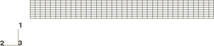

**Figure 1.3.10–2** Deformed shape at 20 microseconds (CAX4R model using the combined hourglass control).

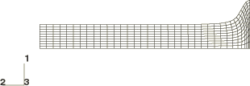

**Figure 1.3.10–3** Deformed shape at 80 microseconds (CAX4R model using the combined hourglass control).

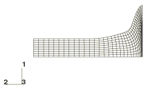

**Figure 1.3.10–4** Original mesh (C3D8R model).

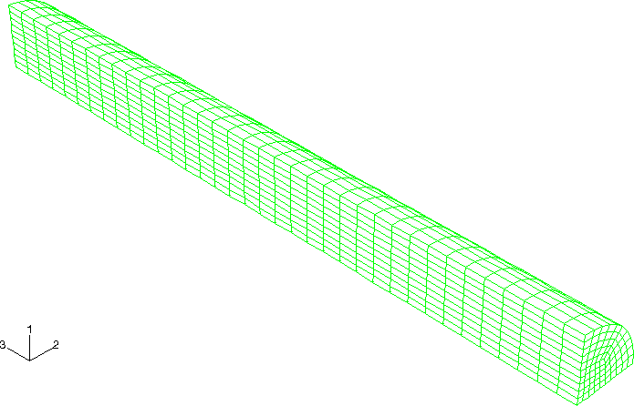

**Figure 1.3.10–5** Deformed shape at 20 microseconds (C3D8R model using the orthogonal kinematic and combined hourglass section control options).

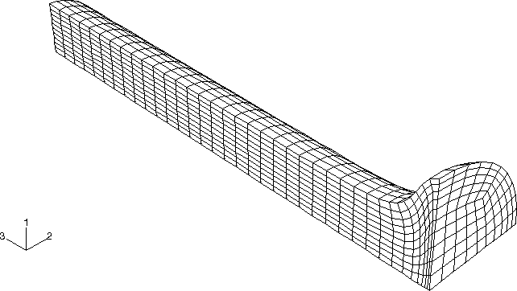

**Figure 1.3.10–6** Deformed shape at 80 microseconds (C3D8R model using the orthogonal kinematic and combined hourglass section control options).

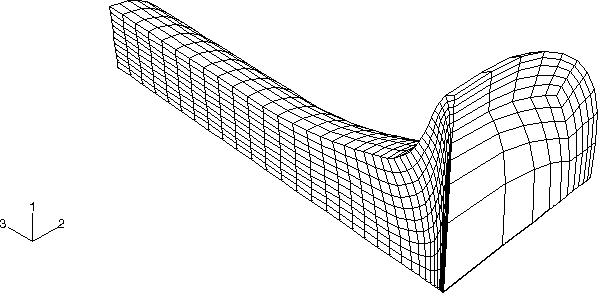

**Figure 1.3.10–7** Original mesh (CAX6M model).

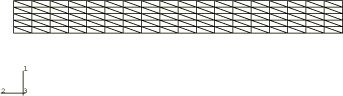

**Figure 1.3.10–8** Deformed shape at 20 microseconds (CAX6M model).

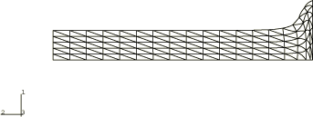

**Figure 1.3.10–9** Deformed shape at 80 microseconds (CAX6M model).

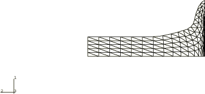

**Figure 1.3.10–10** Original mesh (C3D10M model).

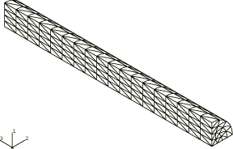

**Figure 1.3.10–11** Deformed shape at 20 microseconds (C3D10M model).

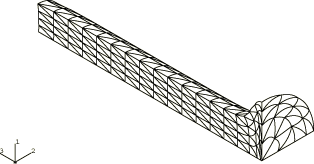

**Figure 1.3.10–12** Deformed shape at 80 microseconds (C3D10M model).

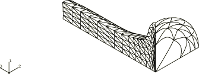

**Figure 1.3.10–13** Coarse Eulerian mesh (only the rod part is shown).

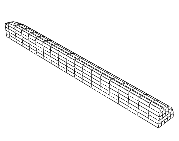

**Figure 1.3.10–14** Fine Eulerian mesh (only the rod part is shown).

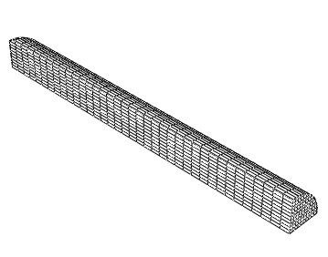

**Figure 1.3.10–15** Deformation shape at 80 microseconds (coarse Eulerian mesh model).

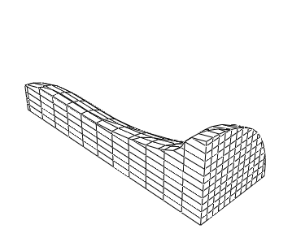

**Figure 1.3.10–16**  Deformation shape at 80 microseconds (fine Eulerian mesh model).

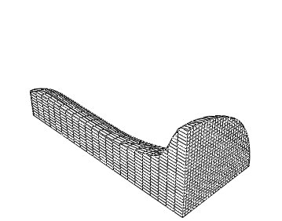

**Figure 1.3.10–17**  Deformation shape at 80 microseconds (adaptive Eulerian mesh model).

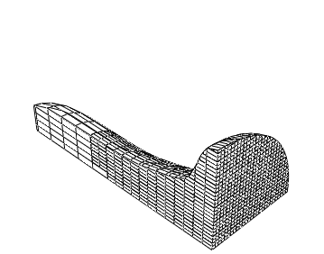

**Figure 1.3.10–18** Time history of the stable time step size (see [Table 1.3.10--1](ch01s03ach29.md#table-rodimpact-analopts) for the analysis options used).

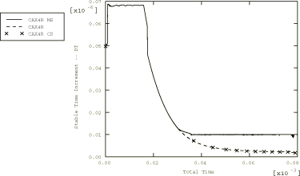

**Figure 1.3.10–19** Time history of the total kinetic energy (see [Table 1.3.10--1](ch01s03ach29.md#table-rodimpact-analopts) for the analysis options used).

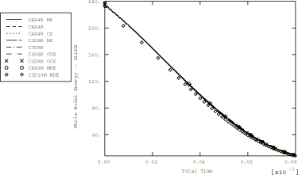

**Figure 1.3.10–20** Time history of the free end displacement (see [Table 1.3.10--1](ch01s03ach29.md#table-rodimpact-analopts) for the analysis options used).

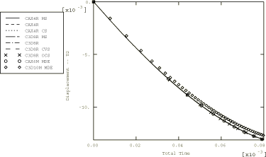

**Figure 1.3.10–21** Time history of the total kinetic energy.

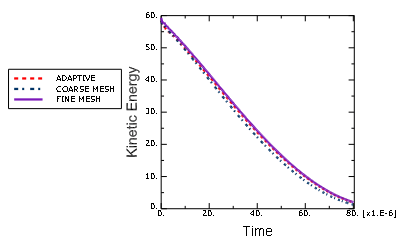

