# 1.3.11 Frictional braking of a rotating rigid body

**Product: **Abaqus/Explicit  

### Problem description

The problem consists of a rigid drum, initially rotating at  60 rad/s about a fixed axis, that is brought to rest by frictional contact with a pad of hyperelastic material. The rigid drum has a radius *R* of 200 mm and width of 150 mm, total mass of 5 kg, and rotary inertia of 0.175 kg m2 about its free axis of rotation. The deformable pad is a 100  100  50 mm block of hyperelastic material, having a polynomial strain energy function of order  1 with constants  0.552 MPa,  0.138 MPa and  0.145  106 MPa. A constant pressure  0.350 MPa is applied to the back of the pad to force it against the rigid drum. A Coulomb friction coefficient of 15% is assumed to exist between the pad and the drum. Both two-dimensional and three-dimensional idealizations of the problem are used for verification.

For two dimensions the rigid drum is modeled in two different ways:

1. The rigid drum is modeled as an analytical rigid surface using a planar analytical surface in conjunction with a rigid body constraint.
2. The rigid drum is discretized using 72 rigid elements of type R2D2.

The analytical rigid surface can yield a more accurate representation of two-dimensional curved punch geometries and result in computational savings. Contact pressure can always be viewed on the specimen surface, and the punch reaction force is available at the rigid body reference node. Results for the element facet representations are presented here.

For three dimensions the rigid drum is modeled in five different ways, as described below:

1. The rigid drum is modeled as an analytical rigid surface using a cylindrical or revolution analytical surface in conjunction with a rigid body constraint. This model is analyzed using contact pairs as well as general contact.
2. The rigid drum is discretized using 72 rigid elements of type R3D4.
3. Membrane elements of type M3D4R are used to model the drum, and they are included in the rigid body by referring to them in the rigid body constraint. A zero material density is specified for the membrane elements; and to make this model comparable to Case 1, a zero-thickness surface is used when defining the outer surface of the drum.
4. Shell elements of type S4R are used to model the drum, and they are included in the rigid body by referring to them in the rigid body constraint. A zero material density is specified for the shell elements; and to make this model comparable to Case 1, a zero-thickness surface is used when defining the outer surface of the drum.
5. Solid elements of type C3D4 are used to model the drum, and they are included in the rigid body by referring to them in the rigid body constraint. A zero material density is specified for the C3D4 elements.

The reference node of the rigid drum is located on the axis of rotation. Since we have chosen to place the reference node at the center of mass for the rigid body, a single MASS element and a ROTARYI element at the reference node are used to define the complete inertial properties for the rigid body.

The deformable pad is discretized into 10 equally spaced elements (CPE4R in two dimensions and C3D8R in three dimensions). A rigid plate has been added to the back face of the deformable pad, using R2D2 elements in two dimensions and R3D4 elements in three dimensions, to constrain these nodes to remain in a plane. This rigid plate is a second rigid body, firmly attached to the pad, and with the motion of its reference node constrained in all but the local *x*-direction. Hence, the pad is free to move toward the drum or away from it, but it can neither translate nor rotate in any other direction.

### Results and discussion

The problem can be solved in closed form if we neglect the detailed behavior of the deformable pad. The normal contact force between the pad and the drum will be 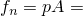 3500 N, where  0.01 m2 is the area subjected to pressure loading, which leads to a tangential friction force of 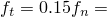 525 N on the surface of the drum. The net torque about the axis of the drum is, therefore, 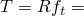 105 Nm, leading to an angular deceleration of 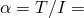 600 rad/s. This should bring the drum to a complete stop over a time span of 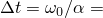 0.10 seconds.

The following discussion of the results applies to the three-dimensional model of Case 1. An idealization of the problem is shown in [Figure 1.3.11--1](ch01s03ach30.md#exxbraking-3d-ideal). A detail of the deformed shape of the brake pad at  0.05 seconds is shown in [Figure 1.3.11--2](ch01s03ach30.md#exxbraking-deform). A sequence of similar frames at different times in the analysis reveals intermittent stick and slip between the pad and the drum, leading to high frequency vibration of the pad. [Figure 1.3.11--3](ch01s03ach30.md#exxbraking-tot-rotate) is a time history plot of the total rotation of the drum, which is a very smooth curve. The time history plot for the angular velocity is shown in [Figure 1.3.11--4](ch01s03ach30.md#exxbraking-ang-vel), where we can clearly see the drum slowing down to an almost complete stop at   0.10 seconds, followed by a steady rocking motion of the drum against the (still oscillating) pad. The slope of the left portion of the curve gives an average deceleration of 600 rad/s for the first 0.10 seconds, as expected. This is not so obvious from the time history plot of angular acceleration, shown in [Figure 1.3.11--5](ch01s03ach30.md#exxbraking-ang-accel), which is rather noisy. Similar noise levels are also observed in the time histories of the two components of the reaction force at the axis of the drum that are shown in [Figure 1.3.11--6](ch01s03ach30.md#exxbraking-rxnforces). Much of this noise is associated with intermittent stick and slip in friction and is not unusual for this type of problem. In spite of the complex local behavior at this interface, the energy balance for the problem is maintained accurately, as shown in [Figure 1.3.11--7](ch01s03ach30.md#exxbraking-energybalance).

The final results for all cases agree closely with the results from the three-dimensional Case 1.

### Input files

[braking2d_anl.inp](../eif/braking2d_anl.inp)

Two-dimensional Case 1 problem.

[braking3d_rev_anl.inp](../eif/braking3d_rev_anl.inp)

Three-dimensional Case 1 problem using an analytical rigid surface with TYPE=REVOLUTION and contact pairs. 

[braking3d_rev_anl_gcont.inp](../eif/braking3d_rev_anl_gcont.inp)

Three-dimensional Case 1 problem using an analytical rigid surface with TYPE=REVOLUTION and general contact.

[braking2d.inp](../eif/braking2d.inp)

Two-dimensional Case 2 problem.

[braking3d.inp](../eif/braking3d.inp)

Three-dimensional Case 2 problem.

[braking3d1.inp](../eif/braking3d1.inp)

Three-dimensional Case 3 problem.

[braking3d2.inp](../eif/braking3d2.inp)

Three-dimensional Case 4 problem.

[braking3d3.inp](../eif/braking3d3.inp)

Three-dimensional Case 5 problem.

[braking3d_cyl_anl.inp](../eif/braking3d_cyl_anl.inp)

Three-dimensional Case 5 model using an analytical rigid surface with TYPE=CYLINDER and contact pairs.

[braking3d_cyl_anl_gcont.inp](../eif/braking3d_cyl_anl_gcont.inp)

Three-dimensional Case 5 model using an analytical rigid surface with TYPE=CYLINDER and general contact.

### Figures

**Figure 1.3.11–1** Three-dimensional idealization of the problem.

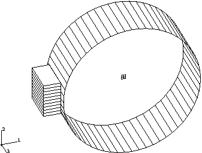

**Figure 1.3.11–2** Deformed shape of the brake pad at  0.05 seconds.

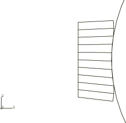

**Figure 1.3.11–3** Time history plot of the total rotation of the drum.

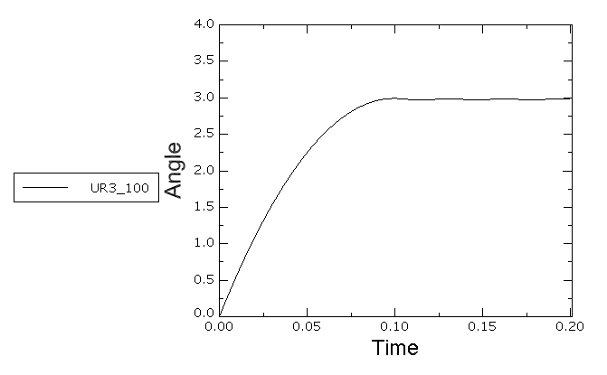

**Figure 1.3.11–4** Time history plot of the angular velocity of the drum.

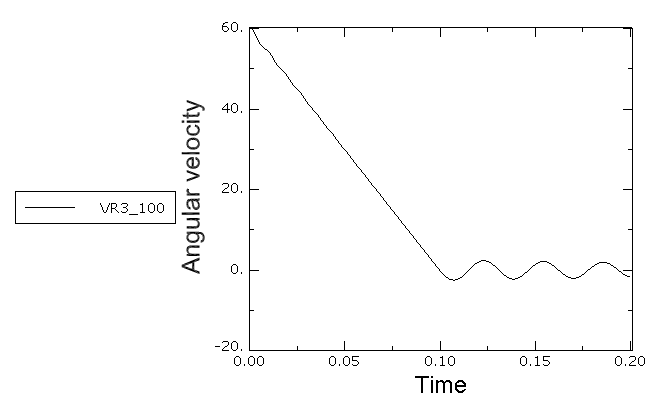

**Figure 1.3.11–5** Time history plot of the angular acceleration of the drum.

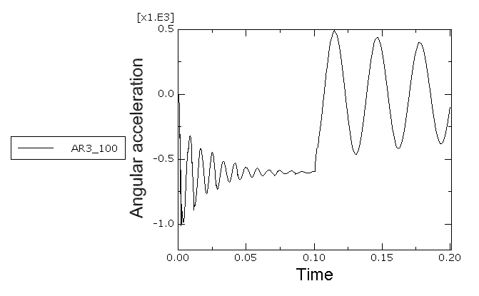

**Figure 1.3.11–6** Time history plot of the reaction forces at the axis of the drum.

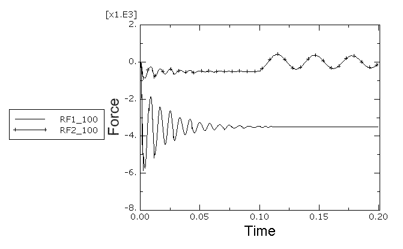

**Figure 1.3.11–7** Time history plot of the energy balance.

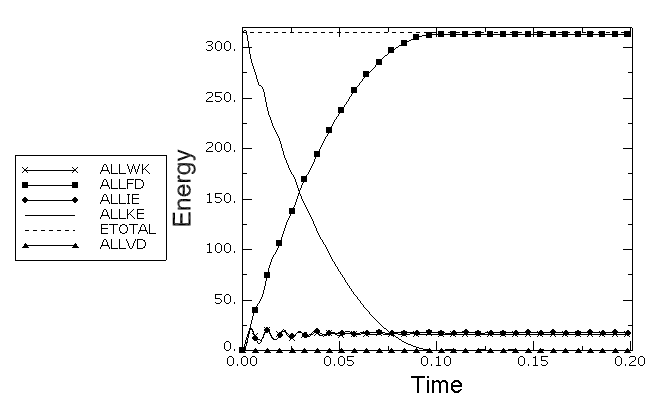

