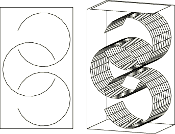
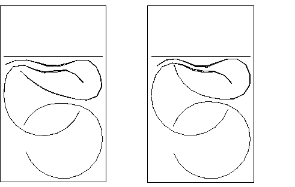
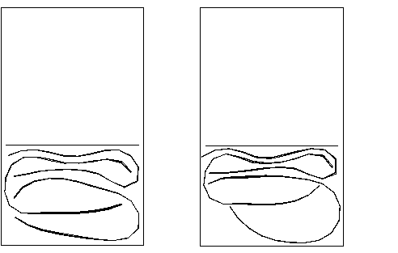
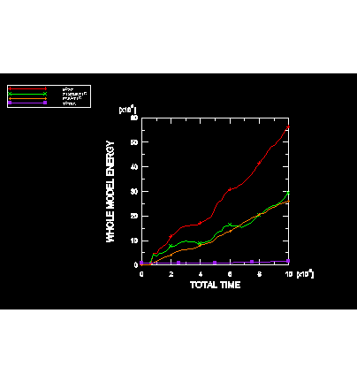

# 1.3.12 Compression of cylindrical shells with general contact

**Product: **Abaqus/Explicit  

### Problem description

This example models the compression of three interlocking cylindrical shells. The shells are placed in a rigid box, and the top of the box is pushed downward at a constant velocity of 130 m/s for 10 ms. The shells are compacted into a volume approximately half the original volume of the box. [Figure 1.3.12--1](ch01s03ach31.md#exxshellcompact-initconfig) shows the original configuration of the cylinders in the box. The cylinders are shown from both the front and oblique views, with the front and right-side wall of the box removed. 

This problem illustrates contact of double-sided shell surfaces. Models using each of the contact algorithms available in Abaqus/Explicit are provided. The primary model uses the general contact capability. The general contact inclusions option to automatically define an all-inclusive surface is used and is the simplest way to define contact in the model. In addition, models using penalty contact pairs and a combination of penalty and kinematic contact pairs are provided.

In the contact pair analyses self-contact interactions are not modeled since the three shells are not expected to undergo self-contact during the compression. Similar pair-wise definitions of contact are possible with the general contact algorithm and may result in minor improvements in computational efficiency.

“Bull-nose” extensions at the shell perimeters are present with the contact pair algorithm but not with the general contact algorithm; this difference between the two algorithms has some effect in this problem.

The element normals on several of the elements that make up the cylinders have been reversed to test the ability of Abaqus/Explicit to define the double-sided surface normals independently of the element normal.

The cylinders are made of steel, with a Young's modulus of 200 GPa, a Poisson's ratio of 0.3, and a density of 7850 kg/m3. A von Mises elastic, linearly hardening plastic material model is used with a yield stress of 250 MPa.

### Results and discussion

[Figure 1.3.12--2](ch01s03ach31.md#exxshellcompact-deform-5) and [Figure 1.3.12--3](ch01s03ach31.md#exxshellcompact-deform-10) show the deformed shape of the cylinders after 5 and 10 msec, respectively. Results for the contact pair analyses are shown on the left of each figure; results for the general contact analysis are shown on the right. The effect of the “bull-nose” extensions at the shell perimeters is visible in the deformed shape plots for the contact pair analyses.

[Figure 1.3.12--4](ch01s03ach31.md#exxshellcompact-energyhists) shows the time history of the total kinetic energy, the total work done on the model, the plastic dissipation, and the total energy balance for the model that uses the general contact algorithm. The other models give similar results.

This problem tests the features listed but does not provide independent verification of them.

### Input files

[shell_compact.inp](../eif/shell_compact.inp)

Primary analysis using the general contact capability.

[shell_compact_cpair.inp](../eif/shell_compact_cpair.inp)

Model that uses contact pairs with kinematic contact.

[shell_compact_cpair2.inp](../eif/shell_compact_cpair2.inp)

Model that uses contact pairs with kinematic contact. The shell normals are reversed.

[shell_compact_cpair3.inp](../eif/shell_compact_cpair3.inp)

Model that uses contact pairs with kinematic contact. The NO THICK parameter is used when defining the surfaces for the lid and the center ring.

[shell_compact_pnlty.inp](../eif/shell_compact_pnlty.inp)

Analysis that uses contact pairs with penalty contact.

[shell_compact_ef1.inp](../eif/shell_compact_ef1.inp)

External file referenced by these analyses.

[shell_compact_ef2.inp](../eif/shell_compact_ef2.inp)

External file referenced by these analyses.

[shell_compact_ef3.inp](../eif/shell_compact_ef3.inp)

External file referenced by these analyses.

### Figures

**Figure 1.3.12–1** Initial configuration of the cylinders in the box from front and oblique views (front and right box walls removed).

**Figure 1.3.12–2** Deformed shape at 5.0 msec (contact pair analysis on the left, general contact analysis on the right).

**Figure 1.3.12–3** Deformed shape at 10.0 msec (contact pair analysis on the left, general contact analysis on the right).

**Figure 1.3.12–4** Time histories of the total kinetic energy, work, plastic dissipation, and internal energy.

