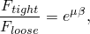
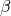
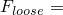
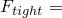
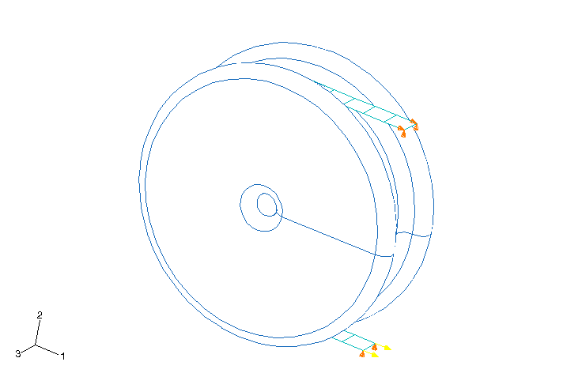
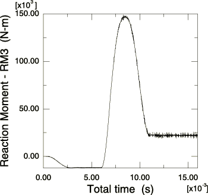

# 1.3.13 Steady-state slip of a belt drive

**Product: **Abaqus/Explicit  

### Problem description

This problem consists of a pre-tensioned elastic belt wrapped 180 around a 1 m diameter rigid drum. The belt is fixed at one end and has a constant force of 50000 N applied at the other end. The interaction between the belt and the drum is governed by a Coulomb friction law with a coefficient of friction  0.2. The objective of the analysis is to predict the steady-state resisting moment as the drum is turned. This moment corresponds to the difference in forces at the two belt ends times the moment arm of 0.5 m. The difference in force is maximized at the steady-state slip condition, which can be simulated by prescribing a rotation of the drum.

The analysis is run in two steps: in the first step the belt is pre-tensioned while keeping the drum fixed, and in the second step the drum is accelerated to a prescribed angular velocity. The pre-tensioning force and the prescribed angular velocity are ramped up using a smooth-step amplitude curve. This amplitude definition provides a smooth loading rate, which is desirable in quasi-static or steady-state simulations. Mass proportional damping is used to further reduce oscillations in the response.

### Results and discussion

The analytical solution for this problem can be found in many mechanical engineering handbooks. At the steady-state slip condition the ratio of the belt force at the tight end to the belt force at the loose end is given by

where  is the wrap angle in radians. Since the drum is turned toward the end of the belt with the concentrated force, this end becomes the loose end. Thus,  50000 N. Using the above relation, the force at the fixed end of the belt,  93723 N. The steady-state resisting moment at the slip condition is then (93723  50000)  0.5 = 21862 N-m.

The plot of reaction moment at the drum's reference node versus time in [Figure 1.3.13--2](ch01s03ach32.md#exxbeltdrive-rxn-mom-hist) has three distinct regions. The first region corresponds to the pre-tensioning step. The reaction moment gradually ramps to a negative value and remains constant at that value for the remainder of the first step. The second region corresponds to the portion of the second step in which the prescribed rotary acceleration of the drum is nonzero (the velocity is being ramped up). The reaction moment overshoots the analytical steady-state value of 21862 N because this reaction moment includes the rotary inertia of the drum as it is accelerated. The third region corresponds to a constant velocity of 20 rad/s of the drum. In this region rotary inertia no longer plays a role, and the predicted resisting moment solution oscillates slightly about the analytical value.

The analysis is performed in Abaqus/Explicit using contact pairs as well as general contact. The Abaqus/Explicit results show good agreement with the analytical solution.

### Input files

[pulley_rev_anl.inp](../eif/pulley_rev_anl.inp)

Three-dimensional model using [*SURFACE](../key/key-link.md#usb-kws-msurface), TYPE=REVOLUTION and contact pairs.

[pulley_rev_anl_gcont.inp](../eif/pulley_rev_anl_gcont.inp)

Three-dimensional model using [*SURFACE](../key/key-link.md#usb-kws-msurface), TYPE=REVOLUTION and general contact.

[pulley_seg_anl.inp](../eif/pulley_seg_anl.inp)

Two-dimensional model using [*SURFACE](../key/key-link.md#usb-kws-msurface), TYPE=SEGMENTS.

[pulley_cyl_anl.inp](../eif/pulley_cyl_anl.inp)

Three-dimensional model using [*SURFACE](../key/key-link.md#usb-kws-msurface), TYPE=CYLINDER and contact pairs.

[pulley_cyl_anl_gcont.inp](../eif/pulley_cyl_anl_gcont.inp)

Three-dimensional model using [*SURFACE](../key/key-link.md#usb-kws-msurface), TYPE=CYLINDER and general contact.

### Figures

**Figure 1.3.13–1** Three-dimensional belt on a rigid drum.

**Figure 1.3.13–2** Reaction moment history at the drum's reference node.

