# 1.3.16 Plate penetration by a projectile

**Product: **Abaqus/Explicit  

### Problem description

This example consists of a two-dimensional axisymmetric plate penetrated by a high-speed projectile. The plate, which is made of Aluminum 2024–T4, has a thickness of 1.3 mm and is 50 mm in diameter. All degrees of freedom on the circumference of the plate are constrained. The outline of the model is shown in [Figure 1.3.16--1](ch01s03ach35.md#exxplatepen-model). The projectile is modeled as an analytical rigid surface with a body diameter of 20 mm, an enclosed tip angle of 40, and a mass of 0.11 kg attached to the reference node.

[Figure 1.3.16--2](ch01s03ach35.md#exxplatepen-meshplot) shows one of the finite element meshes used to model the plate, with 5 axisymmetric elements in the through-thickness direction and 50 axisymmetric elements in the radial direction. Nodes along the *Z*-axis in an axisymmetric model have no implicit constraints to remain at . In most axisymmetric problems it is appropriate to specify radial constraints for these nodes. However, in this example radial constraints for the nodes initially at the center of the plate are inappropriate, since the projectile will form a hole in the center of the plate. The tip of the projectile is assigned a small negative radial position to avoid the possibility of missed contact at the edge of the analytical surface due to numerical round-off. The nodes of the plate on the *Z*-axis will expand radially upon impact of the projectile, allowing projectile penetration and the formation of a hole. Element removal as a result of material failure is also modeled and further will contribute to enlargement of the hole. A potentially significant “petaling” mechanism, in which cracks emanate radially in the plate as the projectile passes through, is not studied in this example because of the two-dimensional nature of the axisymmetric models used.

If element failure and removal are not included in a high-speed impact problem such as this, the analysis will likely terminate prematurely as a result of severe element distortion. A node-based surface comprised of all the nodes on the plate is used for contact modeling purposes because element-based surfaces should not be defined over elements that fail and because nodes internal to the plate may become exposed once surrounding elements start failing. When all the elements attached to a node have failed, the node acts as a point mass and is still active in contact interactions. This aspect can be significant with respect to accurate modeling of momentum transfer in highly dynamic problems.

The results of interest are the velocity of the projectile at the end of the analysis and the work performed by the projectile, which is equal to the projectile's loss of kinetic energy. Analyses are conducted at initial projectile speeds of 400 m/s, 600 m/s, 800 m/s, and 1000 m/s. The projectile speed decreases by a small fraction in each analysis. The time period of the analysis is set such that the projectile penetration, assuming no decrease in velocity, is 55 mm. The results are compared to experimental results, as well as results obtained from analytical expressions based on simplifying assumptions commonly used for this type of problem. To determine the best modeling approach, three preliminary studies are conducted: a mesh convergence study, a comparison of the contact algorithms (kinematic and penalty), and a material model study. All preliminary studies are completed with an initial projectile velocity of 600 m/s. The parametric study capability of Abaqus is used to facilitate these studies.

Mesh convergence is studied for 5, 7, and 9 elements through the thickness and 50, 70, and 90 elements in the radial direction. Each mesh is biased toward the center of the disc, as in the 5  50 element mesh shown in [Figure 1.3.16--2](ch01s03ach35.md#exxplatepen-meshplot). At least four linear reduced-integration elements through the thickness should be used when bending may be significant. For high-speed impact problems such as this, bending may not be highly significant, because the material may fail in shear prior to the occurrence of significant bending; however, fairly refined meshes are considered to provide examples of meshes that could also be used for low-speed impact studies. The input file [pp_mesh_study.inp](../eif/pp_mesh_study.inp) is parameterized for the mesh convergence study and is driven by the parametric study script [pp_mesh_study.psf](../eif/pp_mesh_study.psf). The material is modeled with Mises plasticity with isotropic hardening and a plastic shear failure strain of 50%. The default kinematic contact algorithm is used for the mesh convergence study.

The effect on the results of the choice of the contact algorithm (kinematic or penalty) is investigated next, using the same material model and a mesh found to be efficient and accurate. The script [pp_con_study.psf](../eif/pp_con_study.psf) drives the parameterized input file [pp_con_study.inp](../eif/pp_con_study.inp). We anticipate that the results will not differ significantly for the two contact algorithms.

The third preliminary study is completed to determine the influence of the material model on the analysis results. Material models of two basic types are considered: Mises plasticity with isotropic hardening and Mises plasticity without hardening but a higher yield stress. The hardening data for the first case are calculated using the function  = 44.2 + 29.2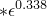, where the units for stress are ksi and the strain is plastic strain. This function is consistent with data available from the Aluminum Association and represents an average of many tests. These hardening data are used for demonstration purposes; they may not be applicable to all situations. The perfectly plastic model is a simplification. Both models have similar strain energy for strains of about 15%. Plots of stress versus total log strain for both material models are shown in [Figure 1.3.16--3](ch01s03ach35.md#exxplatepen-stresstrain). Two values of the equivalent plastic strain at failure (17% and 50%) are considered for each type of plasticity data. The value of 17% corresponds to the percent of total elongation at failure of a 2-inch specimen in a standard tensile test, as published by the Aluminum Association. The value of 50% is commonly used in high-rate dynamic analyses. Element failure is controlled with the shear failure model. The input file [pp_mat_1_study.inp](../eif/pp_mat_1_study.inp) models the material with isotropic hardening, and the input file [pp_mat_2_study.inp](../eif/pp_mat_2_study.inp) uses a perfectly plastic material model. These files are parameterized and are driven by the parametric study scripts [pp_mat_1_study.psf](../eif/pp_mat_1_study.psf) and [pp_mat_2_study.psf](../eif/pp_mat_2_study.psf), respectively.

Analytical expressions based on simplifying assumptions for this type of problem are derived in Backman and Goldsmith. Two approaches, referred to as the energy method and the momentum method, give slightly different estimates for the final velocity of the projectile. With the energy method the resulting expression for the final velocity is 

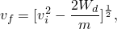

where *m* is the mass. The work done (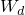) is given by

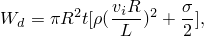

where *R* is the radius of the projectile,  is the length of the conical nose,  is the approximated yield strength of the material when modeled without hardening, *t* is the plate thickness, and  is the material density.

The momentum method gives the final velocity as 

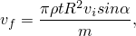

where  is the half cone angle.

### Results and discussion

The results for the mesh convergence study, shown in [Table 1.3.16--1](ch01s03ach35.md#table-meshres), indicate that this problem is not highly sensitive to the mesh refinement in the radial or through-thickness direction for the meshes considered. The calculated decrease in projectile speed differs by about 2% between the mesh with the least (250) elements and the mesh with the most (810) elements. Analysis times for these cases, as reported in the status file, differ by a factor of approximately 8. The final configuration for the 250-element analysis is shown in [Figure 1.3.16--4](ch01s03ach35.md#exxplatepen-250elems-wm). Deformed meshes, with intact elements of the plate only, for the analyses with 250 elements and 810 elements are shown in [Figure 1.3.16--5](ch01s03ach35.md#exxplatepen-250elems) and [Figure 1.3.16--6](ch01s03ach35.md#exxplatepen-810elems), respectively. The predicted deformation of the plate is nearly identical for both meshes. The elements which have failed (not shown) correspond to roughly the inner 15% of the radius of the plate. Bending is not significant to the energy absorption of the plate under these high-speed impact conditions; thus, an even coarser mesh would tend to give a similar estimate of the projectile speed decrease but would give a less accurate prediction of the deformed shape of the intact elements. The 250-element mesh is used for the remainder of the studies.

[Table 1.3.16--2](ch01s03ach35.md#table-conres) shows that the projectile speed decrease differs by only about 2% for the analyses with the penalty and kinematic contact formulations, respectively. This is not surprising, as the choice of the contact algorithm is not usually significant (exceptions are discussed in ["Truss impact on a rigid wall," Section 1.3.15](ch01s03ach34.md), and ["The Hertz contact problem," Section 1.1.11](ch01s01ach11.md)). The kinematic contact algorithm is used for the remaining studies.

The results from the material model study are shown in [Table 1.3.16--3](ch01s03ach35.md#table-matres). The results obtained with the perfectly plastic material are quite close to the results obtained with the isotropic hardening material model for the same value of the failure strain; however, the failure strain does have a significant influence on the results. These results can be explained by consideration of the area under the stress-strain curve. The area under the stress-strain curve represents the ductility or energy absorbing potential of the material, and it is similar for both types of plasticity data, as can be seen in [Figure 1.3.16--3](ch01s03ach35.md#exxplatepen-stresstrain). However, the choice of the failure strain can affect the energy absorbing capacity of the material significantly. The material model with hardening and a failure strain of 50% is used in the final study. In general, careful consideration should be given to the material model.

In the final study the initial velocity of the projectile is varied. [Figure 1.3.16--7](ch01s03ach35.md#exxplatepen-def400) and [Figure 1.3.16--8](ch01s03ach35.md#exxplatepen-def1000) show deformed mesh plots of the plate (intact elements only) after projectile penetration with an initial velocity of 400 m/s and 1000 m/s, respectively. With a higher impact velocity there is less bending deformation of the surviving elements. This behavior is caused by the increased significance of inertial effects for higher impact speed. The decrease in projectile speed and the kinetic energy loss are shown in [Table 1.3.16--4](ch01s03ach35.md#table-rescomp) and [Table 1.3.16--5](ch01s03ach35.md#table-rescomp-ke), respectively. These tables compare Abaqus/Explicit results with experimental results and analytical expressions derived in Backman and Goldsmith based on simplifying assumptions. The experimental results are based on data presented by Backman and Goldsmith. The number of samples used for the experimental results is unknown. The numerical results for the decrease in projectile speed are within 8% of the energy method estimates, 40% of the momentum method estimates, and 30% of the experimental results.

### Input files

[pp_mesh_study.inp](../eif/pp_mesh_study.inp)

Parameterized input file for the mesh study.

[pp_mesh_study.psf](../eif/pp_mesh_study.psf)

Python script to drive the mesh study.

[pp_con_study.inp](../eif/pp_con_study.inp)

Parameterized input file for the contact study.

[pp_con_study.psf](../eif/pp_con_study.psf)

Python script to drive the contact study.

[pp_mat_1_study.inp](../eif/pp_mat_1_study.inp)

Parameterized input file to study effects of failure type and strain with an isotropic hardening material.

[pp_mat_1_study.psf](../eif/pp_mat_1_study.psf)

Python script to drive the isotropic material study.

[pp_mat_2_study.inp](../eif/pp_mat_2_study.inp)

Parameterized input file to study effects of failure type and strain with a Mises material.

[pp_mat_2_study.psf](../eif/pp_mat_2_study.psf)

Python script to drive the Mises material study.

[pp_velo_study.inp](../eif/pp_velo_study.inp)

Parameterized input file to analyze the penetration problem with projectile velocities of 400 m/s, 600 m/s, 800 m/s, and 1000 m/s.

[pp_velo_study.psf](../eif/pp_velo_study.psf)

Python script to drive the velocity study.

[pp_disc_rigid.inp](../eif/pp_disc_rigid.inp)

Input file to analyze the penetration problem using a discretized rigid projectile with a velocity of 250 m/s. A low velocity is chosen to allow sufficient penetration of the projectile so the balanced master-slave approach with the master surface at *r*=0 can be verified.

### Reference

Backman,  M. E., and W. Goldsmith, “The Mechanics of Penetration of Projectiles into Targets,” International Journal of Engineering Science, vol. 16, pp. 1–91, 1978.

### Tables

**Table 1.3.16–1** Mesh study results.
| Number of elements in radial direction | Number of elements through the thickness | Final velocity of missile (m/s) | Velocity drop (m/s) |
| --- | --- | --- | --- |
| 50 | 5 | 597.79 | 2.21 |
| 70 | 5 | 597.76 | 2.24 |
| 90 | 5 | 597.74 | 2.26 |
| 50 | 7 | 597.76 | 2.24 |
| 70 | 7 | 597.77 | 2.23 |
| 90 | 7 | 597.78 | 2.22 |
| 50 | 9 | 597.76 | 2.24 |
| 70 | 9 | 597.79 | 2.21 |
| 90 | 9 | 597.74 | 2.26 |

**Table 1.3.16–2** Contact algorithm study results.
| Contact algorithm | Final velocity of missile (m/s) | Velocity drop (m/s) |
| --- | --- | --- |
| Penalty | 597.71 | 2.29 |
| Kinematic | 597.76 | 2.24 |

**Table 1.3.16–3** Material model study results.
| Material Model | Final velocity of missile (m/s) | Velocity drop (m/s) |
| --- | --- | --- |
| Hardening with failure strain of 17% and allowing element deletion when the failure criterion is met | 598.73 | 1.27 |
| Hardening with failure strain of 50% and allowing element deletion when the failure criterion is met | 597.79 | 2.21 |
| Perfectly plastic with failure strain of 17% and allowing element deletion when the failure criterion is met | 598.78 | 1.22 |
| Perfectly plastic with failure strain of 50% and allowing element deletion when the failure criterion is met | 597.93 | 2.07 |

**Table 1.3.16–4** Velocity drop versus initial projectile speed.
| Initial projectile velocity | Velocity drop (m/s) |
| --- | --- |
| Abaqus result | Energy method | Momentum method | Experiment |
| 400 | 2.53 | 2.43 | 1.41 | --- |
| 600 | 2.21 | 2.07 | 2.12 | 1.88 |
| 800 | 2.12 | 2.04 | 2.83 | 2.4 |
| 1000 | 2.21 | 2.12 | 3.53 | 2.97 |

**Table 1.3.16–5** Kinetic energy loss vs. initial projectile energy.
| Initial projectile velocity | Kinetic energy loss (Nm) |
| --- | --- |
| Abaqus result | Energy method | Momentum method | Experiment |
| 400 | 111.12 | 107.21 | 61.76 | --- |
| 600 | 145.72 | 137.17 | 138.95 | 123.56 |
| 800 | 186.58 | 179.03 | 247.02 | 211.06 |
| 1000 | 242.99 | 233.06 | 385.97 | 321.72 |

### Figures

**Figure 1.3.16–1** Plate penetration model outline.

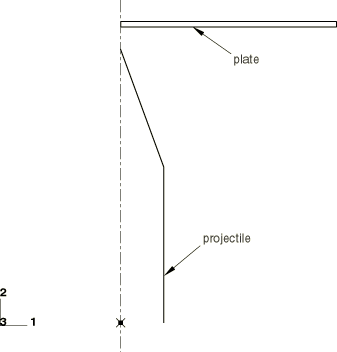

**Figure 1.3.16–2** 5  50 element mesh for plate.

**Figure 1.3.16–3** True stress vs. total log strain curve of material models.

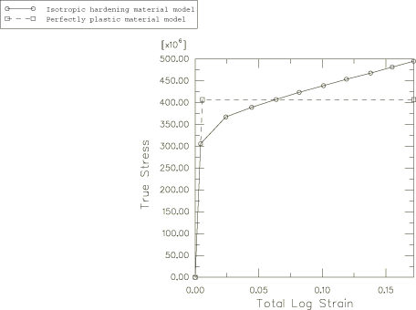

**Figure 1.3.16–4** Final configuration (without failed elements) for analysis with 5  50 mesh and initial velocity of 600 m/s.

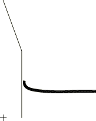

**Figure 1.3.16–5** Deformed plot of intact elements for analysis with 5  50 element mesh and initial velocity of 600 m/s.

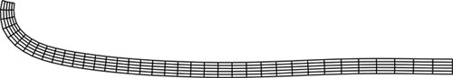

**Figure 1.3.16–6** Deformed plot of intact elements for analysis with 9  90 element mesh and initial velocity of 600 m/s.

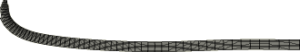

**Figure 1.3.16–7** Deformed plot of intact elements for analysis with 5  50 element mesh and initial velocity of 400 m/s.

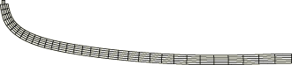

**Figure 1.3.16–8** Deformed plot of intact elements for analysis with 5  50 element mesh and initial velocity of 1000 m/s.

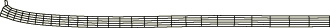

