# 1.4.4 Free and forced vibrations with damping

**Product: **Abaqus/Standard  

This example is intended to provide basic verification of the frequency-dependent spring and dashpot elements available in Abaqus.

There are several different mechanisms that can cause damping in a system. In linear viscous damping the damping force is directly proportional to the velocity. In many cases such simple expressions for the damping forces are not available directly. However, it is possible to obtain an equivalent viscous damping coefficient by equating the loss of kinetic and strain energy to the energy dissipation. Hysteretic and viscoelastic damping are two important damping mechanisms that are more complex than linear viscous damping. In the frequency domain these mechanisms can be simulated by using dashpots with viscous damping coefficients that depend on the forcing frequency. Frequency-dependent springs will also be needed for modeling viscoelastic damping.

To illustrate how to model viscous, hysteretic, and viscoelastic damping mechanisms, springs and dashpots with constant and frequency-dependent properties will be used in frequency domain dynamic analyses of one- and two-degree-of-freedom discrete mass-spring-dashpot systems. In addition, viscous damping is modeled in the time domain by using a constant dashpot coefficient.

Abaqus also allows for spring and dashpot properties that depend on temperature and user-defined field variables. This dependence provides an easy means to vary material properties of springs and dashpots during time-domain analysis. In doing perturbation analysis (such as frequency-domain steady-state dynamic analysis) with Abaqus, temperature and field variable variations are not permitted within an analysis step. However, since the base state temperature and field variable values for each perturbation analysis step can be changed, it is possible to perform a multiple-step perturbation analysis that uses different temperature- and field-variable-dependent material properties that correspond to the base state temperature and field variable values. This dependence feature will be illustrated in analyses 2 and 3 described below. These two analyses employ both the direct-solution and the subspace-based steady-state dynamic procedure in Abaqus.

The one- and two-degree-of-freedom mass-spring-dashpot systems are shown in [Figure 1.4.4--1](ch01s04ach40.md#sxmfreeoscdamp-systems). The following dynamic analyses are performed: (1) free vibration of the one-degree-of-freedom system after it is given an initial displacement and then released; (2) steady-state response to applied harmonic loading of the one-degree-of-freedom model with viscous damping; (3) steady-state response to applied harmonic loading of the one-degree-of-freedom model with hysteretic damping; and (4) steady-state response to applied harmonic loading of the two-degree-of-freedom model with viscoelastic damping. In all cases the forcing function is applied to the point mass closest to the anchor point, and numerical results are compared to the exact solutions for the system.

### Problem description

The basic constant parameters of the analysis models are as follows: 

| Spring constant, *k* | 5253.8 N/m (30 lb/in) |
| --- | --- |
| Damping coefficient, *c* | 21.02 N/m-s (0.12 lb/in-s) |
| Mass, *m* | 4.536 kg (0.02588 lb-s2/in) |

SPRING1 and DASHPOT1 elements are used in analyses 1–3. SPRING2 and DASHPOT2 elements are used in analysis 4.

In analysis 1 the model is the one-degree-of-freedom system shown in [Figure 1.4.4--1](ch01s04ach40.md#sxmfreeoscdamp-systems). The initial displacement is 25.4 mm (1 in), so the force in the spring is initially 133.4 N (30 lb). The problem is run in two steps: a static step, wherein the initial displacement is imposed, and a dynamic step, during which the structure is allowed to oscillate. The dynamic step is run with automatic time stepping, using two different values for the half-increment tolerance: 44.48 N (10 lb) and 4.448 N (1 lb). The higher value of the tolerance should give moderately accurate results, while the lower value should result in a more accurate solution. ["Implicit dynamic analysis using direct integration," Section 6.3.2 of the Abaqus Analysis User's Guide](../usb/usb-link.md#usb-anl-adynamic), gives guidelines for choosing a value for the half-increment tolerance for realistic, multiple-degree-of-freedom systems.

In analysis 2 a harmonic loading of the form 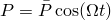 is applied to the single-degree-of-freedom system, where  is the circular frequency. The equation of motion for this system is 

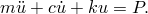

The direct-solution and the subspace-based steady-state dynamic procedures are used to calculate the steady-state vibrations in this system with low and high viscous damping coefficients,  0.12 and 0.24. The dashpot coefficient in this model is defined as a function of the first field variable, and the change of the field variable value is carried out in a dummy general static step placed between two direct-solution steady-state dynamic steps.

Analysis 3 is identical to analysis 2 in all aspects except that hysteretic damping is modeled instead of linear viscous damping. Hysteretic damping, also known as structural or solid damping, is observed in the vibration of many solid materials and can be attributed to internal friction. This form of damping produces a hysteresis loop in the force-displacement plot for each loading cycle that is proportional to the amplitude and tends to stay constant with rising forcing frequency. The energy loss is proportional to the displacement amplitude squared for both viscous damping and for hysteretic damping. This fact suggests that structurally damped systems subjected to harmonic excitation can be modeled as viscously damped systems with an equivalent coefficient of viscous damping that is inversely proportional to the frequency: see Denhartog (1985). The equation of motion for this one-degree-of-freedom system is, thus, written readily as 

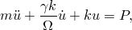

where  is a damping coefficient and  is the forcing frequency. The equivalent viscous damping coefficient is 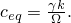 For harmonic motion we have the relationship 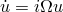; therefore, 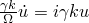, where  is the imaginary number. Hence, the equation of motion can also be written as 

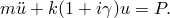

Abaqus also allows direct specification of structural damping; however, this direct specification can be used only in modal-based analysis and is accurate only for small damping values. See ["Material damping," Section 26.1.1 of the Abaqus Analysis User's Guide](../usb/usb-link.md#usb-mat-cdampingopt), for further discussion. In this analysis the effects of low damping (=0.125) and high damping (=0.25) are compared, following the same procedure as used in analysis 2. The data set containing the frequency-dependent dashpot coefficients at intervals of 0.05 Hz over the frequency range of 0 to 10 Hz is included (file [vibration_dampdata1.inp](../eif/vibration_dampdata1.inp)).

Analysis 4 involves a two-degree-of-freedom system with viscoelastic damping. Viscoelastic materials are often used in a structure to improve the damping characteristics of the structure or its components. In a one-dimensional test specimen made of linear viscoelastic material, an applied cyclic stress 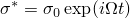 will result in a steady-state cyclic strain response, 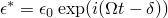 with the same frequency but out of phase by the phase angle . The phase angle is also known as the loss angle and is a function of frequency. The damping ability of the material is dependent on it and not on the stress and strain amplitude. The ratio of the stress and strain defines the complex modulus, 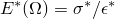, where the real part is termed the storage modulus and the imaginary part the loss modulus. The equation of motion for the steady-state forced vibration of a single-degree-of-freedom viscoelastic system of mass *m* is simply 

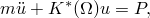

where 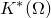 is the complex stiffness proportional to the complex modulus 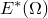. Making use of the substitution  for harmonic motion, we can rewrite the equation of motion as 

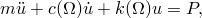

where 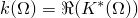 and 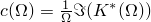. Referring to ["Frequency domain viscoelasticity," Section 22.7.2 of the Abaqus Analysis User's Guide](../usb/usb-link.md#usb-mat-cfreqvisco), we can identify that the equivalent viscous damping coefficient is 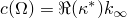 and the spring stiffness is 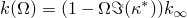, where 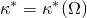 is the Fourier transform of the nondimensional relaxation function 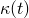 and  is the long-term spring stiffness. The equation of motion for viscoelastic damping resembles the one for hysteretic damping to the extent that viscoelastic damping can also be simulated in discrete mass-spring-dashpot systems using frequency-dependent springs and dashpots. This form of damping is simulated in the two-degree-of-freedom discrete mass-spring-dashpot system shown in [Figure 1.4.4--1](ch01s04ach40.md#sxmfreeoscdamp-systems) with the following parameters: 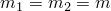 and 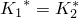, such that the real and imaginary moduli are 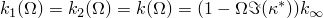, and 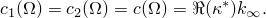 The frequency dependence of 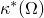 assumes the power law formula 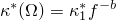, where *b* is a real constant, 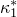 is a complex constant, and 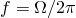 is the frequency in cycles/time. The equation of motion for the two-degree-of-freedom system is now readily developed and can be written as 

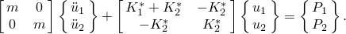

Since harmonic loading of the form 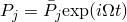 produces the harmonic oscillation 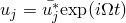 with the complex oscillation amplitude 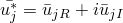, the equation of motion for the loading parameters used in this analysis, 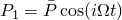 and 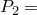0, can be rewritten in terms of the real and imaginary parts of the oscillation amplitudes as follows: 

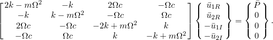

The frequency-dependent spring and dashpot properties are generated by a FORTRAN program using the basic model constants for the mass, *m*, and for the spring,  In addition, the parameters *b*=1.38366, 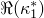=2.3508  102, and 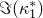=6.5001  102 are used. This form of the power law dependence of frequency of  does not describe the viscoelastic properties for all frequencies accurately. In particular, this formula is incorrect for low frequencies since the stiffness becomes negative. Therefore, values computed using this formula for frequencies below 0.77 Hz are discarded in this analysis. The frequency-dependent data for the dashpot coefficients and for the spring stiffness are written at intervals of 0.035 Hz over the frequency range of 0.77 to 14 Hz.

### Results and discussion

For analysis 1 the exact solution for damped free oscillation is 

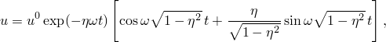

where 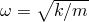 is the natural frequency of the undamped system (34.05 rad/s in this analysis), 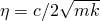 is the ratio of damping to critical damping (0.068 in this analysis), and 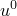 is the initial displacement of 25.4 mm (1 in).

The exact solution and the Abaqus solutions obtained using the different values of the half-increment tolerance are plotted in [Figure 1.4.4--2](ch01s04ach40.md#sxmfreeoscdamp-disp-time). The tighter tolerance provides the more accurate solution, showing a slight phase shift later in the response. The looser tolerance shows considerably more phase shift, as expected.

At any time during the analysis Abaqus can provide a summary of the energy present in the structure, as well as quantities such as viscous and plastic dissipation. Summation of the various energy quantities yields an energy balance. Comparison of this balance with the initial strain energy of the system yields the energy lost due to numerical damping in the time integration operator. [Table 1.4.4--1](ch01s04ach40.md#table-freeoscdamp-energybal) is a summary of all the energy terms at the end of the problem (0.7 seconds). Since the initial strain energy is 1.695 N-m (15 lb-in), the numerical damping loss is 1% for the smaller value of the tolerance and 9.1% for the larger value.

For analysis 2 the steady-state response of the viscously damped single-degree-of-freedom system subjected to a cosine forcing function is given by 

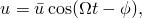

where the amplitude of oscillation is 

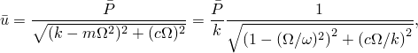

with , and the phase angle of the response is 

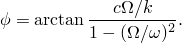

The response calculated by the direct-solution and subspace-based steady-state dynamic procedures are in exact agreement with these solutions. The amplitude and the angle of phase lag for the frequency range of 0 to 10 cycles/time are shown in [Figure 1.4.4--3](ch01s04ach40.md#sxmfreeoscdamp-peakamp-v) and [Figure 1.4.4--4](ch01s04ach40.md#sxmfreeoscdamp-phaseangle-v), respectively.

For analysis 3 the steady-state response of the structurally damped single-degree-of-freedom system subjected to a cosine forcing function can be obtained from the solutions for the viscously damped case by replacing the constant dashpot coefficient with the equivalent frequency-dependent dashpot coefficient, 

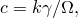

so the amplitude of oscillation is 

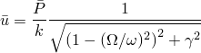

and the phase angle of the response is 

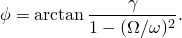

The Abaqus solutions obtained by the direct-solution and subspace-based steady-state dynamic procedures are again in exact agreement with these analytical results, as shown in [Figure 1.4.4--5](ch01s04ach40.md#sxmfreeoscdamp-peakamp-h) and [Figure 1.4.4--6](ch01s04ach40.md#sxmfreeoscdamp-phaseangle-h). Comparing these results with those in [Figure 1.4.4--3](ch01s04ach40.md#sxmfreeoscdamp-peakamp-v) and [Figure 1.4.4--4](ch01s04ach40.md#sxmfreeoscdamp-phaseangle-v) for viscous damping, two differences are apparent. First, resonance (maximum amplitude) occurs at  and not at  as in analysis 2. Second, the phase angle for 0 is 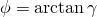 instead of zero as in analysis 2; therefore, motion with structural damping, where the energy dissipation is rate independent, will never be in phase with the forcing function.

For analysis 4 the steady-state response of the two-degree-of-freedom system with viscoelastic damping is obtained numerically by solving the system of four equations for the real and imaginary parts of the response at the two nodes, from which the response amplitudes 

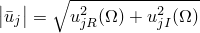

and the phase angles 

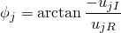

are obtained. The solutions obtained by the direct-solution steady-state dynamic procedure in Abaqus are also in exact agreement with the numerical solutions. The results are presented in [Figure 1.4.4--7](ch01s04ach40.md#sxmfreeoscdamp-peakamp-ve) and [Figure 1.4.4--8](ch01s04ach40.md#sxmfreeoscdamp-phaseangle-ve), which show the amplitudes and angles of phase lag of the response, respectively, at the free nodes for the frequency range of 0.77 to 14 cycles/time. It is important to realize that small intervals must be used in the frequency sweep to obtain results with high accuracy (in particular for the peak response). Furthermore, when the frequency dependence is nonlinear, such as exhibited in this system, the quality of the solution also depends upon the accuracy of the frequency-dependent spring and dashpot data used in the calculations. Abaqus assumes that the properties vary linearly over each frequency interval; consequently, a small interval size should be used in the discretization of the data to minimize interpolation errors.

### Input files

[vibration_1dof_dyn_haft1.inp](../eif/vibration_1dof_dyn_haft1.inp)

One-degree-of-freedom time-integration dynamic analysis with HAFTOL set to 4.448 N (1 lb).

[vibration_1dof_ssdyn_viscous.inp](../eif/vibration_1dof_ssdyn_viscous.inp)

One-degree-of-freedom direct-solution and subspace-based steady-state dynamic analysis with viscous damping.

[vibration_1dof_ssdyn_hyster.inp](../eif/vibration_1dof_ssdyn_hyster.inp)

One-degree-of-freedom direct-solution and subspace-based steady-state dynamic analysis with hysteretic damping.

[vibration_2dof_ssdyn_visco.inp](../eif/vibration_2dof_ssdyn_visco.inp)

Two-degree-of-freedom direct-solution steady-state dynamic analysis with viscoelastic damping.

[vibration_1dof_dyn_haft2.inp](../eif/vibration_1dof_dyn_haft2.inp)

Problem with HAFTOL set to 44.48 N (10 lb).

[vibration_dampdata1.inp](../eif/vibration_dampdata1.inp)

Frequency-dependent damping coefficients used in analysis 3.

[vibration_dampdata2.inp](../eif/vibration_dampdata2.inp)

Frequency-dependent damping coefficients used in analysis 4.

[vibration_springdata.inp](../eif/vibration_springdata.inp)

Frequency-dependent spring stiffness used in analysis 4.

### Reference

Denhartog,  J. P., *Mechanical Vibrations, *Dover, 1985.

### Table

**Table 1.4.4–1** Energy balance at 0.7 seconds.
|  | Solution with half-increment tolerance = 4.448 N (1 lb) | Solution with half-increment tolerance = 44.48 N (10 lb) |
| --- | --- | --- |
| Kinetic energy | N-m | 0.0472 | 0.0033 |
| lb-in | 0.418 | 0.029 |
| Strain energy | N-m | 0.0490 | 0.1943 |
| lb-in | 0.434 | 1.720 |
| Dissipated energy | N-m | 1.5817 | 1.3445 |
| lb-in | 14.000 | 11.900 |
| Total energy | N-m | 1.6780 | 1.5421 |
| lb-in | 14.852 | 13.649 |
| Energy loss through numerical damping | N-m | 0.0167 | 0.1526 |
| lb-in | 0.148 | 1.351 |

### Figures

**Figure 1.4.4–1** One- and two-DOF spring-mass-dashpot systems.

**Figure 1.4.4–2** Displacement-time response for one-DOF spring-mass-dashpot example.

**Figure 1.4.4–3** Peak amplitude response for viscous damping.

**Figure 1.4.4–4** Phase angle response for viscous damping.

**Figure 1.4.4–5** Peak amplitude response for hysteretic damping.

**Figure 1.4.4–6** Phase angle response for hysteretic damping.

**Figure 1.4.4–7** Peak amplitude response for viscoelastic damping.

**Figure 1.4.4–8** Phase angle response for viscoelastic damping.

