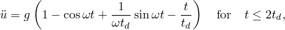
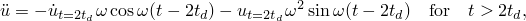
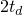
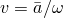
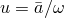
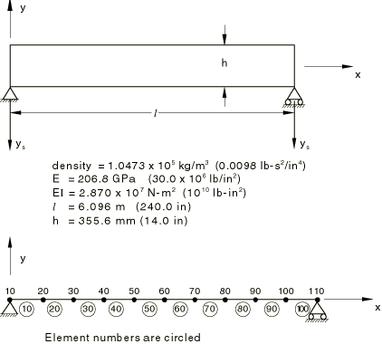

# 1.4.8 Response spectrum analysis of a simply supported beam

**Product: **Abaqus/Standard  

This problem verifies the Abaqus capability for response spectrum analysis by comparing the Abaqus results to an exact solution for a simple case.

### Problem description

The problem is a simply supported beam analyzed by Biggs (1964) and is shown in [Figure 1.4.8--1](ch01s04ach44.md#sxmrespspect-testmodel). The beam has a rectangular cross-section of width 37 mm (1.458 in) and depth 355.6 mm (14 in). The mass density of the beam is 1.0473  105 kg/m3 (0.0098 lb-s2/in4).

The finite element model is also shown in [Figure 1.4.8--1](ch01s04ach44.md#sxmrespspect-testmodel). The response spectrum is applied in the vertical direction at both supports, and the response is determined based on the first mode of the model. Analyses are run using element types B21 and B23, with response spectra defined in the following section. Zero damping is specified for the problem. The beam section is defined as a beam section and a general beam section to test both specifications.

### Response spectra definition

The response spectrum is defined as the peak response of a single degree of freedom spring-mass system excited by a given acceleration history applied to its base. Biggs (1964) defines the problem as having both supports moving vertically according to an acceleration history that ramps linearly from +*g* to *g* (where *g* is the acceleration due to gravity) over a time period of 0.1 seconds and is zero after that. With this base acceleration history, the acceleration of the mass in the single degree of freedom spring-mass system is 

where  is the natural frequency and  is the time of the ramp of the acceleration from +*g* to *g*.

The solution of these two equations for the maximum acceleration as a function of frequency defines the response spectrum. This has been done for frequencies of 5., 6., 6.098, 7., and 8. Hz. The following table shows the resulting response spectrum:

| FREQUENCY (Hz) | ACCELERATION (g's) |
| --- | --- |
| 5. | 2.0000 |
| 6. | 1.6667 |
| 6.098 | 1.6399 |
| 7. | 1.4286 |
| 8. | 1.4530 |

Abaqus provides options for spectrum input in terms of acceleration, velocity, and displacement. The table above is expanded to these forms using the definitions that  and 2, where  is the peak acceleration (in m/s2 or in/sec2), *v* is the peak velocity, and *u* is the peak displacement. The response spectra used in the four runs are shown in the [Table 1.4.8--1](ch01s04ach44.md#table-respspect-spectdef). In the table the acceleration spectrum in m/s2 (in/sec2) has been doubled and a compensating scale factor of 0.5 is used in the input.

### Results and discussion

Biggs (1964) calculates the exact natural frequency of the first mode as 6.1 Hz, with a modal participation factor of 1.27324. Abaqus gives the first mode frequency as 6.098 Hz for the 10-element model using element type B23 and 6.0808 Hz for the model using element type B21. The corresponding modal participation factors are 1.2733 and 1.2628. Both of the Abaqus results are quite close to Biggs's values, with the cubic beam (B23) results giving better agreement—possibly because the linear beam, B21, allows transverse shear deformation, which adds flexibility to the model and, hence, reduces the stiffness.

Biggs also gives the values of the maximum displacement, bending moment, curvature, and bending stress at the beam midspan using SRSS summation. These values are used in [Table 1.4.8--2](ch01s04ach44.md#table-respspect-results) to check the Abaqus calculations (the stress, moment, and curvature values reported from the Abaqus runs are obtained by extrapolation of integration point values to the midspan node). The Abaqus results compare well for all four test cases.

### Input files

[responsespecbeam.inp](../eif/responsespecbeam.inp)

Displacement response spectrum problem.

[responsespecbeam_velocity.inp](../eif/responsespecbeam_velocity.inp)

Velocity response spectrum.

[responsespecbeam_acc.inp](../eif/responsespecbeam_acc.inp)

*g* response spectrum.

[responsespecbeam_absacc.inp](../eif/responsespecbeam_absacc.inp)

Absolute acceleration spectrum.

### Reference

Biggs, J. M., *Introduction to Structural Dynamics*, McGraw-Hill, pp. 256–263, 1964.

### Tables

**Table 1.4.8–1** Response spectra definition.
| Frequency | Acceleration | Velocity | Displacement |
| --- | --- | --- | --- |
| Hz | rad/sec | g's | m/s2 | in/sec2 | m/s | in/sec | m | in |
| 5. | 31.4159 | 2.0000 | 39.258 | 1545.60 | .6248 | 24.5990 | .0199 | .7830 |
| 6. | 37.6991 | 1.6667 | 32.716 | 1288.02 | .4339 | 17.0830 | .0115 | .4531 |
| 6.098 | 38.3418 | 1.6399 | 32.190 | 1267.32 | .4201 | 16.5382 | .0110 | .4316 |
| 7. | 43.9823 | 1.4286 | 28.042 | 1104.02 | .3188 | 12.5507 | .0072 | .2854 |
| 8. | 50.2654 | 1.4530 | 28.521 | 1122.88 | .2837 | 11.1695 | .0056 | .2222 |

**Table 1.4.8–2** Response spectrum analysis results.
| Model | Spectrum | Midspan displacement | Midspan stress | Midspan moment | Midspan curvature |
| --- | --- | --- | --- | --- | --- |
| mm | MPa | N-m | rad/m |
| (in) | (lb/in2) | (lb-in) | (rad/in) |
| Biggs |  | 14.2 | 140.4 | 5.479 103 | 3.778 103 |
| (.56) | (20,100) | (9.595 105) | (9.595 105) |
| B23 | Displ. | 14.0 | n/a | 5.420 103 | 3.738 103 |
| (.549) | (9.493 105) | (9.493 105) |
| B21 | Vel. | 14.0 | n/a | 5.282 103 | 3.642 103 |
| (.550) | (9.251 105) | (9.251 105) |
| B23 | g | 14.0 | 139.3 | 5.420 103 | n/a |
| (.550) | (19,937) | (9.493 105) |
| B21 | Acc. | 14.0 | 135.8 | 5.282 103 | n/a |
| (.551) | (19,443) | (9.251 105) |
| n/a in the table above means that this variable is not available in the run, because of the beam section definition used. |

### Figure

**Figure 1.4.8–1** Simply supported beam for response spectrum test.

