# 1.4.10 Random response to jet noise excitation

**Product: **Abaqus/Standard  

This example illustrates and verifies the random response analysis capability in Abaqus with a simple beam example that was originally studied by Olson (1972). The problem is a five-span continuous beam exposed to jet noise. The example is solved using the built-in moving noise loading option and, as an illustration, with user subroutines [`UPSD`](../sub/sub-link.md#sub-xsl-upsd) and [`UCORR`](../sub/sub-link.md#sub-xsl-ucorr).

### Problem description

Except for the assumption that time is measured in seconds (so that frequencies are expressed in Hz), no specific set of units is used in this example. The units are assumed to be consistent.

The structure is a five-span straight beam, simply supported at its ends and at the four intermediate supports ([Figure 1.4.10--1](ch01s04ach46.md#sxmjetnoise-beam)). Each span has unit length. The beam is excited in bending. It has unit bending stiffness and mass of 1  104 per unit length.

Each span is modeled with four elements of type B23 (cubic beam in a plane), as shown in [Figure 1.4.10--1](ch01s04ach46.md#sxmjetnoise-beam). No mesh convergence studies have been performed; however, the first 15 natural frequencies agree quite well with the exact values given by Olson, so we assume that the mesh is reasonable. The response analysis is based on 1% of critical damping in each mode, as used by Olson.

### Loading

Jet noise is an acoustic excitation that applies random pressure loading to the surface of a structure. The pressure at a point is assumed to have a power spectral density 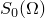, where  is frequency, measured in cycles per time. For this case, following Olson, we assume that the excitation is white noise (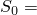1.0 at all frequencies) and that the acoustic waves are traveling along the structure with a velocity  (where  is taken to be 6.0 in this case). The cross-spectral density of the pressure loading between any two points can then be written as 

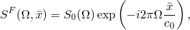

where 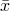 is the distance between the two points for which 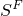 is being given. This type of loading is specified as a moving noise load in the correlation definition for random response analysis. The correlation definition acts between loads applied at the nodes of the model. In this case, since the elements are all of equal length, a load of magnitude 0.25 is applied equally to all nodes to simulate the pressure loading. Thus,  has only the discrete values of the distance between any combination of two nodes. Olson points out that this approximation reduces the accuracy of the results unless a rather fine mesh is used. However, the mesh used here provides results that agree well with those of Olson up to relatively high frequencies, suggesting that the approximation is not too coarse.

### Loading via user subroutines

For purposes of illustration we also show input data for the case where we apply the loading via user subroutines [`UPSD`](../sub/sub-link.md#sub-xsl-upsd) and [`UCORR`](../sub/sub-link.md#sub-xsl-ucorr). These subroutines allow the user to define a different frequency dependence and magnitude for each entry in the cross spectral density matrix. Any number of frequency functions can be used to define the cross spectral density of the loading as 

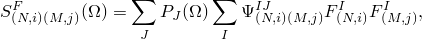

where 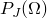 is a complex frequency function defined in the power spectral density definition and referenced in the *J*th correlation definition, 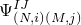 is the corresponding *J*th correlation matrix for load case *I* for degrees of freedom *i* at node *N* and *j* at node *M*, and  is the load applied to degree of freedom *i* at node *N* in load case *I*. Since there are 21 nodes in our model and the elements are all of equal length, the construction of 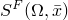 can be accomplished as follows. Concentrated nodal loads 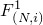 of 0.25 (corresponding to the length of each element) are applied to all of the nodes. In user subroutine [`UPSD`](../sub/sub-link.md#sub-xsl-upsd) we specify 21 complex frequency functions, 

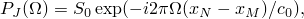

each for a particular value of 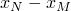, the distance between two nodes *N* and 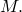  is equal to 1.0 (white noise) in this case. These frequency functions are referenced in 21 correlation definitions in the random response step. For each of these options matrices  are defined in user subroutine [`UCORR`](../sub/sub-link.md#sub-xsl-ucorr), each with unity in the appropriate 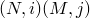 positions and zero elsewhere.

### Results and discussion

The first 15 natural frequencies agree closely with the exact values given by Olson, suggesting that the mesh is suitable for frequencies up to at least 110 Hz.

The random response results obtained with the two approaches are identical within numerical accuracy. [Figure 1.4.10--2](ch01s04ach46.md#sxmjetnoise-psdensitynode2) illustrates the power spectral density of the transverse displacement at node 2. These results, and similar plots for other nodes and for rotations, are in good agreement with those obtained by Olson (1972).

[Figure 1.4.10--3](ch01s04ach46.md#sxmjetnoise-rmsdispnode2) shows the root mean square (RMS) value of the transverse displacement at node 2. Since the higher modes tend to contribute less and less to the response, we expect the RMS values to level off as the frequency increases. As shown in [Table 1.4.10--1](ch01s04ach46.md#table-jetnoise-rmsdisp), the RMS values of rotation and transverse displacement at all nodes along the beam are seen to be in good agreement with Olson's results.

### Input files

[jetnoise_eigen.inp](../eif/jetnoise_eigen.inp)

Eigenvalue extraction step.

[jetnoise_restart.inp](../eif/jetnoise_restart.inp)

Restart run for the random response analysis.

[jetnoise_restart_usr_upsd.inp](../eif/jetnoise_restart_usr_upsd.inp)

Restart run for the random response analysis.

[jetnoise_restart_usr_upsd.f](../eif/jetnoise_restart_usr_upsd.f)

User subroutines [`UPSD`](../sub/sub-link.md#sub-xsl-upsd) and [`UCORR`](../sub/sub-link.md#sub-xsl-ucorr) used in jetnoise_restart_usr_upsd.inp.

### Reference

Olson,  M. D., “A Consistent Finite Element Method for Random Response Problems,” Computers and Structures, vol. 2, 1972.

### Table

**Table 1.4.10–1** Root mean square displacements and rotations.
| Node | Displacement | Rotation |
| --- | --- | --- |
| Olson | Abaqus | Olson | Abaqus |
| 1 | 0. | 0. | 0.7988 | 0.8679 |
| 2 | 0.1719 | 0.1820 | 0.5101 | 0.5289 |
| 3 | 0.2274 | 0.2349 | 0.2775 | 0.3867 |
| 4 | 0.1557 | 0.1656 | 0.5319 | 0.5537 |
| 5 | 0. | 0. | 0.6308 | 0.6811 |
| 6 | 0.1225 | 0.1301 | 0.3436 | 0.3619 |
| 7 | 0.1534 | 0.1589 | 0.2421 | 0.3230 |
| 8 | 0.1040 | 0.1123 | 0.3662 | 0.3840 |
| 9 | 0. | 0. | 0.4378 | 0.4921 |
| 10 | 0.0904 | 0.0998 | 0.2819 | 0.3044 |
| 11 | 0.1176 | 0.1245 | 0.2253 | 0.3050 |
| 12 | 0.0841 | 0.0932 | 0.2902 | 0.3139 |
| 13 | 0. | 0. | 0.3801 | 0.4315 |
| 14 | 0.0889 | 0.0954 | 0.3308 | 0.3469 |
| 15 | 0.1360 | 0.1400 | 0.2216 | 0.2877 |
| 16 | 0.1129 | 0.1188 | 0.3005 | 0.3185 |
| 17 | 0. | 0. | 0.6113 | 0.6539 |
| 18 | 0.1585 | 0.1670 | 0.5652 | 0.5911 |
| 19 | 0.2391 | 0.2478 | 0.2198 | 0.3042 |
| 20 | 0.1793 | 0.1884 | 0.5378 | 0.5615 |
| 21 | 0. | 0. | 0.8235 | 0.8821 |

### Figures

**Figure 1.4.10–1** Beam subjected to jet noise.

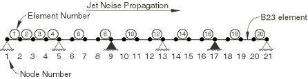

**Figure 1.4.10–2** Power spectral density of displacement at node 2.

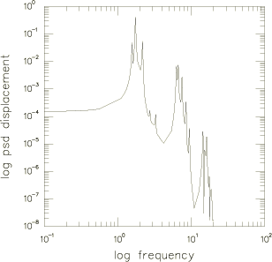

**Figure 1.4.10–3** Root mean square of displacement at node 2.

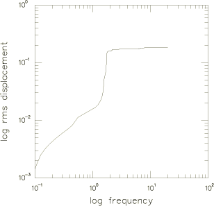

