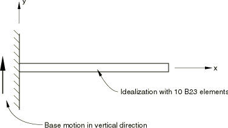
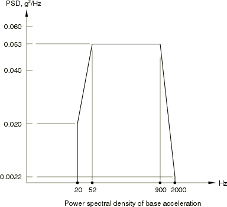
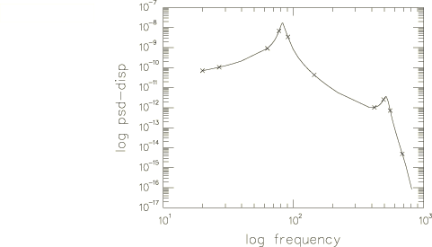

# 1.4.11 Random response of a cantilever subjected to base motion

**Product: **Abaqus/Standard  

The purpose of this example is to verify the random response analysis procedure for a case where the structure is excited by base motion. The model is a steel cantilever attached to a stiff vibrating structure that subjects it to prescribed transverse acceleration with a given power spectral density. The results are compared with the analysis of Johnsen and Dey (1978).

### Problem description

The cantilever is 1 m long and has a square cross-section of 100 mm  100 mm. The steel has a Young's modulus of 210 GPa, a Poisson's ratio of 0.3, and its density is 8000 kg/m3. A 10% structural damping factor is used for all the modes. The mesh has 10 elements of type B23 (cubic beam in a plane) and is shown in [Figure 1.4.11--1](ch01s04ach47.md#sxmcantbase-model).

### Loading

The base motion is applied as an acceleration with the power spectral density function shown in [Figure 1.4.11--2](ch01s04ach47.md#sxmcantbase-accelpsdensity). Since the excitation is in one degree of freedom only, the correlation matrix is a unit matrix.

### Results and discussion

The first 10 natural frequencies agree within 0.1% with those given by Johnsen and Dey (1978). The power spectral density of the displacement at the tip of the cantilever is shown in [Figure 1.4.11--3](ch01s04ach47.md#sxmcantbase-psdensitytip). For all nodes the values at the eigenfrequencies compare well with the results of Johnsen and Dey. For nodes close to the built-in end of the cantilever, discrepancies appear at higher frequencies. These differences are attributed to the use of a beam-column element in Abaqus (element type B23) that uses the axial strain as an internal degree of freedom in the element, so some axial modes appear at higher frequencies. The element used by Johnsen and Dey does not have these same modes. The differences are not important because they could be eliminated by using a finer mesh if the high frequency response close to the base of the cantilever must be predicted accurately.

### Input file

[randomrespcantilever.inp](../eif/randomrespcantilever.inp)

Input data for running the random response analysis.

### Reference

Johnsen, T. L, and S. S. Dey, *ASKA Part II – Linear Dynamic Analysis, Random Response*, ASKA UM 218, ISD, University of Stuttgart, 1978.

### Figures

**Figure 1.4.11–1** Steel cantilever subjected to base motion.

**Figure 1.4.11–2** Base acceleration power spectral density.

**Figure 1.4.11–3** Power spectral density of the displacement response at the tip of the cantilever.

