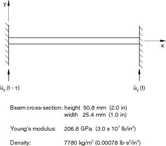
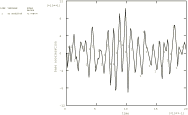
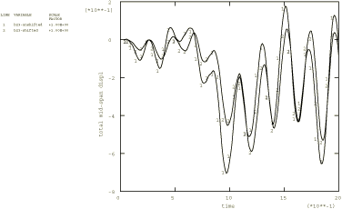
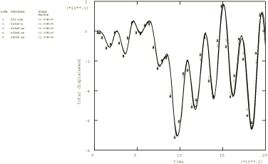
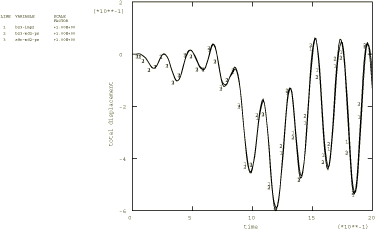

# 1.4.12 Double cantilever subjected to multiple base motions

**Product: **Abaqus/Standard  

Enforced motion is often the primary source of excitation in vibration problems. Examples include vehicle suspensions responding to road irregularities and civil structures subjected to seismic ground motions. In these problems the forcing functions are given by the time history of motions at the supports of the structure.

For modal-based analyses using the modal dynamic and the steady-state dynamic procedures, the support motions are simulated by prescribed excitations, called base motions. Base motions are applied by constraining groups of degrees of freedom into one or more “bases” by specifying a base name on the boundary condition in the frequency step. Multiple bases are required if base motions cannot be described by a single set of rigid body motions.

Degrees of freedom that are constrained without being assigned to a named base make up the *primary* base. This is the only base if the motion can be described by a single set of rigid body motions. Constrained degrees of freedom that are associated with named boundary conditions make up the *secondary* base or bases. Abaqus uses the modal participation method for primary base motions and the “large mass” method for secondary base motions (see ["Base motions in modal-based procedures," Section 2.5.9 of the Abaqus Theory Guide](../stm/stm-link.md#stm-anl-basemotions)).

### Problem description

As an illustration we consider a simple model of a bridge whose supports are subjected to seismic excitations. Two cases are analyzed: the first considers identical base excitations at the supports, and the second assumes that the left-end support is subjected to the excitation with a time shift. The forcing function corresponds to the same El Centro N–S earthquake records used in ["Analysis of a cantilever subject to earthquake motion," Section 1.4.13](ch01s04ach49.md). The model is a double cantilever lying horizontally along the *x*-direction (see [Figure 1.4.12--1](ch01s04ach48.md#sxmdoublecant-beam)), analyzed with 20 equal-sized B23 elements. A two-second event is studied. Analyses are also performed using the implicit dynamic procedure to provide a basis for comparison of the results obtained by the modal dynamic procedure. The time incrementation scheme is the same as that used in ["Analysis of a cantilever subject to earthquake motion," Section 1.4.13](ch01s04ach49.md).

Three models with different “base” organizations are used for the modal dynamic analyses. In the first model the base motion is invoked without referring to a secondary base. In the second model the base motion is invoked without referring to a secondary base for the right-end support—the primary base—and with the base name for the left-end support, which is declared in the frequency step as a secondary base, named `NODE21`. Finally, a model with two secondary bases and no primary base is used. In this model both supports are declared in the frequency step as secondary bases, named `NODE1` and `NODE21`.

### Results and discussion

The base acceleration record is shown in [Figure 1.4.12--2](ch01s04ach48.md#sxmdoublecant-accelrecord). [Figure 1.4.12--3](ch01s04ach48.md#sxmdoublecant-transdisp) shows the (total) displacement response of the midspan node to the unshifted and shifted base excitations predicted using the dynamic procedure.

The modal dynamic analysis results agree closely with the implicit dynamic solution. [Figure 1.4.12--4](ch01s04ach48.md#sxmdoublecant-notimeshift) shows the total displacement response of the midspan obtained with beam models using different dynamic procedures, as well as various base motions for modal dynamic analyses, for the case with no time shift. [Figure 1.4.12--5](ch01s04ach48.md#sxmdoublecant-timeshift) shows the same responses for the case where the motion at the left-end support is delayed by 0.25 second. As a verification exercise the modal dynamic analysis that invokes multiple base motions is repeated using a shell mesh with 10 S8R elements and gives the same results as obtained by the beam model. These solutions are obtained based on superposition of the first six nonzero eigenmodes of the structure. For models with secondary bases the additional low-frequency modes resulting from the unconstrained degrees of freedom at the bases must be taken into account. Abaqus automatically increases the number of eigenfrequencies to keep the number of relevant frequencies constant. However, the eigenmode range used for the modal damping must be extended by the user. The boundary conditions that make up the primary base normally suppress all rigid body motion. If they do not, as occurs in the third model where the primary base is absent, a suitable (negative) shift point must be used in the frequency procedure to avoid numerical problems.

In modal dynamics the default output gives motion relative to the primary base. The sum of this relative motion and the base motion of the primary base yields the total motion. In the absence of primary base motions the relative and total motions are identical. The plots shown in [Figure 1.4.12--4](ch01s04ach48.md#sxmdoublecant-notimeshift) and [Figure 1.4.12--5](ch01s04ach48.md#sxmdoublecant-timeshift) have been requested appropriately to give total values in all cases.

### Input files

##### **Modal dynamic analysis**

[multibasemotion_modal1.inp](../eif/multibasemotion_modal1.inp)

The only base is the primary base.

[multibasemotion_modal12.inp](../eif/multibasemotion_modal12.inp)

Both primary and secondary bases. The base acceleration record for the left-end support has a time shift of 0.25 second.

[multibasemotion_modal2.inp](../eif/multibasemotion_modal2.inp)

Only secondary bases. The base acceleration record for the left-end support has a time shift of 0.25 second.

##### **Other verification problems**

[multibasemotion_noshift.inp](../eif/multibasemotion_noshift.inp)

Same as multibasemotion_modal12.inp but without the time shift.

[multibasemotion_direct.inp](../eif/multibasemotion_direct.inp)

Direct integration analysis.

[multibasemotion_directdelay.inp](../eif/multibasemotion_directdelay.inp)

Direct integration analysis. The base motion has a time delay of 0.25 second.

[multibasemotion_modal2_noshift.inp](../eif/multibasemotion_modal2_noshift.inp)

Only secondary bases, no time shift.

[multibasemotion_s8r_modal.inp](../eif/multibasemotion_s8r_modal.inp)

Modal dynamic analysis using a shell mesh with 10 S8R elements.

[multibasemotion_s8r_shift.inp](../eif/multibasemotion_s8r_shift.inp)

Modal dynamic analysis using a shell mesh with 10 S8R elements. The base motion has a time delay of 0.25 second.

[multibasemotion_quake.inp](../eif/multibasemotion_quake.inp)

Earthquake record.

[multibasemotion_quake_shift.inp](../eif/multibasemotion_quake_shift.inp)

Earthquake record, time delay of 0.25 second.

[multibasemotion_s4r5.inp](../eif/multibasemotion_s4r5.inp)

Modal dynamic analysis using a shell mesh with 10 S4R5 elements. The [*TRANSFORM](../key/key-link.md#usb-kws-mtransform) option is also exercised in this analysis.

[multibasemotion_s4r5_shift.inp](../eif/multibasemotion_s4r5_shift.inp)

Modal dynamic analysis using a shell mesh with 10 S4R5 elements. The [*TRANSFORM](../key/key-link.md#usb-kws-mtransform) option is also exercised in this analysis. The base motion has a time delay of 0.25 second.

### Figures

**Figure 1.4.12–1** Double cantilever beam.

**Figure 1.4.12–2** Base acceleration record.

**Figure 1.4.12–3** Total transverse displacement response of beam midspan to base excitations with and without the 0.25 second time shift.

**Figure 1.4.12–4** Total transverse displacement responses of beam midspan to base motions without time shift.

**Figure 1.4.12–5** Total transverse displacement responses of beam midspan to base motions with the 0.25 second time shift.

