# 1.4.13 Analysis of a cantilever subject to earthquake motion

**Product: **Abaqus/Standard  

This example demonstrates the use of Abaqus in a seismic analysis where the forcing function is given by the time history of acceleration at an anchor point of the structure. Three types of analyses are illustrated: modal dynamics in the time domain, direct time integration, and response spectrum analysis.

In problems such as this one, the modal dynamic procedure is the analysis method of choice because it is computationally inexpensive and it is very accurate (provided that enough modes are extracted), since the integration of the modal amplitudes (the “generalized coordinates”) is exact. Direct time integration is also used in this problem to illustrate the accuracy of the time integration operator. Response spectrum analyses, based on spectra calculated from the same earthquake record, are also performed and compared with the exact solution.

Examples are also included to illustrate the use of baseline correction. Baseline correction is used to modify the acceleration record by adding a correction to the acceleration record to minimize the mean square velocity over the time of the event. The correction to the acceleration record is piecewise quadratic in time. In this example the analyses are first performed without baseline correction. Two different baseline corrections are then applied, and the results with and without baseline correction are compared.

### Problem description

The structure chosen for this example is a free standing, vertical cantilevered column. The dimensions of the column, shown in [Figure 1.4.13--1](ch01s04ach49.md#sxmearthquake-geom), have been chosen so that the column will have a number of frequencies in the range that is usually of interest in the seismic analysis of structures. This range of interest is commonly taken to be up to 33 Hz, the rationale being that the spectral content of the acceleration record will not excite the higher frequency modes of the structure.

To choose a mesh for which the geometric discretization error is negligible, it is important to ensure that the modes corresponding to eigenvalues up to 33 Hz are modeled accurately using the chosen mesh. [Table 1.4.13--1](ch01s04ach49.md#table-earthquake-natfreqs) shows that a model with 10 elements of type B23 (cubic beam in a plane) gives the first six frequencies (up to about 60 Hz) very accurately, with an error of about 0.1% in the fourth mode (25 Hz). This mesh is, therefore, chosen for the analysis.

### Time domain analysis

The seismic analysis is performed using the El Centro N-S acceleration history, which is discretized every 0.01 second. An exact benchmark solution is readily obtained by integrating the eigenvalues and eigenvectors of the structure exactly in time over the first 10 seconds of the acceleration input (see, for example, Hurty and Rubinstein, 1964). (This solution is calculated using the FORTRAN program contained in the file [cantilever_exact.f](../eif/cantilever_exact.f).) The number of modes included in this solution has been found by trial, which has shown that using the six lowest modes (up to 61.9 Hz) gives displacements that are accurate to 0.01%. The higher modes have a negligible effect since the earthquake acceleration input is discretized every 0.01 second.

The modal dynamic analysis is identical to the benchmark solution, except for the spatial discretization, since Abaqus integrates the response of the generalized coordinates exactly for inputs that vary linearly during each time increment.

The direct integration analysis is run using the Hilber-Hughes operator with the operator parameter  set to 0.0, which gives the standard trapezoidal rule. This operator is unconditionally stable and has no numerical damping, but it exhibits a phase error. [Figure 1.4.13--2](ch01s04ach49.md#sxmearthquake-phase-error), taken from Hilber et al. (1977), shows how this error grows with the ratio of the time step to the oscillator period. Automatic time stepping would normally be chosen, with Abaqus adjusting the time step to achieve the accuracy specified by the choice of the half-increment residual tolerance in the dynamic procedure. In this case we choose instead to use a fixed time step of 0.01 seconds so that the integration errors are readily illustrated.

For both of these time history analyses the base motion is read from the given acceleration history by using an amplitude curve. For direct integration this base motion is prescribed by using a boundary condition, whereas for the modal dynamic procedure it must be given using base motion.

### Response spectrum analysis

Response spectrum analysis provides an inexpensive technique for estimating the peak (linear) response of a structure to a dynamic excitation. The spectrum is first constructed for the given acceleration history by integrating the equation of motion of a damped single degree of freedom system. This provides the maximum displacement, velocity, and acceleration response of such a system. Plots of these responses as functions of the natural frequency of the single degree of freedom system are known as displacement, velocity, and acceleration spectra. The maximum response of the structure is then estimated from these spectra by the response spectrum procedure.

### Results and discussion

The results for each analysis are discussed below.

#### Modal dynamic

The modal dynamic analysis results agree exactly with the benchmark solution, since the linear variation of the inputs over each increment results in exact integration.

#### Dynamic

The dynamic analysis is run for 10 sec (1000 increments). The displacement, velocity, and acceleration at the top of the column are plotted as functions of time using the Visualization module in Abaqus/CAE. The response quantities in these plots are all measured relative to the base of the structure. The FORTRAN program that calculates the benchmark solution writes its results to various files, so that Abaqus/CAE can be used to plot the benchmark solution on the same graphs as the Abaqus results.

[Figure 1.4.13--3](ch01s04ach49.md#sxmearthquake-reldisp) shows the displacement of the top of the column, relative to its base, for the first 2 seconds of response. The approximate and benchmark solutions agree well on this plot. The relative velocity and acceleration of the column top for the first 2 sec are shown in [Figure 1.4.13--4](ch01s04ach49.md#sxmearthquake-relvel) and [Figure 1.4.13--5](ch01s04ach49.md#sxmearthquake-relaccel). The difference between the benchmark and the approximate solutions is now more apparent, especially in the acceleration trace. [Figure 1.4.13--6](ch01s04ach49.md#sxmearthquake-reldisp8-10) through [Figure 1.4.13--8](ch01s04ach49.md#sxmearthquake-relaccel8-10) show the response from 8 to 10 seconds after the start of the event. The higher mode content of the approximate solution now shows a significant phase error in the relative displacement trace ([Figure 1.4.13--6](ch01s04ach49.md#sxmearthquake-reldisp8-10)), and the acceleration solution is quite seriously in error.

The source of this phase error is the phase error inherent in the time integration operator, shown in [Figure 1.4.13--2](ch01s04ach49.md#sxmearthquake-phase-error). It is a simple matter to estimate the error and its effect on each mode after 10 seconds of response. Such a calculation is summarized in [Table 1.4.13--2](ch01s04ach49.md#table-earthquake-phserror). As shown in the table, with the 0.01 second time step chosen, the error in the first and second modes is about 4% and 46%, respectively; for all other modes the errors are well in excess of 100%, so the effect shown in [Figure 1.4.13--6](ch01s04ach49.md#sxmearthquake-reldisp8-10) is entirely predictable: with a 0.01 second time step, the errors are very large for all but the first mode response. It is interesting to observe that, to achieve less than a 5% phase error after 10 seconds in Mode 6, the phase error would have to be less than 8  105 per cycle, implying a time step that is not larger than about 105 seconds.

[Figure 1.4.13--9](ch01s04ach49.md#sxmearthquake-reldisp1-10) shows the displacement of the undamped system during the entire 10-second analysis. Even without damping, the first mode response so dominates the solution that the predicted tip displacement response after 10 seconds is not grossly in error. In reality, there will always be some damping; if the structure is undergoing large motion, it is likely that the damping will be enough to remove most of the response above the second mode in this period of time. The common design approach is to incorporate all dissipation of energy as equivalent linear viscous damping—typically assumed to be a certain fraction (2–6%) of critical damping in each mode when modal dynamics is used. This approach cannot be used in direct integration analysis since the modes are not extracted. Instead, damping can be used to introduce mass and stiffness proportional damping into models that are integrated directly. We have not used this option here. In calculations for extremely large input motions this linearized approach is usually replaced with a nonlinear analysis in which the damping mechanisms are modeled explicitly.

#### Response spectrum

The spectra for response spectrum analysis are obtained by integrating 10 seconds of the acceleration record using the FORTRAN program given in the file [cantilever_spectradata.f](../eif/cantilever_spectradata.f). By varying the frequency range and the damping values, several different response spectra can be obtained. [Figure 1.4.13--10](ch01s04ach49.md#sxmearthquake-dispspectra) through [Figure 1.4.13--12](ch01s04ach49.md#sxmearthquake-disp-vel) depict the displacement and velocity spectra for the frequency ranges 0.1–30 Hz and 0.01–5.0 Hz with no damping and with damping chosen as 2% and 4% of critical damping. 

The response spectrum procedure estimates the response at each frequency either as the sum of the absolute values of the modal responses (the absolute summation, or ABS, method) or as the square root of the sum of the squares of the modal responses (SRSS method). The absolute summation method is always conservative, in the sense that it overpredicts the response.

Since the natural modes of the cantilever are well separated in this case, the ten-percent summation method will give the same results as the SRSS method. The complete quadratic combination method will also give these same results, and the Naval Research Laboratory method will give values close to those provided by ABS summation. A comparison of these methods in a more complex case is provided in ["Response spectra of a three-dimensional frame building," Section 2.2.3 of the Abaqus Example Problems Guide](../exa/exa-link.md#exa-dyn-3dframeresponsespect).

We can compare the response estimates provided by the response spectrum analysis with the exact values by examining the predictions of response quantities at the top of the column. The exact peak displacement is 59.2 mm (2.33 in), and the peak velocity is 0.508 m/sec (20 in/sec). The comparison is based on the response spectrum values obtained with the assumption of no damping and is shown in [Table 1.4.13--3](ch01s04ach49.md#table-earthquake-maxdispvel). We see that, using the displacement spectrum, the ABS summation method overestimates the peak displacement by 14% and the peak velocity by 28%, whereas the SRSS method underestimates the peak displacement by 3% and the peak velocity by 22%. Using the velocity spectrum, the ABS method overestimates the peak displacement by 20% and the peak velocity by 27%, whereas the SRSS method overpredicts the peak displacement by 4% and underpredicts the peak velocity by 22%. In spite of these rather large errors, the method is commonly used because of its simplicity and ready application to design cases. The response spectra results found in [Table 1.4.13--3](ch01s04ach49.md#table-earthquake-maxdispvel) can be obtained by executing the FORTRAN program given in the file [cantilever_spectradata.f](../eif/cantilever_spectradata.f) and then running the Abaqus input given in [cantilever_responsespec.inp](../eif/cantilever_responsespec.inp). To obtain results using the ABS summation method, two response spectrum steps must be added to sum the directional excitation components algebraically and to sum the absolute values of the responses in each natural mode.

#### Baseline correction

Baseline correction adds a piecewise quadratic correction to the acceleration record to minimize the mean square velocity of the motion. This correction will change the displacement quite substantially (the corrected base displacement will tend to zero at the end of the motion), but the change in the acceleration record will not be very large. As a result, the relative displacement between the tip and the base of the cantilever will be affected very little, but the absolute displacement will change substantially if significant baseline correction is added.

Baseline correction can be applied in Abaqus as a piecewise quadratic correction through the time domain. In this example we apply two corrections: one done for the entire period of time (here 25 sec) and one done using three intervals: 0.0–8.3 sec, 8.3–16.7 sec, and 16.7–25 sec. [Figure 1.4.13--13](ch01s04ach49.md#sxmearthquake-absdisp) shows the total (not relative) displacement of the tip of the cantilever with and without these corrections, and [Figure 1.4.13--14](ch01s04ach49.md#sxmearthquake-basedisp) shows the base displacement with and without baseline correction. [Figure 1.4.13--14](ch01s04ach49.md#sxmearthquake-basedisp) was produced by running all three analyses for 25 seconds (the duration of the acceleration record) and then plotting the total displacement of the base of the cantilever. The effect of the correction on displacement is clear from [Figure 1.4.13--14](ch01s04ach49.md#sxmearthquake-basedisp); as more intervals are used for the correction, the base displacement at the end of the analysis tends more toward zero.

### Input files

##### **Direct integration analysis**

[cantilever_dynamic.inp](../eif/cantilever_dynamic.inp)

Used to obtain the first 5 seconds of response with direct integration ([*DYNAMIC](../key/key-link.md#usb-kws-hdynamic)).

[cantilever_quakedata.inp](../eif/cantilever_quakedata.inp)

The earthquake record, read as file `QUAKE.AMP`.

[cantilever_restart.inp](../eif/cantilever_restart.inp)

Restarts the direct integration analysis and completes the 10 seconds of response.

##### **Modal dynamic analysis**

[cantilever_modal_10s.inp](../eif/cantilever_modal_10s.inp)

[*MODAL DYNAMIC](../key/key-link.md#usb-kws-hmodaldyn) analysis.

[cantilever_modal_25s.inp](../eif/cantilever_modal_25s.inp)

Identical to cantilever_modal_10s.inp, except that the analysis time is 25 seconds instead of 10 seconds.

##### **Response spectrum analysis**

[cantilever_responsespec.inp](../eif/cantilever_responsespec.inp)

Response spectrum analysis. To run this file, the user must first run cantilever_spectradata.f.

[cantilever_spectradata.f](../eif/cantilever_spectradata.f)

FORTRAN program that generates displacement and velocity spectra. This program integrates the equation of motion of a single degree of freedom system at given frequencies and, thus, creates the needed spectrum definitions. The response spectra are written to ASCII files `QUAKE*x*.DIS`, `QUAKE*x*.VEL`, `QUAKER*x*.DIS`, and `QUAKER*x*.VEL`, where the extension indicates displacement `(.DIS)` or velocity `(.VEL)` data. The *x* in the file name indicates the damping percentage, and the R indicates reduced frequency range results.

##### **Benchmark solution**

[cantilever_exact.f](../eif/cantilever_exact.f)

FORTRAN program that will create an “exact” solution to the problem. The program works by first calculating the eigenmodes of the cantilever and then calculating the response using modal superposition. The results file from the direct integration analysis is also read by this program to obtain the response relative to the base of the structure; hence, cantilever_dynamic.inp and cantilever_restart.inp must be run before the FORTRAN program will work properly. The FORTRAN program then creates a new results file containing the relative response at the top of the cantilever as degree of freedom 1 (Abaqus solution obtained from input file cantilever_restart.inp) and the results from the modal superposition analysis as degree of freedom 2 (exact solution). Furthermore, ASCII files `exactdisp`, `exactvelo`, and `exactaccl` are also generated. These contain the displacement, velocity, and acceleration results, respectively.

##### **Eigenvalue analysis**

[cantilever_eig_b21.inp](../eif/cantilever_eig_b21.inp)

B21 elements.

[cantilever_eig_b21_fine.inp](../eif/cantilever_eig_b21_fine.inp)

B21 elements, fine mesh.

[cantilever_eig_b23.inp](../eif/cantilever_eig_b23.inp)

B23 elements.

[cantilever_eig_b23_fine.inp](../eif/cantilever_eig_b23_fine.inp)

B23 elements, fine mesh.

##### ** Modal dynamic analysis with baseline correction**

[cantilever_baseline1_10s.inp](../eif/cantilever_baseline1_10s.inp)

Modal dynamic analysis with baseline correction over one interval.

[cantilever_baseline3_10s.inp](../eif/cantilever_baseline3_10s.inp)

Modal dynamic analysis with baseline correction over three intervals.

[cantilever_baseline1_25s.inp](../eif/cantilever_baseline1_25s.inp)

Identical to cantilever_baseline1_10s.inp, except that the analysis time is 25 seconds instead of 10 seconds.

[cantilever_baseline3_25s.inp](../eif/cantilever_baseline3_25s.inp)

Identical to cantilever_baseline3_10s.inp, except that the analysis time is 25 seconds instead of 10 seconds.

[cantilever_baseline_eqspaced.inp](../eif/cantilever_baseline_eqspaced.inp)

Variation of file cantilever_baseline1_10s.inp that uses equally spaced amplitude data to define the earthquake record.

[cantilever_data.inp](../eif/cantilever_data.inp)

Equally spaced amplitude data used in the file above.

##### **Other verification problems**

[cantilever_s8r_dynamic.inp](../eif/cantilever_s8r_dynamic.inp)

Tests direct integration using S8R elements.

[cantilever_s8r_modal.inp](../eif/cantilever_s8r_modal.inp)

Tests modal dynamics using S8R elements.

### References

Hilber,  H. M., T. J. R. Hughes, and R. L. Taylor, “Improved Numerical Dissipation of Time Integration Algorithms in Structural Dynamics,” Earthquake Engineering and Structural Dynamics, vol. 5, pp. 283–292, 1977.

Hurty,  W. C., and M. F. Rubinstein, *Dynamics of Structures, *Prentice-Hall, New Jersey, 1964.

### Tables

**Table 1.4.13–1** Natural frequencies in Hertz.
| Mode | Exact | Finite Element |
| --- | --- | --- |
| B23 elements | B21 elements |
| 10 | 20 | 50 | 10 | 20 |
| 1 | .729 | .729 | .729 | .729 | .726 | .728 |
| 2 | 4.567 | 4.567 | 4.567 | 4.567 | 4.519 | 4.554 |
| 3 | 12.787 | 12.791 | 12.787 | 12.787 | 12.623 | 12.740 |
| 4 | 25.058 | 25.082 | 25.059 | 25.058 | 24.774 | 24.961 |
| 5 | 41.423 | 41.529 | 41.430 | 41.423 | 41.222 | 41.288 |
| 6 | 61.878 | 62.220 | 61.901 | 61.879 | 62.328 | 61.767 |
| 7 | 86.425 | 87.317 | 86.488 | 86.426 | 88.453 | 86.472 |
| 8 | 115.060 | 117.040 | 115.210 | 115.070 | 119.210 | 115.510 |
| 9 | 147.790 | 151.470 | 148.100 | 147.800 | 151.380 | 141.010 |
| 10 | 148.610 | 169.170 | 169.170 | 169.170 | 168.990 | 169.120 |

**Table 1.4.13–2** Estimated phase errors after 10 seconds of response, using a time step of 0.01 second (based on [Figure 1.4.13--2](ch01s04ach49.md#sxmearthquake-phase-error)).
| Mode | Period, *T*, (seconds) | 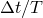 | Phase error per period | Phase error after 10 seconds |
| --- | --- | --- | --- | --- |
| 1 | 1.37 | .007 | .005% | 3.6% |
| 2 | 0.219 | .046 | .01% | 46% |
| 3 | 0.078 | .128 | .05% | 600% |
| 4 | 0.040 | .251 | .17% | 4000% |
| 5 | 0.024 | .414 | .4% | 16000% |
| 6 | 0.016 | .619 | .6% | 37000% |

**Table 1.4.13–3** Estimates of maximum displacement and velocity at the top of the column provided by response spectrum analysis.
|  | Displacement | Velocity |
| --- | --- | --- |
| Exact value | 59.2 mm (2.33 in) | 0.508 m/sec (20 in/sec) |
| Displacement spectrum: |  |  |
| ABS summation | 67.3 mm (2.65 in) | 0.641 m/sec (25.22 in/sec) |
| SRSS summation | 57.1 mm (2.25 in) | 0.392 m/sec (15.45 in/sec) |
| Velocity spectrum: |  |  |
| ABS summation | 70.9 mm (2.79 in) | 0.642 m/sec (25.28 in/sec) |
| SRSS summation | 61.0 mm (2.40 in) | 0.395 m/sec (15.57 in/sec) |

### Figures

**Figure 1.4.13–1** Vertical cantilever beam.

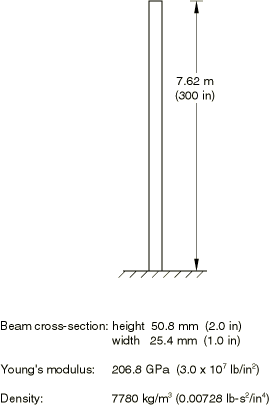

**Figure 1.4.13–2** Relative period error (phase error) versus  for Hilber-Hughes, Wilson, Newmark, and Houbolt methods (from Hilber et al., 1977).

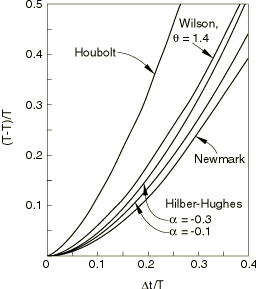

**Figure 1.4.13–3** Relative displacement at the top of the column for the first 2 seconds of response.

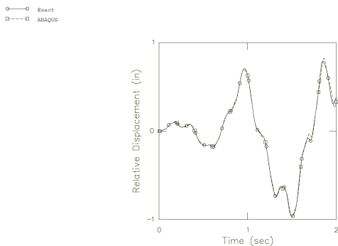

**Figure 1.4.13–4** Relative velocity at the top of the column for the first 2 seconds of response.

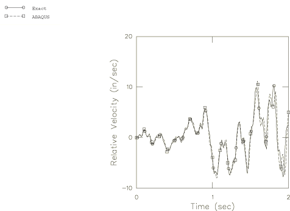

**Figure 1.4.13–5** Relative acceleration at the top of the column for the first 2 seconds of response.

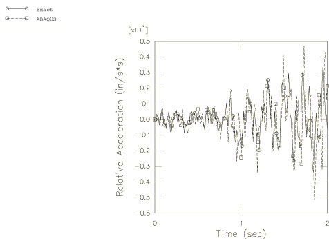

**Figure 1.4.13–6** Relative displacement at the top of the column for the period 8–10 seconds.

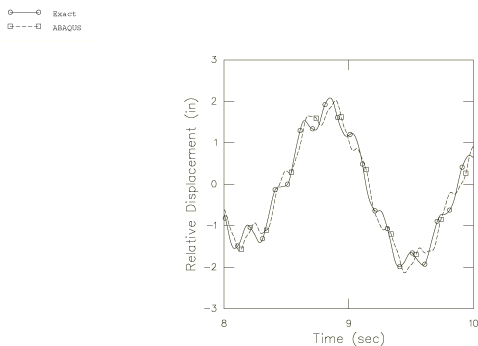

**Figure 1.4.13–7** Relative velocity at the top of the column for the time period 8–10 seconds.

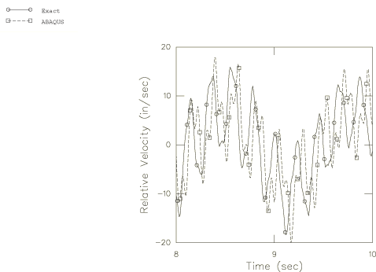

**Figure 1.4.13–8** Relative acceleration at the top of the column for the time period 8–10 seconds.

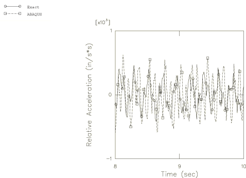

**Figure 1.4.13–9** Relative displacement at the top of the column for the time period 1–10 seconds.

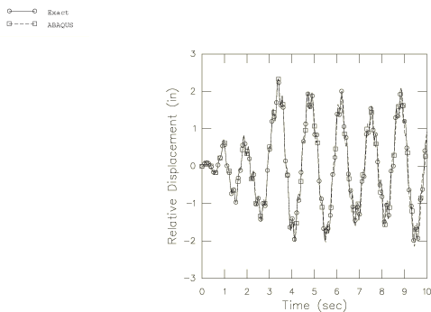

**Figure 1.4.13–10** Displacement spectra for the frequency range 0.1–30 Hz.

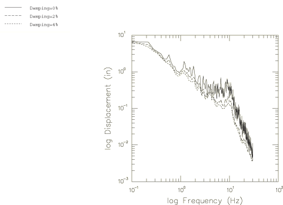

**Figure 1.4.13–11** Velocity spectra for the frequency range 0.1–30 Hz.

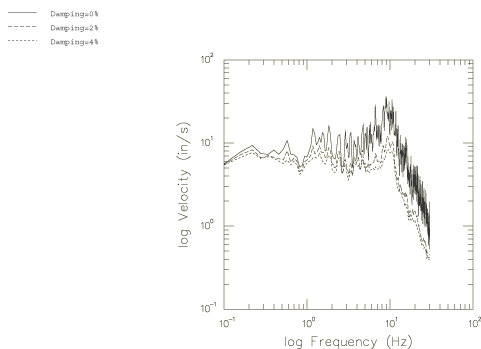

**Figure 1.4.13–12** Displacement and velocity spectra for the frequency range 0.01–5.0 Hz.

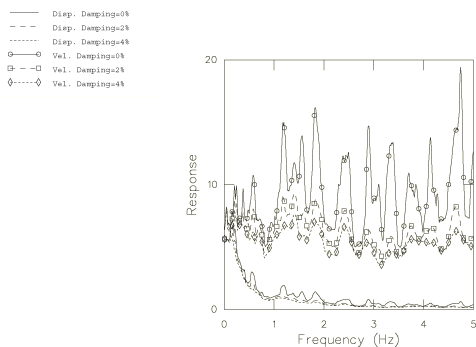

**Figure 1.4.13–13** Absolute displacement of the cantilever's tip with and without baseline correction.

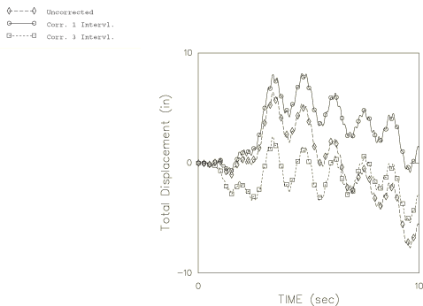

**Figure 1.4.13–14** Base displacement with and without baseline correction.

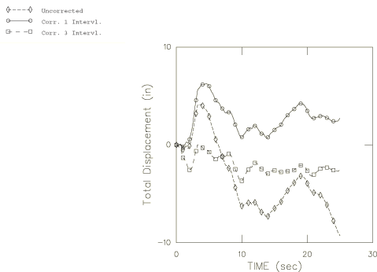

