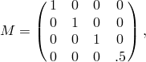
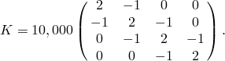
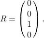
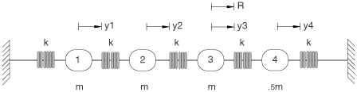

# 1.4.14 Residual modes for modal response analysis

**Product: **Abaqus/Standard  

The purpose of this example is to illustrate the use of the residual modes capability in Abaqus and to verify the solution accuracy.

In many modal response analyses, simplifying a model by reducing the number of degrees of freedom or extracting only a small subset of eigenmodes is often a common practice. These assumptions are beneficial for cost reductions, but the accuracy of the modal solution may suffer. To improve solution accuracy, the method of residual modes (see ["Natural frequency extraction," Section 6.3.5 of the Abaqus Analysis User's Guide](../usb/usb-link.md#usb-anl-afreqextraction)) can be employed. This method extracts an additional set of modes based on loading conditions to help correct for errors introduced by mode truncation. Residual modes are orthogonal to retained eigenmodes and to each other and are computed when specified in the frequency step. 

### Problem description

A simple multiple-degree-of-freedom spring-mass system is used to demonstrate the capability of using residual modes to obtain high solution accuracy. The model consists of 4 masses and 5 springs, as shown in [Figure 1.4.14--1](ch01s04ach50.md#dickensmodel). The assembled mass and stiffness matrices are as follows:

The mass for node 4 is set to half the value of the other three nodes so as to have four distinct modes for the system. A spatial loading of unit force *R* is applied to node 3 in the *y*-direction, where

The eigenfrequencies and corresponding eigenmodes are given in the following table:

| Mode No. | Frequency (Hz) | Nodal Eigendisplacements |
| --- | --- | --- |
| Node 1 | Node 2 | Node 3 | Node 4 |
| 1 | 10.155 | 0.39948 | 0.63631 | 0.61408 | 0.03418 |
| 2 | 20.222 | 0.68548 | 0.26428 | --0.58359 | --0.48927 |
| 3 | 28.258 | 0.60461 | --0.69678 | 0.19839 | 0.46815 |
| 4 | 34.963 | 0.07056 | --0.19939 | 0.49292 | --1.19360 |

The spatial loading is applied harmonically with an excitation frequency of 3 Hz to verify the steady-state response of the system. The single residual mode corresponding to the excitation load is included in the projected basis. A modal damping factor of 0.02 is applied to all the modes including the residual modes.

### Results and discussion

Only one eigenmode is extracted to demonstrate the capability of improving the solution accuracy by extracting residual modes. The residual mode (RM) obtained by Abaqus is identical to that given in the reference. 

| Mode No. | Frequency (Hz) | Nodal Eigendisplacements |
| --- | --- | --- |
| Node 1 | Node 2 | Node 3 | Node 4 |
| Published solutions |
| 1 | 10.155 | 0.39948 | 0.63631 | 0.61408 | 0.03418 |
| RM | 21.865 | 0.68548 | 0.26428 | --0.58359 | --0.48927 |
| Abaqus |
| 1 | 10.155 | 0.39948 | 0.63631 | 0.61408 | 0.03418 |
| RM | 21.865 | 0.68548 | 0.26428 | --0.58359 | --0.48927 |

For the 3 Hz harmonic response analysis, displacements and accelerations of all the nodes are presented for two cases. The first case uses only the first eigenmode, while the second case uses both the first eigenmode and the residual mode. The percentage error shows very clearly how solution accuracy can be significantly improved by adding the residual modes to the original set of eigenvectors.

|  | Displacements |
| --- | --- |
| Node 1 | Node 2 | Node 3 | Node 4 |
| Published results (all modes) | 4.52E5 | 8.89E5 | 1.29E4 | 6.53E5 |
| Abaqus solutions |
| Case 1 (mode 1 only) | 6.60E5 | 1.05E4 | 1.01E4 | 5.65E5 |
| Case 2 (mode 1 with RM) | 4.53E5 | 8.88E5 | 1.29E4 | 6.51E5 |
| Percentage error |
| Case 1 | 46.02 | 18.11 | --21.71 | --13.63 |
| Case 2 | 0.22 | --0.11 | 0.00 | --0.31 |

|  | Accelerations |
| --- | --- |
| Node 1 | Node 2 | Node 3 | Node 4 |
| Published results (all modes) | 1.61E2 | 3.16E2 | 4.59E2 | 2.32E2 |
| Abaqus solutions |
| Case 1 (mode 1 only) | 2.34E2 | 3.73E2 | 3.60E2 | 2.00E2 |
| Case 2 (mode 1 with RM) | 1.61E2 | 3.16E2 | 4.60E2 | 2.31E2 |
| Percentage error |
| Case 1 | 45.34 | 18.04 | --21.57 | --13.79 |
| Case 2 | 0.00 | 0.00 | 0.22 | --0.43 |

### Input file

[dickens_model.inp](../eif/dickens_model.inp)

Dickens numerical example.

### Reference

Dickens,  J. M., J. M. Nakagawa, and M. M. Wittbrodt, “A Critique of Mode Acceleration and Modal Truncation Augmentation Methods for Modal Response Analysis,” Computers & Structures, vol. 62, no.6, pp. 985–998, 1997.

### Figure

**Figure 1.4.14–1** A four-degree-of-freedom spring-mass model.

