# 1.5.2 Steady-state spinning of a disk in contact with a foundation

**Product: **Abaqus/Standard  

This example illustrates the nature of viscoelastic material effects in steady-state rolling problems and serves as a validation test for the material convection algorithm used in the steady-state transport procedure. Since the steady-state transport capability uses a kinematic description that implies flow of material through the mesh, convective effects must be considered for history-dependent material response. Abaqus provides material convection in a steady-state transport analysis for viscoelastic materials. An overview of the capability is provided in ["Steady-state transport analysis," Section 6.4.1 of the Abaqus Analysis User's Guide](../usb/usb-link.md#usb-anl-asteadystatetransport).

We use an independent transient Lagrangian analysis to obtain a reference solution for the validation of the steady-state transport material convection algorithm. A finite element analysis of a similar problem, together with numerical results, has also been published by Oden et al. (1986).

### Problem description

The model consists of a circular disk with an inner radius of 1 and an outer radius of 2. No particular unit system is used, but it is assumed that the units are consistent. The disk is in contact with a flat rigid surface and spins at a constant angular velocity. Friction is neglected so that the disk spins without translating along the surface. Inertia effects are also neglected. The material is incompressible hyperelastic with instantaneous elastic moduli 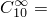 100 and 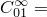 25, shear relaxation coefficient 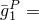 0.2, and relaxation time 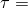 0.1s. Plane strain boundary conditions are applied in the axial direction.

The steady-state transport analysis capability requires a finite element mesh of the cross-section of the body as a starting point. The cross-section is discretized with axisymmetric CAX4RH elements. The inside of the disk is assumed to be in contact with a rigid rim. We model this by a kinematic coupling constraint that couples all the nodes on the inside surface to a reference node placed on the center of the axle. This node is used to prescribe the motion of the disk in the subsequent three-dimensional Lagrangian reference analysis. A kinematic coupling constraint is specified.

A **datacheck** analysis is performed to write the axisymmetric model information to a restart file. The restart file is then read in a subsequent run, and a three-dimensional model is generated by Abaqus by revolving the cross-section about the symmetry axis using symmetric model generation. This method of generating the finite element model is required by Abaqus to define the streamlines in the model. The axisymmetric CAX4RH elements are converted to C3D8RH elements during the model generation. Since the foundation is not axisymmetric, it is defined in the three-dimensional model as a rigid surface. The three-dimensional finite element mesh is shown in [Figure 1.5.2--1](ch01s05ach52.md#rolling3dmodel). To obtain a reference solution, a similar mesh is used for a Lagrangian analysis except that the entire circumference is finely discretized to accommodate the changing contact conditions during the spinning motion.

We also include a model using cylindrical (CCL12) elements. 

### Loading

The loading is applied over two analysis steps. In the first step the disk is brought in contact with the foundation by applying a prescribed displacement of 0.3 units to the rigid body reference node on the foundation ([Figure 1.5.2--1](ch01s05ach52.md#rolling3dmodel)). A static load step that provides the fully relaxed long-term viscoelastic solution is used for this analysis. The long-term solution ensures a smooth transition between the static and slow rolling solutions.

The second analysis step is a steady-state transport analysis. Steady-state solutions at various angular velocities (ranging from  0.001 rad/s to  1000 rad/s) are obtained by specifying transport velocity.

The reference Lagrangian solution is obtained using the quasi-static procedure. The file [spinningdisk_visco.inp](../eif/spinningdisk_visco.inp) contains the input data for this analysis.

### Results and discussion

When the stress in the material of a spinning body is influenced by the rate of strain, such as in a viscoelastic material, the deformation depends on the angular velocity of the body. During the spinning motion, material entering the contact area (leading edge) is compressed by the sudden increase in contact pressure, while material leaving the foundation relaxes. For a perfectly elastic material the deformation is reversible, so the contact area (and stress state) is symmetrical about a plane normal to the foundation and containing the axle. A viscoelastic material, on the other hand, responds instantaneously to the sudden increase in contact pressure but requires a finite time to relax after leaving the contact area. During such a loading/unloading stress-strain cycle some strain energy is dissipated. In other words, in contrast to a perfectly elastic material, the deformation is not reversible, and the loading and unloading stress-strain paths do not coincide. Consequently, the point at which material leaves the foundation is closer to the center plane than the point at which material enters the contact zone. Furthermore, since the contact pressure is asymmetrical, rolling is resisted by a moment around the axle.

The nature of viscoelastic material effects in this problem is illustrated in [Figure 1.5.2--2](ch01s05ach52.md#normal-reaction) through [Figure 1.5.2--4](ch01s05ach52.md#pressure). [Figure 1.5.2--2](ch01s05ach52.md#normal-reaction) shows the reaction force normal to the foundation; [Figure 1.5.2--3](ch01s05ach52.md#reaction-torque) shows the moment around the axle as a function of the angular spinning velocity. The bullet points in the two figures represent the reference transient Lagrangian solution. [Figure 1.5.2--4](ch01s05ach52.md#pressure) shows the contact pressure at different angular velocities. These figures indicate that at low angular velocities, when the time that a material point is in contact with the foundation is long compared to the relaxation time of the material, the behavior of the disk corresponds to the fully relaxed long-term elastic solution. The vertical reaction force ([Figure 1.5.2--2](ch01s05ach52.md#normal-reaction)) is at a minimum, and the stress state is symmetrical about the midplane ([Figure 1.5.2--4](ch01s05ach52.md#pressure)), so the moment around the axle is zero ([Figure 1.5.2--3](ch01s05ach52.md#reaction-torque)). At high angular velocities the solution corresponds to the instantaneous (or dynamic) elastic solution with the vertical reaction force reaching a limiting value. The stress state is still symmetrical about the midplane, so the moment around the axle is zero. The viscoelastic effects become important when the time that a material point is in contact with the foundation is of the same order of magnitude as the relaxation time of the material. Under these conditions energy is dissipated in each loading/unloading cycle, so the contact area becomes asymmetrical ([Figure 1.5.2--4](ch01s05ach52.md#pressure)) and rolling is resisted by a moment around the axle ([Figure 1.5.2--3](ch01s05ach52.md#reaction-torque)).

[Figure 1.5.2--5](ch01s05ach52.md#stress-variation1) through [Figure 1.5.2--7](ch01s05ach52.md#stress-variation3) compare the radial, circumferential, and shear stress between the two analysis methods for the case where the viscoelastic effects are a maximum ( 2.5 rad/s). The solid lines represent the steady-state transport solution; the broken lines represent the reference transient Lagrangian solution. The figures plot the stress near the outer surface along a streamline—the angle is measured about the -axis along the direction of material flow, with the -axis defining 0. The reference solution is obtained by monitoring the stress at one integration point on the streamline during the analysis history. Since the solution is steady, the time variation of stress can be converted to a variation along the streamline. The figures show very good agreement between the two solution methods.

The steady-state transport solution obtained with cylindrical elements also agrees closely with the reference solution. The results of this simulation are not reported here.

### Input files

[spinningdisk_axi.inp](../eif/spinningdisk_axi.inp)

Reference axisymmetric model for the Lagrangian analysis and the steady-state rolling analysis using C3D8RH elements.

[spinningdisk_3d.inp](../eif/spinningdisk_3d.inp)

Steady-state rolling analysis using C3D8RH elements.

[spinningdisk_visco.inp](../eif/spinningdisk_visco.inp)

Transient Lagrangian analysis using the [*VISCO](../key/key-link.md#usb-kws-hvisco) procedure.

[spinningdisk_axi_ccl.inp](../eif/spinningdisk_axi_ccl.inp)

Reference axisymmetric model for the steady-state rolling analysis using CCL12H elements.

[spinningdisk_3d_ccl.inp](../eif/spinningdisk_3d_ccl.inp)

Steady-state rolling analysis using CCL12H elements.

### Reference

Oden,  J. T., and T. L. Lin, “On the General Rolling Contact Problem for Finite Deformations of a Viscoelastic Cylinder,” Computer Methods in Applied Mechanics and Engineering, vol. 57, pp. 297–367, 1986.

### Figures

**Figure 1.5.2–1** Displaced shape of disk ( 0.0 rad/s).

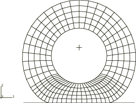

**Figure 1.5.2–2** Reaction force normal to the foundation. The bullet points are the transient Lagrangian solution.

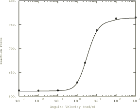

**Figure 1.5.2–3** Moment around the axle. The bullet points are the transient Lagrangian solution.

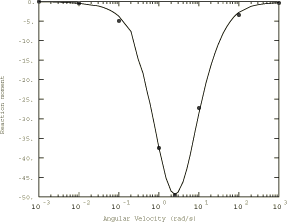

**Figure 1.5.2–4** Contact pressure.

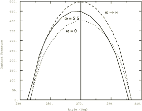

**Figure 1.5.2–5** Radial stress variation along a streamline. Comparison with transient Lagrangian solution (broken line).

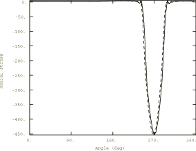

**Figure 1.5.2–6** Circumferential stress variation along a streamline. Comparison with transient Lagrangian solution (broken line).

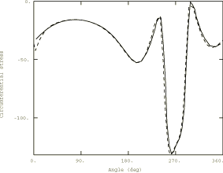

**Figure 1.5.2–7** Shear stress variation along a streamline. Comparison with transient Lagrangian solution (broken line).

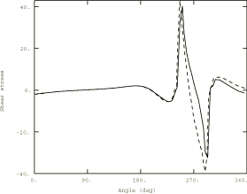

