# 1.6.1 Convection and diffusion of a temperature pulse

**Product: **Abaqus/Standard  

The convective/diffusive heat transfer elements in Abaqus are intended for use in thermal problems involving heat transfer in a flowing fluid so that heat is transported (convected) by the velocity of the fluid and, at the same time, is diffused by conduction through the fluid and its surroundings. The elements utilize a Petrov-Galerkin finite element formulation (an “upwinding” method) and can also include numerical dispersion control. The techniques used in these elements are described in ["Convection/diffusion," Section 2.11.3 of the Abaqus Theory Guide](../stm/stm-link.md#stm-anl-convectelems). The elements are typically used in conjunction with purely diffusive heat transfer elements, connected directly, or through thermal interfaces used to represent boundary layer effects (film coefficients) between the fluid and the solid surface. They can also be used alone. The problems in this example involve the convective/diffusive elements alone and are used to illustrate the characteristics of these types of elements. The problem is the transport and diffusion of a temperature pulse in the form of a Gaussian wave. Variations of the problem are done in one and two dimensions. The problems are taken from the papers by Yu and Heinrich (1986, 1987).

### Problem description

The geometry and models for each analysis are described in the following sections.

#### One-dimensional case

No particular set of physical units is used in this case: we assume that the units are consistent. The problem consists of the one-dimensional domain from 0 to 2, through which fluid is flowing at a velocity 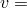 0.25. Abaqus requires definition of the fluid mass flow rate, 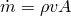, at the nodes of the convective elements, where  is the fluid density and *A* is the cross-sectional area of the convective/diffusive element. At the start of the problem there is a temperature pulse in the form of a Gaussian wave centered at 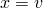 with peak amplitude of unity, defined by 

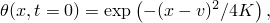

where *K* is the thermal diffusivity of the fluid, defined as 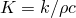, in which *k* is the conductivity of the fluid and *c* is its specific heat.

Yu and Heinrich show that the solution to this problem is the temperature distribution at any time, *t*, given by 

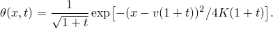

We use a uniform mesh of 64 elements of type DCC1D2 or DCC1D2D in the one-dimensional domain from 0 to 2. The DCC1D2D elements include numerical dispersion control; the DCC1D2 elements do not. The rather fine mesh is necessary to model the convection/diffusion of the temperature field with reasonable accuracy.

The mesh has been chosen to provide a Peclet number of 20. The Peclet number, , is defined as 

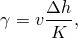

where  is the length of an element.  provides an indication of the extent to which convection dominates the heat transport in an element: 0 implies no convection (zero velocity), and as 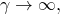 the problem becomes purely convective—there is no time for diffusion. The value used in this case,  20, makes the problem strongly convective but, nevertheless, leaves sufficient diffusion in the system to make it important in the solution.

The problem is transient. We use fixed time increments chosen to provide a Courant number *C* of 0.8. The Courant number is defined by 

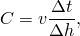

where  is the time increment. *C* measures how quickly energy can be convected across an element compared to the time increment. If 1 energy can convect across more than a single element in a time increment. The convective/diffusive elements used in Abaqus cannot provide accurate transient solutions for  1, and for those elements that include numerical dispersion control (which is desirable for such transient cases)  1 is a stability limit in the sense that the solution can become numerically unstable if this value is exceeded. Therefore, we choose  0.8, which requires a time increment of 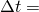 0.1 with the mesh chosen.

In a separate run we also evaluate the behavior of these elements as the wave leaves the domain of the mesh. All of the parameters here are the same as above except that the one-dimensional domain now extends from 0 to 1 (32 elements are used). The boundary condition at the edge of the mesh, 1, is the natural boundary condition: 

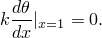

This boundary condition prevents conduction of heat out of the mesh but allows energy to convect through the boundary, which is convenient for practical applications. Since it is the natural boundary condition in the formulation, it requires no specification in the input data.

#### Two-dimensional case

Again, no particular set of physical units is used in this case: we assume that the units are consistent.

The problem consists of a two-dimensional rectangular domain defined as 0.0  1.0, 0.0  0.5. There is no heat generation in the region, and the boundary conditions are 

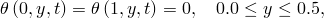

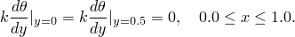

We consider unidirectional flow that is skewed to the mesh at an angle of 25 to the *x*-axis and is given as 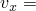 0.25 and 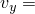 0.1166, where 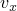 is the velocity in the *x*-direction and  is the velocity in the *y*-direction. The initial temperature pulse is centered at 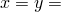 0.175 and is defined by 

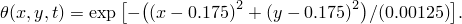

We consider the pure convection case where 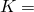 0, so that there should be no diffusion of the temperature pulse.

We use a uniform rectangular 40  20 mesh of type DCC2D4 or DCC2D4D elements. The DCC2D4D elements include numerical dispersion control; the DCC2D4 elements do not. We use fixed time increments chosen to provide a Courant number, 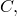 of 0.73. The Courant number in a two-dimensional rectangular mesh is defined by 

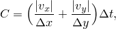

where  is the time increment. The chosen mesh and Courant number define a fixed time increment of 0.05.

### Results and discussion

The results for each case are presented here.

#### One-dimensional case

The value of the upwinding and numerical dispersion control techniques is illustrated by the three numerical solutions shown in [Figure 1.6.1--1](ch01s06ach53.md#sxmtemppulse-1d-noupwind), [Figure 1.6.1--2](ch01s06ach53.md#sxmtemppulse-1d-upwind), and [Figure 1.6.1--3](ch01s06ach53.md#sxmtemppulse-upwind-disp). In each of the plots the temperature pulse is shown at three time points: at the start of the problem ( 0), at  2, and at  4. Each plot shows the exact solution and a numerical solution.

The plot in [Figure 1.6.1--1](ch01s06ach53.md#sxmtemppulse-1d-noupwind) shows a solution generated with a standard Galerkin finite element method. (This solution cannot be generated by any standard element in Abaqus since all the convective elements include upwinding.) Spurious oscillation of the temperature on the trailing (upstream) side of the pulse is evident in the numerical solution. The plot in [Figure 1.6.1--2](ch01s06ach53.md#sxmtemppulse-1d-upwind) is generated with element type DCC1D2, which includes upwinding only. There is significantly less oscillation following the trailing end of the pulse, but the peak temperature is not well predicted. (This formulation can be shown to be optimal for steady-state convection/diffusion: see Yu and Heinrich.) The plot in [Figure 1.6.1--3](ch01s06ach53.md#sxmtemppulse-upwind-disp) includes upwinding and numerical dispersion control (element type DCC1D2D). The results in this case show almost no oscillation trailing the pulse. The peak temperature is slightly underestimated, but the solution is clearly superior. Further improvements in accuracy require a finer mesh.

The series of plots in [Figure 1.6.1--4](ch01s06ach53.md#sxmtemppulse-waveleavingmesh) illustrate the wave leaving the mesh as time progresses. Element type DCC1D2D was used to generate these results at times  2.4, 2.7, 3.0, and 3.4. The exact solutions are plotted also for comparative purposes. The traveling wave exhibits no undesirable reflections as it leaves the mesh. This reflection-free response could not be obtained with a Galerkin formulation element.

#### Two-dimensional case

The value of the upwinding control technique is illustrated by the two numerical solutions shown in [Figure 1.6.1--5](ch01s06ach53.md#sxmtemppulse-2d-noupwind) and [Figure 1.6.1--6](ch01s06ach53.md#sxmtemppulse-2d-upwind). In each of the plots the temperature pulse is shown in its initial state and at a time of 1.3. The exact solution of the problem is transport of the initial wave in the direction of flow with zero dissipation. All calculations presented here contain some inherent numerical dissipation.

The plot in [Figure 1.6.1--5](ch01s06ach53.md#sxmtemppulse-2d-noupwind) shows a solution generated with a standard Galerkin finite element method. The peak temperature with this method is 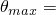 0.82, but dispersive oscillations as large as 44% of 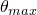 are observed. The plot in [Figure 1.6.1--6](ch01s06ach53.md#sxmtemppulse-2d-upwind) illustrates the advantages gained by the Petrov-Galerkin formulation implemented in Abaqus. [Figure 1.6.1--6](ch01s06ach53.md#sxmtemppulse-2d-upwind), which was generated with element type DCC2D4, shows  0.51. Here the dispersion present is only about 11% of 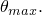 Further improvements in accuracy can be obtained with a finer mesh.

#### Axisymmetric and three-dimensional element tests

The two-dimensional problem is also modeled with axisymmetric and three-dimensional elements. The axisymmetric model, consisting of DCCAX4 or DCCAX4D elements, uses a mesh of the same size as the two-dimensional problem. The mesh is located at a very large radius, so the problem definition is approximately the same. The three-dimensional model, consisting of DCC3D8 or DCC3D8D elements, uses a single layer mesh of the same size as the two-dimensional model. The results for both models are the same as for the two-dimensional model.

### Input files

[convectdifftemppulse_dcc1d2.inp](../eif/convectdifftemppulse_dcc1d2.inp)

One-dimensional case of upwinding only (element type DCC1D2). Numerical dispersion control is added by changing the element type to DCC1D2D.

[convectdifftemppulse_mass.inp](../eif/convectdifftemppulse_mass.inp)

Contains the mass flow rate data used in the file convectdifftemppulse_dcc1d2.inp.

[convectdifftemppulse_dcc1d2d.inp](../eif/convectdifftemppulse_dcc1d2d.inp)

One-dimensional case of the wave leaving the mesh.

[convectdifftemppulse_exact.f](../eif/convectdifftemppulse_exact.f)

A program used to create the one-dimensional analytical solution.

[convectdifftemppulse_dcc2d4.inp](../eif/convectdifftemppulse_dcc2d4.inp)

Two-dimensional skewed transport case of upwinding only (element type DCC2D4). Numerical dispersion control is added by changing the element type to DCC2D4D.

[convectdifftemppulse_2dtemp0.f](../eif/convectdifftemppulse_2dtemp0.f)

A program used to create the two-dimensional initial temperature conditions.

[convectdifftemppulse_dccax4.inp](../eif/convectdifftemppulse_dccax4.inp)

Axisymmetric skewed transport case of upwinding only (element type DCCAX4). Numerical dispersion control is added by changing the element type to DCCAX4D.

[convectdifftemppulse_dcc3d8.inp](../eif/convectdifftemppulse_dcc3d8.inp)

Three-dimensional skewed transport case of upwinding only (element type DCC3D8). Numerical dispersion control is added by changing the element type to DCC3D8D.

[convectdifftemppulse_3dtemp0.f](../eif/convectdifftemppulse_3dtemp0.f)

A program used to create the three-dimensional initial temperature conditions.

### References

Yu,  C. C., and J. C. Heinrich, “Petrov-Galerkin Methods for the Time-Dependent Convective Transport Equation,” International Journal for Numerical Methods in Engineering, vol. 23, pp. 883–901, 1986.

Yu,  C. C., and J. C. Heinrich, “Petrov-Galerkin Method for Multidimensional, Time-Dependent, Convective-Diffusion Equations,” International Journal for Numerical Methods in Engineering, vol. 24, pp. 2201–2215, 1987.

### Figures

**Figure 1.6.1–1** One-dimensional convection/diffusion model problem (no upwinding).

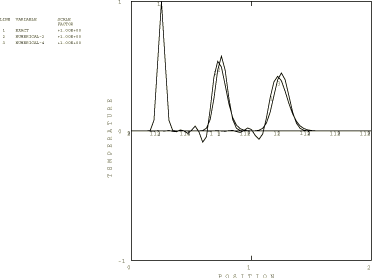

**Figure 1.6.1–2** One-dimensional convection/diffusion model problem (with upwinding).

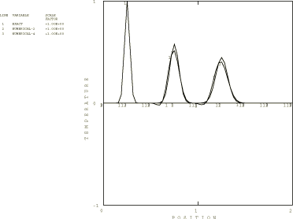

**Figure 1.6.1–3** One-dimensional convection/diffusion model problem (with upwinding and numerical dispersion control).

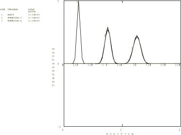

**Figure 1.6.1–4** One-dimensional convection/diffusion model problem: wave leaving mesh.

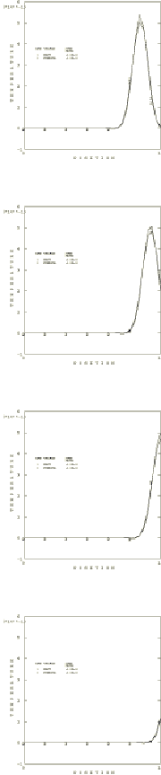

**Figure 1.6.1–5** Two-dimensional skewed transport model problem (no upwinding).

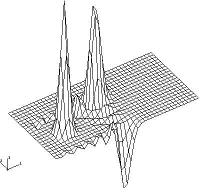

**Figure 1.6.1–6** Two-dimensional skewed transport model problem (with upwinding).

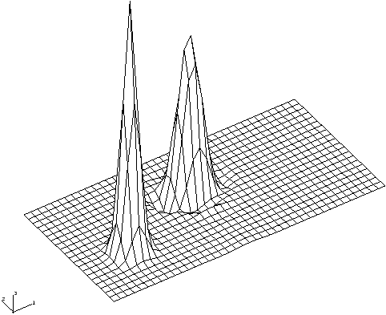

