# 1.6.3 Coupled temperature-displacement analysis: one-dimensional gap conductance and radiation

**Products: **Abaqus/Standard  Abaqus/Explicit  

This example illustrates two elementary nonlinear cases of one-dimensional, fully coupled, heat transfer and stress analysis. The problems are simple enough that exact solutions are obtained easily, thus providing verification of the numerical solutions obtained with Abaqus.

### Problem description

The model is shown in [Figure 1.6.3--1](ch01s06ach55.md#sxmtempdisp-specs). A conductive rod of unit area is fixed at one end, *A*, and free at the other end, 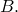 Between the free end and an adjacent fixed wall, *C*, there is a gap across which heat will be conducted or radiated.

In case 1 two forms of clearance-dependent heat transfer are considered: in the first, the conductivity for the gap drops linearly as the clearance increases; in the second, the gap radiation view factor drops linearly as the clearance increases. The fixed ends of the rod, *A*, and the wall, *C*, are both held at fixed temperatures,  and 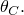 Initially the gap is open, so the distance between *B* and *C* is  (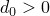). The objective is to predict the steady-state displacement, 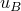, and temperature, , of the free end of the rod. We assume that the strains are small and that the behavior of the rod is linear elastic, with constant modulus and thermal expansion coefficient. In this case the gap never closes, so the rod is always stress-free.

In case 2 it is assumed that the conductivity across the closed gap increases linearly as the pressure transmitted through the gap, *p*, increases. The fixed end of the rod, *A*, and the wall, *C* (which is also fixed in position), are both held at fixed temperatures,  and  Since in this case the gap never opens, the axial stress in the rod will be nonzero. We solve for the pressure across the gap, *p*, and the temperature, , of the end of the rod, assuming that the strains are small and the behavior of the rod is linear elastic with constant modulus and thermal expansion coefficient.

In Abaqus/Standard the bar is modeled with either two- or three-dimensional elements; the contact between the end of the bar and the wall is modeled in one of three ways: as a gap element (GAPUNIT) or as an element-based rigid surface made of T2D2T, S4RT, S4T, or S8RT elements. In Abaqus/Explicit the bar is modeled with either two- or three-dimensional elements; the wall is modeled one of two ways: either as an analytical rigid surface or as an element-based rigid surface. Surface-based contact is employed between the bar and the wall; both kinematic and penalty mechanical contact are considered.

### Solution

Mechanical equilibrium along the rod requires that 

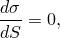

where *S* is the distance along the rod measured from the fixed end, 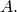 Integrating along the rod, the stress is

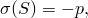

where *p* is the pressure transmitted by contact between the end of the rod, *B*, and the adjacent fixed point, 

Thermal equilibrium requires that the heat flux along the rod, *q*, has no gradient: 

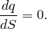

Integrating this along the rod and imposing the boundary condition that the flux at *B* is the same as the flux transmitted from *B* to *C* through the gap, 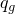, then gives the thermal equilibrium equation

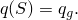

Since we assume that the strains are small, the strain at any point in the rod is 

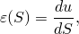

and the displacement is 

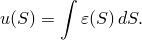

The rod is assumed to be made of a linear elastic material, so the stress constitutive equation is 

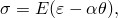

where the modulus, *E*, and the thermal expansion coefficient, , are constants (they are not temperature dependent).

Heat conduction in the rod is assumed to be governed by Fourier's law, which states that the heat flux is determined by 

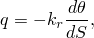

where 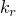 is the thermal conductivity of the rod and is also assumed to be constant. Combining thermal equilibrium with the Fourier law in the rod shows that 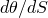 is constant in the rod, so the temperature, , varies linearly along the rod: 

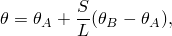

where *L* is the length of the rod.

The heat flux in the gap, , between the end of the rod, *B*, and the fixed point *C* is assumed to be proportional to the difference in temperature between *B* and *C*: 

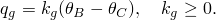

#### Case 1

First we assume that the gap is open and that the gap thermal conductivity, 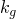, increases linearly as the gap reduces, so 

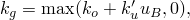

where  and 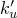 are nonnegative constants and  is the displacement of point  Gap radiation is neglected in these calculations.

The thermal boundary conditions are that the temperatures at *A* and *C*,  and , are held constant. The mechanical boundary conditions are that points *A* and *C* are fixed. Since in this case the end of the rod never touches *C*, force equilibrium requires that

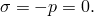

The equations given above define the problem. Their solution is readily developed as follows. Combining integrated force equilibrium with the linear elastic constitutive equation and the displacement relationship, 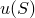, gives 

Thermal equilibrium combined with Fourier's law and the gap heat flux equation then gives 

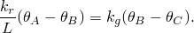

With the assumed form of the gap thermal conductivity, , and assuming 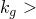 0, this is 

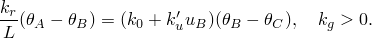

Substituting for  then gives a quadratic equation for : 

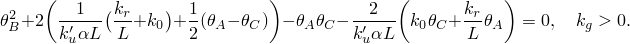

The roots of this quadratic equation provide two solutions for 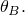 The solutions for  are available once  is determined. Only one of the two solutions gives a value of  for which  0; hence, this is the only physically acceptable solution.

As a numerical example the parameters are chosen in consistent units as 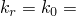 1.0; 105,  1.0; 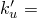 100; 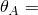 400; and 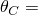 200.

These values give  285.4 or 4485, so 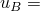3.427  103 or 2.043  102. The second solution must be rejected as it gives 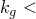 0. The first solution is valid so long as 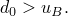

Next we assume that the gap is open and that the gap radiation view factor, 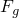, increases linearly as the gap reduces; so 

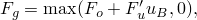

where  and 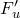 are nonnegative constants and  is the displacement of point  In this case gap conduction is neglected.

The thermal and mechanical boundary conditions are the same as the gap conduction problem considered above. Force equilibrium requires that

Following a procedure similar to that used in the gap conduction problem and combining integrated force equilibrium with the linear elastic constitutive equation and the displacement relationship, , gives 

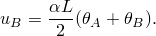

Combining thermal equilibrium with Fourier's law and the gap heat flux equation then gives 

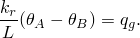

With the assumed form of the gap radiation, , and assuming 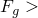 0, this is 

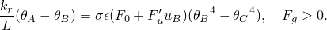

Substituting for  then gives the following equation for : 

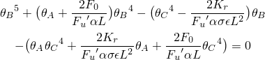

 is obtained by solving the above equation numerically. The solutions for  are available once  is determined.

As a numerical example the parameters are chosen in consistent units as  1.0; 105;  1.0; 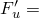 50;  1.E8; 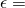1.0;  400;  200; and absolute zero  –460.

These values give  222.4, so  3.112  103. This solution is valid so long as  All other solutions must be rejected since they give 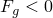 or 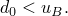

#### Case 2

In this case the rod is always in contact with *C*. Combining the integrated equilibrium equation with the mechanical constitutive model gives 

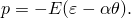

Combining this with the temperature solution, , gives 

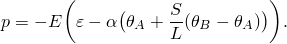

Integrating this along the rod using the displacement relationship, , gives the pressure as a function of the temperature at points *A* and *B*,

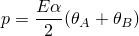

since 

In this case the conductivity of the closed gap is proportional to the contact pressure: 

where  and  are nonnegative constants. Since , with this behavior for  we have 

Combining this with the equation for the pressure provides a quadratic equation for : 

The roots of this equation provide two solutions for , and the corresponding values of *p* are then defined by  Only one solution gives a positive value for *p*; the other must be rejected because it is inconsistent with the assumption that the gap is closed.

As a numerical example the parameters are chosen in consistent units as  10;  2;  0.2;  105;  105;  1.0;  200; and  100.

These values give  122.6 or 342.6, so  161.3 or 71.3. The second solution must be rejected as it gives 

### Results and discussion

In both cases Abaqus/Standard uses a full Newton method and obtains the solution in one or two increments requiring two or three iterations per increment. The values for  and  in case 1 and *p* and  in case 2 agree with the exact solutions obtained above.

The results obtained with Abaqus/Explicit also agree with the analytical solutions.

### Input files

##### **Abaqus/Standard input files**

#### Clearance-dependent problem with gap conduction:

[coupledtempdisp_clearance.inp](../eif/coupledtempdisp_clearance.inp)

T2D3T elements and GAPUNIT elements.

[coupledtempdisp_std_c_cpe3t.inp](../eif/coupledtempdisp_std_c_cpe3t.inp)

CPE3T elements for the rod and an element-based rigid surface made of T2D2T elements for the wall.

[coupledtempdisp_std_c_cps3t.inp](../eif/coupledtempdisp_std_c_cps3t.inp)

CPS3T elements for the rod and an element-based rigid surface made of T2D2T elements for the wall.

[coupledtempdisp_std_c_cpe4t.inp](../eif/coupledtempdisp_std_c_cpe4t.inp)

CPE4T elements for the rod and an element-based rigid surface made of T2D2T elements for the wall.

[coupledtempdisp_std_c_cpe4rt.inp](../eif/coupledtempdisp_std_c_cpe4rt.inp)

CPE4RT elements for the rod and an element-based rigid surface made of T2D2T elements for the wall.

[coupledtempdisp_std_c_cpe4rht.inp](../eif/coupledtempdisp_std_c_cpe4rht.inp)

CPE4RHT elements for the rod and an element-based rigid surface made of T2D2T elements for the wall.

[coupledtempdisp_std_c_cpeg4t.inp](../eif/coupledtempdisp_std_c_cpeg4t.inp)

CPEG4T elements for the rod and an element-based rigid surface made of T2D2T elements for the wall.

[coupledtempdisp_std_c_c3d4t.inp](../eif/coupledtempdisp_std_c_c3d4t.inp)

C3D4T elements for the rod and an element-based rigid surface made of S4RT elements for the wall.

[coupledtempdisp_std_c_c3d6t.inp](../eif/coupledtempdisp_std_c_c3d6t.inp)

C3D6T elements for the rod and an element-based rigid surface made of S4RT elements for the wall.

[coupledtempdisp_std_c_c3d8ht.inp](../eif/coupledtempdisp_std_c_c3d8ht.inp)

C3D8HT elements for the rod and an element-based rigid surface made of S8RT elements for the wall.

#### Clearance-dependent problem with gap radiation:

[coupledtempdisp_clearancerad.inp](../eif/coupledtempdisp_clearancerad.inp)

T2D3T elements and GAPUNIT elements.

[coupledtempdisp_std_r_cpe3t.inp](../eif/coupledtempdisp_std_r_cpe3t.inp)

CPE3T elements for the rod and an element-based rigid surface made of T2D2T elements for the wall.

[coupledtempdisp_std_r_cps3t.inp](../eif/coupledtempdisp_std_r_cps3t.inp)

CPS3T elements for the rod and an element-based rigid surface made of T2D2T elements for the wall.

[coupledtempdisp_std_r_cpe4t.inp](../eif/coupledtempdisp_std_r_cpe4t.inp)

CPE4T elements for the rod and an element-based rigid surface made of T2D2T elements for the wall.

[coupledtempdisp_std_r_cpeg4t.inp](../eif/coupledtempdisp_std_r_cpeg4t.inp)

CPEG4T elements for the rod and an element-based rigid surface made of T2D2T elements for the wall.

[coupledtempdisp_std_r_c3d4t.inp](../eif/coupledtempdisp_std_r_c3d4t.inp)

C3D4T elements for the rod and an element-based rigid surface made of S4T elements for the wall.

[coupledtempdisp_std_r_c3d6t.inp](../eif/coupledtempdisp_std_r_c3d6t.inp)

C3D6T elements for the rod and an element-based rigid surface made of S4T elements for the wall.

[coupledtempdisp_std_r_c3d8ht.inp](../eif/coupledtempdisp_std_r_c3d8ht.inp)

C3D8HT elements for the rod and an element-based rigid surface made of S8RT elements for the wall.

#### Pressure-dependent problem with gap conduction:

[coupledtempdisp_pressure.inp](../eif/coupledtempdisp_pressure.inp)

T2D3T elements and GAPUNIT elements.

[coupledtempdisp_pressure_post.inp](../eif/coupledtempdisp_pressure_post.inp)

[*POST OUTPUT](../key/key-link.md#usb-kws-hpostoutput) analysis.

[coupledtempdisp_std_p_cpe3t.inp](../eif/coupledtempdisp_std_p_cpe3t.inp)

CPE3T elements for the rod and an element-based rigid surface made of T2D2T elements for the wall.

[coupledtempdisp_std_p_cps3t.inp](../eif/coupledtempdisp_std_p_cps3t.inp)

CPS3T elements for the rod and an element-based rigid surface made of T2D2T elements for the wall.

[coupledtempdisp_std_p_cps4t.inp](../eif/coupledtempdisp_std_p_cps4t.inp)

CPS4T elements for the rod and an element-based rigid surface made of T2D2T elements for the wall.

[coupledtempdisp_std_p_cpeg4t.inp](../eif/coupledtempdisp_std_p_cpeg4t.inp)

CPEG4T elements for the rod and an element-based rigid surface made of T2D2T elements for the wall.

[coupledtempdisp_std_p_c3d4t.inp](../eif/coupledtempdisp_std_p_c3d4t.inp)

C3D4T elements for the rod and an element-based rigid surface made of S4RT elements for the wall.

[coupledtempdisp_std_p_c3d6t.inp](../eif/coupledtempdisp_std_p_c3d6t.inp)

C3D6T elements for the rod and an element-based rigid surface made of S4RT elements for the wall.

[coupledtempdisp_std_p_c3d8t.inp](../eif/coupledtempdisp_std_p_c3d8t.inp)

C3D8T elements for the rod and an element-based rigid surface made of S8RT elements for the wall.

##### **Abaqus/Explicit input files**

#### Clearance-dependent gap conduction problem, kinematic mechanical contact between analytical rigid and deformable surfaces:

[coupledtempdisp_xa_c_cpe3t.inp](../eif/coupledtempdisp_xa_c_cpe3t.inp)

CPE3T elements.

[coupledtempdisp_xa_c_cpe4rt.inp](../eif/coupledtempdisp_xa_c_cpe4rt.inp)

CPE4RT elements.

[coupledtempdisp_xa_c_cps3t.inp](../eif/coupledtempdisp_xa_c_cps3t.inp)

CPS3T elements.

[coupledtempdisp_xa_c_cps4rt.inp](../eif/coupledtempdisp_xa_c_cps4rt.inp)

CPS4RT elements.

[coupledtempdisp_xa_c_c3d4t.inp](../eif/coupledtempdisp_xa_c_c3d4t.inp)

C3D4T elements.

[coupledtempdisp_xa_c_c3d6t.inp](../eif/coupledtempdisp_xa_c_c3d6t.inp)

C3D6T elements.

[coupledtempdisp_xa_c_c3d8rt.inp](../eif/coupledtempdisp_xa_c_c3d8rt.inp)

C3D8RT elements.

[coupledtempdisp_xa_c_c3d8t.inp](../eif/coupledtempdisp_xa_c_c3d8t.inp)

C3D8T elements.

[coupledtempdisp_xa_c_sc6rt.inp](../eif/coupledtempdisp_xa_c_sc6rt.inp)

SC6RT elements.

[coupledtempdisp_xa_c_sc8rt.inp](../eif/coupledtempdisp_xa_c_sc8rt.inp)

SC8RT elements.

#### Clearance-dependent gap conduction problem, penalty mechanical contact between analytical rigid and deformable surfaces:

[coupledtempdisp_xap_c_cpe4rt.inp](../eif/coupledtempdisp_xap_c_cpe4rt.inp)

CPE4RT elements.

[coupledtempdisp_xap_c_c3d4t.inp](../eif/coupledtempdisp_xap_c_c3d4t.inp)

C3D4T elements.

#### Clearance-dependent gap radiation problem, kinematic mechanical contact between analytical rigid and deformable surfaces:

[coupledtempdisp_xa_r_cpe3t.inp](../eif/coupledtempdisp_xa_r_cpe3t.inp)

CPE3T elements.

[coupledtempdisp_xa_r_cpe4rt.inp](../eif/coupledtempdisp_xa_r_cpe4rt.inp)

CPE4RT elements.

[coupledtempdisp_xa_r_cps3t.inp](../eif/coupledtempdisp_xa_r_cps3t.inp)

CPS3T elements.

[coupledtempdisp_xa_r_cps4rt.inp](../eif/coupledtempdisp_xa_r_cps4rt.inp)

CPS4RT elements.

[coupledtempdisp_xa_r_c3d4t.inp](../eif/coupledtempdisp_xa_r_c3d4t.inp)

C3D4T elements.

[coupledtempdisp_xa_r_c3d6t.inp](../eif/coupledtempdisp_xa_r_c3d6t.inp)

C3D6T elements.

[coupledtempdisp_xa_r_c3d8rt.inp](../eif/coupledtempdisp_xa_r_c3d8rt.inp)

C3D8RT elements.

[coupledtempdisp_xa_r_c3d8t.inp](../eif/coupledtempdisp_xa_r_c3d8t.inp)

C3D8T elements.

[coupledtempdisp_xa_r_sc6rt.inp](../eif/coupledtempdisp_xa_r_sc6rt.inp)

SC6RT elements.

[coupledtempdisp_xa_r_sc8rt.inp](../eif/coupledtempdisp_xa_r_sc8rt.inp)

SC8RT elements.

#### Clearance-dependent gap radiation problem, penalty mechanical contact between analytical rigid and deformable surfaces:

[coupledtempdisp_xap_r_cpe4rt.inp](../eif/coupledtempdisp_xap_r_cpe4rt.inp)

CPE4RT elements.

[coupledtempdisp_xap_r_c3d4t.inp](../eif/coupledtempdisp_xap_r_c3d4t.inp)

C3D4T elements.

#### Pressure-dependent gap conduction problem, kinematic mechanical contact between analytical rigid and deformable surfaces:

[coupledtempdisp_xa_p_cpe3t.inp](../eif/coupledtempdisp_xa_p_cpe3t.inp)

CPE3T elements.

[coupledtempdisp_xa_p_cpe4rt.inp](../eif/coupledtempdisp_xa_p_cpe4rt.inp)

CPE4RT elements.

[coupledtempdisp_xa_p_cps3t.inp](../eif/coupledtempdisp_xa_p_cps3t.inp)

CPS3T elements.

[coupledtempdisp_xa_p_cps4rt.inp](../eif/coupledtempdisp_xa_p_cps4rt.inp)

CPS4RT elements.

[coupledtempdisp_xa_p_c3d4t.inp](../eif/coupledtempdisp_xa_p_c3d4t.inp)

C3D4T elements.

[coupledtempdisp_xa_p_c3d6t.inp](../eif/coupledtempdisp_xa_p_c3d6t.inp)

C3D6T elements.

[coupledtempdisp_xa_p_c3d8rt.inp](../eif/coupledtempdisp_xa_p_c3d8rt.inp)

C3D8RT elements.

[coupledtempdisp_xa_p_c3d8t.inp](../eif/coupledtempdisp_xa_p_c3d8t.inp)

C3D8T elements.

[coupledtempdisp_xa_p_sc8rt.inp](../eif/coupledtempdisp_xa_p_sc8rt.inp)

SC8RT elements.

#### Pressure-dependent gap conduction problem, penalty mechanical contact between analytical rigid and deformable surfaces:

[coupledtempdisp_xap_p_cps4rt.inp](../eif/coupledtempdisp_xap_p_cps4rt.inp)

CPS4RT elements.

[coupledtempdisp_xap_p_c3d6t.inp](../eif/coupledtempdisp_xap_p_c3d6t.inp)

C3D6T elements.

#### Clearance-dependent gap conduction problem, kinematic mechanical contact between element-based rigid and deformable surfaces:

[coupledtempdisp_xd_c_cpe3t.inp](../eif/coupledtempdisp_xd_c_cpe3t.inp)

CPE3T elements.

[coupledtempdisp_xd_c_cpe4rt.inp](../eif/coupledtempdisp_xd_c_cpe4rt.inp)

CPE4RT elements.

[coupledtempdisp_xd_c_cps3t.inp](../eif/coupledtempdisp_xd_c_cps3t.inp)

CPS3T elements.

[coupledtempdisp_xd_c_cps4rt.inp](../eif/coupledtempdisp_xd_c_cps4rt.inp)

CPS4RT elements.

[coupledtempdisp_xd_c_c3d4t.inp](../eif/coupledtempdisp_xd_c_c3d4t.inp)

C3D4T elements.

[coupledtempdisp_xd_c_c3d6t.inp](../eif/coupledtempdisp_xd_c_c3d6t.inp)

C3D6T elements.

[coupledtempdisp_xd_c_c3d8rt.inp](../eif/coupledtempdisp_xd_c_c3d8rt.inp)

C3D8RT elements.

[coupledtempdisp_xd_c_c3d8t.inp](../eif/coupledtempdisp_xd_c_c3d8t.inp)

C3D8T elements.

[coupledtempdisp_xd_c_sc8rt.inp](../eif/coupledtempdisp_xd_c_sc8rt.inp)

SC8RT elements.

#### Clearance-dependent gap conduction problem, penalty mechanical contact between element-based rigid and deformable surfaces:

[coupledtempdisp_xdp_c_cpe3t.inp](../eif/coupledtempdisp_xdp_c_cpe3t.inp)

CPE3T elements.

[coupledtempdisp_xdp_c_c3d8rt.inp](../eif/coupledtempdisp_xdp_c_c3d8rt.inp)

C3D8RT elements.

[coupledtempdisp_xdp_c_c3d8t.inp](../eif/coupledtempdisp_xdp_c_c3d8t.inp)

C3D8T elements.

[coupledtempdisp_xdp_c_sc8rt.inp](../eif/coupledtempdisp_xdp_c_sc8rt.inp)

SC8RT elements.

#### Clearance-dependent gap radiation problem, kinematic mechanical contact between element-based rigid and deformable surfaces:

[coupledtempdisp_xd_r_cpe3t.inp](../eif/coupledtempdisp_xd_r_cpe3t.inp)

CPE3T elements.

[coupledtempdisp_xd_r_cpe4rt.inp](../eif/coupledtempdisp_xd_r_cpe4rt.inp)

CPE4RT elements.

[coupledtempdisp_xd_r_cps3t.inp](../eif/coupledtempdisp_xd_r_cps3t.inp)

CPS3T elements.

[coupledtempdisp_xd_r_cps4rt.inp](../eif/coupledtempdisp_xd_r_cps4rt.inp)

CPS4RT elements.

[coupledtempdisp_xd_r_c3d4t.inp](../eif/coupledtempdisp_xd_r_c3d4t.inp)

C3D4T elements.

[coupledtempdisp_xd_r_c3d6t.inp](../eif/coupledtempdisp_xd_r_c3d6t.inp)

C3D6T elements.

[coupledtempdisp_xd_r_c3d8rt.inp](../eif/coupledtempdisp_xd_r_c3d8rt.inp)

C3D8RT elements.

[coupledtempdisp_xd_r_c3d8t.inp](../eif/coupledtempdisp_xd_r_c3d8t.inp)

C3D8T elements.

[coupledtempdisp_xd_r_sc8rt.inp](../eif/coupledtempdisp_xd_r_sc8rt.inp)

SC8RT elements.

#### Clearance-dependent gap radiation problem, penalty mechanical contact between element-based rigid and deformable surfaces:

[coupledtempdisp_xdp_r_cpe3t.inp](../eif/coupledtempdisp_xdp_r_cpe3t.inp)

CPE3T elements.

[coupledtempdisp_xdp_r_c3d8rt.inp](../eif/coupledtempdisp_xdp_r_c3d8rt.inp)

C3D8RT elements.

[coupledtempdisp_xdp_r_c3d8t.inp](../eif/coupledtempdisp_xdp_r_c3d8t.inp)

C3D8T elements.

[coupledtempdisp_xdp_r_sc8rt.inp](../eif/coupledtempdisp_xdp_r_sc8rt.inp)

SC8RT elements.

#### Pressure-dependent gap conduction problem, kinematic mechanical contact between element-based rigid and deformable surfaces:

[coupledtempdisp_xd_p_cpe3t.inp](../eif/coupledtempdisp_xd_p_cpe3t.inp)

CPE3T elements.

[coupledtempdisp_xd_p_cpe4rt.inp](../eif/coupledtempdisp_xd_p_cpe4rt.inp)

CPE4RT elements.

[coupledtempdisp_xd_p_cps3t.inp](../eif/coupledtempdisp_xd_p_cps3t.inp)

CPS3T elements.

[coupledtempdisp_xd_p_cps4rt.inp](../eif/coupledtempdisp_xd_p_cps4rt.inp)

CPS4RT elements.

[coupledtempdisp_xd_p_c3d4t.inp](../eif/coupledtempdisp_xd_p_c3d4t.inp)

C3D4T elements.

[coupledtempdisp_xd_p_c3d6t.inp](../eif/coupledtempdisp_xd_p_c3d6t.inp)

C3D6T elements.

[coupledtempdisp_xd_p_c3d8rt.inp](../eif/coupledtempdisp_xd_p_c3d8rt.inp)

C3D8RT elements.

[coupledtempdisp_xd_p_c3d8t.inp](../eif/coupledtempdisp_xd_p_c3d8t.inp)

C3D8T elements.

[coupledtempdisp_xd_p_sc8rt.inp](../eif/coupledtempdisp_xd_p_sc8rt.inp)

SC8RT elements.

#### Pressure-dependent gap conduction problem, penalty mechanical contact between element-based rigid and deformable surfaces:

[coupledtempdisp_xdp_p_cps3t.inp](../eif/coupledtempdisp_xdp_p_cps3t.inp)

CPS3T elements.

[coupledtempdisp_xdp_p_c3d8rt.inp](../eif/coupledtempdisp_xdp_p_c3d8rt.inp)

C3D8RT elements.

[coupledtempdisp_xdp_p_c3d8t.inp](../eif/coupledtempdisp_xdp_p_c3d8t.inp)

C3D8T elements.

[coupledtempdisp_xdp_p_sc8rt.inp](../eif/coupledtempdisp_xdp_p_sc8rt.inp)

SC8RT elements.

### Figure

**Figure 1.6.3–1** Coupled temperature-displacement analysis specifications.

