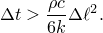
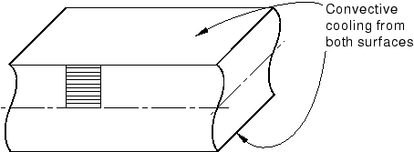
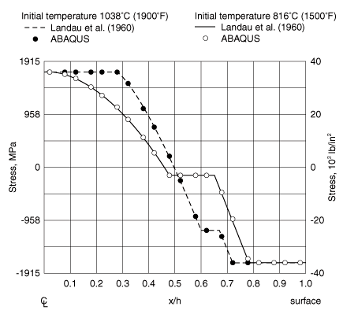
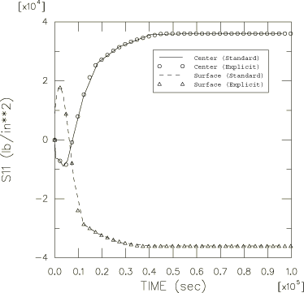

# 1.6.4 Quenching of an infinite plate

**Products: **Abaqus/Standard  Abaqus/Explicit  

This example is an illustration of uncoupled heat transfer and subsequent thermal-stress analysis. A semi-analytic solution is available for the case (see Landau et al., 1960), so the problem provides verification of this type of analysis in Abaqus. The purpose of the analysis is to predict the residual stresses caused by the quenching of a large homogeneous plate in regions away from the edges of the plate so that it can be treated as a plate of infinite extent in all but the thickness direction. The plate is made of an elastic, perfectly plastic material, with a yield stress that drops linearly with temperature above 121C (250F). The problem is one-dimensional since the plate is assumed to be of infinite extent: the only gradients occur through the thickness. The plate is initially at a uniform temperature, near its melting point (when its yield stress is small). It is assumed to be stress-free in this condition. The surface is then quenched in a medium at room temperature. Cooling is allowed to continue until all of the plate reaches room temperature.

The analyses performed in Abaqus/Standard consist of both sequential thermal-stress and fully coupled solution procedures. In the sequential analyses the transient heat transfer analysis is followed by the thermal stress analysis. During the heat transfer analysis the temperature distributions are recorded in the Abaqus results file. This temperature-time history is then used as input to the thermal stress analysis. The transient stresses are large enough to cause significant plastic flow, so residual stresses will remain after the plate reaches room temperature. In the fully coupled procedures the sequentially coupled problems are simulated by setting the fraction of inelastic dissipation that is converted into heat to zero. In this problem this uncouples the thermal response from the mechanical response.

A fully coupled solution procedure is used in Abaqus/Explicit; the sequentially coupled problem described above is again simulated by setting the fraction of inelastic dissipation that is converted into heat to zero. For completeness, another analysis is performed in Abaqus/Explicit, this time using the [`VUMAT`](../sub/sub-link.md#sub-xsl-vumat) user subroutine to define the material response and assuming that a 0.2 fraction of the inelastic dissipation is converted into heat. This last analysis illustrates the use of the [`VUMAT`](../sub/sub-link.md#sub-xsl-vumat) user subroutine in conjunction with the inelastic heat fraction, specific heat, and conductivity; the heat flux due to inelastic energy dissipation is calculated automatically by Abaqus/Explicit.

### Problem description

The plate is shown in [Figure 1.6.4--1](ch01s06ach56.md#sxmquenching-geom). It is 914.4 mm (36 in) thick and has the following properties:

| Young's modulus | 206.8 GPa (30 106 lb/in2) |
| --- | --- |
| Poisson's ratio | 0.3 |
| Yield stress | 248.2 MPa for  121C (36000 lb/in2,  250F) |
|  | 248.2(1 ( 121)/1111.1) MPa,  121C |
|  | (36000(1 ( 250)/2000) lb/in2,  250F) |
| Density | 7832 kg/m3 (0.283 lb/in3) |
| Specific heat | 0.6 kJ/kgC (0.1431 BTU/lbF) |
| Thermal conductivity | 58.8 W/mC (7.872 104 BTU/in secF) |

The film coefficient on the surface of the plate is 193.1 W/m2C (6.559  105 BTU/in2 secF).

The finite element mesh used in the Abaqus/Standard simulations is shown in [Figure 1.6.4--1](ch01s06ach56.md#sxmquenching-geom). Ten elements are used through the half-thickness of the plate. Only one row of elements is needed since the problem is one-dimensional. No mesh convergence studies have been done: it is assumed that this mesh should give reasonably accurate results. This assumption is confirmed by the agreement with the results described by Landau et al. (1960). For the sequential thermal-stress analyses the heat transfer mesh uses elements of type DC2D8 (8-node quadrilaterals) and DC2D4 (4-node quadrilaterals). For the stress analysis the boundary conditions correspond to generalized plane strain in all directions that are normal to the surface of the plate; that is, any straight line that is initially perpendicular to the surface of the plate remains straight and perpendicular to the surface, but the distance between such lines varies as the plate cools. In the sequential thermal-stress analyses this condition is modeled using four element types: axisymmetric elements CAX8R and CAX4I and generalized plane strain elements CPEG4I and CPEG8R. To verify the interpolation technique between dissimilar meshes, the stress analysis using CAX8R elements is driven by the temperature field from the analysis using DC2D4 elements. In the fully coupled Abaqus/Standard simulations CPEG4HT, CPEG8RHT, CAX4T, and CAX4RT elements are used. The generalized plane strain elements have zero relative rotations prescribed between the planes that define the limits of the model in the thickness direction. (This condition is imposed by introducing boundary conditions at the reference node of these elements.) The generalized plane strain condition in the plane of the model is imposed in both models by using a symmetry condition on the left-hand edge of the mesh and an equation constraint to impose equal displacements at all nodes on the right-hand edge of the mesh.

Reduced-integration elements are used in all second-order models. Reduced integration is attractive because it decreases the analysis cost and, at the same time, provides more accurate stress predictions. Reduced integration is generally recommended when second-order elements are chosen.

In the Abaqus/Explicit simulations the axisymmetric plate is modeled with either CAX3T or CAX4RT elements; for the case where the plate is assumed to be in a state of generalized plane strain, C3D8RT elements are used with appropriate constraints to ensure that plane sections remain plane. In each case 20 elements are used through the half-thickness of the plate. Mass scaling is used to reduce the computational cost of the analyses.

### Analysis sequence

The Abaqus/Standard sequential thermal-stress simulation consists of a transient heat transfer analysis, followed by a thermal-stress analysis in which the temperatures predicted by the heat transfer analysis are used as the loading of the problem. Abaqus makes it very simple to transfer temperature data in this way. In the heat transfer analysis the temperatures at the nodes are written to a file. Then, in the stress analysis these temperatures are read back into the stress model. This mode of transferring the temperatures is based on node numbers: the temperature at node *N* from the heat transfer analysis is applied at node *N* in the stress mesh. Thus, the node numbers must remain the same from the heat transfer model to the stress model. Abaqus does not check that the nodes are in the same location. In some cases nonstructural components (such as insulation) are modeled in the heat transfer analysis but not in the stress analysis. This situation does not present a problem; if the output from the heat transfer analysis includes temperatures at nodes that do not exist in the stress analysis model, those temperatures are ignored in the stress analysis.

In the Abaqus/Standard and Abaqus/Explicit fully coupled analyses the thermal and mechanical responses of the plate are determined simultaneously.

### Controls

The following discussion is relevant only for the Abaqus/Standard simulations.

You can limit the maximum temperature change that may occur in an increment and, thus, determine the accuracy with which the transient temperature solution is integrated in time. Setting this value implies the use of automatic time incrementation, which is desirable in a case such as this where we wish to carry the analysis through to steady-state conditions, so that large time increments are used toward the end of the solution. In this example the maximum temperature change is set to 5.56C (10F). This choice should provide sufficient accuracy in the heat transfer solution to define the residual stresses correctly.

The initial time increment is suggested to be 20 seconds, and the time period is suggested to be 4  106 seconds. Since the solution is to reach steady state, the time period specification is rather arbitrary: it has to be long enough to reach steady state. Controls are set for the heat transfer analysis so that the analysis should terminate when steady-state conditions are reached. Steady-state conditions are defined for the purpose of this parameter by the time rate of change of temperature at all nodes falling below a given value. In this analysis this value is set to 0.556  106C per second (106F per second). When a heat transfer analysis specifies to end the analysis when steady state is reached, controls are set for the heat transfer analysis so that the step terminates either when steady-state conditions have been reached or when the time period specified for the step has been completed, whichever comes first. Therefore, a very large time period is generally used in such cases.

It is usually desirable to specify a minimum time increment to cover the possibility that a data error or unforeseen event in the solution causes the automatic time increment scheme to choose very small increments. In this case a value of 0.5 seconds is used for this purpose. ["Uncoupled heat transfer analysis," Section 6.5.2 of the Abaqus Analysis User's Guide](../usb/usb-link.md#usb-anl-aheattransfer), recommends a minimum time increment for transient heat transfer analysis when there is a rapid change in temperature of 

In this case  is 0.9 in, so this formula suggests a minimum time increment of at least 6.9 sec. In the case where the surface temperature is changed suddenly, time increments that are smaller than this can cause initial oscillations in the solution. However, the physics of this problem do not produce sufficiently large temperature gradients to cause such oscillations with the time increment that satisfies the maximum temperature change specified.

### Results and discussion

Two cases are considered: one where the initial temperature is 1038C (1900F), and one where the initial temperature is 816C (1500F). The residual stresses are shown in [Figure 1.6.4--2](ch01s06ach56.md#sxmquenching-residuals), where they are compared to the values given by Landau et al. (1960). The numerical results shown in this figure are based on the solution obtained with Abaqus/Standard. The close agreement between the Abaqus results and those of this reference verifies this class of thermal-stress analysis.

Time histories of the stress at the integration point next to the surface and at the integration point next to the center of the plate are shown in [Figure 1.6.4--3](ch01s06ach56.md#sxmquenching-stresshist). The stress reversals that occur early in the analysis are readily observed in this plot. The excellent agreement between the results obtained with Abaqus/Explicit and Abaqus/Standard is also clear from this plot.

The last Abaqus/Explicit analysis shows that an inelastic heat fraction can be used together with the [`VUMAT`](../sub/sub-link.md#sub-xsl-vumat) user subroutine such that the inelastic dissipation computed within the [`VUMAT`](../sub/sub-link.md#sub-xsl-vumat) subroutine is converted into heat generation in a dynamic fully coupled thermal-stress analysis.

### Input files

##### **Abaqus/Standard input files**

[quenchplate_dc2d8.inp](../eif/quenchplate_dc2d8.inp)

1038C (1900F) heat transfer analysis data.

[quenchplate_cax8r_quadheat.inp](../eif/quenchplate_cax8r_quadheat.inp)

Stress analysis data with CAX8R elements.

[quenchplate_cpeg8r.inp](../eif/quenchplate_cpeg8r.inp)

Stress analysis data with CPEG8R elements.

[quenchplate_dc2d4.inp](../eif/quenchplate_dc2d4.inp)

Heat transfer data using DC2D4 elements.

[quenchplate_cax4i.inp](../eif/quenchplate_cax4i.inp)

Corresponding stress analysis data for CAX4I elements.

[quenchplate_cpeg4i.inp](../eif/quenchplate_cpeg4i.inp)

Corresponding stress analysis data for CPEG4I elements.

[quenchplate_postoutput.inp](../eif/quenchplate_postoutput.inp)

[*POST OUTPUT](../key/key-link.md#usb-kws-hpostoutput) analysis.

[quenchplate_cax8r_linheat.inp](../eif/quenchplate_cax8r_linheat.inp)

Stress analysis data for CAX8R elements. The temperature data are read from the results file of quenchplate_dc2d4.inp.

[quenchplate_cpeg4ht.inp](../eif/quenchplate_cpeg4ht.inp)

Analysis data for CPEG4HT elements.

[quenchplate_cpeg8rht.inp](../eif/quenchplate_cpeg8rht.inp)

Analysis data for CPEG8RHT elements.

[quenchplate_std_cax4t.inp](../eif/quenchplate_std_cax4t.inp)

Analysis data for CAX4T elements.

[quenchplate_std_cax4rt.inp](../eif/quenchplate_std_cax4rt.inp)

Analysis data for CAX4RT elements.

[quenchplate_std_cax3t.inp](../eif/quenchplate_std_cax3t.inp)

Analysis data for CAX3T elements.

[quenchplate_cax8r_interpolate.inp](../eif/quenchplate_cax8r_interpolate.inp)

Analysis data for testing temperature interpolation for CAX8R elements. The temperature data are read from the output database file of quenchplate_dc2d4.inp.

##### **Abaqus/Explicit input files**

[quenchplate_xpl_cax3t.inp](../eif/quenchplate_xpl_cax3t.inp)

Analysis data for CAX3T elements.

[quenchplate_xpl_cax4rt.inp](../eif/quenchplate_xpl_cax4rt.inp)

Analysis data for CAX4RT elements.

[quenchplate_xpl_c3d8rt.inp](../eif/quenchplate_xpl_c3d8rt.inp)

Analysis data for C3D8RT elements.

[quenchplate_xpl_vumat.inp](../eif/quenchplate_xpl_vumat.inp)

Analysis data for CAX4RT elements using the user material subroutine [`VUMAT`](../sub/sub-link.md#sub-xsl-vumat).

[quenchplate_xpl_vumat.f](../eif/quenchplate_xpl_vumat.f)

User material subroutine [`VUMAT`](../sub/sub-link.md#sub-xsl-vumat) to be used with quenchplate_xpl_vumat.inp.

To run the problem with an initial temperature of 816C (1500F), simply change the initial temperatures in both the heat transfer and stress analysis input data files to 1500.

### Reference

Landau,  H. G., J. H. Weiner, and E. E. Zwicky, Jr., “Thermal Stress in a Viscoelastic-Plastic Plate with Temperature Dependent Yield Stress,” Journal of Applied Mechanics, vol. 27, pp. 297–302, 1960.

### Figures

**Figure 1.6.4–1** Infinite plate quenching problem and finite element mesh.

**Figure 1.6.4–2** Residual stresses through the half-plate (Abaqus/Standard).

**Figure 1.6.4–3** Stress history for the plate surface and center.

