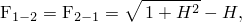
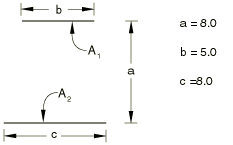
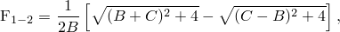
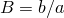
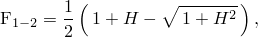
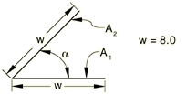
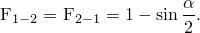

# 1.6.5 Two-dimensional elemental cavity radiation view factor calculations

**Product: **Abaqus/Standard  

Relatively simple configurations were selected for these verification problems to ensure that analytical solutions or tabulated results could be found. In some cases certain parameters such as the distance between two surfaces or the number of elements on a surface were varied to illustrate the effects of these parameters on view factor calculations within Abaqus. To duplicate the tabulated results for the cases where parameters were varied, the user can modify the input files provided with the Abaqus release.

### Two infinitely long, directly opposed parallel plates of the same finite width

### Problem description

### Analytical solution

where .

### Results and discussion

| F |
| --- |
| Abaqus | Analytical |
| 0.2361 | 0.2361 |

### Input file

[xrvd24n1.inp](../eif/xrvd24n1.inp)

One DC2D4 element is used to discretize each surface of the cavity.

### Reference

Howell,  J. R., *A Catalog of Radiation Configuration Factors, *McGraw-Hill Book Company, New York, 1982.

### Two infinitely long parallel plates of different widths; the centerlines of each plate are connected by the perpendicular between the plates

### Problem description

### Analytical solution

where  and .

### Results and discussion

| F |
| --- |
| Abaqus | Analytical |
| 0.4337 | 0.4337 |

### Input file

[xrvd24n2.inp](../eif/xrvd24n2.inp)

One DC2D4 element is used to discretize each surface of the cavity.

### Reference

Howell,  J. R., *A Catalog of Radiation Configuration Factors, *McGraw-Hill Book Company, New York, 1982.

### Two infinitely long plates of unequal widths h and w, having one common edge and at an angle of 90 to each other

### Problem description

### Analytical solution

where .

### Results and discussion

| F |
| --- |
| Abaqus | Analytical |
| 0.2229 | 0.2229 |

### Input file

[xrvd24n3.inp](../eif/xrvd24n3.inp)

One DC2D4 element is used to discretize each surface of the cavity.

### Reference

Siegel,  R., and J. R. Howell, *Thermal Radiation Heat Transfer, *Hemisphere Publishing Corporation, Washington, 3rd, 1992.

### Two infinitely long plates of equal finite width w, having one common edge and having an included angle of α to each other

### Problem description

### Analytical solution

### Results and discussion

In [xrvd24n4.inp](../eif/xrvd24n4.inp)  can be varied to obtain the following results (in [xrvd24m4.inp](../eif/xrvd24m4.inp) the angle is varied using prescribed rotational motion):

|  | F |
| --- | --- |
| Abaqus | Analytical |
| 10 | 0.9128 | 0.9128 |
| 20 | 0.8264 | 0.8264 |
| 30 | 0.7412 | 0.7412 |
| 40 | 0.6580 | 0.6580 |
| 50 | 0.5774 | 0.5774 |
| 60 | 0.5000 | 0.5000 |
| 70 | 0.4264 | 0.4264 |
| 80 | 0.3572 | 0.3572 |
| 90 | 0.2929 | 0.2929 |

### Input files

[xrvd24n4.inp](../eif/xrvd24n4.inp)

One DC2D4 element is used to discretize each surface of the cavity;  60.

[xrvd24m4.inp](../eif/xrvd24m4.inp)

One DC2D4 element is used to discretize each surface of the cavity; the [*MOTION](../key/key-link.md#usb-kws-hmotion), ROTATION option is used to vary the angle between the plates.

### Reference

Siegel,  R., and J. R. Howell, *Thermal Radiation Heat Transfer, *Hemisphere Publishing Corporation, Washington, 3rd, 1992.

