# 1.6.8 Radiation analysis of a plane finned surface

**Product: **Abaqus/Standard  

This example illustrates the Abaqus capability to solve heat transfer problems including cavity radiation. We simulate the effects of a fire condition on a plane finned surface. This problem was proposed by Glass et al. (1989) as a benchmark for thermal radiation. We compare their results with those obtained using Abaqus.

The configuration shown in [Figure 1.6.8--1](ch01s06ach60.md#sxmfinnedrad-surface) represents a plane wall with a uniform array of parallel rectangular fins attached. The problem represents three phases in a fire test. The first is the pretest, a steady-state condition where heat is transferred by natural convection from an internal fluid at a fixed temperature of 100C to the plane inside wall. Heat is conducted through the wall and dissipated by radiation and natural convection from the outside wall and fin surfaces to the surrounding medium, which is at a temperature of 38C. The second phase is a 30-minute fire transient, where heat is supplied by radiation and forced convection from a hot external fluid at 800C. After conduction through the fins and wall, heat is rejected by natural convection to the internal fluid. Finally, the third phase is a 60-minute cool down period, where heat absorbed during the fire transient is rejected to the surroundings by the same process as that used to establish the initial steady-state condition.

### Problem description

The finite element mesh used for the wall and fins is shown in [Figure 1.6.8--2](ch01s06ach60.md#sxmfinnedrad-mesh). By making use of the radiation periodic symmetry capability in Abaqus, we are able to represent the array of fins while meshing only one fin and corresponding wall section.

The outside ambient is modeled with a single horizontal row of elements at some distance above the top of the fin (not shown in the figure). The varying ambient temperature is simulated by prescribing temperatures to the nodes of these elements. The elements representing the outside ambient are also assigned a surface emissivity of 1.0.

### Material and boundary conditions

The thermal conductivity of the wall and fins is 50 W/mC (*k*), their specific heat is 500 J/kgC (*c*), and the density is 7800 kg/m3 (). The surface emissivity of the wall and fins is 0.8, the Stefan-Boltzmann radiation constant is 5.6697  108 W/m2K4, and the temperature of absolute zero is 273C.

The natural convection between the internal fluid and the inside of the wall is modeled with a film boundary condition where the film coefficient is given as 500(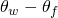)1/3 W/m2C, where 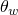 is the inside wall temperature and 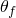 is the temperature of the internal fluid. The film boundary condition user subroutine is used for this purpose since the film condition is temperature dependent.

The natural convection between the outside finned surface and its surroundings is modeled with a film boundary condition where the film coefficient is given as 2(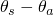)1/3 W/m2C, where  is the temperature of the finned surface and 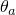 is the outside ambient temperature. Again, the film boundary condition user subroutine is employed. The forced convection between the hot surroundings and the finned surface is modeled with a constant film coefficient of 10 W/m2C.

### Loading

The first simulation step is a steady-state heat transfer analysis to establish the initial pretest conditions. This is followed by a 30-minute transient heat transfer analysis during which time the ambient fire temperature is 800C. Finally, a second transient heat transfer step is performed to simulate the 60-minute cool down period.

The integration procedure used in Abaqus for transient heat transfer analysis procedures introduces a relationship between the minimum usable time increment and the element size and material properties. The guideline given in the [Abaqus Analysis User's Guide](../usb/usb-link.md#usb) is 

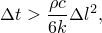

where  is the element size. This suggests that an initial time increment of 10 seconds is appropriate for the transient steps of this problem. Automatic time incrementation is chosen for the transient steps by setting DELTMX to 5C. DELTMX controls the time integration by limiting the temperature change allowed at any point during an increment.

### Results and discussion

The Glass et al. reference summarizes numerical results for this model for many heat transfer codes (all of which give similar results) along with the mean and standard deviation among the different codes. [Table 1.6.8--1](ch01s06ach60.md#bmk-anl-radiationfinnedsurf-table-glass) shows a comparison of the results obtained by Abaqus with the corresponding mean values reported by Glass et al. Table 5.1.5–1 also indicates the standard deviation reported by Glass et al. among the codes considered in that reference; the Abaqus results are within one standard deviation of the mean values reported in Glass et al. in all cases.

[Figure 1.6.8--3](ch01s06ach60.md#sxmfinnedrad-temphist-top) shows the history of the temperature at the top of the fin (point 1 in [Figure 1.6.8--1](ch01s06ach60.md#sxmfinnedrad-surface)). [Figure 1.6.8--4](ch01s06ach60.md#sxmfinnedrad-temphist-root) shows the histories of the temperature at the root of the fin (point 2 in [Figure 1.6.8--1](ch01s06ach60.md#sxmfinnedrad-surface)) and on the wall inside surface (point 3). In all cases the results obtained with Abaqus match the TAU results quite well. In [Figure 1.6.8--5](ch01s06ach60.md#sxmfinnedrad-tempdist) we show the temperature distribution around the fin perimeter (starting at point 1 and ending at point 2) at the end of the fire transient. Again, the Abaqus and TAU results match closely. Finally, temperature contours at the end of the fire transient are shown in [Figure 1.6.8--6](ch01s06ach60.md#sxmfinnedrad-tempcont).

### Input files

[radiationfinnedsurf.inp](../eif/radiationfinnedsurf.inp)

Fire transient problem.

[radiationfinnedsurf.f](../eif/radiationfinnedsurf.f)

User subroutine [`FILM`](../sub/sub-link.md#sub-xsl-film) used in radiationfinnedsurf.inp.

### References

Glass,  R. E., et al., “Standard Thermal Problem Set,” Proceedings of the Ninth International Symposium on the Packaging of Radioactive Materials, pp. 275–282, June 1989.

Johnson,  D., “Surface to Surface Radiation in the Program TAU, Taking Account of Multiple Reflection,” United Kingdom Atomic Energy Authority Report ND-R-1444(R), 1987.

### Table

**Table 1.6.8–1** Comparison of the results obtained by Abaqus with those published by Glass et al.
| Step | Locations | Glass et al. (C) | Abaqus (C) |
| --- | --- | --- | --- |
| Mean | Standard deviation |
| Initial (t=0 s) | Fin tip (point 1) | 75.8 | 0.2 | 75.7 |
| Fin root (point 2) | 93 | 0.3 | 92.9 |
| Inside surface (point 3) | 97 | 0.1 | 96.9 |
| End of fire (t=1800 s) | Fin tip (point 1) | 652.2 | 4.9 | 649.9 |
| Fin root (point 2) | 238.6 | 6.6 | 237.2 |
| Inside surface (point 3) | 133.7 | 1.1 | 133.6 |
| End of cooldown (t=5400 s) | Fin tip (point 1) | 80.4 | 0.7 | 80.9 |
| Fin root (point 2) | 95.7 | 0.5 | 96.1 |
| Inside surface (point 3) | 98.4 | 0.2 | 98.5 |

### Figures

**Figure 1.6.8–1** Plane finned surface.

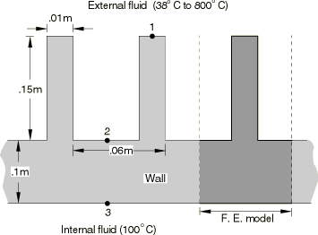

**Figure 1.6.8–2** Finite element mesh of fin and inner wall.

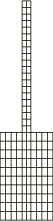

**Figure 1.6.8–3** Temperature history at top of fin.

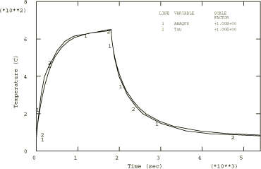

**Figure 1.6.8–4** Temperature history at root of fin and inside wall surface.

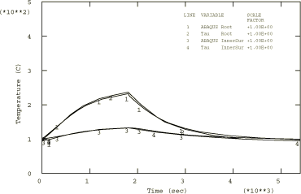

**Figure 1.6.8–5** Temperature distribution along fin perimeter at end of fire transient.

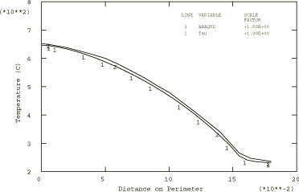

**Figure 1.6.8–6** Temperature contours at end of fire transient.

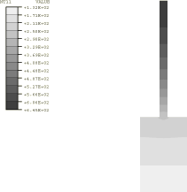

