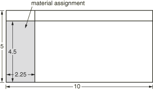
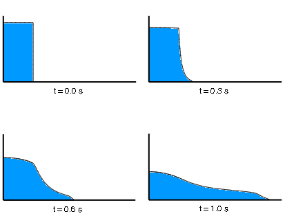
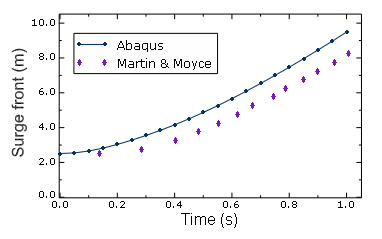
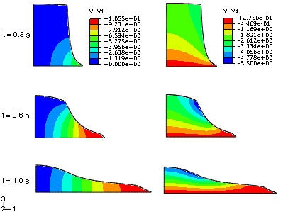

# 1.7.1 Eulerian analysis of a collapsing water column

**Products: **Abaqus/Explicit  Abaqus/CAE  

This example utilizes the pure Eulerian analysis technique to model a dynamic fluid flow event involving large deformation. A column of water is subjected to a gravity load, causing the column to collapse and flow along a flat, rigid floor. The analysis results can be compared to experimental results from Martin and Moyce (1952), demonstrating the efficacy of the Eulerian technique and equation of state material models for simulating fluid dynamics in Abaqus/Explicit.

### Problem description

The model is created in Abaqus/CAE using a simple rectangular Eulerian domain measuring 10  5  0.05 m. Because Eulerian analyses must be conducted in three-dimensional space, it is common to approximate two-dimensional problems using a thin domain with a single Eulerian element through its thickness. Cubic elements provide the best accuracy and performance in Eulerian analyses, so the thickness is chosen to correspond to the height and width of each element in the eventual mesh.

Zero-velocity boundary conditions normal to all the domain faces prevent the flow of material into or out of the domain. The domain is partitioned, and the Eulerian material (water) is assigned to a 2.25  4.5 m region along the left edge of the domain (see [Figure 1.7.1--1](ch01s07ach61.md#bmk-anl-collapse-model)).

The water is modeled as a nearly incompressible, viscous Newtonian fluid. The linear  Hugoniot form of the Mie-Grneisen equation of state is used in the material model. The parameters used to define the material, based on a bulk modulus of approximately 2.246 GPa, are listed in [Table 1.7.1--1](ch01s07ach61.md#bmk-anl-watercollapse-material).

In addition to a gravity load applied to the entire Eulerian domain, initial geostatic stresses are defined in the water to model the hydrostatic pressure in the column. Since geostatic stresses cannot be defined directly in Abaqus/CAE, they are added to the model using the **Keywords Editor**.

The Eulerian domain is finely meshed with a grid of 222  111 Eulerian EC3D8R elements.

### Results and discussion

In the Visualization module of Abaqus/CAE, an isosurface view cut based on the Eulerian volume fraction for water (output variable EVF_WATER) is used to visualize the progression of the column collapse within the Eulerian mesh, as shown in [Figure 1.7.1--2](ch01s07ach61.md#bmk-anl-collapse-progress). The results can be compared to experimental data from a similar physical model by Martin and Moyce (1952). The trends of the surge front in the experimental case and in the Abaqus case are similar (see [Figure 1.7.1--3](ch01s07ach61.md#bmk-anl-collapse-surge)). Given the potential inaccuracies associated with the experimental measurement techniques, as documented by Martin and Moyce, the two cases agree reasonably well.

The surge front can be tracked in the Visualization module of Abaqus/CAE by investigating the Eulerian volume fraction for water in the elements along the bottom of the mesh. The tracking can be done manually or by creating *X–Y* data objects from output variable EVF_WATER and using mathematical operations to convert the volume fraction to an associated distance.

[Figure 1.7.1--4](ch01s07ach61.md#bmk-anl-collapse-velocities) illustrates the dynamics of the water by contouring the velocity in the horizontal direction (V1) and the velocity in the vertical direction (V3) during the collapse. The water in the column moves downward under the gravity load (with the free edge of the column falling faster than the edge along the wall), forcing an accelerating surge in the horizontal direction.

### Python script

### Input file

[eulerian_column.inp](../eif/eulerian_column.inp)

Input file for the model.

### Reference

Martin,  J. C., and W. J. Moyce, “An Experimental Study of the Collapse of Liquid Columns on a Rigid Horizontal Plane,” Philosophical Transactions of the Royal Society of London, Series A, Mathematical and Physical Sciences, vol. 244, no.882, pp. 312–324, 1952.

### Table

**Table 1.7.1–1** Material parameters for water.
| Parameter | Value |
| --- | --- |
| Density () | 998.2 kg/m3 |
| Viscosity () | 0.001003 N s/m2 |
|  | 1500 m/s |
| *s* | 0 |
|  | 0 |

### Figures

**Figure 1.7.1–1** Geometry of the Eulerian domain. All dimensions are in meters.

**Figure 1.7.1–2** Deformation of the water column under gravity loading.

**Figure 1.7.1–3** Results in Abaqus compared to experimental results.

**Figure 1.7.1–4** Water velocity in the horizontal (V1) and vertical (V3) directions.

