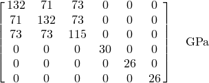
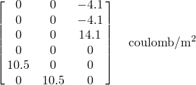
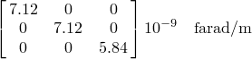
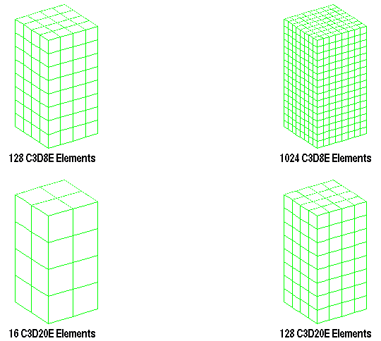
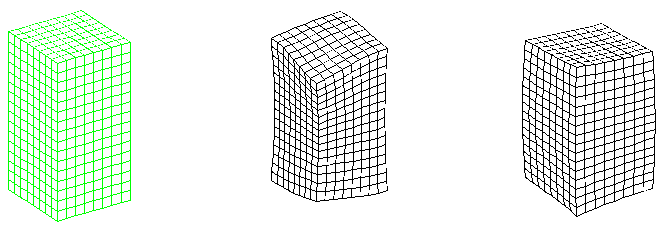

# 1.8.1 Eigenvalue analysis of a piezoelectric cube with various electrode configurations

**Product: **Abaqus/Standard  

This problem examines the vibrational breathing modes of a piezoelectric cube of PZT4 material with multiple configurations of electroded surfaces. One analysis has two ends of the cube fully electroded, while the second analysis has the two ends only partially electroded. Both the resonant (close-circuited) and antiresonant (open-circuited) frequencies are extracted for both electrode patterns. The elements used are the 8-node and 20-node three-dimensional brick elements. The basis of the piezoelectric capability in Abaqus is described in ["Piezoelectric analysis," Section 2.10.1 of the Abaqus Theory Guide](../stm/stm-link.md#stm-anl-piezoelectric).

### Problem description

This problem has been used as a basis for verification for finite element piezoelectric capabilities in several references: Boucher et al. (1981), Lerch (1990), and Ostergaard et al. (1986). The structure is a cube consisting of the piezoelectric material PZT4. Each side length of the cube is 20 mm. For the first case the top and bottom surfaces, which are orthogonal to the axis of polarization, are considered to be completely covered with electrodes. In the second case only a portion of the surfaces are covered with electrodes. The portion covered consists of a centered square section with an edge length of 10 mm.

The properties for the materials in the transducer are available in Boucher et al. (1981). These properties for the PZT4 are given as

Elasticity Matrix:

Piezoelectric Coupling Matrix (Stress Coefficients): 

Dielectric Matrix: 

The poling direction is the 3-direction. The electrodes are placed on the faces that are orthogonal to the 3-axis.

See ["Eigenvalue analysis of a piezoelectric transducer," Section 7.1.1 of the Abaqus Example Problems Guide](../exa/exa-link.md#exa-elc-eigenpiezotrans), for a note on the ordering of the stress components.

### Models

If we wished to extract all the natural frequencies of the cube, symmetry could not be utilized in the discretizations. However, in the references used for comparison, only the breathing-type modes are given. This allows the use of some symmetry in the models. An eighth of the cube cannot be used for the distribution of the electrical potentials because they may not be symmetrical about the *x*–*y* plane. Therefore, a quarter of the cube is modeled with symmetry about the *x*–*z* and *y*–*z* planes. The piezoelectric cube is modeled with both the 8-node and 20-node three-dimensional brick elements each with two levels of refinement. The discretizations used are shown in [Figure 1.8.1--1](ch01s08ach63.md#sxmpiezocube-meshes).

In each analysis constraints are used to ensure that only the modes of interest, the breathing-type modes, are extracted. These constraints are applied as both boundary conditions and equations.

Each level of discretization for each element is analyzed with the two configurations of electrodes. The first has the electrodes fully covering the top and bottom surfaces where these surfaces are those orthogonal to the poling direction. The second configuration has the electrodes partially covering the top and the bottom surfaces. The analyses are performed considering the electrodes to be both closed-and open-circuited. The closed-circuited cases are specified by setting the potentials on both electrodes to zero. This situation yields the resonant frequencies. The open-circuited cases are specified by setting the potentials on only one surface electrode to zero, which allows a different potential to exist on each electrode. This situation yields the antiresonant frequencies.

### Results and discussion

The solutions obtained with the Abaqus models, along with the results available from other references, are given in [Table 1.8.1--1](ch01s08ach63.md#table-piezocube-eig-fully) and [Table 1.8.1--2](ch01s08ach63.md#table-piezocube-eig-part). In [Table 1.8.1--1](ch01s08ach63.md#table-piezocube-eig-fully) both the resonant and antiresonant frequencies are given for the case with fully covered electrodes. The corresponding results are given for the analyses with the partially covered electrodes in [Table 1.8.1--2](ch01s08ach63.md#table-piezocube-eig-part). The two modes of interest are the breathing-type modes described by Boucher et al. (1981). The corresponding mode shapes obtained from Abaqus for the resonant frequencies for the case of completely covered electrodes are shown in [Figure 1.8.1--2](ch01s08ach63.md#sxmpiezocube-modes). The model for these mode shapes used the 8-node brick elements in the refined discretization.

The results from Abaqus compare well with the results from the other references. Even the coarser meshes are seen to give reasonable results.

### Input files

[piezocube_c3d8e_coarse_reson.inp](../eif/piezocube_c3d8e_coarse_reson.inp)

Coarse mesh with 8-node three-dimensional brick elements for the closed-circuited case for resonant frequencies.

[piezocube_c3d8e_coarse_anti.inp](../eif/piezocube_c3d8e_coarse_anti.inp)

Coarse mesh with 8-node three-dimensional brick elements for the open-circuited case for antiresonant frequencies.

[piezocube_c3d8e_fine_reson.inp](../eif/piezocube_c3d8e_fine_reson.inp)

Refined mesh with 8-node three-dimensional brick elements for the closed-circuited case for resonant frequencies.

[piezocube_c3d8e_fine_anti.inp](../eif/piezocube_c3d8e_fine_anti.inp)

Refined mesh with 8-node three-dimensional brick elements for the open-circuited case for antiresonant frequencies.

[piezocube_c3d20e_coarse_reson.inp](../eif/piezocube_c3d20e_coarse_reson.inp)

Coarse mesh with 20-node three-dimensional brick elements for the closed-circuited case for resonant frequencies.

[piezocube_c3d20e_coarse_anti.inp](../eif/piezocube_c3d20e_coarse_anti.inp)

Coarse mesh with 20-node three-dimensional brick elements for the open-circuited case for antiresonant frequencies.

[piezocube_c3d20e_fine_reson.inp](../eif/piezocube_c3d20e_fine_reson.inp)

Refined mesh with 20-node three-dimensional brick elements for the closed-circuited case for resonant frequencies.

[piezocube_c3d20e_fine_anti.inp](../eif/piezocube_c3d20e_fine_anti.inp)

Refined mesh with 20-node three-dimensional brick elements for the open-circuited case for antiresonant frequencies.

The input files are currently set up for the situation of fully covered electrodes. Commented data lines exist in each input file for the partially covered electroded cases.

### References

Boucher,  D., M. Lagier, and C. Maerfeld, “Computation of the Vibrational Modes for Piezoelectric Array Transducers using a Mixed Finite Element-Perturbation Method,” IEEE Transactions on Sonics and Ultrasonics, vol. SU-28, no.8, pp. 318–330, September 1981.

Lerch,  R., “Simulation of Piezoelectric Devices by Two- and Three-Dimensional Finite Elements,” IEEE Transactions on Ultrasonics, Ferroelectrics, and Frequency Control, vol. 37, no.2, pp. 233–247, 1990.

Ostergaard,  D., and T. Pawlak, “Three-Dimensional Finite Elements for Analyzing Piezoelectric Structures,” Proceedings IEEE Ultrasonics Symposium, Williamsburg, VA, pp. 639–642, 1986.

### Tables

**Table 1.8.1–1** Eigenvalue estimates for breathing modes in piezoelectric cube with fully covered electrodes.
| Model | Resonant freq. (kHz) | Anti-resonant freq. (kHz) |
| --- | --- | --- |
| Element | # in Model | Mode 1 | Mode 2 | Mode 1 | Mode 2 |
| C3D8E | 128 | 64.3 | 82.1 | 76.9 | 90.1 |
| C3D8E | 1024 | 64.9 | 86.6 | 79.4 | 92.7 |
| C3D20E | 16 | 65.1 | 88.4 | 80.2 | 94.0 |
| C3D20E | 128 | 65.1 | 88.2 | 80.1 | 93.7 |
| Boucher et al.--FEA | 67.0 | 91.9 | 83.1 | 96.8 |
| Ostergaard et al.--FEA | 65.7 | 86.5 | 81.8 | 95.2 |
| Lerch--FEA | 66.0 | 87.3 | 80.5 | 94.9 |
| Boucher et al.--Measured | 66.6 | 88.0 | 81.6 | 93.4 |

**Table 1.8.1–2** Eigenvalue estimates for breathing modes in piezoelectric cube with partially covered electrodes.
| Model | Resonant freq. (kHz) | Anti-resonant freq. (kHz) |
| --- | --- | --- |
| Element | # in Model | Mode 1 | Mode 2 | Mode 1 | Mode 2 |
| C3D8E | 128 | 67.1 | 84.0 | 77.1 | 90.2 |
| C3D8E | 1024 | 68.3 | 88.6 | 79.6 | 92.9 |
| C3D20E | 16 | 68.2 | 90.3 | 80.4 | 94.2 |
| C3D20E | 128 | 68.6 | 90.1 | 80.3 | 93.9 |
| Boucher et al.--FEA | 70.7 | 92.9 | 84.1 | 97.1 |
| Lerch--FEA | 69.5 | 88.5 | 80.5 | 92.9 |
| Boucher et al.--Measured | 70.4 | 90.1 | 82.5 | 93.6 |

### Figures

**Figure 1.8.1–1** Discretizations used with 8-node and 20-node three-dimensional elements.

**Figure 1.8.1–2** Undeformed mesh and first two breathing modes.

