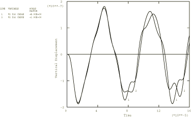
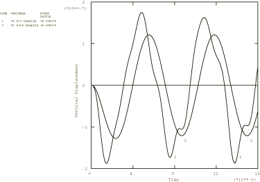

# 1.8.3 Steady-state dynamic analysis for piezoelectric materials

**Product: **Abaqus/Standard  

### Problem description

The model is the cylinder described in ["Static analysis for piezoelectric materials," Section 3.7.1 of the Abaqus Verification Guide](../ver/ver-link.md#ver-prc-piezostatic). There are nine input files. The input files [ppzossd1.inp](../eif/ppzossd1.inp), [ppzossd3.inp](../eif/ppzossd3.inp), [ppzossd4.inp](../eif/ppzossd4.inp), and [ppzossd4a.inp](../eif/ppzossd4a.inp) have 16 CAX4E elements. The input file [ppzossd2.inp](../eif/ppzossd2.inp) has 4 CAX8E elements. The input files [ppzossd7.inp](../eif/ppzossd7.inp), [ppzossd8.inp](../eif/ppzossd8.inp), and [ppzossd9.inp](../eif/ppzossd9.inp) have 32 CAX3E, 8 CAX6E, and 4 CAX8RE elements, respectively.

The modal-based steady-state dynamic analyses use the eigendata from the restart files generated in ["Frequency extraction analysis for piezoelectric materials," Section 3.7.2 of the Abaqus Verification Guide](../ver/ver-link.md#ver-prc-piezofreqextract). The input files [ppzossd1.inp](../eif/ppzossd1.inp) and [ppzossd2.inp](../eif/ppzossd2.inp) illustrate a steady-state dynamic analysis with no damping and are intended for comparison with the results from Mercer et al. (1987). In this analysis a pressure load is applied on the top surface. In input files [ppzossd3.inp](../eif/ppzossd3.inp), [ppzossd7.inp](../eif/ppzossd7.inp), [ppzossd8.inp](../eif/ppzossd8.inp), and [ppzossd9.inp](../eif/ppzossd9.inp) modal damping terms are introduced to the steady-state dynamic analysis mentioned previously to illustrate the effect of damping. Both modal and direct calculation steady-state analyses are performed in input files [ppzossd1.inp](../eif/ppzossd1.inp), [ppzossd2.inp](../eif/ppzossd2.inp), [ppzossd3.inp](../eif/ppzossd3.inp), [ppzossd7.inp](../eif/ppzossd7.inp), [ppzossd8.inp](../eif/ppzossd8.inp), and [ppzossd9.inp](../eif/ppzossd9.inp). The input file [ppzossd4.inp](../eif/ppzossd4.inp) illustrates steady-state analysis with a distributed electrical charge, while the input file [ppzossd4a.inp](../eif/ppzossd4a.inp) performs the steady-state analysis with a concentrated electrical charge instead of the pressure load. Only the direct calculation option is used because the modal-based procedures do not adequately transform the charge loads into modal loads.

In addition to the modal-based and direct-solution analyses, subspace-based steady-state dynamics analyses are performed in the input files [ppzossd1.inp](../eif/ppzossd1.inp), [ppzossd3.inp](../eif/ppzossd3.inp), [ppzossd7.inp](../eif/ppzossd7.inp), [ppzossd8.inp](../eif/ppzossd8.inp), and [ppzossd9.inp](../eif/ppzossd9.inp). An additional frequency step extracts all eigenmodes available, which are then used in the subspace-based steady-state dynamic steps to compute the response. Since all the eigenmodes are used, the results are identical to the ones obtained in the direct-solution analysis.

For all these analyses a single sinusoidal frequency of 100000 rad/sec (15.9 kHz) is chosen to compare to the modal dynamics results from ["Modal dynamic analysis for piezoelectric materials," Section 1.8.2](ch01s08ach64.md).

### Results and discussion

In the steady-state dynamics procedure the frequency of the sinusoidal load is user-defined, with a complex-valued solution for various quantities such as stresses and displacements that occur when steady state is reached. The accuracy of the modal procedure depends on the representation contained in the eigendata extracted previously, whereas the direct procedure utilizes all the available degrees of freedom. For the modal procedure the vertical deflection at the center of the top surface for the sinusoidally applied pressure load for the two models with no damping is 1.56  107 for the model that uses CAX4E elements and 1.55  107 for the model with CAX8E elements. For the direct procedure the deflection is 1.80  107 for the model with CAX4E elements and 1.79  107 for the model with CAX8E elements. If all the possible modes are used in the frequency extraction, the modal procedures give the same results as the direct procedure.

These results are in the same range as that reported in Mercer et al. (1987) for similar models. Since no damping is included in the model, the phase angles for all variables are either 0 or 180. The phase angle for the 2-displacement at the center of the top surface is 180. This phase shift is evident from [Figure 1.8.3--1](ch01s08ach65.md#bmkpiezo-dispnodamp). The total force on the restrained bottom edge of the CAX8E model is output; the total force in the vertical direction matches the sum of the reaction forces on the edge.

The deflection at the center of the top surface for the analysis including Rayleigh damping using CAX4E elements (input file [ppzossd3.inp](../eif/ppzossd3.inp)) is 1.21  107 with a phase angle of 133. The reduction in magnitude and the phase shift are evident from [Figure 1.8.3--2](ch01s08ach65.md#bmkpiezo-disps). The problem including Rayleigh damping is also analyzed using CAX3E, CAX6E, and CAX8RE elements in input files [ppzossd7.inp](../eif/ppzossd7.inp), [ppzossd8.inp](../eif/ppzossd8.inp), and [ppzossd9.inp](../eif/ppzossd9.inp), respectively. In these analyses the deflection and phase angle at the center of the top surface match with those obtained using CAX4E elements. In addition, the results from direct and modal dynamic solutions in each case are in good agreement.

The analyses using input files [ppzossd4.inp](../eif/ppzossd4.inp) and [ppzossd4a.inp](../eif/ppzossd4a.inp) have a sinusoidally varying surface charge. Because of the inability of the modal procedures to transform these loads adequately into modal loads, only the direct procedure is used. The first step uses the REAL ONLY feature of the direct calculation analysis procedure. The second step includes both real and imaginary terms, with the load applied in the imaginary plane using the IMAGINARY parameter. The vertical deflection at the center of the top surface is 5.5  108. The phase shift for the vertical displacement at this location is 180 (no damping involved) for the case when the charges are applied in the real plane and 90.0 when the charges are applied in the imaginary plane. The potential at that nodal location is 158., with a phase shift of 0 for the first step and a phase shift of 90 in the second step.

### Input files

[ppzossd1.inp](../eif/ppzossd1.inp)

CAX4E elements.

[ppzossd2.inp](../eif/ppzossd2.inp)

CAX8E elements.

[ppzossd3.inp](../eif/ppzossd3.inp)

CAX4E elements including damping.

[ppzossd4.inp](../eif/ppzossd4.inp)

CAX4E elements with distributed charges (direct calculations only).

[ppzossd4a.inp](../eif/ppzossd4a.inp)

CAX4E elements with concentrated charges (direct calculations only).

[ppzossd7.inp](../eif/ppzossd7.inp)

CAX3E elements including damping.

[ppzossd8.inp](../eif/ppzossd8.inp)

CAX6E elements including damping.

[ppzossd9.inp](../eif/ppzossd9.inp)

CAX8RE elements including damping.

### Reference

Mercer,  C. D., B. D. Reddy, and R. A. Eve, “Finite Element Method for Piezoelectric Media,” UCT/CSIR Applied Mechanics Research Unit Technical Report No. 92, vol. April, 1987.

### Figures

**Figure 1.8.3–1** Vertical displacement at center of top of cylinder for pressure load with no damping.

**Figure 1.8.3–2** Vertical displacement at center of top of cylinder with and without damping.

