# 1.8.4 TEAM 2: Eddy current simulations of long cylindrical conductors in an oscillating magnetic field

**Product: **Abaqus/Standard  

This benchmark problem is part of the standard suite of problems designed for Testing Electromagnetic Analysis Methods (TEAM). The problem to be addressed is that of an infinite conducting cylindrical shell immersed in a time-harmonic uniform magnetic field. The objective is to compute the eddy currents induced in the cylindrical shell by the magnetic field that is varying in time. Lorentz force and Joule heating in the conductor are also of interest.

### Problem description

The problem setup is shown in [Figure 1.8.4--1](ch01s08ach66.md#bmk-em-team2-geom). It depicts an infinite conducting cylindrical shell immersed in a time-harmonic uniform magnetic field. The inner and outer radius of the conducting cylindrical shell are 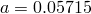 m and 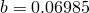 m. Its resistivity and relative magnetic permeability are assumed to be 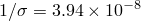Ω-m and 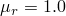. The magnetic flux density is assumed to have a magnitude of 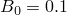 T and is oscillating with a frequency of 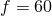 Hz. The magnetic field is assumed to be oriented along the 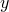-direction. We will assume that the medium in which the cylindrical shell is immersed has properties similar to that of a vacuum. For these parameters, the skin depth of the conductor is about 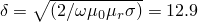 mm, which is comparable to the shell thickness of 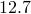 mm.

### Model and boundary conditions

The magnetic vector potential formulation is used to solve this problem. Due to the invariance of the geometry along the -direction and the fact that magnetic flux density lies in the *x*–*y* plane, only the -component of magnetic vector potential is nonzero. Although the geometry is two-dimensional in nature, the magnetic vector potential formulation in two dimensions can only represent the - and - components of the magnetic vector potential. Hence, a three-dimensional geometry that contains one element along the -direction is used.

Due to the symmetry of the problem, it is sufficient to model the first quadrant of the problem domain in the *x*–*y* plane. Appropriate boundary conditions are imposed on the symmetry planes  and . Since the magnetic vector potential, , is oriented along the -direction, symmetry arguments require that it be identically zero on the  plane. As a result, a homogeneous Dirichlet boundary condition 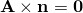 is applied on the symmetry plane . Here  represents the unit normal perpendicular to the boundary surface. Similarly, on the plane , symmetry arguments require that the magnetic field  be perpendicular to the plane. Hence, a homogeneous Neumann boundary condition  is applied on the symmetry plane .

Since the problem domain is unbounded, it must be truncated in some way. Abaqus does not support absorbing boundary conditions; therefore, the truncation boundary should be chosen far away from the conductor. Boundary surfaces far away from the conductor are chosen such that they are parallel to either the  or  plane. Magnetic vector potential and magnetic flux density far away from the conductor are given by  and 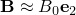, where  and  are the unit vectors along the - and - coordinate axes. Since the projection of the magnetic vector potential onto the far boundary surface that is parallel to the  plane is constant, an inhomogeneous Dirichlet boundary condition 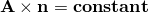 is applied on this boundary surface. Since the magnetic flux density is perpendicular to the far boundary surface that is parallel to the  plane, a homogeneous Neumann boundary condition is applied on this boundary surface.

Finally, since the magnetic vector potential is oriented along the -axis, a homogeneous Dirichlet boundary condition is applied on the boundary surfaces that are parallel to the  plane.

### Analytical solution

The magnetic vector potential in various regions of the problem can be expressed as follows:

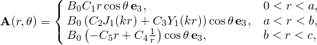

where , 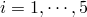 are the constants to be determined; 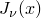 and 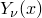 are the cylindrical Bessel functions of the first and second kind, respectively; and 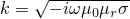 is the complex wave number of the conductor. Enforcing continuity of the normal component of magnetic flux density and the tangential component of magnetic field intensity on the inner and outer surfaces of the cylindrical shell and applying an inhomogeneous Dirichlet boundary condition on an outer cylindrical surface of radius  leads to the following set of relations between the constants:

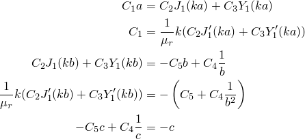

where the primed function 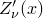 denotes the first derivative of the function with respect to its argument. In the limit of  we obtain the true solution to the problem. For comparison with the simulation results, truncated analytical results are generated by choosing the value of  to be the distance from the origin to the outer boundary of the problem domain.

### Results and discussion

[Figure 1.8.4--2](ch01s08ach66.md#bmk-em-team2-xyplotb) shows the comparison of the amplitude of the -component of the magnetic flux density computed using Abaqus/Standard with that of the analytical solution. The labels `EMC3D8' and `EMC3D4' in the legend correspond to the analyses performed with these elements. The labels `Analytical Truncated' and `Analytical True' in the legend correspond to the analytical solution computed by assuming that a Dirichlet boundary condition is applied on an outer cylindrical boundary surface at a finite distance and at infinity, respectively, as described in the previous section. The figure clearly indicates that the analysis results compare very well with the analytical results and that the outer boundary surface is far enough from the cylindrical shell that the error introduced by truncation is small.

[Figure 1.8.4--3](ch01s08ach66.md#bmk-em-team2-contoure) shows a contour plot of the amplitude of the electric field. For a time-harmonic analysis the amplitude of the electric field is the same as that of the amplitude of the magnetic vector potential scaled by the radian frequency. The figure clearly shows that the presence of the conductor distorts the field near its vicinity. Finally, [Figure 1.8.4--4](ch01s08ach66.md#bmk-em-team2-contourj) depicts the induced current density in the conductor due to the magnetic field. The figure shows that the current density in the conductor is larger along the -axis and vanishes along the -axis. Consequently, the Joule heat generated in the conductor is large along the -axis.

### Input files

[team2_symm_sqr_emc3d8.inp](../eif/team2_symm_sqr_emc3d8.inp)

Eddy current analysis of a conducting cylindrical shell immersed in a time-harmonic uniform magnetic field using element type EMC3D8 and symmetry boundary conditions.

[team2_symm_sqr_emc3d4.inp](../eif/team2_symm_sqr_emc3d4.inp)

Eddy current analysis of a conducting cylindrical shell immersed in a time-harmonic uniform magnetic field using element type EMC3D4 and symmetry boundary conditions.

### Reference

Ida,  N., “Infinite Cylinder in a Uniform Sinusoidal Field (Comparison of Results, Problem 2),” The International Journal for Computation and Mathematics in Electrical and Electronic Engineering, vol. 7, pp. 29–45, 1988.

### Figures

**Figure 1.8.4–1** Geometry of an infinite conducting cylindrical shell immersed in a time-harmonic uniform magnetic field.

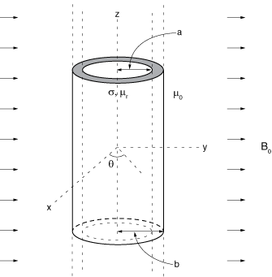

**Figure 1.8.4–2** Amplitude of the *y*-component of magnetic flux density.

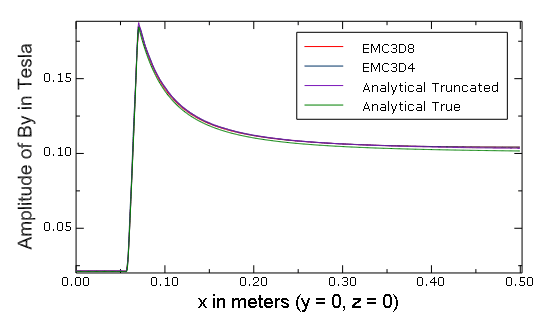

**Figure 1.8.4–3** Amplitude of the real part of the electric field.

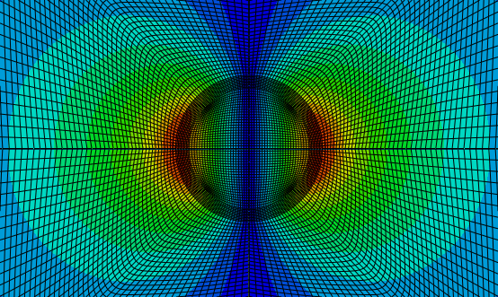

**Figure 1.8.4–4** Amplitude of the eddy current induced in the conductor.

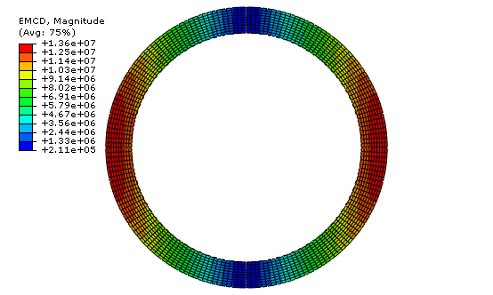

