# 1.8.6 TEAM 6: Eddy current simulations for spherical conductors in an oscillating magnetic field

**Product: **Abaqus/Standard  

This benchmark problem is part of the standard suite of problems designed for Testing Electromagnetic Analysis Methods (TEAM). The problem to be addressed is that of a conducting spherical shell immersed in a time-harmonic uniform magnetic field. The objective is to compute the eddy currents induced in the spherical shell by the magnetic field that is varying in time. Lorentz force and Joule heating in the conductor are also of interest.

### Problem description

The problem setup is shown in [Figure 1.8.6--1](ch01s08ach68.md#bmk-em-team6-geom). It depicts a conducting spherical shell immersed in a time-harmonic uniform magnetic field. For visual clarity, the figure depicts a spherical shell with a section of it removed. The inner and outer radius of the conducting spherical shell are 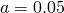 m and 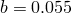 m. Its conductivity and relative magnetic permeability are assumed to be 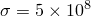 S/m and . The magnetic flux density is assumed to have a magnitude of 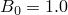 T and is oscillating with a frequency of 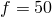 Hz. Without loss of generality, we can assume that the magnetic field is oriented along the -direction. We will assume that the medium in which the spherical shell is immersed has properties similar to that of a vacuum. For these parameters, the skin depth of the conductor is about 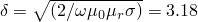 mm, which is smaller than the shell thickness of  mm.

### Model and boundary conditions

The magnetic vector potential formulation is used to solve this problem. Due to the symmetry of the problem, it is sufficient to model the first octant of the problem domain. Appropriate boundary conditions are imposed on the symmetry planes , , and . Since the magnetic flux density is oriented along the -direction, azimuthal symmetry of the geometry requires that the total magnetic vector potential  is nonzero only in the azimuthal direction. As a result, the magnetic vector potential on the planes  and  is perpendicular to each of these planes. Hence, a homogeneous Dirichlet boundary condition  is imposed on the symmetry planes  and . Symmetry of the problem also requires that the total magnetic field  on the symmetry plane  be perpendicular to this plane. Hence, a homogeneous Neumann boundary condition  is applied on the symmetry plane .

Since the problem domain is unbounded, it must be truncated in some way. Abaqus does not support absorbing boundary conditions; therefore, the truncation boundary should be chosen far away from the conductor. Boundary truncation surfaces are chosen such that they are parallel to one of the , , or  planes. To demonstrate various boundary conditions that can be applied in an Abaqus/Standard analysis, a spherical boundary surface of radius  is chosen to truncate the problem domain. Magnetic vector potential and magnetic flux density far away from the conductor are given by 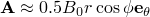 and 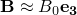, where  and  are the unit vectors along the -coordinate axis and along the azimuthal direction. Clearly neither the projection of magnetic vector potential nor that of magnetic field onto this surface is constant. They vary nonuniformly over the boundary surface. In this problem a nonuniform Dirichlet boundary condition is applied on the spherical boundary surface by supplying a user subroutine [`UDEMPOTENTIAL`](../sub/sub-link.md#sub-xsl-udempotential) that computes the magnetic vector potential on the boundary surface.

### Analytical solution

The total magnetic vector potential in various regions can be expressed as follows:

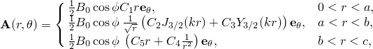

where ,  are the constants to be determined;  and  are the cylindrical Bessel functions of the first and second kind, respectively; and  is the complex wave number in the conductor. Enforcing continuity of the normal component of magnetic flux density and the tangential component of magnetic field intensity on the inner and outer surfaces of the spherical shell and applying an inhomogeneous Dirichlet boundary condition on an outer spherical surface of radius  leads to the following set of relations between the constants:

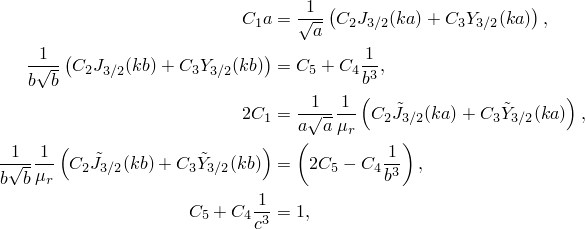

where, for notational simplicity, the functions 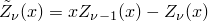 are introduced. In the limit of  we obtain the true solution to the problem. For comparison with the simulation results, truncated analytical results are generated by choosing the value of  to be the distance from the origin to the outer boundary of the problem domain.

### Results and discussion

[Figure 1.8.6--2](ch01s08ach68.md#bmk-em-team6-xyplotb) shows the comparison of the amplitude of the -component of the magnetic flux density computed using Abaqus/Standard analysis with that of the analytical solution. The labels `EMC3D8' and `EMC3D4' in the legend correspond to the analyses performed with these elements. The labels `Analytical Truncated' and `Analytical True' in the legend correspond to the analytical solution computed by assuming that a Dirichlet boundary condition is applied on an outer spherical boundary surface at a finite distance and at infinity, respectively, as described in the previous section. The figure clearly indicates that the analysis results compare very well with the analytical results and that the outer boundary surface is far enough from the spherical shell that the error introduced by truncation is small.

[Figure 1.8.6--3](ch01s08ach68.md#bmk-em-team6-contoure) shows the contour plot of the amplitude of the electric field. Only the first octant of the problem domain is shown in the figure. The view is oriented such that the origin is closer to the reader. For a time-harmonic analysis the amplitude of the electric field is the same as that of the amplitude of the magnetic vector potential scaled by the radian frequency. Finally, [Figure 1.8.6--4](ch01s08ach68.md#bmk-em-team6-contourj) depicts the induced current density in the conductor due to the magnetic field. In the figure a portion of the spherical shell is removed to expose the interior of the shell. The figure shows that the current density in the conductor is larger along the *x*–*y* plane and decreases toward the poles. Consequently, the Joule heat generated in the conductor is maximum along the *x*–*y* plane.

### Input files

[team6_symm_nuori_emc3d8.inp](../eif/team6_symm_nuori_emc3d8.inp)

Eddy current analysis of a conducting spherical shell immersed in a time-harmonic uniform magnetic field using element type EMC3D8, symmetry boundary conditions, and user subroutine [`UDEMPOTENTIAL`](../sub/sub-link.md#sub-xsl-udempotential).

[team6_symm_nuori_emc3d4.inp](../eif/team6_symm_nuori_emc3d4.inp)

Eddy current analysis of a conducting spherical shell immersed in a time-harmonic uniform magnetic field using element type EMC3D4, symmetry boundary conditions, and user subroutine [`UDEMPOTENTIAL`](../sub/sub-link.md#sub-xsl-udempotential).

[team6_symm_nuori_emc3d8.f](../eif/team6_symm_nuori_emc3d8.f)

User subroutine [`UDEMPOTENTIAL`](../sub/sub-link.md#sub-xsl-udempotential) used in the analysis with EMC3D8 elements.

[team6_symm_nuori_emc3d4.f](../eif/team6_symm_nuori_emc3d4.f)

User subroutine [`UDEMPOTENTIAL`](../sub/sub-link.md#sub-xsl-udempotential) used in the analysis with EMC3D4 elements.

### Reference

Emson,  C. R. I., “Results for a Hollow Sphere in Uniform Field (Benchmark Problem 6),” The International Journal for Computation and Mathematics in Electrical and Electronic Engineering, vol. 7, pp. 89–101, 1988.

### Figures

**Figure 1.8.6–1** Geometry of a conducting spherical shell immersed in a time-harmonic uniform magnetic field.

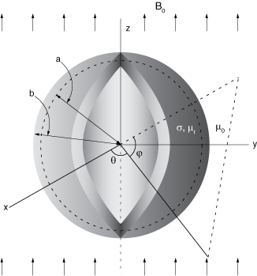

**Figure 1.8.6–2** Amplitude of the *z*-component of magnetic flux density.

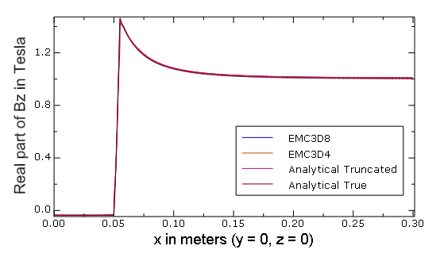

**Figure 1.8.6–3** Amplitude of the real part of the electric field.

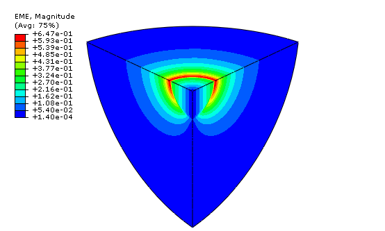

**Figure 1.8.6–4** Amplitude of the eddy current induced in the conductor.

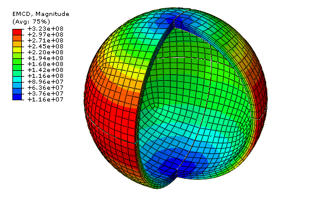

