# 1.9.1 Partially saturated flow in a porous medium

**Product: **Abaqus/Standard  

This example illustrates the Abaqus capability to solve problems involving partially saturated flow in porous media. Abaqus is capable of solving the stress equilibrium/fluid flow coupled problem (see ["Demand wettability of a porous medium: coupled analysis," Section 1.9.2](ch01s09ach72.md)), but in this example we are primarily concerned with the fluid flow part of the problem. For two-dimensional models this uncoupled fluid flow case is obtained by constraining all the displacement degrees of freedom in the problem. In three-dimensional models we allow the model to expand in the global 3-direction.

We consider a “constrained demand wettability” test. The demand wettability test is a common way of measuring the absorption properties of porous materials. In such a test fluid is made available to the material at a certain location, and the material is allowed to absorb as much fluid as it can. In this example we consider a square specimen of material and allow it to absorb fluid at its center. We investigate two cases: one in which the material contains a large number of gel particles that entrap fluid and, as a result, enhance the fluid retention capability of the material; and the other in which the material does not contain gel. We also study the cyclic wetting behavior in the case of the sample containing gel particles.

### Problem description

The square specimen is 101.6 mm on a side, and its thickness is 20 mm. 

[Figure 1.9.1--1](ch01s09ach71.md#sxmpartsatflow-model) shows one-quarter of the problem, modeled with a uniform 10  10 mesh of CPE8RP plane strain elements. The problem is also solved with a 5  5 mesh, a 15  15 mesh, and meshes using CPE4P, CPE4RP, and CPE6MP elements without significant changes in the results. When second-order elements are used where partially saturated flow is of concern, the use of reduced-integration elements is recommended since the fully integrated elements may lead to spurious oscillations during the initial stages of the transient.

Three-dimensional analyses are also performed using C3D4P, C3D6P, and C3D8P elements. 

### Material

The permeability of the fully saturated material is 3.7  104 m/sec. The partially saturated permeability is the default model, which assumes that the permeability varies as a cubic function of saturation. The specific weight of the material is 105 N/m3. The initial void ratio is 5.0 throughout the sample. The capillary action in the porous medium is defined by the absorption/exsorption curves shown in [Figure 1.9.1--2](ch01s09ach71.md#sxmpartsatflow-curves). These curves give the (negative) pore pressure versus saturation relationship for absorption and exsorption behavior. The transition between absorption and exsorption and vice-versa takes place along a scanning slope that is set by default to 1.05 times the largest slope of any branch in the absorption/exsorption curves. The initial conditions for pore pressure and saturation are assumed to be those at the beginning of the absorption curve, so the initial saturation is 0.05 and the initial pore pressure is 10 kPa.

The gel particles have a radius of 0.5 mm when completely dry and are capable of swelling to a maximum radius of 1.5 mm when fully exposed to fluid. There are 1.0  108 gel particles in each cubic meter of the porous material. The relaxation time constant for swelling of the gel particles is 500 sec. A dummy elastic modulus of 104 N/m2 is prescribed to complete the material definition.

### Loading and controls

The “loading” consists of prescribing a zero pore pressure (corresponding to full saturation) at the center of the sample, node 1 in [Figure 1.9.1--1](ch01s09ach71.md#sxmpartsatflow-model). This is based on the assumption that, in the demand wettability test, the sample has available to it as much fluid as necessary to cause saturation at that point. This boundary condition is held fixed for 600 seconds to model the fluid acquisition process. Then a draining period of 600 seconds is modeled by prescribing a pore pressure of 10 kPa at node 1; this corresponds to a saturation of 10%, which is the least saturation the sample can achieve after it has been wetted (see [Figure 1.9.1--2](ch01s09ach71.md#sxmpartsatflow-curves)). The draining procedure we use is not physically realistic, since the free fluid saturation cannot drop to 10% instantaneously as we assume. Nevertheless, it serves to illustrate the behavior of the model. Finally, we model the rewetting process over a time period of 800 seconds in the third step of analysis by once again prescribing zero pressure at the center of the sample.

The analysis is performed with a transient soils consolidation procedure (["Coupled pore fluid diffusion and stress analysis," Section 6.8.1 of the Abaqus Analysis User's Guide](../usb/usb-link.md#usb-anl-acoupdiffstress)) using automatic time incrementation. The pore pressure tolerance that controls the automatic incrementation is set to a large value since we expect the nonlinearity of the material to restrict the size of the time increments during the transient stages of the analysis and we do not wish to impose any further control on the accuracy of the time integration. The volume flux tolerance that controls the accuracy of the solution of the flow continuity equations is set to 1.0  108 m3 sec (["Convergence criteria for nonlinear problems," Section 7.2.3 of the Abaqus Analysis User's Guide](../usb/usb-link.md#usb-anl-aconvergcriteria)). This is less than 1% of the flux that occurs during the initial wetting stage of the problem. The problem can also be run with the default tolerance. The results obtained are unchanged. However, in this problem the default tolerances calculated by Abaqus are extremely tight, resulting in additional iterations without benefit to the solution. For this reason we define a less stringent tolerance.

An important issue in these transient, partially saturated flow problems is the choice of initial time step. As in any transient problem the spatial element size and the time step are related, to the extent that time steps smaller than a certain size give no useful information. This coupling of the spatial and temporal approximations is always most obvious at the start of diffusion problems, immediately after prescribed changes in the boundary values. As discussed in ["Coupled pore fluid diffusion and stress analysis," Section 6.8.1 of the Abaqus Analysis User's Guide](../usb/usb-link.md#usb-anl-acoupdiffstress), the criterion is

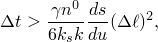

where  is the specific weight of the wetting liquid,  is the initial porosity of the material, *k* is the fully saturated permeability of the material,  is the permeability-saturation relationship, 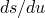 is the rate of change of saturation with respect to pore pressure as defined in the absorption/exsorption material behavior (["Sorption," Section 26.6.4 of the Abaqus Analysis User's Guide](../usb/usb-link.md#usb-mat-csorption)), and  is a typical element dimension. For our model we have 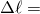 5.08 mm (the size of an element side), 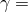 1.0  104 N/m3,  3.7  104 m/sec, , and 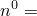 5/6. Near node 1, where we apply the boundary condition, we will approach full saturation conditions early in the transient. If we choose a saturation of 0.9 and the corresponding  in the absorption curve, we can calculate a  of about 0.1 sec. We choose to start the analysis with a time increment of 1 sec.

If time increments smaller than the critical value are used, spurious oscillations may appear in the solution (except when reduced-integration, linear, or modified triangular elements are used, in which case Abaqus uses a special integration scheme for the wetting liquid storage term to avoid this problem). If the problem requires analysis with smaller time increments than the critical value, a finer mesh is required. Generally there is no upper limit on the time step, except accuracy, since the integration procedure is unconditionally stable.

### Results and discussion

Since the volume occupied by the sample is fixed (all displacements have been constrained) we must expect the volume of fluid absorbed to be the same in the cases of the sample with and without gel particles; the difference will be in the proportions of the volume of the sample that will be occupied by free fluid and fluid trapped in the gel particles. [Figure 1.9.1--3](ch01s09ach71.md#sxmpartsatflow-porepress) shows the time history of the pore pressures at six nodes along the diagonal of the sample during the first wetting stage of the problem; these histories are identical for the two samples. [Figure 1.9.1--4](ch01s09ach71.md#sxmpartsatflow-volume) shows the history of the volume of fluid absorbed by the samples at node 1. In [Figure 1.9.1--5](ch01s09ach71.md#sxmpartsatflow-satura) we show the histories of free fluid saturation at the six integration points closest to the six nodes for which the pore pressure histories are plotted; again these histories are identical for the two samples. The void ratio for the sample without gel remains constant at 5 throughout the test, whereas in the sample with gel it decreases to values below 1, as shown in the time histories of [Figure 1.9.1--6](ch01s09ach71.md#sxmpartsatflow-voids): as the gel particles grow in a confined volume, the void space available for free fluid flow has to decrease. The growth of the gel particles in the case of the sample with gel is shown in [Figure 1.9.1--7](ch01s09ach71.md#sxmpartsatflow-gelvol), where we plot the time histories of the ratio of the volume of gel to the total volume. The proportion of the total volume occupied by the different phases of the porous medium at the beginning and at the end of the wetting stage is shown in [Figure 1.9.1--8](ch01s09ach71.md#sxmpartsatflow-nogel-phases) and [Figure 1.9.1--9](ch01s09ach71.md#sxmpartsatflow-gel-phases) for the case of the samples with and without gel.

The cyclic wetting behavior of the sample containing gel particles is given in [Figure 1.9.1--10](ch01s09ach71.md#sxmpartsatflow-porepress-cyc) to [Figure 1.9.1--14](ch01s09ach71.md#sxmpartsatflow-voids-cyc), where we show histories of pore pressure, volume of fluid absorbed, free fluid saturation, gel volume ratio, and void ratio. The trends observed are as expected, with pore pressure and saturation increasing and decreasing as the volume of fluid in the sample increases and decreases. In addition, once the sample with gel has been wetted, it can never dry out to the original state because some fluid remains trapped in the gel particles. During the draining stage the gel particles stop growing when the saturation of the surrounding free fluid falls below the value required to keep the gel growing. At the same time the void ratio also has to remain constant ([Figure 1.9.1--14](ch01s09ach71.md#sxmpartsatflow-voids-cyc)). Finally, in the rewetting stage, full saturation is achieved more quickly than in the first wetting stage since the sample starts off with a higher saturation and has less capacity to absorb fluid.

### Input files

[partsatflow_cpe8rp.inp](../eif/partsatflow_cpe8rp.inp)

Cyclic demand wettability test in the case of the sample containing gel particles, element type CPE8RP.

[partsatflow_cpe4h.inp](../eif/partsatflow_cpe4h.inp)

Element type CPE4P.

[partsatflow_cpe4rp.inp](../eif/partsatflow_cpe4rp.inp)

Element type CPE4RP.

[partsatflow_cpe6mp.inp](../eif/partsatflow_cpe6mp.inp)

Element type CPE6MP.

[partsatflow_c3d4p.inp](../eif/partsatflow_c3d4p.inp)

Element type C3D4P.

[partsatflow_c3d6p.inp](../eif/partsatflow_c3d6p.inp)

Element type C3D6P.

[partsatflow_c3d8p.inp](../eif/partsatflow_c3d8p.inp)

Element type C3D8P.

[partsatflow_postoutput.inp](../eif/partsatflow_postoutput.inp)

Postprocessing analysis.

To run the first test in the case of a sample without gel, the [*GEL](../key/key-link.md#usb-kws-mgel) material option needs to be removed.

### Figures

**Figure 1.9.1–1** Finite element model for constrained demand wettability example.

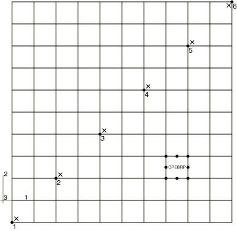

**Figure 1.9.1–2** Absorption/exsorption curves for the porous material.

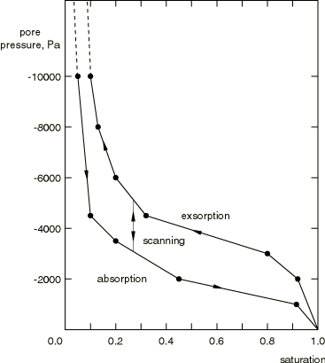

**Figure 1.9.1–3** Pore pressure histories for both samples (with and without gel).

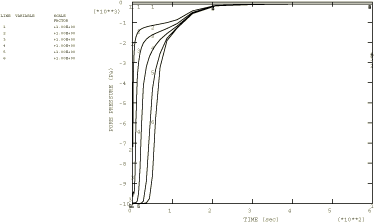

**Figure 1.9.1–4** History of fluid volume absorbed at node 1 for both samples (with and without gel).

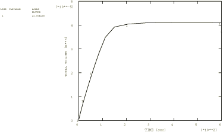

**Figure 1.9.1–5** Saturation histories for both samples (with and without gel).

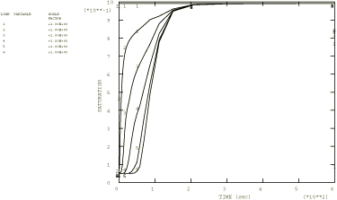

**Figure 1.9.1–6** Void ratio histories for sample with gel.

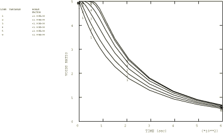

**Figure 1.9.1–7** Gel volume ratio histories for sample with gel.

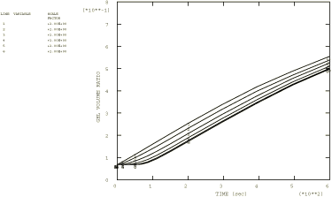

**Figure 1.9.1–8** Volume of different phases of porous medium—sample without gel.

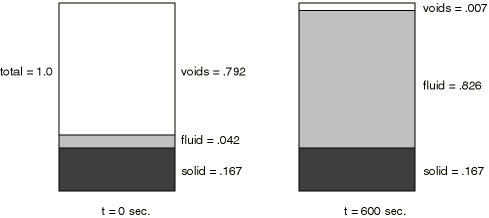

**Figure 1.9.1–9** Volume of different phases of porous medium—sample with gel.

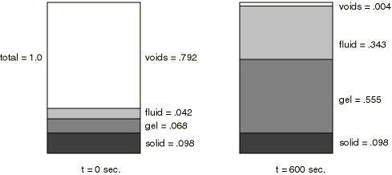

**Figure 1.9.1–10** Pore pressure histories for cyclic demand wettability test.

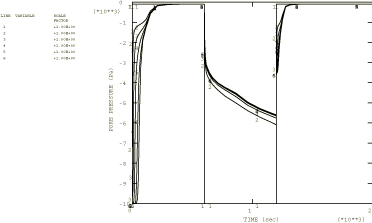

**Figure 1.9.1–11** History of fluid volume absorbed at node 1 for cyclic demand wettability test.

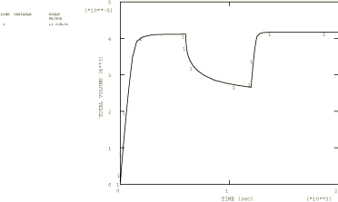

**Figure 1.9.1–12** Saturation histories for cyclic demand wettability test.

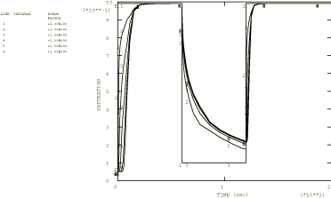

**Figure 1.9.1–13** Gel volume ratio histories for cyclic demand wettability test.

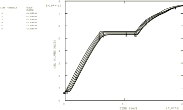

**Figure 1.9.1–14** Void ratio histories for cyclic demand wettability test.

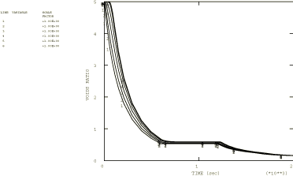

