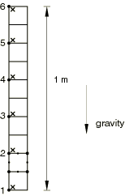
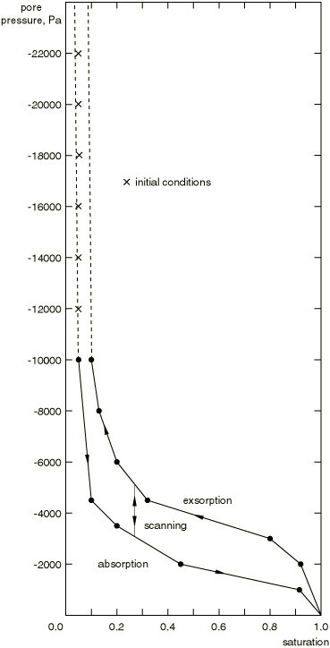
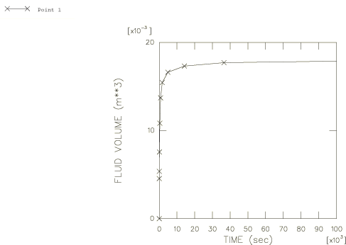
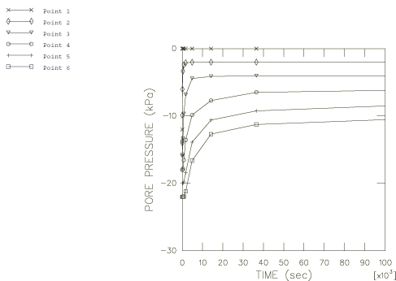
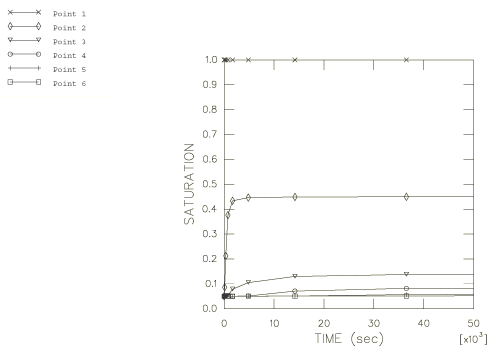
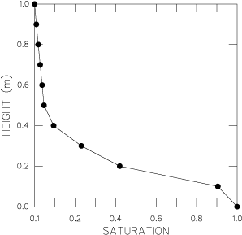

# 1.9.3 Wicking in a partially saturated porous medium

**Product: **Abaqus/Standard  

This example illustrates the Abaqus capability to solve fluid flow problems in partially saturated porous media where the effects of gravity are important.

We consider a one-dimensional “wicking” test where the absorption of fluid takes place against the gravity load caused by the weight of the fluid. In such a test fluid is made available to the material at the bottom of a column, and the material absorbs as much fluid as the weight of the rising fluid permits. In this example we consider a column of material, kinematically constrained in the horizontal direction so that all deformation will be in the vertical direction; in this sense the problem is one-dimensional. We investigate two cases: one in which the column is not allowed to deform (uncoupled flow problem), and the other in which we consider the deformation of the material (coupled problem).

### Problem description

The column of material is 1.0 m high and 0.1 m wide. We model the problem with 10 CPE8RP plane strain elements. In addition, input files containing element types CPE4P, CAX4P, C3D4P, C3D6P, C3D8RP, and C3D8PH are included for verification purposes. The mesh is shown in [Figure 1.9.3--1](ch01s09ach73.md#sxmwicking-model). We constrain all horizontal displacements. In the deforming column problem we constrain the vertical displacements at the bottom of the column, while in the rigid column problem we constrain all the vertical displacements.

### Material

The permeability of the fully saturated material is 3.7  104 m/sec. The default model is used for the partially saturated permeability. This assumes that the permeability varies as a cubic function of saturation. The specific weight of the fluid is 104 N/m3. The capillary action in the porous medium is defined by the absorption/exsorption curves shown in [Figure 1.9.3--2](ch01s09ach73.md#sxmwicking-curves). These curves give the (negative) pore pressure versus saturation relationship for absorption and exsorption behavior. The transition between absorption and exsorption and vice-versa takes place along a scanning slope which in this example is set by default to 1.05 times the largest slope of any branch in the absorption/exsorption curves. The fluid is assumed to be water, with a bulk modulus of 2 GPa. For the mechanical properties we assume the material is elastic with Young's modulus 50000 Pa and Poisson's ratio 0.0. The dry mass density of the material is 100 kg/m3.

The initial condition for saturation is 5% throughout the column. The initial conditions for pore pressure must have a gradient that is equal to the specific weight of the fluid so that, according to Darcy's law, there is no initial flow. For this purpose we assume the initial pore pressures vary linearly from 12000 Pa at the bottom of the column to 22000 Pa at the top of the column. These initial conditions satisfy the pore pressure/saturation relationship in that they are between the absorption and exsorption curves, as shown in [Figure 1.9.3--2](ch01s09ach73.md#sxmwicking-curves). The initial void ratio is 5.0 throughout the column. In the deforming column case the initial conditions for effective stress are calculated from the density of the dry material and fluid, the initial saturation and void ratio, and the initial pore pressures using equilibrium considerations and the effective stress principle. The procedure used is detailed in ["Geostatic stress state," Section 6.8.2 of the Abaqus Analysis User's Guide](../usb/usb-link.md#usb-anl-ageostatstress). It is important to specify the correct initial conditions for this type of problem; otherwise, the system may be so far out of equilibrium initially that it may fail to start because converged solutions cannot be found.

### Loading and controls

The weight is applied by gravity loading. In the case of the deforming column, an initial geostatic step is performed to establish the initial equilibrium state. The initial conditions in the column exactly balance the weight of the fluid and dry material so that no deformation or fluid flow takes place. Then the bottom of the column is exposed to fluid by prescribing zero pore pressure (corresponding to full saturation) at those nodes during a transient soils consolidation step. The fluid will seep up the column until the pore pressure gradient is equal to the weight of the fluid, at which time equilibrium is established.

The transient analysis is performed using automatic time incrementation. The pore pressure tolerance that controls the automatic incrementation is set to a large value since we expect the nonlinearity of the material to restrict the size of the time increments during the transient stages of the analysis and we do not wish to impose any further control on the accuracy of the time integration. The check on displacement and pore pressure changes is relaxed using solution controls. The analysis can also be done with the default tolerances, but Abaqus iterates a lot more without any gain in solution accuracy.

The choice of initial time increment in these transient partially saturated flow problems is important to avoid spurious solution oscillations for some element types (see["Partially saturated flow in a porous medium," Section 1.9.1](ch01s09ach71.md)). As discussed in ["Coupled pore fluid diffusion and stress analysis," Section 6.8.1 of the Abaqus Analysis User's Guide](../usb/usb-link.md#usb-anl-acoupdiffstress), the criterion for a minimum usable time increment in partial-saturation conditions is

where  is the specific weight of the wetting liquid,  is the initial porosity of the material, *k* is the fully saturated permeability of the material,  is the permeability-saturation relationship,  is the rate of change of saturation with respect to pore pressure as defined in the absorption/exsorption material behavior (["Sorption," Section 26.6.4 of the Abaqus Analysis User's Guide](../usb/usb-link.md#usb-mat-csorption)), and  is a typical element dimension. For our model we have  0.1 m (the size of an element side),  1.0  104 N/m3,  3.7  104 m/sec, , and  5/6. Adjacent to where we apply the fully saturated boundary condition, elements will span a region from initial to full saturation early in the transient. A conservative estimate of the minimum time increment is found by choosing the initial saturation of 0.05. From this, we compute , , and a value of  of about 2700 sec. We find, in practice, that an initial increment of 1000 sec is adequate to avoid oscillations in this problem. For the remaining input files the initial time increment is chosen as 1 second.

In this analysis the prevailing pore pressure in the medium approaches the magnitude of the stiffness of the material skeleton elastic modulus. When reduced-integration elements are used in such cases, the default choice for the hourglass stiffness control, which is based on a scaling of skeleton-material constitutive parameters, may not be adequate to control hourglassing in the presence of the relatively large pore pressure fields. An appropriate hourglass control setting in these cases should scale with the expected magnitude of pore pressure changes over an element and must be defined explicitly by the user.

### Results and discussion

The results for the rigid (uncoupled problem) and deforming (coupled problem) column cases are similar since the deformation of the column is small. The time history of the volume of fluid absorbed by the column is shown in [Figure 1.9.3--3](ch01s09ach73.md#sxmwicking-volume). The pore pressures at the two bottom nodes are tied with an equation constraint so that the total volume of fluid absorbed by the column is given directly in the output by the reaction (RVT) to the pore pressure at node 1. [Figure 1.9.3--4](ch01s09ach73.md#sxmwicking-porepress) shows the time history of the pore pressures at six nodes along the height of the column of material. In [Figure 1.9.3--5](ch01s09ach73.md#sxmwicking-satura) we show time histories of fluid saturation at the six integration points closest to the six nodes for which the pore pressure histories are plotted. At steady state the pore pressure gradient must equal the weight of the fluid so that pore pressure varies linearly with height and saturation, therefore, varies in the same way (according to the absorption behavior) with respect to pressure or height. Thus, points close to the bottom of the column are fully saturated, while those at the top are still at 5% saturation. This is illustrated in [Figure 1.9.3--6](ch01s09ach73.md#sxmwicking-ssprofile), which is exactly the absorption curve of [Figure 1.9.3--2](ch01s09ach73.md#sxmwicking-curves).

### Input files

[wicking_cpe8rp_deform.inp](../eif/wicking_cpe8rp_deform.inp)

Case of the deforming column (element type CPE8RP).

[wicking_cpe8rp_rigid.inp](../eif/wicking_cpe8rp_rigid.inp)

Case of the rigid column (element type CPE8RP). Initial pore pressure specified with user subroutine [`UPOREP`](../sub/sub-link.md#sub-xsl-uporep).

[wicking_cpe8rp_rigid.f](../eif/wicking_cpe8rp_rigid.f)

User subroutine [`UPOREP`](../sub/sub-link.md#sub-xsl-uporep) used in wicking_cpe8rp_rigid.inp.

[wicking_cpe4p_deform.inp](../eif/wicking_cpe4p_deform.inp)

Element type CPE4P (deforming column).

[wicking_cax4p_deform.inp](../eif/wicking_cax4p_deform.inp)

Element type CAX4P (deforming column).

[wicking_c3d4p_deform.inp](../eif/wicking_c3d4p_deform.inp)

Element type C3D4P (deforming column).

[wicking_c3d6p_deform.inp](../eif/wicking_c3d6p_deform.inp)

Element type C3D6P (deforming column).

[wicking_c3d8ph_deform.inp](../eif/wicking_c3d8ph_deform.inp)

Element type C3D8PH (deforming column).

[wicking_c3d8rp_rigid.inp](../eif/wicking_c3d8rp_rigid.inp)

Element type C3D8RP (rigid column).

[wicking_c3d8rp_rigid.f](../eif/wicking_c3d8rp_rigid.f)

User subroutine [`UPOREP`](../sub/sub-link.md#sub-xsl-uporep) used in wicking_c3d8rp_rigid.inp.

### Figures

**Figure 1.9.3–1** Finite element model for wicking example.

**Figure 1.9.3–2** Absorption/exsorption curves and initial conditions.

**Figure 1.9.3–3** History of fluid volume absorbed at bottom of column.

**Figure 1.9.3–4** Pore pressure histories.

**Figure 1.9.3–5** Saturation histories.

**Figure 1.9.3–6** Saturation profile at steady-state conditions.

