# 1.10.1 Thermo-mechanical diffusion of hydrogen in a bending beam

**Product: **Abaqus/Standard  

This two-dimensional problem provides a simple demonstration and verification of the sequentially coupled, thermo-mechanical mass diffusion capability in Abaqus. The mass diffusion formulation used in Abaqus is described in ["Mass diffusion analysis," Section 6.9.1 of the Abaqus Analysis User's Guide](../usb/usb-link.md#usb-anl-amassdiffusion), and ["Mass diffusion analysis," Section 2.13.1 of the Abaqus Theory Guide](../stm/stm-link.md#stm-anl-massdiffusion).

The physical problem considered here is that of a cantilever beam subjected to thermal and mechanical loading with simple hydrogen concentration boundary conditions. Diffusion is driven by the gradients of temperature and equivalent pressure stress. In this example we are concerned with the hydrogen diffusion aspect of the problem; fictitious diffusion properties are chosen.

### Problem description

The problem geometry and boundary conditions are shown in [Figure 1.10.1--1](ch01s10ach75.md#sxmh2odiffbeam-geom), and the finite element mesh is shown in [Figure 1.10.1--2](ch01s10ach75.md#sxmh2odiffbeam-model). The specimen is 1-mm thick, 10-mm high, and 100-mm long. The hydrogen concentration is specified at both ends of the beam at the neutral axis, and flux through all other surfaces is assumed to be zero.

The sequentially coupled mass diffusion analysis consists of a coupled temperature-displacement analysis followed by a mass diffusion analysis. Equivalent pressure stresses from the temperature-displacement analysis are written to the results file as nodal averaged values. Temperatures from the temperature-displacement analysis are stored on the results file as nodal values. Subsequently, these pressure stress and temperature fields are read in during the course of the mass diffusion analysis to provide driving mechanisms for mass diffusion.

The material properties for mass diffusion were selected to verify the sequentially coupled mass diffusion procedure and are not intended to model true properties of the material. Solubility, *s*, is defined as unity so that concentration, *c*, and normalized concentration, , are equivalent. This assumption is acceptable since no material interfaces are present. Diffusivity, *D*, is specified as 3.6  106m2/h; temperature dependence of the diffusivity is not accounted for in this example. Stress-assisted diffusion is specified by defining the pressure stress factor, , as 

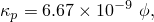

where  is the normalized concentration. The Soret effect factor, , which allows temperature-driven mass diffusion, is defined as

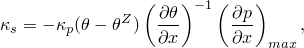

where (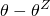) is the absolute temperature, 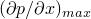 is the maximum gradient of equivalent pressure stress applied to the beam, and 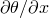 is the maximum temperature gradient applied to the beam. This definition of , although not realistic, allows the mass diffusion behavior to be verified easily when both equivalent pressure stress and temperature are read from the results file: when the gradients of both temperature and equivalent pressure stress are applied simultaneously, these properties indicate that mass diffusion should be driven by concentration gradients alone. The concentration dependence of  and  is entered in Abaqus in tabulated form, as shown in the input listings.

The following properties are also used in the coupled temperature-displacement analysis: elastic modulus, 2.0  1011Nm2; Poisson's ratio, 0.3; and conductivity, 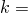1.0  103W m1K1.

The specimen is initially at a constant temperature of 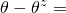273 K, and an initial concentration of 50 ppm is applied over the entire beam. In the first step the concentration at the free end of the beam is ramped to 100 ppm over the step and the steady-state distribution is determined. During the second step a bending moment is applied at the end of the beam to achieve a maximum tensile stress of 7.5 MPa, corresponding to a maximum equivalent pressure stress gradient of 650 MPa/m. The bending moment is applied as a ramp over 10% of the mass diffusion step and maintained until steady-state mass diffusion conditions are reached. In the third step the temperature field is applied to the mass diffusion analysis. A temperature gradient of 3.0  104 K/m is applied as a ramp over 10% of the mass diffusion step and maintained until steady-state mass diffusion conditions are reached.

### Results and discussion

During the first step the steady-state analytical distribution of normalized concentration along the length of the beam can be obtained by direct integration of the governing equations:

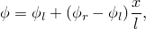

where 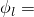50 ppm is the concentration at the left end of the beam (0) and 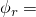100 ppm is the concentration at the right end of the beam (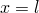).

Based on the definition of  used in this problem, the analytical solution for stress-assisted diffusion takes a form similar to that given by Liu (1970): 

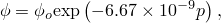

where  is the normalized concentration obtained in the unstressed state and *p* is the equivalent pressure stress in the cantilever beam. For a beam in bending 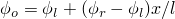 represents the concentration on the neutral axis. [Figure 1.10.1--3](ch01s10ach75.md#sxmh2odiffbeam-press) and [Figure 1.10.1--4](ch01s10ach75.md#sxmh2odiffbeam-ssconc) show the final distribution of equivalent pressure stress and concentration predicted by the Abaqus analysis at *x*=7.5 cm (=87.5 ppm). The finite element results show good agreement with the analytical solutions.

The Soret effect factor, , was selected to allow the applied temperature gradient to counteract the driving force imposed by the applied pressure gradient. When the concentrations reach steady state in Step 3, the solution has returned to the linear distribution obtained in Step 1. This confirms that the temperature and equivalent pressure stress fields are applied properly when read from the results file.

### Input files

[thermomechdiffusion_tempdisp.inp](../eif/thermomechdiffusion_tempdisp.inp)

Coupled temperature-displacement analysis that generates the temperature and equivalent pressure stress fields for the mass diffusion analysis shown in thermomechdiffusion_massdiff.inp.

[thermomechdiffusion_massdiff.inp](../eif/thermomechdiffusion_massdiff.inp)

Mass diffusion analysis using temperature and equivalent pressure stress fields read from the results file of thermomechdiffusion_tempdisp.inp.

### Reference

Liu,  H. W., “Stress-Corrosion Cracking and the Interaction Between Crack-Tip Stress Field and Solute Atoms,” Transactions of the ASME: Journal of Basic Engineering, vol. 92, pp. 633–638, 1970.

### Figures

**Figure 1.10.1–1** Cantilever beam geometry and boundary conditions.

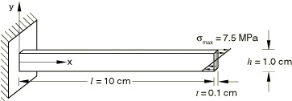

**Figure 1.10.1–2** Finite element model of cantilever beam.

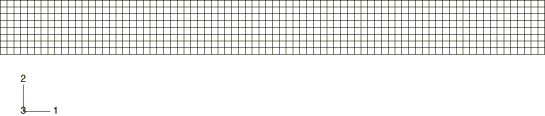

**Figure 1.10.1–3** Equivalent pressure stress at the end of Step 2 (*x*=7.5 cm).

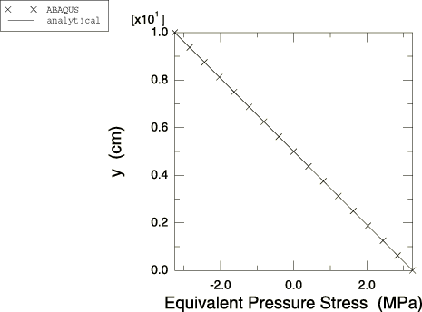

**Figure 1.10.1–4** Steady-state concentration at the end of Step 2 (*x*=7.5 cm).

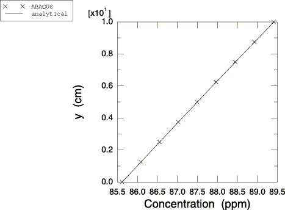

