# 1.11.1 A simple coupled acoustic-structural analysis

**Product: **Abaqus/Standard  

This problem is an elementary case of coupled acoustic-structural vibration. It is included because a closed form solution is easily calculated, thus providing verification of the various options for this type of analysis. The basis of the coupled acoustic-structural vibration capability in Abaqus is described in ["Coupled acoustic-structural medium analysis," Section 2.9.1 of the Abaqus Theory Guide](../stm/stm-link.md#stm-anl-acouststruct).

### Problem description

The model is shown in [Figure 1.11.1--1](ch01s11ach76.md#sxmacouststruct-model). No particular set of units is used in this case: all units used are assumed to be consistent. A point mass, *m*, of magnitude 4 is attached to a linear spring whose stiffness, *k*, is 1 and a dashpot that has a damping coefficient, *c*, of 0.08. The other ends of the spring and dashpot are fixed. The point mass is exposed to a one-dimensional acoustic medium of unit cross-sectional area and of length 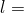 5, in which the acoustic pressure is assumed to vary linearly with respect to position. We model the acoustic medium with one element of type AC1D2, which has a “lumped mass.” The analytical solution is obtained on this basis. The far end of the acoustic medium is constrained to have zero acoustic pressure. The acoustic fluid has a density, , of 0.4008 and a bulk modulus, , of 10. It flows in a medium that offers volumetric drag, , of 0.04. The end of the acoustic medium adjacent to the structure also has an impedance boundary condition, for which 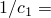 0.01 and  0.25. These values are chosen so that the natural frequency of the undamped mass-spring system vibrating alone is 

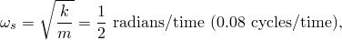

and the natural frequency of the acoustic medium with the impedance boundary condition, modeled with a single one-dimensional acoustic element (AC1D2), is 

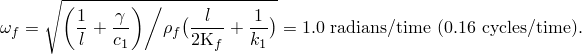

The natural frequency of the mass-spring system is confirmed by using the eigenfrequency extraction procedure in Abaqus. Since impedance boundary conditions and volumetric drag are not considered in a frequency analysis, the natural frequency of the acoustic medium cannot be confirmed. The natural frequency calculated by Abaqus for the acoustic medium alone is 0.22 cycles/time.

The damping coefficient of the dashpot is chosen to be 2% of critical damping of the mass-spring-dashpot system vibrating alone. The volumetric drag coefficient in the acoustic medium, together with the coefficient 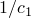 of the impedance boundary condition, provides just under 6% of critical damping for the one degree of freedom “lumped mass” model of the acoustic fluid, vibrating alone.

The equilibrium equations of this coupled system, excited by a force *P* applied to the point mass, can be written in terms of the displacement, *u*, of the point mass and the acoustic pressure, *p*, acting on the mass as 

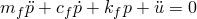

and 

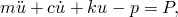

where for the steady-state solution we have defined 

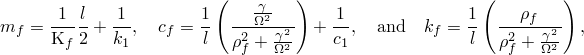

and for the frequency analysis, 

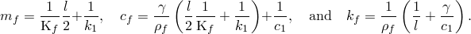

These parameters—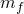, , and —are the (2, 2) entries in the AC1D2 mass, damping, and stiffness matrices, respectively. These are the only significant entries in these matrices, since the pressure at the first node is constrained to be zero.

### Steady-state vibration

Steady-state vibration is caused by a harmonic loading: 

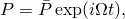

where  (radians/second) is 2 times the frequency (cycles/second) of excitation. The response is also harmonic and is defined from the equilibrium equations above as 

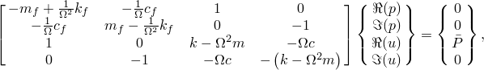

where 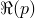 is the real part of the pressure amplitude, 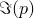 is the imaginary part of the pressure amplitude, and 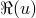 and 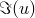 are the real and imaginary components of the displacement amplitude.

We first study the system by uncoupling the fluid from the structural elements and excite the fluid harmonically by specifying an inward volume acceleration with an amplitude, 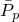, of 1: 

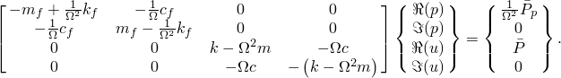

### Results and discussion

The uncoupled system response is obtained by conducting a frequency sweep using the direct-solution and subspace-based steady-state dynamic procedures. Since the undamped individual systems resonate at about 0.08 and 0.16 cycles/time, we request a frequency sweep over the range 0.01 to 0.3 cycles/time, using a linear frequency scale with solution points at intervals of 0.01 cycles/time throughout this range. [Figure 1.11.1--2](ch01s11ach76.md#sxmacouststruct-uncoupled) shows the amplification of the pressure *p* and the displacement *u* throughout this frequency range. As would be expected, the displacement shows significantly higher amplification around resonance because that system has less damping.

The fully coupled system is investigated with the same frequency sweep. Three steady-state dynamic analyses are performed: one with the subspace-based method based on the coupled acoustic-structural modes, one with the direct-solution method, and a final step with the subspace-based method but based on the uncoupled modes. The system is excited by the mechanical loading, *P*, only. The response of the fully coupled system is shown in [Figure 1.11.1--3](ch01s11ach76.md#sxmacouststruct-coupled). The resonances are now separated compared to the uncoupled systems: the lower resonance occurs at about 0.06 cycles/time (compared to the natural frequency of 0.08 cycles/time for the uncoupled structural system), while the higher resonance is at 0.2 cycles/time (compared to the natural frequency of 0.16 cycles/time for the uncoupled acoustic element). The results of all three steady-state dynamic procedures are coincident.

The system is also studied without volumetric drag in the fluid (by choosing  0). The response is shown in [Figure 1.11.1--4](ch01s11ach76.md#sxmacouststruct-nodrag). The lower resonance has about the same peak amplitude as the system with drag, but the higher resonance now has a peak amplitude about three times that of the system with fluid drag. The displacement amplification is almost zero at the frequency corresponding to the resonance of the uncoupled fluid system (0.16 cycles/time). From the equations given above it is clear that, at this frequency, with  0 the displacement amplitude is 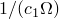 times the pressure amplitude. Since  is fairly low ( 0.01), the displacement has a very small value at this frequency.

### Input files

[acousticstructvibration.inp](../eif/acousticstructvibration.inp)

Fully coupled case.

[acousticstructvibration_uncoup.inp](../eif/acousticstructvibration_uncoup.inp)

Uncoupled case.

[acousticstructvibration_nodrag.inp](../eif/acousticstructvibration_nodrag.inp)

Fully coupled case with no volumetric drag (0).

[acousticstructvibration_depend.inp](../eif/acousticstructvibration_depend.inp)

Uncoupled case with temperature and field variable dependence of the density and the acoustic medium properties, as well as frequency dependence of the spring and dashpot properties.

### Figures

**Figure 1.11.1–1** Coupled acoustic-structural vibration model.

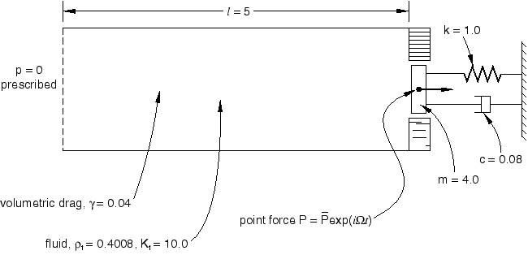

**Figure 1.11.1–2** Steady-state response of the uncoupled acoustic-structural system.

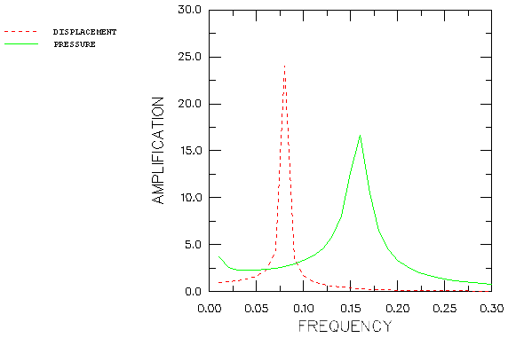

**Figure 1.11.1–3** Steady-state response of the coupled acoustic-structural system.

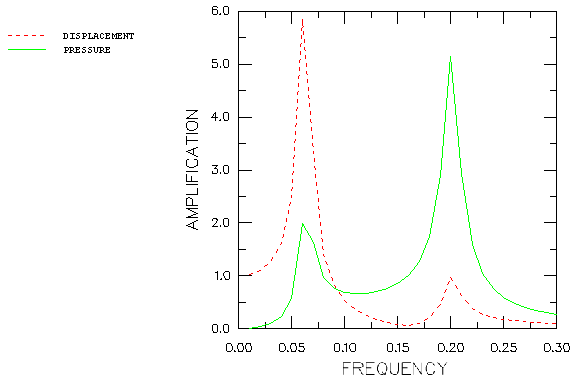

**Figure 1.11.1–4** Steady-state response of the coupled acoustic-structural system without volumetric drag.

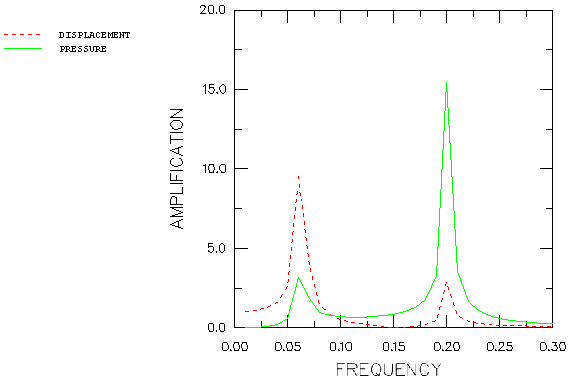

