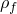
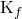
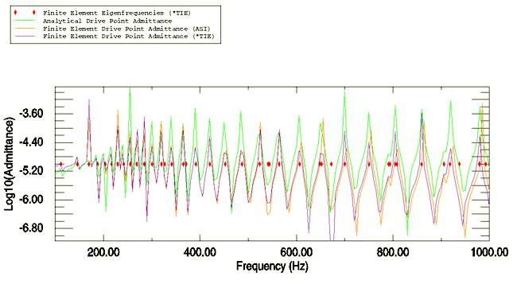
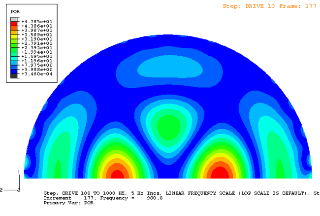

# 1.11.2 Analysis of a point-loaded, fluid-filled, spherical shell

**Product: **Abaqus/Standard  

This problem involves the steady-state vibration of a point-loaded spherical shell coupled to an acoustic fluid that fills its interior. It is modeled using axisymmetric shell and acoustic elements. The closed form solution of Stepanishen and Cox (2000) is used for validation of the analysis. The basis of the coupled acoustic-structural vibration capability in Abaqus is described in ["Coupled acoustic-structural medium analysis," Section 2.9.1 of the Abaqus Theory Guide](../stm/stm-link.md#stm-anl-acouststruct), and ["Acoustic, shock, and coupled acoustic-structural analysis," Section 6.10.1 of the Abaqus Analysis User's Guide](../usb/usb-link.md#usb-anl-aacoustic).

### Problem description

The model is a semicircular shell and fluid mesh of radius 2.286 m. A point load on the symmetry axis of magnitude 1.0 N is applied to the shell. The shells are 0.0254 m in thickness and have a Young's modulus of 206.8 GPa, a Poisson's ratio of 0.3, and a mass density of 7800.0 kg/m3. The acoustic fluid has a density, , of 1000 kg/m3 and a bulk modulus, , of 2.25 GPa. The response of the coupled system is calculated for frequencies ranging from 100 to 1000 Hz in 5 Hz increments. There are two different finite element meshes used: one with explicitly defined acoustic-structural interaction elements and one that uses a tie constraint. The former model consists of 220 SAX1 elements surrounding a mesh of 15848 ACAX4 elements. Coupling is effected using 220 ASI2A elements. The latter model uses 80 SAX2 elements surrounding a mesh of 965 ACAX8 elements. For this mesh, coupling is effected using a tie constraint to generate the acoustic-structural interaction elements internally.

A dummy part is included in the models to ensure that the analytical solution appears in the output database. This part consists of a single point mass, uncoupled from the model described above, with a displacement boundary condition on degree of freedom 1. This imposed displacement uses an amplitude table consisting of the Stepanishen/Cox analytical solution for the drive point admittance.

### Results and discussion

The response is obtained by conducting a frequency sweep, using the direct-solution steady-state and the mode-based steady-state dynamic procedures. A frequency sweep over the range 100.0 to 1000.0 cycles per second, using a linear frequency scale with solution points at intervals of 5 cycles per second throughout this range, is requested.

The finite element solutions for drive point admittance, the ratio of the velocity to the applied load, are shown in [Figure 1.11.2--1](ch01s11ach77.md#sxmacousticfilledsphere-plot). This plot was created in the Visualization module of Abaqus/CAE by multiplying the steady-state displacement by the frequency and taking the logarithm (base 10) of the data. Comparison to the analytical results of Stepanishen and Cox, as shown, is quite good throughout the frequency range. The analytical data appear as the displacement of degree of freedom 1 for the dummy mass element in the output database. The results obtained in the direct-solution steady-state dynamic analysis are nearly identical to the results obtained in the mode-based steady-state dynamic analysis although only 50 eigenmodes have been retained.

The natural frequencies of the coupled fluid-filled sphere are extracted in a frequency step. These frequencies correspond well with frequencies for the peak amplitudes for acoustic pressure and drive point admittance, as seen in [Figure 1.11.2--1](ch01s11ach77.md#sxmacousticfilledsphere-plot). The frequency results in the figure correspond to the case using the tie constraint; the results for the other case are very similar.

[Figure 1.11.2--2](ch01s11ach77.md#sxmacousticfilledsphere-contour) shows a sample contour plot of acoustic pressure at 980 Hz.

### Input file

[acousticfilledsphere.inp](../eif/acousticfilledsphere.inp)

Coupled analysis using acoustic structural interaction elements.

### Reference

Stepanishen,  P., and D. L. Cox, “Structural-Acoustic Analysis of an Internally Fluid-Loaded Spherical Shell: Comparison of Analytical and Finite Element Modeling Results,” NUWC Technical Memorandum 00-118, Newport, Rhode Island, 2000.

### Figures

**Figure 1.11.2–1** Coupled acoustic-structural vibration model.

**Figure 1.11.2–2** Steady-state pressure magnitudes for the acoustic-structural system at 980 Hz.

