# 1.11.3 Acoustic radiation impedance of a sphere in breathing mode

**Products: **Abaqus/Standard  Abaqus/Explicit  

In this example we calculate the acoustic radiation from a sphere in the “breathing” mode; that is, when the motion consists of uniform radial velocity. The example illustrates the use of a simple absorbing boundary condition in conjunction with acoustic continuum and interface elements and acoustic infinite elements. The results are compared with classical results.

### Problem description

A spherical cavity of unit radius in an unbounded acoustic medium is subjected to a uniform radial velocity on its inner surface. The analytical solution for the acoustic pressure is of the form 

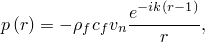

where  is the acoustic pressure,  is the fluid density,  is the speed of sound,  is the bulk modulus,  is the acoustic wave number,  is the frequency,  is the radial coordinate,  is the normal unit vector pointing into the fluid, and 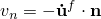 is the prescribed inward particle velocity on the spherical boundary. The ratio of the pressure to the velocity on the boundary is called the acoustic impedance (see Junger and Feit, 1972); for the zeroth (breathing) mode the impedance is given by

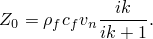

The imaginary part of the impedance is given by 

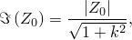

where 

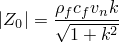

is the magnitude of the impedance.

The absorbing boundary condition used here is the first-order condition of Bayliss, Gunzberger, and Turkel (1982):

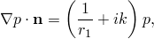

where  is the radius of the spherical truncation boundary of the finite element mesh. This boundary condition is theoretically exact for all vibration frequencies in the breathing mode. Since conservation of linear momentum requires 

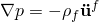

and the impedance enforces the condition

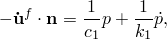

the first-order Bayliss et al. boundary condition can be enforced in the steady-state dynamic procedure by specifying impedance parameters given by

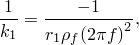

 and

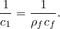

In Abaqus this spherical radiation impedance can also be defined by specifying the radius of the terminating spherical mesh boundary.

[Figure 1.11.3--1](ch01s11ach78.md#sxmsphericalimpedance0-mesh) shows the finite element mesh using a single layer of 15 ACAX8 elements, with ASI3A coupling elements on the inner surface and the impedance applied to the outer faces of the ACAX8 elements. Uniform radial velocities are applied to the inner surface transforming the spherical coordinates to a local coordinate system before specifying the magnitudes. The dimensions and acoustic properties of this problem are chosen to facilitate comparison with the analytical value of the impedance, 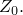 With 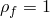 and 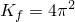, 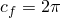, and the acoustic wave number  is equal to the analysis frequency in Hertz, 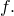 Moreover, if the imposed normal velocity 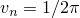, the value of the pressure variable on the inner boundary will equal the value for the impedance, . This normal velocity is imposed using a boundary condition in conjunction with a transformed coordinate system, as shown in [acousticimpsphere_acax8_bayliss.inp](../eif/acousticimpsphere_acax8_bayliss.inp). Since the degrees of freedom representing the tangential velocity components have no stiffness associated with them, they must be constrained to prevent solver problems.

 The outer boundary is placed at 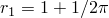 to provide a good aspect ratio for the elements; its value has no other significance for this problem. For comparison, the same mesh was reanalyzed using the default plane wave absorbing condition. This plane wave absorber is equal to the limiting value of the Bayliss et al. first-order condition as 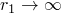 and is theoretically exact for absorption of planar wavefronts normally incident on a planar truncation boundary.

A steady-state dynamic analysis is performed in Abaqus/Standard over a range of frequencies from 0 to 20 Hz. The transient simulations are also performed in Abaqus/Explicit with an excitation frequency of 1 Hz. Different excitation frequencies can be tested by changing the parameters defined in the input files.

The steady-state analysis was also performed in Abaqus/Standard using three-dimensional and axisymmetric acoustic infinite elements. These acoustic infinite elements use infinite-direction basis functions that are based on radiating modes of a sphere (see ["Acoustic infinite elements," Section 3.3.2 of the Abaqus Theory Guide](../stm/stm-link.md#stm-elm-acousticinfinite)). Consequently, the impedance for the spherical breathing mode is modeled accurately by these elements, and the results obtained using acoustic infinite elements should closely match the results obtained using spherical radiation impedance conditions. However, for more complex wave shapes the acoustic infinite elements are expected to give more accurate results, owing to the richness of the basis functions used to model the variation of the acoustic field in the infinite direction. The infinite element mesh required to model this problem consists only of acoustic infinite elements on the spherical surface, with acoustic-structural interface elements added (with the same mesh topology) to facilitate imposition of the velocity boundary condition at the surface of the sphere. The reference point for the infinite elements is located at the center of the sphere. For this problem a single input file, [acousticimpsphere_acin.inp](../eif/acousticimpsphere_acin.inp), includes sections of the sphere modeled with each of the three-dimensional acoustic infinite elements: ACIN3D3, ACIN3D4, ACIN3D6, and ACIN3D8. Two additional input files, [acousticimpsphere_acinax2.inp](../eif/acousticimpsphere_acinax2.inp) and [acousticimpsphere_acinax3.inp](../eif/acousticimpsphere_acinax3.inp), model the problem using semicircular meshes of ACINAX2 and ACINAX3 elements, respectively.

For the transient analyses in Abaqus/Explicit the Bayliss et al. boundary condition is enforced using spherical radiation impedance conditions. On the inner radius of the mesh the shell elements in the three-dimensional case and beam elements in the axisymmetric case are connected to the acoustic domain with a tie constraint. The transient analysis is also performed in Abaqus/Explicit using three-dimensional and axisymmetric acoustic infinite elements instead of defining the impedance. Two additional input files, [acousticimpsphere_acin3d4_xpl.inp](../eif/acousticimpsphere_acin3d4_xpl.inp) and [acousticimpsphere_acinax2_xpl.inp](../eif/acousticimpsphere_acinax2_xpl.inp), model the three-dimensional and axisymmetric problems, respectively.

### Results and discussion

For the steady-state dynamic analysis the finite element results for the Bayliss et al. and plane wave absorbing boundary conditions are shown in [Table 1.11.3--1](ch01s11ach78.md#table-acousticsphere), where they are compared with the analytical values. The ratios of the finite element results to the analytical solutions for the pressure magnitude (output variable POR) and the imaginary part of pressure are presented. In the table the definition of nodes per wavelength, N, is

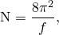

which is appropriate for quadratic elements of length 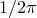. The Bayliss et al. results agree with the analytical solution, except for the highest frequencies, where errors are attributable to the small number of nodes per wavelength in the radial direction. In contrast, the numerical results for the model with the plane wave absorbing boundary condition are not as accurate. Because the absorbing boundary has been placed extremely close to the radiating surface, the assumption that wavefronts incident on the truncation boundary are planar is invalid.

A graph of the pressure magnitude (output variable POR) as a function of frequency is shown in [Figure 1.11.3--2](ch01s11ach78.md#sxmsphericalimpedance0-hist) for the Bayliss et al. boundary condition.

The results for the acoustic infinite elements also agree with the analytical solution.

The results from the Abaqus/Explicit transient tests with the impedance defined agree with those obtained by Abaqus/Standard. For the axisymmetric case, the pressure variation in time at a sample location on the outer boundary is shown in [Figure 1.11.3--3](ch01s11ach78.md#sxmsphericalimpedance0-xpl2std) (for a clear comparison the Abaqus/Standard analysis is also performed as a transient simulation). The results obtained with acoustic infinite elements agree closely with the results obtained using impedance, as shown in the figure. The figure shows that the peak pressure magnitude for the transient analyses is about .60. This value is quite close to the pressure magnitude predicted by the steady-state analysis for an excitation frequency of 1 Hz, as can be seen from [Figure 1.11.3--2](ch01s11ach78.md#sxmsphericalimpedance0-hist).

### Input files

##### **Abaqus/Standard input files**

[acousticimpsphere_acax8_bayliss.inp](../eif/acousticimpsphere_acax8_bayliss.inp)

Model that uses ACAX8 and ASI3A elements with the Bayliss et al. boundary condition.

[acousticimpsphere_acax8_auto.inp](../eif/acousticimpsphere_acax8_auto.inp)

Model that uses ACAX8 and ASI3A elements with the Bayliss et al. boundary condition, defined using spherical radiation conditions.

[acousticimpsphere_acax8_planew.inp](../eif/acousticimpsphere_acax8_planew.inp)

ACAX8 elements with the plane wave boundary condition.

[acousticimpsphere_acax6_bayliss.inp](../eif/acousticimpsphere_acax6_bayliss.inp)

Same problem as acousticimpsphere_acax8_bayliss.inp but with ACAX6 elements.

[acousticimpsphere_ac3d15.inp](../eif/acousticimpsphere_ac3d15.inp)

Version of the spherical model in three dimensions using AC3D15 elements.

[acousticimpsphere_ac3d20.inp](../eif/acousticimpsphere_ac3d20.inp)

Same problem as acousticimpsphere_ac3d15.inp but with AC3D20 elements.

[acousticimpsphere_ac3d10.inp](../eif/acousticimpsphere_ac3d10.inp)

Same problem as acousticimpsphere_ac3d20.inp but with AC3D10 elements.

[acousticimpsphere_acin.inp](../eif/acousticimpsphere_acin.inp)

Same problem as acousticimpsphere_ac3d20.inp but with spherical segments modeled with ACIN3D3, ACIN3D4, ACIN3D6, and ACIN3D8 elements.

[acousticimpsphere_acinax2.inp](../eif/acousticimpsphere_acinax2.inp)

Same problem as acousticimpsphere_acax.inp, but with spherical segments modeled with ACINAX2 elements.

[acousticimpsphere_acinax3.inp](../eif/acousticimpsphere_acinax3.inp)

Same problem as acousticimpsphere_acax.inp, but with spherical segments modeled with ACINAX3 elements.

##### **Abaqus/Explicit input files**

[acousticimpsphere_acax4r_xpl.inp](../eif/acousticimpsphere_acax4r_xpl.inp)

Model that uses ACAX4R elements with the Bayliss et al. boundary condition.

[acousticimpsphere_ac3d8r_xpl.inp](../eif/acousticimpsphere_ac3d8r_xpl.inp)

Version of the spherical model in three dimensions using AC3D8R elements.

[acousticimpsphere_acin3d4_xpl.inp](../eif/acousticimpsphere_acin3d4_xpl.inp)

Model that uses ACAX4R and ACINAX2 elements.

[acousticimpsphere_acinax2_xpl.inp](../eif/acousticimpsphere_acinax2_xpl.inp)

Version of the spherical model in three dimensions using AC3D8R and ACIN3D4 elements.

### References

Bayliss,  A., M. Gunzberger, and E. Turkel, “Boundary Conditions for the Numerical Solution of Elliptic Equations in Exterior Regions,” SIAM Journal of Applied Mathematics, vol. 42, no.2, pp. 430–451, 1982.

Junger,  M., and D. Feit, *Sound, Structures, and Their Interaction, *The MIT Press, 1972.

### Table

**Table 1.11.3–1** Finite element results.
| f | N | BGT POR Ratio | PWA POR Ratio | BGT Im Ratio | PWA Im Ratio |
| --- | --- | --- | --- | --- | --- |
| 0.05000 | 1579.137 | 0.99999 | 14.90379 | 0.99999 | 0.03438 |
| 0.10000 | 789.568 | 0.99999 | 7.48000 | 0.99999 | 0.03477 |
| 0.20000 | 394.784 | 0.99999 | 3.79570 | 0.99999 | 0.03574 |
| 0.30000 | 263.189 | 0.99999 | 2.59122 | 0.99999 | 0.03744 |
| 0.40000 | 197.392 | 0.99999 | 2.00555 | 0.99999 | 0.03985 |
| 0.50000 | 157.914 | 0.99999 | 1.66626 | 0.99999 | 0.04292 |
| 0.60000 | 131.595 | 0.99999 | 1.44914 | 0.99999 | 0.04666 |
| 0.70000 | 112.795 | 0.99999 | 1.30096 | 0.99999 | 0.05110 |
| 0.80000 | 98.696 | 0.99999 | 1.19515 | 0.99999 | 0.05619 |
| 0.90000 | 87.730 | 0.99999 | 1.11699 | 0.99998 | 0.06199 |
| 1.00000 | 78.957 | 0.99999 | 1.05772 | 0.99998 | 0.06843 |
| 1.30000 | 60.736 | 0.99999 | 0.94678 | 0.99998 | 0.09174 |
| 1.60000 | 49.348 | 0.99999 | 0.88868 | 0.99998 | 0.12096 |
| 1.90000 | 41.556 | 0.99999 | 0.85587 | 0.99998 | 0.15591 |
| 2.00000 | 39.478 | 0.99999 | 0.84834 | 0.99999 | 0.16879 |
| 3.00000 | 26.319 | 0.99997 | 0.81832 | 0.99998 | 0.32989 |
| 5.00000 | 15.791 | 0.99963 | 0.84443 | 0.99989 | 0.79138 |
| 7.00000 | 11.280 | 0.99799 | 0.90195 | 1.00078 | 1.32394 |
| 10.00000 | 7.896 | 0.98983 | 0.98764 | 1.04189 | 1.87622 |
| 15.00000 | 5.264 | 0.96791 | 1.02461 | 1.86250 | 2.01852 |
| 20.00000 | 3.948 | 1.03001 | 1.03899 | 5.28096 | 4.49785 |

### Figures

**Figure 1.11.3–1** Acoustic model finite element mesh used in Abaqus/Standard.

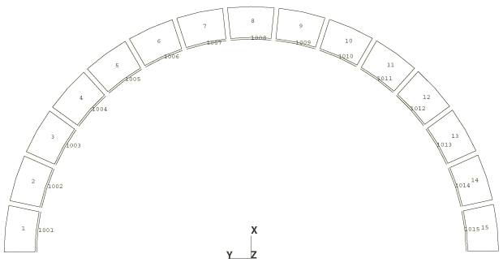

**Figure 1.11.3–2** Pressure magnitude (POR) versus frequency.

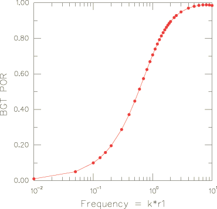

**Figure 1.11.3–3** Pressure variation on the outer boundary for the transient analysis.

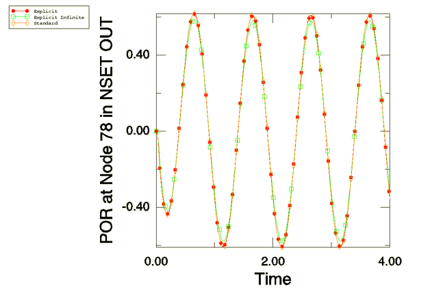

