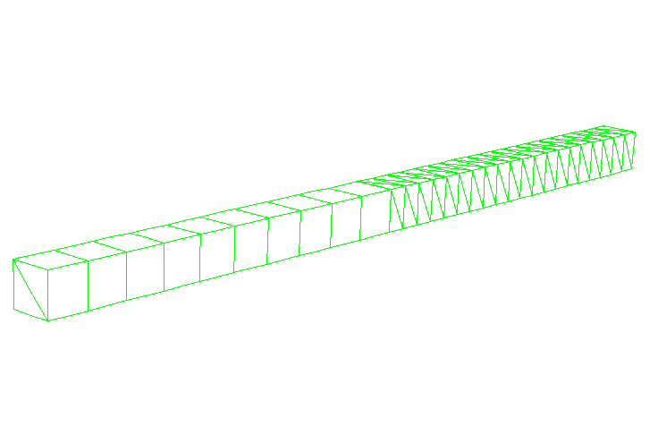
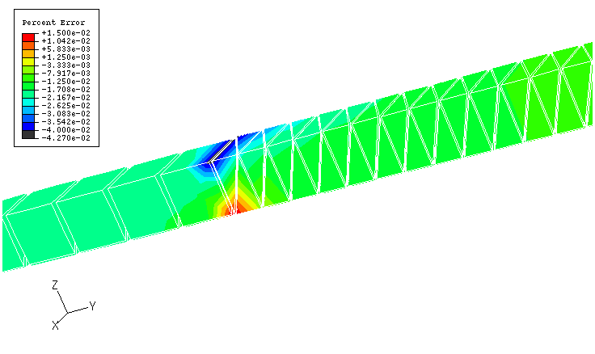
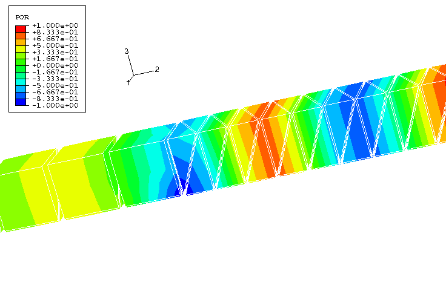
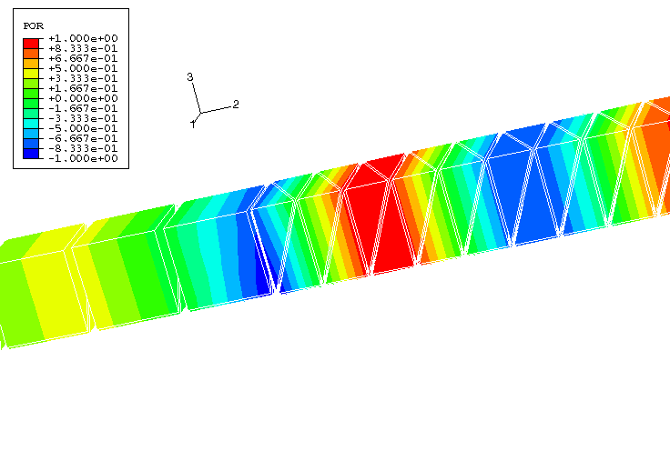

# 1.11.6 Acoustic-acoustic tie constraint in three dimensions

**Products: **Abaqus/Standard  Abaqus/Explicit  

This example is intended to illustrate and verify the use of the tie constraint in a simple three-dimensional acoustic system, using several procedures.

### Problem description

This problem examines the natural frequencies of and the steady-state and transient wave propagation in a rectangular duct 20 meters in length and 1 meter square in cross-section. [Figure 1.11.6--1](ch01s11ach81.md#tie3dmesh) shows the three-dimensional test mesh. The model is split into two regions: one region has AC3D15 triangular prism elements (AC3D6 triangular prism elements in Abaqus/Explicit), while the other has AC3D4 tetrahedral elements. Both regions are 10 meters long and are connected through tie constraints. Both regions are made of an acoustic material with a bulk modulus of 0.142 MPa and a density of 1.21 kg per cubic meter. The surface on the AC3D15 (AC3D6 in Abaqus/Explicit) side is defined as the slave in the constraint pair.

### Loading

The frequency analysis uses no imposed boundary conditions or loads; in acoustic analysis this corresponds to rigid-wall (Neumann) boundary conditions on all exterior surfaces. 

In the steady-state dynamic analyses the nodes on the right (unconstrained) end of the AC3D4 mesh are excited using a boundary condition on degree of freedom 8. A plane wave absorbing impedance condition is imposed on the left end of the AC3D15 domain.

In the transient dynamic problems the same boundary condition is applied but with a sinusoidal amplitude. The plane wave condition is imposed here, in the same manner as for the steady-state dynamic analyses.

### Results and discussion

The calculated frequencies obtained from the frequency analysis correspond to analytic values, indicating that the constraint transmits the pressure between the mesh regions correctly.

Direct-solution steady-state dynamic analyses are performed at selected frequencies from 5 to 100 Hz. [Figure 1.11.6--2](ch01s11ach81.md#tie3dssdyn) shows the percentage error in the variable POR (pressure field magnitude) at 20 Hz. The mesh is viewed from the point of view opposite to that of [Figure 1.11.6--1](ch01s11ach81.md#tie3dmesh) to show the area of maximum error. The errors in the vicinity of the constraint are on the order of hundredths of a percent; the response in other regions of the mesh is more accurate.

In the dynamic problem the Abaqus/Standard analysis uses a fixed time increment of 0.0005 seconds. [Figure 1.11.6--3](ch01s11ach81.md#tie3dtrans) and [Figure 1.11.6--4](ch01s11ach81.md#tie3dtransxpl) show the variable POR (pressure magnitude) at a time of 0.04 seconds, shortly after the wavefront has crossed the tie boundary between the tetrahedra and the wedges. The tie constraints introduce minimal distortion and error in the solution.

### Input files

##### **Abaqus/Standard input files**

[acoustic_tie_3d_ssdyn.inp](../eif/acoustic_tie_3d_ssdyn.inp)

Steady-state and natural frequency analysis.

[acoustic_tie_3d_trans.inp](../eif/acoustic_tie_3d_trans.inp)

Transient analysis.

##### **Abaqus/Explicit input file**

[acoustic_tie_3d_trans_xpl.inp](../eif/acoustic_tie_3d_trans_xpl.inp)

Transient analysis.

### Figures

**Figure 1.11.6–1** Mesh configuration.

**Figure 1.11.6–2** Pressure magnitude error at 20 Hz, using a direct-solution steady-state dynamic procedure.

**Figure 1.11.6–3** Pressure magnitude at 0.04 seconds, using a dynamic procedure.

**Figure 1.11.6–4** Pressure magnitude at 0.04 seconds, using an explicit dynamic procedure.

