# 1.11.8 Acoustic analysis of a duct with mean flow

**Product: **Abaqus/Standard  

In this problem the acoustic field in a duct with mean flow at high subsonic speed is analyzed using the direct-solution steady-state dynamic procedure. Analytical solutions for this problem also exist and are provided for comparison with the numerical results obtained. Real and complex frequency analysis results for the reverberant case are also examined.

### Problem description

The model is a simple column of elements oriented along the *x*-axis. The units used in this case are consistent with air: 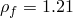, 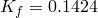  106, the column length is 4, and the Mach number is 0.5. The frequency range of interest is 50 to 300 cycles per second.

Two physical cases are examined: a reverberant end condition and an open condition. In both cases the real and imaginary parts of the acoustic pressure are prescribed at one end of the duct. Default nonreflective impedance conditions are applied on the opposite end of the duct to simulate the open case; no loads, boundary conditions, or impedance conditions are required for the reverberant case.

The general analytical solution of the steady-state sound pressure along the length of the duct with uniform flow at (subsonic) Mach number  is given by

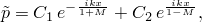

where 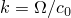, 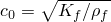, and the constants  and  are defined by the prescribed load and end conditions. At the 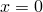 end, we set 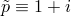 for both the reverberant and open cases. At 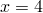, the reverberant and open conditions depend on the Mach number. To see this, recall the variational form of the acoustic equation with flow, as used in the derivation of the finite elements for these problems in Abaqus: 

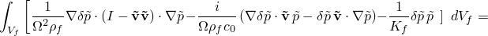

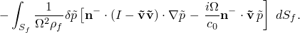

In this one-dimensional problem the right hand side for the boundary traction at  reduces to

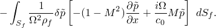

The default reverberant condition in Abaqus sets this boundary traction to zero. This can be satisfied in an analytical solution by enforcing the strong condition

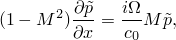

 and using this, in conjunction with the boundary condition at , to establish the following constants:

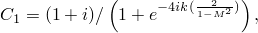

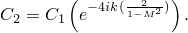

For the open-end case with the same boundary condition at , only right-traveling waves exist; that is, 

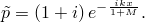

In Abaqus the open-end condition has to be enforced using a radiation impedance. Applying the right-traveling plane wave 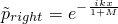 to the boundary traction integral and simplifying, we obtain the boundary term as

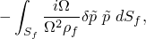

which is the same as the Abaqus default radiation condition for quiescent acoustic fluids. Consequently, the open-end analysis in Abaqus for this problem, with Mach number 0.5, is performed the same as for a stationary fluid.

The real and complex frequency analyses are performed separately for the reverberant physical case.

### Results and discussion

The responses for the reverberant and open-ended cases are obtained by conducting direct-solution steady-state dynamic analysis steps. The analysis frequencies are chosen between 50 and 300 cycles per second. Analytic and computed results agree as expected.

The results for the real and complex frequency analysis also agree with the expected results.

### Input files

[acousticflowduct2d.inp](../eif/acousticflowduct2d.inp)

Direct-solution steady-state dynamic analysis, all two-dimensional elements tested.

[acousticflowduct3d.inp](../eif/acousticflowduct3d.inp)

Direct-solution steady-state dynamic analysis, all three-dimensional elements tested.

[acousticflowduct2d_eig.inp](../eif/acousticflowduct2d_eig.inp)

Real and complex eigenanalysis, all two-dimensional elements tested.

[acousticflowduct3d_eig.inp](../eif/acousticflowduct3d_eig.inp)

Real and complex eigenanalysis, all three-dimensional elements tested.

