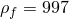
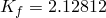
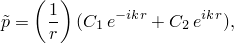
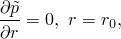
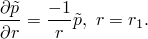
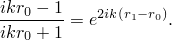
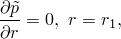
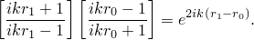

# 1.11.9 Real exterior acoustic eigenanalysis

**Product: **Abaqus/Standard  

In this problem the symmetric acoustic resonances of a rigid unit sphere immersed in an acoustic fluid of infinite extent are analyzed using nonreflecting impedance conditions and acoustic infinite elements. In the case studied a set of real-valued solutions are sought. Analytical solutions for this problem are provided for comparison with the numerical results obtained. Real frequency analysis results for the reverberant case are also examined for comparison.

### Problem description

The first model is a small sector of axisymmetric acoustic elements with an inner radius of 1 and an outer radius of 3. The units used in this case are consistent with water:  and   109. The frequency range of interest is 21 to 3730 cycles per second. The second model is identical to the first except that it is terminated with an acoustic infinite element.

Two physical cases are examined: a reverberant end condition and an open condition. In the former case no infinite element or impedance condition is used. In the latter case a spherical nonreflective impedance condition or an acoustic infinite element is applied on the opposite end of the duct.

The general analytical solution of the steady-state sound pressure along the radius of the sphere is given by the following: 

with boundary conditions

and

The latter equation is the real part of the spherical nonreflecting impedance condition used in Abaqus. Seeking characteristic solutions, the constants  and  are eliminated and the resonant wave numbers *k* are defined implicitly by the characteristic equation

For the reverberant case the boundary condition at  becomes

and the resonant wave numbers are defined by

The results for the eigenfrequencies are calculated approximately for both analytical formulae using a Newton method.

### Results and discussion

The results for the reverberant and open-ended cases are obtained by conducting real-valued frequency extraction steps. The analysis frequencies are chosen between 120 and 3800 cycles per second. Guidelines for acoustic analysis recommend using at least 10 elements per wavelength for accurate solutions. For the mesh used in this problem this corresponds roughly to a limit of 1800 Hz. However, in this problem all of the analytic and computed results agree well, despite the fact that the analysis proceeds well beyond the 10 elements per wavelength frequency of the mesh. Results using the nonreflecting impedance condition are shown in [Table 1.11.9--1](ch01s11ach84.md#table-nonreflecting-imped) below; results from the infinite element analysis are similar.

**Table 1.11.9–1** Analytic and computed results for the nonreflecting impedance condition.
| Analytic exterior | Abaqus exterior | Analytic reverberant | Abaqus reverberant |
| --- | --- | --- | --- |
| 125.2 | 125.21 | --- | --- |
| 423.6 | 423.33 | 394.5 | 403.63 |
| 764.8 | 762.78 | 749.7 | 751.32 |
| 119.0 | 1112.9 | 1110.0 | 1105.0 |
| 1479.0 | 1463.7 | 1472.0 | 1457.6 |
| 1841.0 | 1810.9 | 1835.0 | 1806.0 |
| 2204.0 | 2152.3 | 2199.0 | 2148.1 |
| 2567.0 | 2485.9 | 2563.0 | 2482.2 |
| 2931.0 | 2810.1 | 2929.0 | 2806.9 |
| 3295.0 | 3123.5 | 3292.0 | 3120.5 |
| 3660.0 | 3424.6 | 3657.0 | 3421.9 |
| 4024.0 | 3712.2 | 4022.0 | 3709.6 |

### Input files

[exteig_real_ax4_inf.inp](../eif/exteig_real_ax4_inf.inp)

Solution using acoustic infinite element.

[exteig_real_ax4_imp.inp](../eif/exteig_real_ax4_imp.inp)

Solution using nonreflecting impedance.

