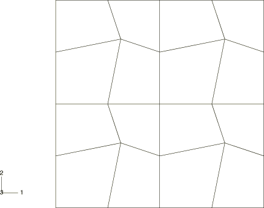
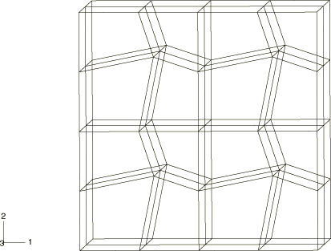
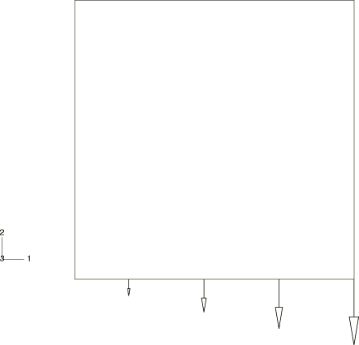
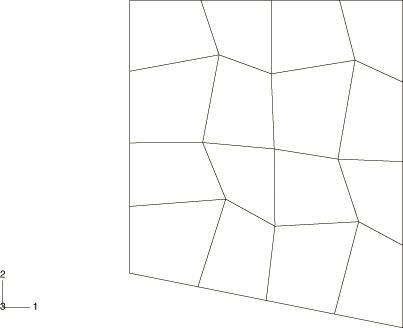
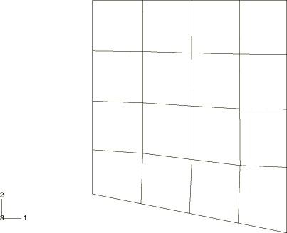
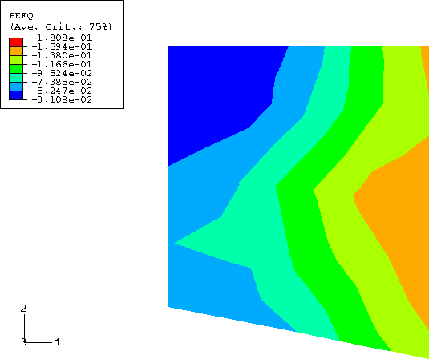
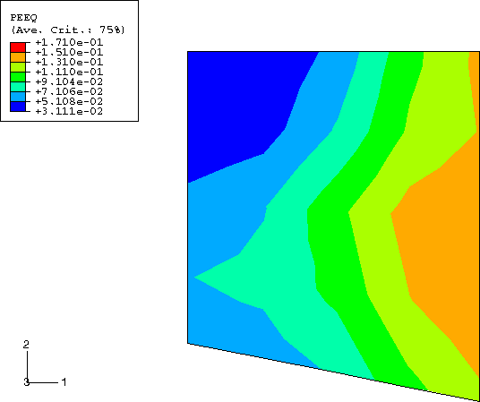

# 1.12.3 Adaptivity patch test with different materials

**Product: **Abaqus/Explicit  

### Problem description

The advection algorithms are tested by loading a small patch of elements. Two-dimensional (plane strain and plane stress) and three-dimensional geometries are considered. For the two-dimensional geometries a square block with an edge length of 4 m is meshed with CPE4R (plane strain) or CPS4R (plane stress) elements, as shown in [Figure 1.12.3--1](ch01s12ach90.md#exxalepatchtest-2dmesh). For the three-dimensional geometry a cube with an edge length of 4 m is meshed with C3D8R elements, as shown in [Figure 1.12.3--2](ch01s12ach90.md#exxalepatchtest-3dmesh). Both geometries are meshed with initially distorted elements.

All three meshes are tested for the following material models: hyperelasticity, hyperelasticity with viscoelasticity, hyperfoam, Hill plasticity, Mises plasticity, Drucker-Prager plasticity, Drucker-Prager cap plasticity, crushable foam plasticity, and porous metal plasticity. The parameters and constants used for each material model can be found in the input files that are included with the Abaqus release.

The loading is similar for all geometries. The first step is run in a pure Lagrangian fashion. A linearly varying displacement field, acting in the negative *y*-direction, is prescribed on the bottom edge or face of the mesh, as shown in [Figure 1.12.3--3](ch01s12ach90.md#exxalepatchtest-dispfield). The displacements normal to all the remaining edges/faces are fully constrained. The prescribed displacement is ramped on using a smooth-step amplitude curve to promote a quasi-static response to the loading.

In the second step an adaptive mesh domain is defined for each patch to allow adaptive meshing to occur. The loading and boundary conditions remain unchanged. Adaptive meshing is performed at every increment. At this frequency the mesh distortion is eliminated in a few increments. An accurate advection algorithm ensures that the distribution of solution variables in the patch remains approximately the same before and after adaptive meshing occurs.

### Results and discussion

The deformed configurations at the completion of the first and second steps are shown in [Figure 1.12.3--4](ch01s12ach90.md#exxalepatchtest-deform1) and [Figure 1.12.3--5](ch01s12ach90.md#exxalepatchtest-deform2), respectively, for the plane strain model with Mises plasticity. Corresponding contour plots of equivalent plastic strain are shown in [Figure 1.12.3--6](ch01s12ach90.md#exxalepatchtest-contours1) and [Figure 1.12.3--7](ch01s12ach90.md#exxalepatchtest-contours2). It is apparent from these plots that adaptive meshing creates a much more uniform mesh without affecting the solution. Similar results (not presented here) are observed for the plane stress and three-dimensional geometries using each material model. For the hyperelasticity with viscoelasticity model the solution does not reach a steady value at the end of the first step because of ongoing stress relaxation. The solution is continuous upon adaptive meshing and continues to relax for the duration of the second step.

### Input files

[ale_patch_mises2d.inp](../eif/ale_patch_mises2d.inp)

Two-dimensional geometry and Mises plasticity.

[ale_patch_hyper2d.inp](../eif/ale_patch_hyper2d.inp)

Two-dimensional geometry and hyperelasticity.

[ale_patch_vishyper2d.inp](../eif/ale_patch_vishyper2d.inp)

Two-dimensional geometry and hyperelasticity with viscoelasticity.

[ale_patch_hyperfoam2d.inp](../eif/ale_patch_hyperfoam2d.inp)

Two-dimensional geometry and hyperfoam.

[ale_patch_plfoam2d.inp](../eif/ale_patch_plfoam2d.inp)

Two-dimensional geometry and crushable foam plasticity with volumetric hardening.

[ale_patch_crushfoam2d.inp](../eif/ale_patch_crushfoam2d.inp)

Two-dimensional geometry and crushable foam plasticity with isotropic hardening.

[ale_patch_porous2d.inp](../eif/ale_patch_porous2d.inp)

Two-dimensional geometry and porous plasticity.

[ale_patch_hill2d.inp](../eif/ale_patch_hill2d.inp)

Two-dimensional geometry and Hill plasticity.

[ale_patch_drucker2d.inp](../eif/ale_patch_drucker2d.inp)

Two-dimensional geometry and Drucker-Prager plasticity.

[ale_patch_cap2d.inp](../eif/ale_patch_cap2d.inp)

Two-dimensional geometry and Drucker-Prager cap plasticity.

[ale_patch_mises3d.inp](../eif/ale_patch_mises3d.inp)

Three-dimensional geometry and Mises plasticity.

[ale_patch_hyper3d.inp](../eif/ale_patch_hyper3d.inp)

Three-dimensional geometry and hyperelasticity.

[ale_patch_vishyper3d.inp](../eif/ale_patch_vishyper3d.inp)

Three-dimensional geometry and hyperelasticity with viscoelasticity.

[ale_patch_hyperfoam3d.inp](../eif/ale_patch_hyperfoam3d.inp)

Three-dimensional geometry and hyperfoam.

[ale_patch_plfoam3d.inp](../eif/ale_patch_plfoam3d.inp)

Three-dimensional geometry and crushable foam plasticity with volumetric hardening.

[ale_patch_crushfoam3d.inp](../eif/ale_patch_crushfoam3d.inp)

Three-dimensional geometry and crushable foam plasticity with isotropic hardening.

[ale_patch_porous3d.inp](../eif/ale_patch_porous3d.inp)

Three-dimensional geometry and porous plasticity.

[ale_patch_hill3d.inp](../eif/ale_patch_hill3d.inp)

Three-dimensional geometry and Hill plasticity.

[ale_patch_drucker3d.inp](../eif/ale_patch_drucker3d.inp)

Three-dimensional geometry and Drucker-Prager plasticity.

[ale_patch_cap3d.inp](../eif/ale_patch_cap3d.inp)

Three-dimensional geometry and Drucker-Prager cap plasticity.

### Figures

**Figure 1.12.3–1** Initial finite element mesh for the two-dimensional geometries.

**Figure 1.12.3–2** Initial finite element mesh for the three-dimensional geometry.

**Figure 1.12.3–3** Schematic diagram showing the applied displacement field.

**Figure 1.12.3–4** Deformed mesh at the end of the first step for the plane strain geometry with Mises plasticity.

**Figure 1.12.3–5** Deformed mesh at the end of the second step for the plane strain geometry with Mises plasticity.

**Figure 1.12.3–6** Contours of equivalent plastic strain at the end of the first step for the plane strain geometry with Mises plasticity.

**Figure 1.12.3–7** Contours of equivalent plastic strain at the end of the second step for the plane strain geometry with Mises plasticity.

