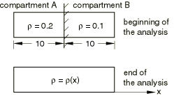
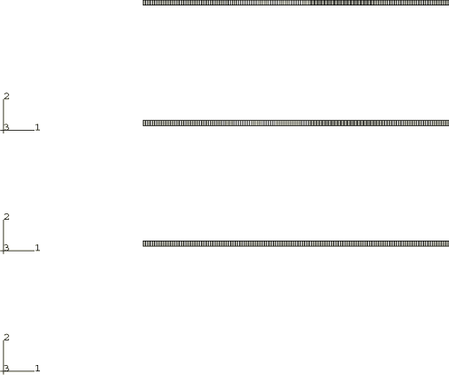
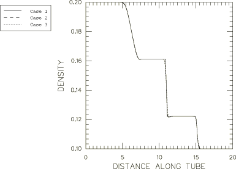
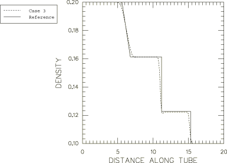

# 1.12.4 Wave propagation in a shock tube

**Product: **Abaqus/Explicit  

### Problem description

This problem models the one-dimensional propagation of a shock wave in a polytropic gas. An analytical solution is given in Amsden, Ruppel, and Hirt (1980).

A schematic of the model is shown in [Figure 1.12.4--1](ch01s12ach91.md#exxaleshocktube-schematic); the model consists of a compartmentalized shock tube filled with a polytropic gas. A diaphragm separates the tube into two equal compartments. Both compartments are filled with the same gas, but the ratio of the density of the gas in compartment A to the density of the gas in compartment B is 2:1. The diaphragm separating the compartments is instantaneously removed, causing a shock wave to advance into compartment B and a rarefaction wave to propagate back into compartment A.

The plane strain finite element model used for the analysis is shown in [Figure 1.12.4--2](ch01s12ach91.md#exxaleshocktube-initconfig). While the shock tube is not meshed, the gas in the tube is meshed with CPE4R elements and fills a volume of dimensions 20  0.333  1. The Abaqus/Explicit ideal gas equation of state model is used with a gas constant of 0.2 and a constant specific heat at constant volume of 0.3. The initial state of the gas is determined from an initial uniform temperature of 0.6, an initial density of 0.2 for compartment A, and an initial density of 0.1 for compartment B. The initial specific energy of 0.18 is also given only for the purpose of total specific energy output.

Symmetry boundary conditions are prescribed on all four outer boundary walls of the tube throughout the analysis. The analysis is continued until *t* = 10 sec, at which time the shock wave has propagated halfway through the original compartment B.

The following three different techniques are used to solve the problem:

1. Pure Lagrangian: The problem is solved with a pure Lagrangian analysis; no adaptive meshing is performed.
2. Adaptive meshing with two domains: An adaptive mesh domain is defined for each compartment, and continuous adaptive meshing is performed within each domain. The interface between the two compartments remains Lagrangian because of the boundary region between the two domains. The net effect of this constraint is that there is no mixing of the gas contained in each compartment. The frequency of adaptive meshing is changed to 1 from a default value of 10 because of the substantial material flow through the mesh that occurs when the shock wave propagates.
3. Adaptive meshing with one domain: The analysis is performed using a traditional Eulerian approach. A single adaptive mesh domain is defined that encompasses both compartments. This allows the gas from the two compartments to mix freely when the diaphragm is removed. As the shock wave moves through the tube, the mesh can be held stationary using one of two techniques: (1) applying spatial adaptive mesh constraints on every node or (2) performing adaptive meshing based on the positions of nodes at the end of the previous adaptive mesh increment, which has the effect of holding the mesh stationary for a uniform mesh with no boundary deformation. The latter technique is adopted here. The frequency of adaptive meshing is changed to 1 from a default value of 10 because of the substantial material flow through the mesh that occurs when the shock wave propagates.

Although this simple one-dimensional problem can be solved satisfactorily with all three approaches, two- and three-dimensional shock wave problems involving compressible gases almost always require the third approach that uses one adaptive mesh domain to include both the high energy (density) and low energy gases. This approach is required because of the substantial amount of material flow resulting from the expansion of the high energy (density) gas into the area occupied by the low energy gas.

### Results and discussion

[Figure 1.12.4--3](ch01s12ach91.md#exxaleshocktube-deform2) shows the deformed configuration for each of the three cases at the end of the analysis. The magnitude of the shock wave can be realized by studying the size of the elements along the length of the tube for Case 1 (the pure Lagrangian analysis). Path plots of the density along the length of the tube at the end of the analysis are shown in [Figure 1.12.4--4](ch01s12ach91.md#exxaleshocktube-density1-3) for each case. The results are identical. In [Figure 1.12.4--5](ch01s12ach91.md#exxaleshocktube-density3-anal) the path plot of density for Case 3 (the analysis using one adaptive mesh domain) is compared to the solution given by Amsden, et al. The results are in close agreement.

### Input files

[lag_shocktube.inp](../eif/lag_shocktube.inp)

Case 1.

[ale_shocktube.inp](../eif/ale_shocktube.inp)

Case 2.

[ueul_shocktube.inp](../eif/ueul_shocktube.inp)

Case 3.

### Reference

Amsden,  A. A., H. M. Ruppel, and C. W. Hirt, “SALE: A Simplified ALE Computer Program for Fluid Flow at All Speeds,” Los Alamos Scientific Laboratory, 1980.

### Figures

**Figure 1.12.4–1** Schematic drawing of the shock tube.

**Figure 1.12.4–2** Initial configuration.

**Figure 1.12.4–3** Deformed configuration at the end of the second step for Cases 1–3.

**Figure 1.12.4–4** Comparison of the density along the length of the shock tube at the end of the second step for Cases 1–3.

**Figure 1.12.4–5** Comparison of the density along the length of the shock tube at the end of the second step for Case 3 and the analytical solution.

