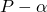
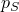
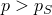
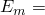
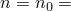
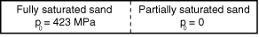
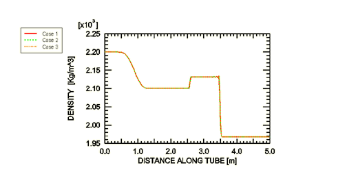
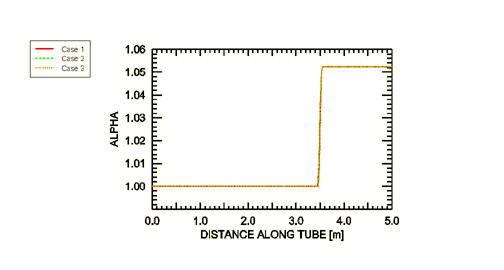
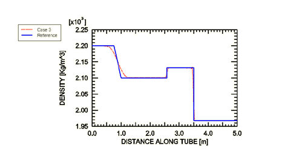

# 1.12.5 Propagation of a compaction wave in a shock tube

**Product: **Abaqus/Explicit  

This problem models the one-dimensional propagation of a compaction wave in partially saturated sand. The results are compared with the solution given in Wardlaw, McKeown, and Chen (1996).

### Problem description

The problem under consideration is similar to that discussed in ["Wave propagation in a shock tube," Section 1.12.4](ch01s12ach91.md). Here we consider the case of a compartmentalized shock tube filled with sand, as shown in [Figure 1.12.5--1](ch01s12ach92.md#exxalecompaction-schematic). A diaphragm separates the tube into two equal compartments. The left compartment is filled with compacted (fully saturated) sand with initial pressure  423 MPa. The right compartment is filled with partially saturated sand with initial pressure  0. The diaphragm separating the compartments is instantaneously removed, causing a compaction wave to advance into the right compartment and a rarefaction wave to propagate back into the left compartment. The compaction wave causes permanent compaction of the sand in the right compartment.

The mechanical response of the sand is modeled using the  equation of state material model (["Equation of state," Section 25.2.1 of the Abaqus Analysis User's Guide](../usb/usb-link.md#usb-mat-ceos)). Sand consists of sand grains, water, and air or voids. It is assumed that the air does not carry any pressure. The solid part of the  model represents the sand grain-water mixture, while the porous part accounts for the air-void content. In the absence of the air-void content, sand is said to be fully saturated, or fully compacted, which in the framework of the  model corresponds to . The constitutive behavior of fully saturated sand is described by a Mie-Grneisen equation of state. At its virgin state, under zero pressure, sand usually contains an initial void volume fraction and is said to be partially saturated. As the pressure increases, sand undergoes irreversible compaction and permanent (plastic) volume change. Sand becomes fully compacted when the pressure reaches the compaction pressure .

The following material properties are used:

| Solid phase (Mie-Grneisen) | Compaction properties |
| --- | --- |
|  | 2070 kg/m3 |  | 600 m/sec |
|  | 1480 m/sec |  | 0.049758 |
| *s* | 1.93 |  | 0.0 MPa |
|  | 0.880 |  | 6.5 MPa |

The sand in the left compartment is assumed to be fully compacted ( 1), with initial pressure  423 MPa () and initial specific energy  5000 j oule/Kg. On the other hand, the sand in the right compartment is initially at the virgin state: ,  0, and  porosity  0.049758 (or  1.052364).

Plane strain CPE4R elements are used to mesh the sand in the tube, which fills a volume of 5  0.1  1 m3. Symmetry boundary conditions are prescribed on all four outer boundary walls of the tube throughout the analysis. The analysis is continued until  0.001 sec.

The following three techniques are used to solve the problem:

1. Pure Lagrangian: The problem is solved with a pure Lagrangian analysis; no adaptive meshing is performed.
2. Adaptive meshing with two domains: An adaptive mesh domain is defined for each compartment, and continuous adaptive meshing is performed within each domain. The interface between the two compartments remains Lagrangian because of the boundary region between the two domains. The net effect of this constraint is that there is no mixing of the sand contained in each compartment. The frequency of adaptive meshing is changed to 1 from a default value of 10 because of the substantial material flow through the mesh that occurs when the shock wave propagates.
3. Adaptive meshing with one domain: The analysis is performed using a traditional Eulerian approach. A single adaptive mesh domain is defined that encompasses both compartments. This allows the sand from the two compartments to mix freely when the diaphragm is removed. As the shock wave moves through the tube, the mesh can be held stationary using one of two techniques: (1) applying spatial adaptive mesh constraints on every node or (2) performing adaptive meshing based on the positions of nodes at the end of the previous adaptive mesh increment, which has the effect of holding the mesh stationary for a uniform mesh with no boundary deformation. The latter technique is adopted here. The frequency of adaptive meshing is changed to 1 from a default value of 10 because of the substantial material flow through the mesh that occurs when the shock wave propagates.

### Results and discussion

Path plots along the length of the tube at the end of the analysis ( 0.001 sec) are shown in [Figure 1.12.5--2](ch01s12ach92.md#exxalecompaction-density1-3) and [Figure 1.12.5--3](ch01s12ach92.md#exxalecompaction-alpha1-3) for the density, , and the distension, , respectively. The results from all analyses (Cases 1, 2, and 3) are nearly identical, which indicates that the one-dimensional problem can be solved satisfactorily with all three approaches. However, two- and three-dimensional shock wave problems usually require the third approach. [Figure 1.12.5--3](ch01s12ach92.md#exxalecompaction-alpha1-3) shows that as the compaction wave advances toward the right compartment, it leaves behind a trail of fully saturated sand (). In [Figure 1.12.5--4](ch01s12ach92.md#exxalecompaction-density3-ref) the path plot of density for Case 3 (the analysis using one adaptive mesh domain) is compared to the solution given by Wardlaw, et al. The results are in close agreement.

### Input files

[lag_compaction.inp](../eif/lag_compaction.inp)

Lagrangian analysis (Case 1).

[ale_compaction.inp](../eif/ale_compaction.inp)

Adaptive meshing analysis with two domains (Case 2).

[ueul_compaction.inp](../eif/ueul_compaction.inp)

Adaptive meshing analysis with one domain (Case 3).

### Reference

Wardlaw,  A. B., R. McKeown, and H. Chen, “Implementation and application of the  equation of state in the DYSMAS code,” Naval Surface Warfare Center, Dahlgren Division, Report Number: NSWCDD/TR-95/107, May 1996.

### Figures

**Figure 1.12.5–1** Schematic drawing of the shock tube.

**Figure 1.12.5–2** Comparison of the density along the length of the shock tube at the end of the analysis for Cases 1–3.

**Figure 1.12.5–3** Comparison of the distension  along the length of the shock tube at the end of the analysis for Cases 1–3.

**Figure 1.12.5–4** Comparison of the density along the length of the shock tube at the end of the analysis for Case 3 and the reference solution.

