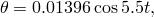
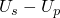
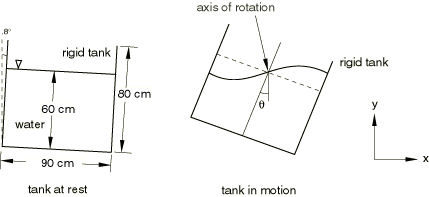
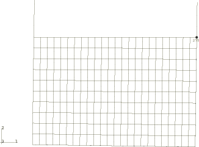
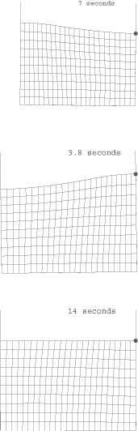
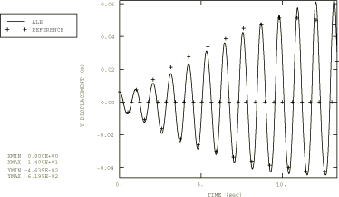

# 1.12.7 Water sloshing in a pitching tank

**Product: **Abaqus/Explicit  

### Problem description

This section verifies the use of adaptive meshing to solve basic fluid-structure interaction problems involving sloshing. A forced oscillation problem is solved. Results are compared to a numerically obtained reference solution given by Nakayama and Washizu (1980).

The model geometry for the problem is shown in [Figure 1.12.7--1](ch01s12ach94.md#exxalewater-geom). A rigid tank is partially filled with water to a height of 60 cm. The tank measures 90  80  60 cm and is initially inclined 0.8 degrees with respect to the *y*-axis. The tank is rotated about a point at the water surface midway between the two tank walls. The rotation is prescribed as

which gives rise to a sinusoidal pitching oscillation of the water in the tank. Although there are physical stiffness contributions from surface tension forces in the water, these effects are minimal compared to the fluid-structural coupling effects and, consequently, are not modeled.

The finite element model is shown in [Figure 1.12.7--2](ch01s12ach94.md#exxalewater-femodel). The water is modeled with CPE4R elements, and the rigid tank is modeled with R2D2 elements. Frictionless contact is defined between the water and the tank. The motion of the tank is prescribed at the rigid body reference node, which is located on the axis of rotation. Gravity loading is defined for the water. Consequently, an initial geostatic stress field is defined to equilibrate the stresses caused by the self-weight of the water. The sloshing analysis is performed for 14 seconds, although adaptive meshing allows an analysis such as this to be carried out much further.

For this class of problems water can be considered an incompressible and inviscid material. An effective method for modeling water in Abaqus/Explicit is to use a simple Newtonian viscous shear model and a linear  equation of state for the bulk response. The bulk modulus functions as a penalty parameter for the incompressible constraint. Since sloshing problems are unconfined, the bulk modulus chosen can be two or three orders of magnitude less than the actual bulk modulus and the water will still behave as an incompressible medium. The shear viscosity also acts as a penalty parameter to suppress shear modes that could tangle the mesh. The shear viscosity chosen should be small because water is inviscid; a high shear viscosity will result in an overly stiff response. An appropriate value for the shear viscosity can be calculated based on the bulk modulus. To avoid an overly stiff response, the internal forces arising due to the deviatoric response of the material should be kept several orders of magnitude below the forces arising due to the volumetric response. This can be done by choosing an elastic shear modulus that is several orders of magnitude lower than the bulk modulus. In this problem the Newtonian viscous deviatoric model is used, and the shear viscosity specified is on the order of an equivalent shear modulus, calculated as mentioned earlier, scaled by the expected stable time increment. This keeps the deviatoric shear stresses several orders of magnitude lower than the pressure in the water.

In addition, when a shear model is defined, the hourglass control forces are calculated based on the shear stiffness of the material. Thus, in materials with extremely low or zero shear strength such as inviscid fluids, the hourglass forces calculated based on the default parameters are insufficient to prevent spurious hourglass modes. Therefore, a sufficiently high hourglass scaling factor is used to increase the resistance to such modes.

For this problem the linear  equation of state is used with a wave speed of 45 m/s and density of 983.2 kg/m3. This wave speed corresponds to a bulk modulus of 2.07 MPa (three orders of magnitude less than the actual bulk modulus of water, 2.07 GPa). The shear viscosity is chosen as 13E4 Pa sec.

### Adaptive meshing

A single adaptive mesh domain that incorporates the water is used for each model. A sliding boundary region is used for the contact surface definition on the water (the default). Because of the large amounts of shearing induced by the sloshing motion, the frequency and intensity of adaptive meshing must be increased to provide a smooth mesh. The frequency of adaptive meshing is reduced from the default of 10 to 5, and the number of mesh sweeps to be performed in each adaptive mesh increment is increased from the default of 1 to 3.

### Results and discussion

[Figure 1.12.7--3](ch01s12ach94.md#exxalewater-deformconfigs) shows the deformed mesh configuration at various times. As the figure shows, there is significant sloshing of the water. The use of adaptive meshing acts to prevent excessive element distortion from occurring over time. [Figure 1.12.7--4](ch01s12ach94.md#exxalewater-ydisp) shows a time history of the water displacement in the global *y*-direction at the extreme right end of the free surface (node 275 highlighted in [Figure 1.12.7--3](ch01s12ach94.md#exxalewater-deformconfigs)). Results are compared to the reference solution reported in Nakayama and Washizu (1980) and are seen to be similar, even though the approaches are quite different. A well-known, nonlinear characteristic of the fluid motion is observed: the upward wave amplitude becomes greater than the downward amplitude as the wave amplitude becomes larger.

### Input file

[ale_water_oscillation.inp](../eif/ale_water_oscillation.inp)

Input data for this analysis.

### Reference

Nakayama,  T., and K. Washizu, “Nonlinear Analysis of Liquid Motion in a Container Subjected to Forced Pitching Oscillation,” International Journal for Numerical Methods in Engineering, vol. 15, pp. 1207–1220, 1980.

### Figures

**Figure 1.12.7–1** Model geometry.

**Figure 1.12.7–2** Finite element model.

**Figure 1.12.7–3** Deformed configurations at various times.

**Figure 1.12.7–4** Time history of the *y*-displacement at the right end of the free surface.

