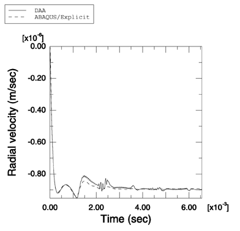
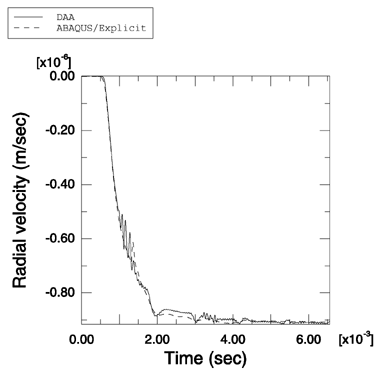

# 1.14.6 Cylindrical shell response to a planar step shock wave

**Product: **Abaqus/Explicit  

Simulating the response of submerged structures of simple geometric shapes to various underwater explosions constitutes an important part of the validation of any fluid-structure interaction code. In this example the ability of Abaqus/Explicit to model the interaction between an air-backed cylindrical elastic shell and a planar step wave is illustrated. The results obtained using Abaqus/Explicit are compared with those obtained independently using the Doubly Asymptotic Approximation (Geers (1978), Abaqus/USA 6.1). This problem has been solved analytically by Huang (1970).

### Problem description

This problem models the interaction between an air-backed cylindrical elastic shell and a weak planar step shock wave with a maximum pressure of 1 Pa. The cylindrical shell has a radius of 1 m and a thickness of 0.029 m. The shell is made of steel with a density of 7766 kg/m3, a Young's modulus of 206.4 GPa, and a Poisson's ratio of 0.3. The fluid is water with a density of 997 kg/m3, in which the speed of sound is 1524 m/s. A half-symmetry model is used to study this problem. A thin axial section of width 0.0049 m with symmetry boundary conditions is used to represent the infinite length of the actual cylinder. The shell is represented by S4R elements, and the surrounding fluid is represented by a fluid region that extends concentrically from the shell and has a radius of 3 m. The fluid region is modeled with AC3D8R elements. A circular nonreflective boundary condition is imposed on the exterior surface of the fluid using surface impedance. The fluid response is coupled to that of the structure using a tie constraint on the fluid surface nearest to the shell and the shell itself. The fluid-solid system is excited by a planar step wave applied close to the fluid-solid interface using incident wave loading. A linear bulk viscosity parameter of 0.25 and a quadratic bulk viscosity parameter of 10.0 are used.

### Results and discussion

The results are analyzed by comparing predictions made by Abaqus/Explicit with those in the referenced literature. We also compare the numerical values for radial velocities at the leading and trailing edges of the shell obtained using Abaqus/Explicit with those obtained using Abaqus/USA 6.1. As shown in [Figure 1.14.6--1](ch01s14ach103.md#undex-cyl-ps-le) and [Figure 1.14.6--2](ch01s14ach103.md#undex-cyl-ps-tr), the results agree closely.

### Input file

[undex_cyl_ps.inp](../eif/undex_cyl_ps.inp)

Input data for this analysis.

### References

Geers,  T., “Doubly Asymptotic Approximations for Transient Motions of Submerged Structures,” Journal of the Acoustical Society of America, vol. 64, pp. 1500–1508, 1978.

Huang,  H., “An Exact Analysis of the Transient Interaction of Acoustic Plane Waves With a Cylindrical Elastic Shell,” Journal of Applied Mechanics, vol. 37, pp. 1091–1099, December 1970.

### Figures

**Figure 1.14.6–1** Comparison of radial velocity at the leading edge of the cylindrical shell obtained with the Doubly Asymptotic Approximation method and with Abaqus/Explicit.

**Figure 1.14.6–2** Comparison of radial velocity at the trailing edge of the cylindrical shell obtained with the Doubly Asymptotic Approximation method and with Abaqus/Explicit.

