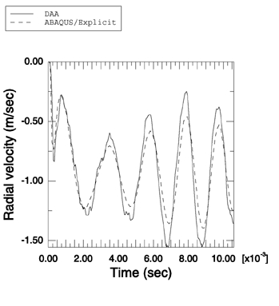
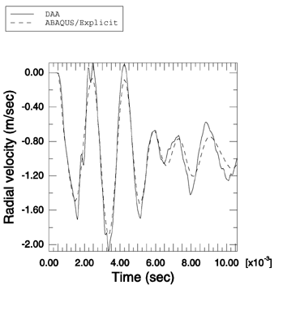

# 1.14.14 Coupled spherical shell response to a planar step wave

**Product: **Abaqus/Explicit  

Simulating the response of submerged structures of simple geometric shapes to various underwater explosions constitutes an important part of the validation of any fluid-structure interaction code. In this example the ability of Abaqus/Explicit to model the interaction between two fluid-coupled concentric spherical shells and a planar step wave is illustrated. The results obtained using Abaqus/Explicit are compared with those obtained independently using the Doubly Asymptotic Approximation (Geers (1978), Abaqus/USA 6.1). This problem has been solved analytically by Huang (1979).

### Problem description

This problem models the interaction between two fluid-coupled concentric elastic spherical shells and a weak planar step shock wave with a maximum pressure of 1.0 MPa. The outer cylinder is water-backed. In contrast to Huang's solution, engineering material parameters for the fluid and solid media are used. The inner spherical shell has a radius of 0.8 m and a thickness of 16 mm, while the outer spherical shell has a radius of 1 m and a thickness of 4 mm. The shells are made of steel with a density of 7765 kg/m3, a Young's modulus of 224.6 GPa, and a Poisson's ratio of 0.3. The fluid is water with a density of 997 kg/m3, in which the speed of sound is 1524 m/s. An axisymmetric model is used. Each spherical shell is modeled with 64 SAX1 elements. The fluid in between the spherical shells and outside the outer spherical shell is meshed with ACAX4R elements. The exterior fluid region is concentric with the spherical shells and has a radius of 3.002 m. A spherical nonreflective boundary condition is imposed on the outer surface of the exterior fluid region using surface impedance. The fluid response is coupled to that of the structure using a tie constraint on both surfaces of the outer shell and on the outer surface of the inner shell. In both cases the shell surfaces are the master surfaces. The fluid-solid system is excited by a planar step wave applied at the outer spherical shell using incident wave loading. A linear bulk viscosity parameter of 0.2 and a quadratic bulk viscosity parameter of 1.2 are used.

### Results and discussion

The results from Abaqus/Explicit show good qualitative comparison with those in the referenced literature. We also compare the numerical values for radial velocities at the leading and trailing edges of the inner spherical shell obtained using Abaqus/Explicit with those obtained using Abaqus/USA 6.1. As shown in [Figure 1.14.14--1](ch01s14ach111.md#undex-coupled-sph-inner-le) and [Figure 1.14.14--2](ch01s14ach111.md#undex-coupled-sph-inner-tr), the results agree closely.

### Input file

[undex_coupled_sph.inp](../eif/undex_coupled_sph.inp)

Input data for this analysis.

### References

Geers,  T., “Doubly Asymptotic Approximations for Transient Motions of Submerged Structures,” Journal of the Acoustical Society of America, vol. 64, pp. 1500–1508, 1978.

Huang,  H., “Transient Response of Two Fluid-Coupled Spherical Elastic Shells to an Incident Pressure Pulse,” Journal of the Acoustical Society of America, vol. 65, pp. 881–887, 1979.

### Figures

**Figure 1.14.14–1** Comparison of the radial velocity at the leading edge of the inner spherical shell obtained with the Doubly Asymptotic Approximation method and with Abaqus/Explicit.

**Figure 1.14.14–2** Comparison of the radial velocity at the trailing edge of the inner spherical shell obtained with the Doubly Asymptotic Approximation method and with Abaqus/Explicit.

