# 1.15.2 Consolidation of a triaxial test specimen

**Product: **Abaqus/Standard  

This example illustrates inelastic deformation of a soil specimen whose constitutive behavior is modeled with modified Cam-clay plasticity. The elastic part of the behavior is modeled with both the linear elastic and porous elastic models. The Cam-clay plasticity theory, which is one of the critical state plasticity theories developed by Roscoe and his colleagues at Cambridge, is described in ["Plasticity for non-metals," Section 4.4 of the Abaqus Theory Guide](../stm/stm-link.md#stmnonmetalchap). Verification of the model is provided by ["Triaxial tests on a saturated clay," Section 3.2.4](ch03s02ach177.md).

The geometric configuration is one of the most common soils tests: a triaxial specimen, confined by an enclosing membrane, being squeezed axially between platens (see [Figure 1.15.2--1](ch01s15ach115.md#sxmtriaxcon-geom)). Perfectly smooth and perfectly rough platens are both considered. The platen motion is assumed to be very slow compared to characteristic diffusion times in the soil, and the platen is assumed to provide perfect drainage, so that the pore pressures throughout the soil specimen are always essentially zero. Pore fluid diffusion is, thus, not a significant effect in this case. See ["The Terzaghi consolidation problem," Section 1.15.1](ch01s15ach114.md), and ["Plane strain consolidation," Section 10.1.1 of the Abaqus Example Problems Guide](../exa/exa-link.md#exa-soi-planestrainconsolidation), for cases where transient effects in the pore fluid diffusion are an important aspect of the overall response.

As the specimen is compressed, the elastic-plastic response of the specimen consists of two competing effects. Elastically, the increased compressive hydrostatic effective stress on the soil skeleton causes a stiffening of the response. When the soil yields, inelastic deformation results in softer behavior. Eventually the stress state in some region of the specimen reaches critical state, where the soil skeleton response is perfectly plastic. When this region is sufficiently developed, a limit state is attained, and the specimen's resistance to further compression no longer increases. The analysis is intended to track the response from the initial loading to this limit state.

### Problem description

The soil sample is an axisymmetric cylinder, as shown in [Figure 1.15.2--1](ch01s15ach115.md#sxmtriaxcon-geom). The model takes advantage of symmetry about the midplane, as well as the axisymmetry of the configuration. The specimen has a length to diameter ratio of 3. Two cases are considered: one in which the platen is assumed to be perfectly smooth, so that the stress state in the specimen will be homogeneous, and one in which the platen is assumed to be completely rough, so the soil in contact with the platen cannot move with respect to the platen. This latter case results in an nonhomogeneous stress state, as the specimen bulges during compression. The eight element mesh shown in [Figure 1.15.2--1](ch01s15ach115.md#sxmtriaxcon-geom) is not expected to capture this nonhomogeneous state accurately but should suffice for the present demonstration purposes.

The material properties of the soil are based on the example used by Zienkiewicz and Naylor (1972). The properties for the Cam-clay model with porous elasticity are shown in [Figure 1.15.2--1](ch01s15ach115.md#sxmtriaxcon-geom). The Cam-clay model with linear elasticity uses a Young's modulus of 15 GPa. This value is based on the elastic stiffness (at the end of the loading step) of the examples that use porous elasticity.

### Initial conditions

The Cam-clay model assumes that the soil has no stiffness at zero stress, so that some initial (compressive) stress state must be defined for the material. In this case we assume that the soil sample is under an initial hydrostatic pressure of 0.1 MPa (14.5 lb/in2), and this confining pressure remains constant throughout the test. Since the soil may drain through the platen, this pressure is carried as an effective stress in the soil skeleton. This initial stress state is defined using initial conditions. In this particular example it is trivial to see that this initial stress state is in equilibrium with the external distributed pressure of the same magnitude. In more complex cases it may not be so simple to ensure that the discrete, finite element model is in equilibrium with the geostatic loading. Accordingly, the first step of any analysis involving an initial stress state should be a geostatic step. In that step the geostatic external loads (in this case the pressure on the specimen) should be specified. Abaqus will then check whether the initial stress state is in equilibrium with these loads. If it is not, Abaqus will iterate and attempt to establish an equilibrium stress field that balances the prescribed tractions. Such iteration does not occur in this case since the prescribed initial stress is in equilibrium with the applied tractions.

### Loading

The specimen is compressed to 40% of its initial height over 34.56  106 sec (400 days). Although this represents a large strain of the specimen, geometric nonlinearity is ignored in this example because we wish to examine the effects of the material nonlinearity, and we only report the stress-strain response at points, rather than overall load-deflection response that will be predicted quite inaccurately unless geometric nonlinearity is included. The loading is applied in a transient soils consolidation step specifying the time period, with an associated boundary condition prescribing the travel of the platen during that time. The platen is assumed to drain freely throughout the analysis. This is specified by a boundary condition, fixing the pore pressure at zero on the top edge of the mesh. The loading is intended to represent very slow compression, sufficiently slow that the pore pressures never rise to any significant values. We can obtain a rough idea of this time scale by noting that a characteristic time for pore pressure dissipation is 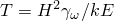, where *H* is a typical dimension from the draining surface (60 mm, 2.362 in, in this case); 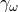 is the specific weight of the pore fluid (1.0  104 N/m3, 0.0369 lb/in3); *k* is the permeability of the soil (0.1728 mm/day, 6.803  103 in/day); and  is a typical soil modulus, which we compute as 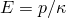, where  is the logarithmic bulk modulus and *p* is a typical mean normal effective stress. *T* is, thus, estimated as 0.05 days. This is about the time it takes for pore pressures to drop to 5% of their initial values, following sudden application of a load (see Terzaghi and Peck, 1967). Since the time scale chosen for the loading of the test specimen in this example is very long compared to this value, no significant pore pressures should ever arise in the analysis.

The same analysis could be performed by using a static procedure, in which case the coupled, effective stress formulation element type could be replaced with an element that models soil deformation only. We choose to use the coupled element type and the soils consolidation procedure to exercise these features.

The accuracy of the equilibrium solution within a time increment is controlled by iterating until the out-of-balance forces reduce to a small fraction of an average force magnitude calculated internally by Abaqus. The rough platen causes an nonhomogeneous stress state, which tends to cause an underestimation of this average force magnitude since stresses are locally higher in the region of the mesh near the platen and the reference force magnitude is averaged over the entire mesh. To avoid iterating to excessive accuracy, we have overridden the default calculation of the average force magnitude and have defined that typical actual nodal forces will be of the order 100 N (22.52 lb). This is done using solution controls. The increment size choice is automatic, determined by allowing a maximum pore pressure change (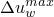) of 0.16 KPa (.023 lb/in2) per increment, which should give sufficient definition of the solution.

### Results and discussion

[Figure 1.15.2--2](ch01s15ach115.md#sxmtriaxcon-plots-rough) shows results for the rough platen case, when the stress field is nonhomogeneous, and shows results corresponding to point *A* in [Figure 1.15.2--1](ch01s15ach115.md#sxmtriaxcon-geom): this is the stress output point at the centroid of the element shown. [Figure 1.15.2--3](ch01s15ach115.md#sxmtriaxcon-plots-smooth) is for the smooth platen case, when the stress field is homogeneous. The top section of each figure shows the –*q* plane. Here *p* is the equivalent effective pressure stress, defined by

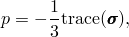

and *q* is the equivalent deviatoric stress (the Mises equivalent stress) defined by 

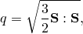

where

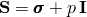

is the deviatoric stress (here  is a unit matrix).

The 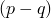 plot in each case shows the critical state line, the initial yield surface, and the stress trajectory followed in the solution. The bottom section of each figure is a plot of the equivalent deviatoric stress, *q*, versus the vertical deflection of the platen. The behavior in both cases is as we would expect: a gradual softening of the specimen after yield, until critical state is reached, when the behavior becomes perfectly plastic. In the rough platen case, the response at the point plotted moves some way up the critical state line after it reaches that line: presumably this is because other points in the model have not yet reached the limit state.

Similar results are obtained for the Cam-clay model with linear elasticity.

### Input files

[triaxconsolid_cax8rp_por.inp](../eif/triaxconsolid_cax8rp_por.inp)

Rough platen case using the porous elasticity model with CAX8RP elements.

[triaxconsolid_caxa8rp1_por.inp](../eif/triaxconsolid_caxa8rp1_por.inp)

Rough platen case using the porous elasticity model with CAXA8RP1 elements. This analysis is done as basic verification of this element type.

[triaxconsolid_cax8rp_lin.inp](../eif/triaxconsolid_cax8rp_lin.inp)

Rough platen case using the linear elasticity model with CAX8RP elements. This analysis is done as basic verification of the Cam-clay model with linear elasticity.

The only change needed for the smooth platen case is to remove the boundary conditions in the radial direction at the top of the mesh.

### References

Terzaghi,  K., and R. B. Peck, *Soil Mechanics in Engineering Practice, *John Wiley and Sons, New York, 2nd, 1967.

Zienkiewicz,  O. C., and D. J. Naylor, “The Adaptation of Critical State Soil Mechanics Theory for Use in Finite Elements,” Stress-Strain Behavior of Soils, edited by R. H. G. Parry, G. T. Foulis and Co., Ltd., London, 1972.

### Figures

**Figure 1.15.2–1** Triaxial consolidation: geometry, properties, and loading.

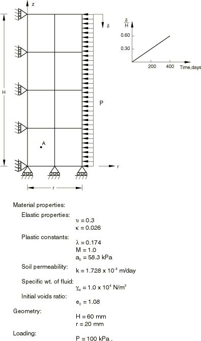

**Figure 1.15.2–2** Shear stress versus mean normal stress and axial strain. Rough platen case.

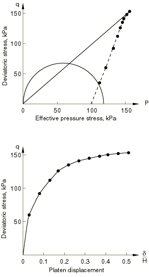

**Figure 1.15.2–3** Shear stress versus mean normal stress and axial strain. Smooth platen case.

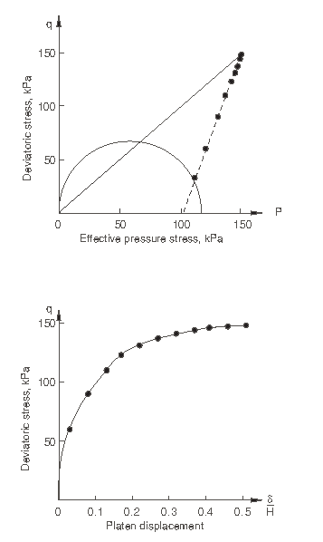

