# 1.15.4 Limit load calculations with granular materials

**Products: **Abaqus/Standard  Abaqus/Explicit  

This example presents solutions to limit load calculations for a strip of sand loaded by a rigid, perfectly rough footing. The foundation material is defined as a Mohr-Coulomb material; therefore, we show results obtained with the Mohr-Coulomb plasticity model available in Abaqus. The example also shows results obtained with different parameters used in the modified Drucker-Prager model in Abaqus, with and without a cap, matched to the classical Mohr-Coulomb yield model.

The classical failure model for granular materials is the Mohr-Coulomb model, which can be written as 

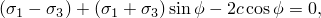

where  and  are the maximum and minimum principal stresses (positive in tension),  is the friction angle, and *c* is the cohesion. The intermediate principal stress has no effect on yield in this model. Experimental evidence suggests that the intermediate principal stress does have an effect on yield; nonetheless, laboratory data characterizing granular materials are often presented as values of  and 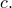

Abaqus offers a Mohr-Coulomb model for modeling this class of material behavior. This model uses the classical Mohr-Coulomb yield criterion: a straight line in the meridional plane and a six-sided polygon in the deviatoric plane. However, the Abaqus Mohr-Coulomb model has a completely smooth flow potential instead of the classical hexagonal pyramid: the flow potential is a hyperbola in the meridional plane, and it uses the smooth deviatoric section proposed by Menetrey and Willam (1995). The Abaqus Mohr-Coulomb model is described in ["Mohr-Coulomb plasticity," Section 23.3.3 of the Abaqus Analysis User's Guide](../usb/usb-link.md#usb-mat-cmohrcoulomb).

Abaqus also offers two Drucker-Prager models, with and without a compression cap, to model this class of material behavior. The Abaqus Drucker-Prager model without a cap provides a choice of three yield criteria. The differences are based on the shape of the yield surface in the meridional plane, which can be a linear form, a hyperbolic form, or a general exponent form (as described in ["Extended Drucker-Prager models," Section 23.3.1 of the Abaqus Analysis User's Guide](../usb/usb-link.md#usb-mat-cdruckerprager)). The linear form is used here to make direct comparisons with the classical linear Mohr-Coulomb model. In addition, the hyperbolic and exponential forms are also verified in this example by using parameters that reduce them to equivalent linear forms.

This section also illustrates how to match the parameters of a corresponding linear Drucker-Prager model,  and *d*, to the Mohr-Coulomb parameters,  and *c*, under plane strain conditions.

The Abaqus Drucker-Prager and Mohr-Coulomb models restrict possible flow patterns when the stress point is at a vertex of the Mohr-Coulomb yield surface. Thus, the models will not reproduce some localization effects exhibited by real materials, which are assumed to behave more in accordance with a vertex model than with a smooth model when the plastic flow direction wants to change rapidly with load. Either model must be used with nonassociated flow to avoid excessive dilatation in modeling real materials.

The Drucker-Prager/Cap model adds a cap yield surface to the modified Drucker-Prager model. The cap surface serves two main purposes: it bounds the yield surface in hydrostatic compression, thus providing an inelastic hardening mechanism to represent plastic compaction; and it helps control volume dilatancy when the material yields in shear by providing softening as a function of the inelastic volume increase created as the material yields on the Drucker-Prager shear failure and transition yield surfaces. The model uses associated flow in the cap region and a particular choice of nonassociated flow in the shear failure and transition regions.

### Problem description

The plane strain model analyzed is shown in [Figure 1.15.4--1](ch01s15ach117.md#sxmlimload-model). The strip of sand is 3.66 m (12 ft) deep and of infinite horizontal extent. The footing is rigid and perfectly rough and spans a central portion 3.05 m (10 ft) wide. The model assumes symmetry about a center plane, and the region modeled with finite elements extends 8.84 m (29 ft) to the right of the center plane. In Abaqus/Standard reduced-integration, second-order, plane strain quadrilaterals (element type CPE8R) are used for the finite region, and infinite elements (element type CINPE5R) are used beyond this line to simulate the rest of the strip.  In Abaqus/Explicit these elements are substituted with their linear counterparts (element type CPE4R and element type CINPE4, respectively). In Abaqus the infinite elements are always assumed to have linear elastic behavior; therefore, they are used beyond the region where plastic deformation takes place. The base of the strip is fixed in both the horizontal and vertical directions. The mesh is shown in [Figure 1.15.4--1](ch01s15ach117.md#sxmlimload-model). No mesh convergence studies have been performed.

### Material

The material's elastic response is assumed to be linear and isotropic, with a Young's modulus 207 MPa (30  103 lb/in2) and a Poisson's ratio 0.3. Yield is assumed to be governed by the Mohr-Coulomb surface, with a friction angle 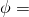 20 and cohesion, *c*, of 0.069 MPa (10 lb/in2). These constants can be used directly in the Abaqus Mohr-Coulomb model.

["Extended Drucker-Prager models," Section 23.3.1 of the Abaqus Analysis User's Guide](../usb/usb-link.md#usb-mat-cdruckerprager), describes the method for converting these Mohr-Coulomb parameters to Drucker-Prager parameters in plane strain. Applying the formulae given in the [Abaqus Analysis User's Guide](../usb/usb-link.md#usb) provides 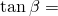 0.581 ( 30.16) and 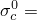 0.137 MPa (19.8 lb/in2) for associated flow and  0.592 ( 30.64) and  0.140 MPa (20.2 lb/in2) for nondilatant flow. The example is run using the associated flow parameters together with  and using the nondilatant flow parameters together with 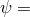0.

The Drucker-Prager/Cap model is run using the same plane strain matching of the Mohr-Coulomb parameters. The cap eccentricity parameter is chosen as  0.1. The initial cap position (which measures the initial consolidation of the specimen) is taken as 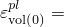 0.00041, and the cap hardening curve is as shown in [Figure 1.15.4--2](ch01s15ach117.md#sxmlimload-capharden). The transition surface parameter  0.01 is used.

For verification of the hyperbolic and exponent forms of the yield criteria, input files have been included that correspond to the dilatant linear Drucker-Prager model. Reducing the hyperbolic yield function into a linear form requires that 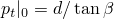. Reducing the exponent yield function into a linear form requires that 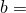 1.0 and that  ()1.

### Loading and controls

We are mainly interested in obtaining the limit footing pressure and in estimating the vertical displacement under the footing as a function of load.

A convenient way of defining a rigid and perfectly rough footing is to use an equation constraint to constrain all of the nodes under the footing to have the same displacement, which is done by retaining the central top node (node 801) to represent the footing. A vertical displacement is then applied to this node while its horizontal displacement is constrained to be zero. The total footing load is obtained as the vertical reaction force at node 801. The average footing pressure is this vertical load divided by the width of the footing.

For the nonassociated flow cases unsymmetric matrix storage and solution is used: this is essential to obtain an acceptable convergence rate since nonassociated flow plasticity results in unsymmetric stiffness matrices.

### Results and discussion

The load-displacement responses are shown in [Figure 1.15.4--3](ch01s15ach117.md#sxmlimload-results), where we also show the limit analysis (slip line) Prandtl and Terzaghi solutions, as given by Chen (1975). The nondilatant Drucker-Prager and Mohr-Coulomb models give a softer response and a lower limit load than the corresponding dilatant versions. The cap model provides a response that is comparable to the corresponding Drucker-Prager nondilatant response. This response is due to the addition of the cap and the nonassociated flow in the failure region, which combine to reduce the dilation in the model and—therefore—approximate the Drucker-Prager nondilatant flow model.

The results obtained for the nondilatant Drucker-Prager model and the corresponding cap model match closely those obtained with the nondilatant Mohr-Coulomb model. They provide almost identical limit loads, which lie between the Prandtl and Terzaghi solutions. This conclusion can be extended to general geotechnical problems that are analyzed under plane strain or axisymmetric assumptions.

### Input files

##### **Abaqus/Standard input files**

[granularlimitload_mc_nondilat.inp](../eif/granularlimitload_mc_nondilat.inp)

Mohr-Coulomb nondilatant flow case.

[granularlimitload_mc_dilat.inp](../eif/granularlimitload_mc_dilat.inp)

Mohr-Coulomb dilatant flow case.

[granularlimitload_dp_nondilat.inp](../eif/granularlimitload_dp_nondilat.inp)

Drucker-Prager nondilatant flow case.

[granularlimitload_dp_dilat.inp](../eif/granularlimitload_dp_dilat.inp)

Drucker-Prager dilatant flow case.

[granularlimitload_cap2.inp](../eif/granularlimitload_cap2.inp)

Case with cap model.

[granularlimitload_hyper_dilat.inp](../eif/granularlimitload_hyper_dilat.inp)

Hyperbolic yield criterion, dilatant case.

[granularlimitload_expo_dilat.inp](../eif/granularlimitload_expo_dilat.inp)

Exponential yield criterion, dilatant case.

##### **Abaqus/Explicit input files**

[granularlimitload_mc_nondilat_xpl.inp](../eif/granularlimitload_mc_nondilat_xpl.inp)

Mohr-Coulomb nondilatant flow case.

[granularlimitload_mc_dilat_xpl.inp](../eif/granularlimitload_mc_dilat_xpl.inp)

Mohr-Coulomb dilatant flow case.

### References

Chen,  W. F., *Limit Analysis and Soil Plasticity, *Elsevier, Amsterdam, 1975.

Mentrey,  Ph., and K. J. Willam, “Triaxial Failure Criterion for Concrete and its Generalization,” ACI Structural Journal, vol. 92, pp. 311–318, May/June 1995.

### Figures

**Figure 1.15.4–1** Model for limit load calculations on centrally loaded sand strip.

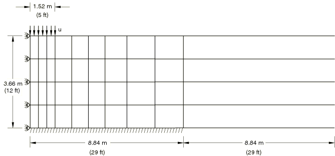

**Figure 1.15.4–2** Cap hardening curve.

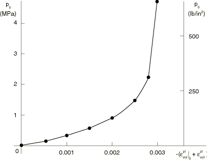

**Figure 1.15.4–3** Limit load results.

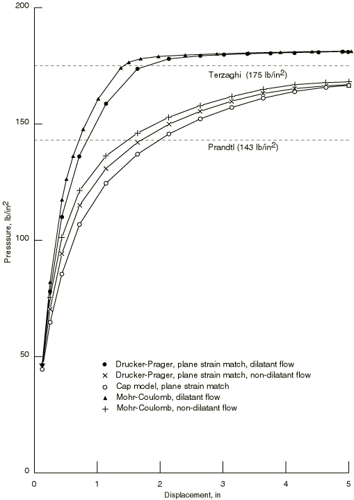

