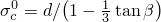
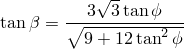
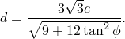
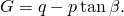
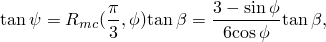
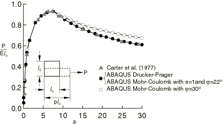
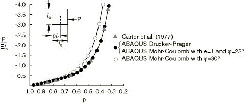

# 1.15.5 Finite deformation of an elastic-plastic granular material

**Products: **Abaqus/Standard  Abaqus/Explicit  

### Problem description

This is a simple verification study in which we develop the homogeneous, finite-strain inelastic response of a granular material subject to uniform extension or compression in plane strain. Results given by Carter et al. (1977) for these cases are used for comparison.

The specimen is initially stress-free and is made of an elastic, perfectly plastic material. The elasticity is linear, with a Young's modulus of 30 MPa and a Poisson's ratio of 0.3. Carter et al. assume that the inelastic response is governed by a Mohr-Coulomb failure surface, defined by the friction angle of the Coulomb line ( 30) and the material's cohesion (*c*). They also assume that the cohesion is twice the Young's modulus for the extension test and 10% of the Young's modulus in the compression test. The above problem is solved using the Mohr-Coulomb plasticity model in Abaqus with the friction angle and the dilation angle equal to 30. However, note that this Abaqus Mohr-Coulomb model is not identical to the classical Mohr-Coulomb model used by Carter because it uses a smooth flow potential.

An alternative solution is to use the associated linear Drucker-Prager surface in place of the Mohr-Coulomb surface. In this case it is necessary to relate  and *c* to the material constants  and  that are used in the Drucker-Prager model. Matching procedures are discussed in ["Extended Drucker-Prager models," Section 23.3.1 of the Abaqus Analysis User's Guide](../usb/usb-link.md#usb-mat-cdruckerprager). In this case we select a match appropriate for plane strain conditions: 

The first equation gives  40. Using the assumptions of Carter et al., the second equation gives *d* as 86.47 MPa ( = 120 MPa) for the extension case and *d* as 4.323 MPa ( = 6 MPa) for the compression case.

Uniform extension or compression of the soil sample is specified by displacement boundary conditions since the load-displacement response will be unstable for the extension case.

### Results and discussion

The results are shown in [Figure 1.15.5--1](ch01s15ach118.md#sxmgrandef-extension) for extension and in [Figure 1.15.5--2](ch01s15ach118.md#sxmgrandef-compression) for compression. The solutions for Abaqus/Standard and Abaqus/Explicit are the same. The Drucker-Prager solutions agree well with the results given by Carter et al.; this is to be expected since the Drucker-Prager parameters are matched to the classical Mohr-Coulomb parameters under plane strain conditions. The differences between the Abaqus Mohr-Coulomb solutions and Carter's solutions are due to the fact that the Abaqus Mohr-Coulomb model uses a different flow potential. The Abaqus Mohr-Coulomb model uses a smooth flow potential that matches the classical Mohr-Coulomb surface only at the triaxial extension and compression meridians (not in plane strain).

However, one can also obtain Abaqus Mohr-Coulomb solutions that match Carter's plane strain solutions exactly. As discussed earlier, the classical Mohr-Coloumb model can be matched under plane strain conditions to an associated linear Drucker-Prager model with the flow potential 

This match implies that under plane strain conditions the flow direction of the classical Mohr-Coulomb model can be alternatively calculated by the corresponding flow direction of the Drucker-Prager model with the dilation angle  as computed before. Therefore, we can match the flow potential of the Abaqus Mohr-Coulomb model to that of the Drucker-Prager model. Matching between these two forms of flow potential assumes  1 and results in 

which gives  22 in the Abaqus Mohr-Coulomb model. These Abaqus Mohr-Coulomb solutions are shown in [Figure 1.15.5--1](ch01s15ach118.md#sxmgrandef-extension) and [Figure 1.15.5--2](ch01s15ach118.md#sxmgrandef-compression) and match Carter's solutions exactly.

### Input files

##### **Abaqus/Standard input files**

[deformgranularmat_mc3030.inp](../eif/deformgranularmat_mc3030.inp)

Extension case with the Mohr-Coulomb plasticity model ( 30 and  30) and CPE4 elements.

[deformgranularmat_dp.inp](../eif/deformgranularmat_dp.inp)

Extension and compression cases with the linear Drucker-Prager plasticity model and CPE4 elements.

[deformgranularmat_cpe4i_dp.inp](../eif/deformgranularmat_cpe4i_dp.inp)

Extension case with the linear Drucker-Prager plasticity model and CPE4I incompatible mode elements.

[deformgranularmat_mc3030_comp.inp](../eif/deformgranularmat_mc3030_comp.inp)

Compression case with the Mohr-Coulomb plasticity model ( 30 and  30) and CPE4 elements.

[deformgranularmat_dp_comp.inp](../eif/deformgranularmat_dp_comp.inp)

Compression case with the linear Drucker-Prager plasticity model and CPE4 elements.

[deformgranularmat_mc3022.inp](../eif/deformgranularmat_mc3022.inp)

Extension case with the Mohr-Coulomb plasticity model ( 30 and  22) and CPE4 elements.

[deformgranularmat_mc3022_comp.inp](../eif/deformgranularmat_mc3022_comp.inp)

Compression case with the Mohr-Coulomb plasticity model ( 30 and  22) and CPE4 elements.

##### **Abaqus/Explicit input files**

[granular.inp](../eif/granular.inp)

Extension and compression cases with the linear Drucker-Prager plasticity model and CPE4R elements.

[deformgranularmat_mc3030_xpl.inp](../eif/deformgranularmat_mc3030_xpl.inp)

Extension case with the Mohr-Coulomb plasticity model ( 30 and  30) and CPE4R elements.

[deformgranularmat_mc3030_comp_xpl.inp](../eif/deformgranularmat_mc3030_comp_xpl.inp)

Compression case with the Mohr-Coulomb plasticity model ( 30 and  30) and CPE4R elements.

[deformgranularmat_mc3022_xpl.inp](../eif/deformgranularmat_mc3022_xpl.inp)

Extension case with the Mohr-Coulomb plasticity model ( 30 and  22) and CPE4R elements.

[deformgranularmat_mc3022_comp_xpl.inp](../eif/deformgranularmat_mc3022_comp_xpl.inp)

Compression case with the Mohr-Coulomb plasticity model ( 30 and  22) and CPE4R elements.

### Reference

Carter,  J. P., J. R. Booker, and E. H. Davis, “Finite Deformation of an Elasto-Plastic Soil,” International Journal for Numerical and Analytical Methods in Geomechanics, vol. 1, pp. 25–43, 1977.

### Figures

**Figure 1.15.5–1** Load-displacement results for uniform extension.

**Figure 1.15.5–2** Load-displacement results for uniform compression.

