# 1.15.7 Consolidation around a cylindrical heat source

**Product: **Abaqus/Standard  

This problem presents the solution of consolidation in saturated soil around a cylindrical heat source. The problem has been studied by Booker and Savvidou (1985) and represents an idealization of the problem of a canister of radioactive waste buried in saturated soil. The temperature changes that occur due to radiation of heat from the canister cause the pore water to expand a greater amount than the pores in the soil, resulting in an increase in the pore pressure around the heat source. The resulting pore pressure gradient drives pore fluid away from the heat source, resulting in the dissipation of the pore pressure with time. Booker and Savvidou developed an analytical solution for the fundamental problem of a point heat source buried deep in saturated soil. They subsequently used this analytical solution to derive an approximate solution to the problem of consolidation around a cylindrical heat source. This problem provides a verification for the coupled thermal consolidation capability in Abaqus. The analysis of saturated soils requires solution of coupled stress-diffusion equations, and the formulation used in Abaqus is described in detail in ["Analysis of porous media," Section 2.8 of the Abaqus Theory Guide](../stm/stm-link.md#stmporousmediachap). The thermal consolidation capability also solves the heat transfer equation (considering both conductive and convective effects) in a fully coupled manner with the stress-diffusion equations and, thereby, models the influence of the pore pressure on the temperature field in the pore fluid and the soil and vice versa.

 Numerical values for the parameters that define the geometry and the material properties are based on the details presented in a parametric study of this problem by Lewis and Schrefler (2000).

### Problem description

The problem setup is shown in [Figure 1.15.7--1](ch01s15ach120.md#sxmconsolheatsource-geom). A cylindrical heat source of radius 0.1604 m and height 2.5 m is embedded within a cylindrical volume of soil with radius and height both equal to 10 m. The cylindrical volume of soil, in effect, represents an infinite medium surrounding the heat source. Gravity is neglected. Because of the boundary conditions (discussed below in detail), the problem is essentially one-dimensional, the only gradient being in the radial direction. The purpose of the analysis is to predict the evolution of pore pressure and temperature throughout the soil mass, especially in the neighborhood of the heat source, as a function of time.

### Geometry and models

Only half of the problem is modeled, taking advantage of the symmetry in the vertical direction. This problem is solved using both three-dimensional and axisymmetric coupled temperature–pore pressure elements. For the purpose of presenting the results, three-dimensional element type C3D8RPT is chosen. Both the three-dimensional and axisymmetric analyses are carried out using different variants (such as reduced-integration and hybrid) of the basic three-dimensional 8-node or axisymmetric 4-node elements, as well as the modified tetrahedral elements.

The response of the soil is assumed to be linear elastic, with a Young's modulus of 60.0 MPa and a Poisson's ratio of 0.4. The specific weight of the pore fluid is assumed to be 9800.0 N/m3 (1 lb/in3). The permeability is assumed to be constant, with a value of 4.63  108 m/sec. The thermal expansion coefficients of the soil and pore fluid are assumed to be 0.3  106 per C and 0.21  105 per C, respectively. The density, specific heat, and conductivity of the soil and the pore fluid are assumed to be the same, with values of 1000 kg/m3, 40.0 cal/(kgC), and 11.9 W/cal/(mC), respectively. The void ratio is assumed to be 1.0 initially throughout the soil volume. The initial temperature and pore pressure are assumed to be zero everywhere. It is also assumed that the pores are fully saturated with pore fluid.

#### Boundary conditions

The normal (vertical) component of displacement is constrained at the base of the soil, while rigid body motion in the two lateral directions is prevented by constraining a set of points on the outer boundary. The pore pressure and the temperature are assumed to be zero at all points on the outer boundary of the soil volume. Thus, the outer boundary is assumed to be connected to a heat and fluid reservoir (as represented by the soil that surrounds the volume considered for this model) that allows transfer of heat and pore fluid such that the boundary temperature and pore pressure are maintained at the specified values. The heat source is specified as heat body flux per unit volume with a magnitude of 11.58.

### Analytical solution

There are two distinct time scales associated with this problem: one for each of the two diffusive mechanisms that are operational. The first time scale is associated with diffusive heat transfer and is given by 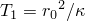, where  is the radius of the cylindrical heat source, while  represents the thermal diffusivity of the surrounding medium and is given by 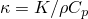. In the preceding expression, , 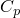, and  represent the density, specific heat capacity, and conductivity, respectively, of the surrounding medium. In general, the thermal properties used in this expression need to be weighted average quantities based on the volume fraction of the pores. However, such averaging is not necessary in this example as the thermal properties of the soil and the pore fluid are assumed to be the same. The second time scale is associated with diffusive flow of the pore fluid and is given by 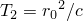. In the preceding expression, the quantity  represents the consolidation coefficient that is defined as 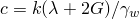, where  is the permeability of the porous medium,  and  are elastic constants, and  is the specific weight of the pore fluid. The choice of the different parameters for the problem is such that the ratio 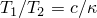 is approximately equal to 2.

Booker and Savvidou obtained an analytical solution for consolidation around a point heat source in an otherwise infinite medium and utilized this analytical solution to approximate the solution to the problem of consolidation around a cylindrical heat source. The latter was accomplished by simply integrating the point source solution throughout the cylindrical volume. The expressions for the temperature and pore pressure fields, as given in the above reference, are reproduced below. These expressions are used to obtain the analytical solutions for comparison with the numerical results. The value of the temperature at the point (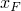, 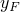, 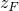) and at time  is given by

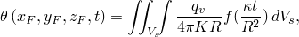

where 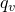 is the strength of the heat source (heat energy radiated from the source per unit volume per unit time), 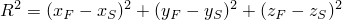, and (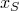, 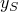, 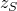) represent the coordinates of a point source within the cylindrical volume 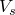. The function 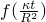 is expressed in terms of the complementary error function 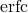 as

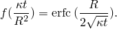

Likewise, under the assumption that 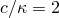, the pore pressure field can be expressed as

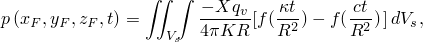

 where the quantity 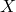 depends upon the elastic properties of the soil skeleton and the (volumetric) thermal expansion coefficients of both the soil skeleton and the pore fluid and is given by 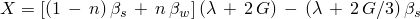. Booker and Savvidou note that the temperature reaches a maximum value of 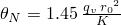 at the midpoint of the cylindrical source. If the soil were to be impermeable (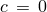), the pore pressure would reach a maximum value of 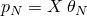 at the same point.

The expression for pore pressure given in the above paragraph clearly suggests that the effect of pore fluid flow is to reduce (with time) the pore pressure at a given point. For the special case of an impermeable fluid, the pore pressure will simply build up over time and never reduce. On the other hand, if 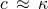, the fluid diffuses at the same rate as the heat and, hence, the pore pressure never builds up.

### Time stepping

The accuracy of the time integration for the transient soils consolidation procedure that also models heat transfer is controlled by the maximum allowable pore pressure and temperature changes per time step. Even in a linear problem these values control the accuracy of the solution because the time integration operators for the consolidation and heat transfer problems are not exact (the backward difference rule is used in both cases). In this case the allowable pore pressure change per time step is chosen as 0.5 Pa, which is a relatively large value compared to 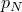. Simulations with smaller values, such as 0.1 Pa and 0.075  Pa, produce essentially the same results, although the analysis takes progressively more increments to complete with lower values. The allowable temperature change per time step is chosen as 0.003C, which is approximately 0.1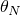. A value of 0.0003C (along with a value of 0.075 Pa) produced essentially the same results, although the analysis took a significantly larger number of increments to complete.

The analysis is continued for a time period of approximately 1000 .

The simulations use solution controls to specify a nondefault initial value of the time average pore fluid flux. The default choice may not be appropriate in situations such as those encountered in the present problem, where the fluid velocities are, in relative terms, lower compared to typical flux values encountered for other fields (such as displacements or rotations). Without the above specification, the increments would be treated as linear from the viewpoint of the continuity equation. In other words, without using solution controls to specify a nondefault initial value of the time average pore fluid flux, the pore fluid part of the incrementation will be treated as linear. Consequently, the continuity equation would be assumed to have been satisfied at the first iteration itself, without performing any further iterations to compute corrections to pore pressure.

For the pore fluid flow equations, the simulations also use a nondefault and a relatively large value of the ratio of the largest residual flux to the average flux, which sets the convergence criterion for an increment. This setting is helpful as the fluid velocity in this problem is very small and ensures that the pore pressure increment is not considered converged without at least one correction (iteration). There is not much advantage in reducing the tolerance further as the flow residuals are already sufficiently small, and any further reduction in the residual does not make any difference to the overall solution.

### Results and discussion

The automatic time incrementation capabilities of Abaqus/Standard were used for all the simulations. As discussed earlier, the total number of increments to complete the analysis depends strongly on the choices of the maximum allowable pore pressure and temperature changes per time step for the transient soils consolidation procedure. For relatively loose tolerances, the time increment size increases by a factor of approximately 25,000 from the beginning to the end of the analysis, while for relatively tight tolerances the factor reduces to approximately 20,000. These very large changes in the time increment size are typical of problems that are diffusion dominated and highlight the value of using automatic time stepping with an unconditionally stable integration operators for such problems.

 [Figure 1.15.7--2](ch01s15ach120.md#sxmconsolheatsource-temp) and [Figure 1.15.7--3](ch01s15ach120.md#sxmconsolheatsource-press) show the variations of temperature and pore pressure, respectively, with time at three different radii from the cylindrical heat source. These locations correspond to the outer surface of the heat source (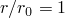), and distances of 2 (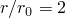) and 5 (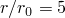) times, respectively, of the radius of the heat source, along . The axes for temperature, pore pressure, and time (the latter shown on a logarithmic scale) are normalized by the quantities , , and , respectively. 

The analytical solutions to the problem, based on the equations presented earlier, are also shown in the figures using data points (as opposed to continuous curves) and are labeled `Analytical-1`, `Analytical-2`, and `Analytical-5`, respectively, and correspond to the three different radii discussed above. The analytical solutions were obtained by evaluating the integrals numerically. 

The temperature results suggest that at the surface of the heat source, the temperature approaches  with time, while at distances further away from the heat source the temperature increases with time at a slower rate. The results agree well with the analytical results, especially relatively early in the analysis. The mesh used for the simulations is relatively coarse with 2718 elements. The agreement between the finite element predictions and the analytical solutions is much better at all times if the analysis is carried out with a more refined mesh consisting of 9816 elements. 

There is an initial elevation, followed by a reduction in the pore pressure with time. The initial increase in pore pressure is due to the relatively higher volumetric expansion of the pore fluid compared to the pores. A gradient in the pore pressure field is necessary to drive pore fluid flow. The results suggest that at relatively early times, the diffusion of the pore fluid away from a material point is not strong enough to offset the increase in volume associated with an increase in temperature. Hence, the pore pressure increases with time. However, with the passage of time the rate of increase of temperature at a material point slows down, and the diffusion of pore fluid picks up such that any further increase in temperature (and the associated volume change) does not result in additional increase in pore pressure, and the pore pressure decays with time.

[Figure 1.15.7--4](ch01s15ach120.md#sxmconsolheatsource-presscontr) and [Figure 1.15.7--5](ch01s15ach120.md#sxmconsolheatsource-flvelvectr) show the contour plot of pore pressure and a vector plot of the magnitude of the fluid velocity, respectively, at some intermediate time (approximately 5700 seconds) during the analysis. The distribution of pore pressure is approximately axisymmetric, with higher pore pressures closer to the central heat source. The radial gradient in the pore pressure drives the pore fluid flow, resulting in pore fluid velocity vectors that point approximately in the radial direction. The mesh itself is not axisymmetric, which results in small variations in the solution from a purely axisymmetric state.

While this problem illustrates the coupled nature of the physical problem of a heat source embedded in soil, the coupling is of a relatively weak nature. Thus, while the pore fluid flow field is mainly driven by the relative thermal volumetric expansions of the pore fluid and the pores and, hence, depends directly on the temperature field, the heat transfer problem is insensitive to the pore fluid flow. A stronger coupling could be included, for example, by considering convective heat transfer where the rate of transfer of heat is directly influenced by the pore fluid velocities. Additional potential sources of coupling include the dependence of permeability on the void ratio, which can depend on the level of straining (including thermal expansion) in the material. Although such effects are accounted for in the formulation in Abaqus/Standard, they are neglected in the present problem.

### Input files

[pointheatsrcconsl_c3d8pt.inp](../eif/pointheatsrcconsl_c3d8pt.inp)

Consolidation analysis with heat transfer using element type C3D8PT.

[pointheatsrcconsl_c3d8pht.inp](../eif/pointheatsrcconsl_c3d8pht.inp)

Consolidation analysis with heat transfer using element type C3D8PHT.

[pointheatsrcconsl_c3d8rpt.inp](../eif/pointheatsrcconsl_c3d8rpt.inp)

Consolidation analysis with heat transfer using element type C3D8RPT.

[pointheatsrcconsl_c3d8rpht.inp](../eif/pointheatsrcconsl_c3d8rpht.inp)

Consolidation analysis with heat transfer using element type C3D8RPHT.

[pointheatsrcconsl_cax4pt.inp](../eif/pointheatsrcconsl_cax4pt.inp)

Consolidation analysis with heat transfer using element type CAX4PT.

[pointheatsrcconsl_cax4rpt.inp](../eif/pointheatsrcconsl_cax4rpt.inp)

Consolidation analysis with heat transfer using element type CAX4RPT.

[pointheatsrcconsl_cax4rpht.inp](../eif/pointheatsrcconsl_cax4rpht.inp)

Consolidation analysis with heat transfer using element type CAX4RPHT.

[pointheatsrcconsl_c3d10mpt.inp](../eif/pointheatsrcconsl_c3d10mpt.inp)

Consolidation analysis with heat transfer using element type C3D10MPT.

### References

Booker,  J. R., and C. Savvidou, “Consolidation Around a Point Heat Source,” International Journal for Numerical and Analytical Methods in Geomechanics, vol. 9, pp. 173–184, 1985.

Lewis,  R. W., and B. A. Schrefler, *The Finite Element Method in the Static and Dynamic Deformation and Consolidation of Porous Media, *John Wiley & Sons Ltd., 1998.

### Figures

**Figure 1.15.7–1** Geometry of the heat source that is embedded in an infinite soil medium (modeled as a cylindrical domain with finite dimensions).

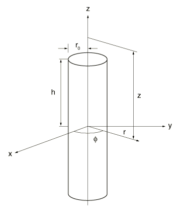

**Figure 1.15.7–2** Variation of normalized temperature with normalized time at three different radii.

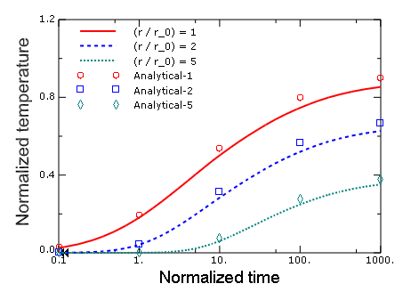

**Figure 1.15.7–3** Variation of normalized pore pressure with normalized time at three different radii.

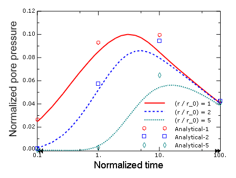

**Figure 1.15.7–4** Contour plot of pore pressure at an intermediate time.

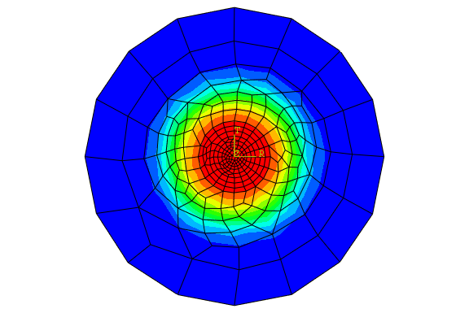

**Figure 1.15.7–5** Vector plot of pore fluid velocity at an intermediate time.

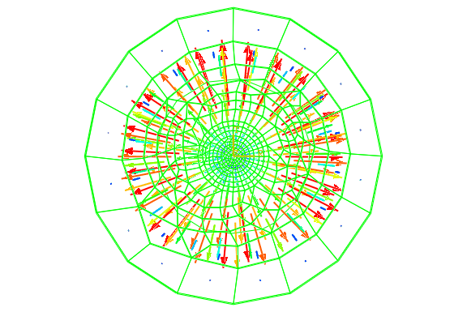

