# 1.16.2 Contour integral evaluation: three-dimensional case

**Product: **Abaqus/Standard  

This example is an illustration of contour integral evaluation in a fully three-dimensional crack configuration. The example provides validation of the method (for linear elastic response), because comparative results are available for this geometry.

Abaqus provides values of the *J*-integral; stress intensity factor, ; and *T*-stress as a function of position along a crack front in three-dimensional geometries. Several contours can be used; and, since the integral should be path independent, the scatter in the values obtained with different contours can be used as an indicator of the quality of the results. The domain integral method used to calculate the contour integral in Abaqus generally gives accurate results even with rather coarse models, as is shown in this case. Abaqus offers the evaluation of these parameters for fracture mechanics studies based on either the conventional finite element method or the extended finite element method (XFEM).

### Problem description

Two geometries are analyzed in this example. In addition, both the conventional finite element method and the extended finite element method are used.

#### Semi-elliptic crack in a half-space

The first geometry analyzed is a semi-elliptic crack in a half-space and is shown in [Figure 1.16.2--1](ch01s16ach122.md#sxm3djint-surfcrack). The crack is loaded in Mode I by far-field tension. When used with the conventional finite element method, due to symmetry, only one-quarter of the body needs to be analyzed. The mesh is shown in [Figure 1.16.2--2](ch01s16ach122.md#bmk-elliptic-crack-mesh). Reduced-integration elements (C3D20R) are used, with the midside nodes moved to the quarter-point position on those element edges that focus onto the crack tip nodes. This quarter-point method provides a strain singularity and, thus, improves the modeling of the strain field adjacent to the crack tip (see ["Contour integral evaluation: two-dimensional case," Section 1.16.1](ch01s16ach121.md), for a discussion of this technique). The normal to the crack front is used to specify the crack extension direction, as shown in [Figure 1.16.2--3](ch01s16ach122.md#bmk-ellipticcrsurf-normal). The mesh extends out far enough to cause the boundary conditions on the far faces of the model to have negligible effect on the solution. Three rings of elements surrounding the crack tip are used to evaluate the contour integrals. 

When used with the extended finite element method, the mesh is not required to match the cracked geometry. The presence of a crack is ensured by the special enriched functions in conjunction with additional degrees of freedom. This approach also removes the requirement to define the crack front explicitly or to specify the virtual crack extension direction when evaluating the contour integral. The data required for the contour integral are determined automatically based on the level set signed distance functions at the nodes in an element. The mesh with first-order brick elements (C3D8) for the first geometry is shown in [Figure 1.16.2--4](ch01s16ach122.md#bmk-elliptic-crack-xfem-mesh); and the crack front, which is represented by the level set contour plot of output variable PSILSM, is shown in [Figure 1.16.2--5](ch01s16ach122.md#bmk-elliptic-crackfront-xfem).

#### Semi-elliptic crack in a rectangular plate

The second geometry analyzed is a semi-elliptic crack in a rectangular plate, as shown in [Figure 1.16.2--6](ch01s16ach122.md#sxm3dcint-surfcrack). The plate is subjected to uniform tension. Due to symmetry only one-quarter of the body needs to be analyzed when used with the conventional finite element method. The dimensions of the plate relative to the plate thickness, *t*, are as follows: the half-height 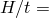 16; the half-width 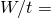 8; the mid-plane crack depth 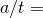 0.6; and the surface crack half-length 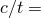 2.5, which results in a surface crack aspect ratio of 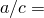 0.24. The mesh for the plate using the conventional finite element method is shown in [Figure 1.16.2--7](ch01s16ach122.md#bmk-ellipticcrack-meshrectplate), with its profile on the crack plane shown in [Figure 1.16.2--8](ch01s16ach122.md#bmk-ellipticcrrect-meshprofile). The model uses C3D8 elements for the conventional finite element method and both C3D8 and C3D4 elements for the extended finite element method.

### Results and discussion

The results are presented for each of the geometries.

#### Semi-elliptic crack in a half-space

The *J*-integral values computed by Abaqus using the conventional finite element method for the first geometry are given in [Table 1.16.2--1](ch01s16ach122.md#table-3djint-estimates) as functions of angular position  along the crack front, where  is defined by 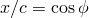, 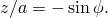 The values show a rather smooth variation along the crack front and are reasonably path independent; that is, the values provided by the three contours are almost the same. There is some loss of path independence and, hence, presumably, of accuracy as the crack approaches the free surface (at 0). This accuracy loss is assumed to be attributable to the coarse and rather distorted mesh in that region.

The stress intensity factors  obtained using the conventional finite element method along the crack line are compared in [Table 1.16.2--2](ch01s16ach122.md#table-3djint-strssintense) and in [Figure 1.16.2--9](ch01s16ach122.md#bmk-kfac-ellipticcr) with those obtained by Newman and Raju (1979), who used a nodal force method to compute  from a finite element model that had 3078 degrees of freedom. The *J*-integral values calculated by Abaqus are converted to  using 

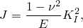

where  is the Poisson's ratio and *E* is the Young's modulus. The fourth column of [Table 1.16.2--2](ch01s16ach122.md#table-3djint-strssintense) presents the stress intensity factors, , that are calculated directly by Abaqus using the conventional finite element method. For comparison, the stress intensity factors  obtained using the extended finite element method are also included in [Figure 1.16.2--9](ch01s16ach122.md#bmk-kfac-ellipticcr). The comparisons show good agreement with the results published by Newman and Raju (1979). 

#### Semi-elliptic crack in a rectangular plate

The stress intensity factor values, , computed by Abaqus based on the conventional finite element method for the second geometry are compared with the  results calculated by Nakamura and Parks (1991) in [Figure 1.16.2--10](ch01s16ach122.md#bmk-rectplate-kfac), and the agreement between them is excellent. The results obtained using the extended finite element method with linear brick or linear tetrahedron elements are also included in [Figure 1.16.2--10](ch01s16ach122.md#bmk-rectplate-kfac) for comparison.

[Figure 1.16.2--11](ch01s16ach122.md#bmk-rectplate-tstr) presents the *T*-stresses calculated by Abaqus and those obtained by Nakamura and Parks (1991) and Wang and Parks (1992). Comparison shows good agreement between them, especially near the middle of the crack line.

### Python scripts

### Input files

The input files below create models with different meshes than the Abaqus/CAE models created by the Python scripts above. The results are identical in both cases.

[jintegral3d.inp](../eif/jintegral3d.inp)

First model with conventional finite element method.

[jintegral3d_node.inp](../eif/jintegral3d_node.inp)

Nodal coordinates for the first model. These have been generated by a special-purpose program.

[contourintegral_ellip_xfem_c3d8.inp](../eif/contourintegral_ellip_xfem_c3d8.inp)

First model with extended finite element method.

[jktintegral3d.inp](../eif/jktintegral3d.inp)

Second model with conventional finite element method.

[jktintegral3d_node.inp](../eif/jktintegral3d_node.inp)

Node definitions for jktintegral3d.inp.

[jktintegral3d_element.inp](../eif/jktintegral3d_element.inp)

Element definitions for jktintegral3d.inp.

[contourintegral_ellip_plate_xfem_c3d8.inp](../eif/contourintegral_ellip_plate_xfem_c3d8.inp)

Second model with linear brick elements with extended finite element method.

[contourintegral_ellip_plate_xfem_c3d4.inp](../eif/contourintegral_ellip_plate_xfem_c3d4.inp)

Second model with linear tetrahedron elements with extended finite element method.

### References

Nakamura,  T., and D. M. Parks, “Determination of Elastic *T*-Stress along Three-Dimensional Crack Fronts Using an Interaction Integral,” International Journal of Solids and Structures, vol. 28, pp. 1597–1611, 1991.

Newman,  J. C., and I. S. Raju, “Stress-Intensity Factors for a Wide Range of Semi-Elliptical Surface Cracks in Finite Thickness Plates,” Engineering Fracture Mechanics, vol. 11, pp. 817–829, 1979.

Wang,  Y-Y., and D. M. Parks, “Evaluation of the Elastic *T*-Stress in Surface-Cracked Plate Using the Line-Spring Method,” International Journal of Fracture, vol. 56, pp. 25–40, 1992.

### Tables

**Table 1.16.2–1** *J*-integral estimates for semi-elliptic crack ( 103 N/mm (top);  103 lb/in (bottom)).
| Crack Front Location,  (deg) | Contour | Average Value |
| --- | --- | --- |
| 1 | 2 | 3 |
| 0.00 | 0.8081 | 0.8232 | 0.8222 | 0.8178 |
| 4.6099 | 4.6964 | 4.6907 | 4.6656 |
| 11.25 | 0.7817 | 0.7818 | 0.7840 | 0.7825 |
| 4.4597 | 4.4599 | 4.4727 | 4.4641 |
| 22.50 | 0.8703 | 0.8814 | 0.8834 | 0.8783 |
| 4.9647 | 5.028 | 5.0397 | 5.0108 |
| 33.75 | 1.0300 | 1.0458 | 1.0485 | 1.0415 |
| 5.8761 | 5.9662 | 5.9817 | 5.9413 |
| 45.00 | 1.2236 | 1.2229 | 1.2261 | 1.2242 |
| 6.9801 | 6.9762 | 6.9947 | 6.9836 |
| 56.25 | 1.3808 | 1.3800 | 1.3836 | 1.3815 |
| 7.8771 | 7.8725 | 7.8933 | 7.8809 |
| 67.50 | 1.4488 | 1.4723 | 1.4762 | 1.4658 |
| 8.2649 | 8.3991 | 8.4213 | 8.3617 |
| 78.75 | 1.5746 | 1.5745 | 1.5786 | 1.5759 |
| 8.9827 | 8.9818 | 9.0053 | 8.8989 |
| 90.00 | 1.5572 | 1.5783 | 1.5825 | 1.5727 |
| 8.8832 | 9. | 9.0275 | 8.9715 |

**Table 1.16.2–2** Comparison of computed Mode I stress intensity factors (N/mm2–mm1/2 (top); lb/in2–in1/2 (bottom)).
| Crack Front Location,  (deg) | Newman and Raju | Average Value with Conventional Method (calculated from *J*-integral) | Average Value with Conventional Method (calculated directly by Abaqus) |
| --- | --- | --- | --- |
| 0.00 | 12.99 | 13.64 | 13.23 |
| 373.60 | 392.19 | 380.47 |
| 11.25 | 13.23 | 13.34 | 13.48 |
| 380.50 | 383.62 | 387.66 |
| 22.50 | 14.26 | 14.13 | 14.06 |
| 410.20 | 406.43 | 404.52 |
| 33.75 | 15.63 | 15.39 | 15.31 |
| 449.60 | 442.56 | 440.37 |
| 45.00 | 16.90 | 16.68 | 16.91 |
| 486.20 | 479.82 | 486.35 |
| 56.25 | 17.92 | 17.72 | 17.96 |
| 515.40 | 509.71 | 516.65 |
| 67.50 | 18.68 | 18.26 | 18.16 |
| 537.30 | 525.03 | 522.23 |
| 78.75 | 19.12 | 18.93 | 18.79 |
| 554.40 | 544.40 | 540.48 |
| 90.00 | 19.27 | 18.93 | 18.79 |
| 554.40 | 543.84 | 546.17 |

### Figures

**Figure 1.16.2–1** Semi-elliptic surface crack in a half-space.

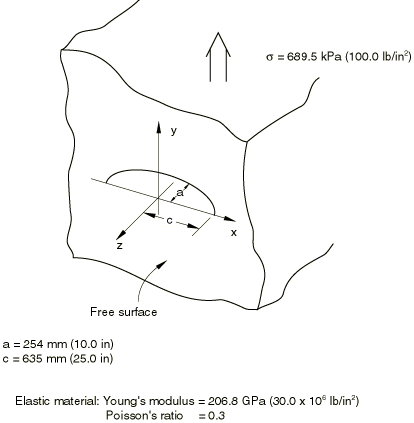

**Figure 1.16.2–2** Mesh for semi-elliptic surface crack problem with conventional finite element method.

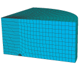

**Figure 1.16.2–3** Normal to the crack front is used to define the crack extension direction.

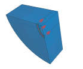

**Figure 1.16.2–4** Mesh for semi-elliptic surface crack problem with extended finite element method.

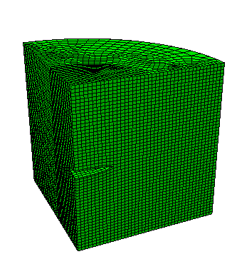

**Figure 1.16.2–5** Crack front for the semi-elliptic surface crack problem with extended finite element method.

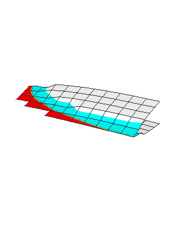

**Figure 1.16.2–6** Semi-elliptic surface crack in a rectangular plate.

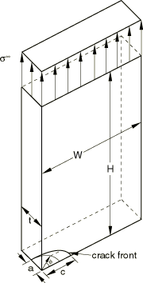

**Figure 1.16.2–7** Mesh for semi-elliptic surface crack in a rectangular plate with conventional finite element method.

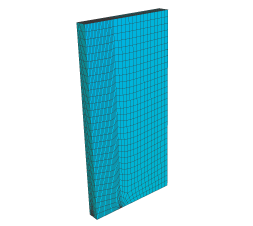

**Figure 1.16.2–8** Mesh profile on the crack surface with conventional finite element method.

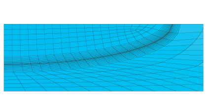

**Figure 1.16.2–9** Stress intensity factors computed for a semi-elliptic crack.

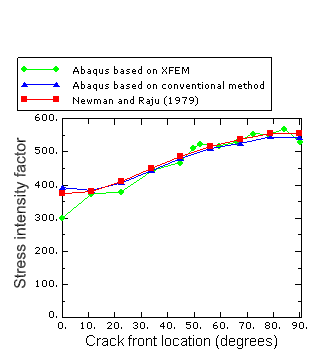

**Figure 1.16.2–10** Stress intensity factors computed for a semi-elliptic crack in a rectangular plate.

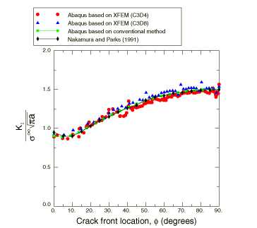

**Figure 1.16.2–11** *T*-stresses computed for a semi-elliptic crack in a rectangular plate.

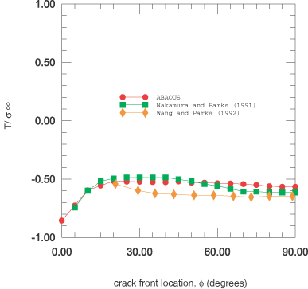

