# 1.16.6 Ct-integral evaluation

### 1.16.6 *Ct*-integral evaluation

**Product: **Abaqus/Standard  

This example illustrates the evaluation of the -integral as a function of time for a stationary crack under secondary power law creep conditions.

Because of the time-dependent effects of creep deformation, there is no one parameter that characterizes the stress state around the crack tip for all circumstances. The appropriate parameter to use depends on the details of the constitutive law (whether the law describes primary, secondary, or tertiary creep) and on the stage of deformation of the material around the crack tip. In addition, creep deformation can occur in either an initially elastic or an initially plastic stress field. Riedel (1981) discusses which parameters are correct for different circumstances. When the initial response of the material is linear elastic and secondary creep dominates the creep behavior, the stress intensity factor, , and the path independent integral, , are the relative loading parameters. For small-scale creep (that is, when elastic strains dominate almost everywhere in the specimen except in a small zone that grows around the crack tip),  governs crack growth initiation. If, however, the creep zone becomes large compared to the specimen size and the elastic strains small compared to the creep strains,  is the appropriate fracture parameter.

The  fracture mechanics parameter offered by Abaqus characterizes crack growth behavior for a wide range of creep conditions. For stationary cracks  characterizes the rate of growth of the crack-tip creep zone under small-scale creep conditions and is also related to the stress intensity factor 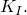 Under extensive secondary creep conditions, 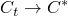 and is path independent throughout the extensive creep region.

### Problem description

A shallow edge-crack in a half space in plane strain, subjected to constant Mode I far-field tensile loading, is considered. The geometry is shown in [Figure 1.16.6--1](ch01s16ach126.md#sxmctint-geom). Initially the edge crack is stress free. At time 0+ a tensile stress, 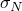, is applied suddenly on the circular boundary and held constant thereafter. The instantaneous response is purely elastic since creep deformation develops over a period of time. The crack-tip stress field is, thus, initially characterized by linear elastic fracture mechanics. With the load held constant, subsequent creep deformation causes a relaxation of the crack-tip stresses until, as , a steady-state stress distribution is reached.

The results for this problem are documented by Bassani and McClintock (1981).

The crack length, *a*, is 10 mm. As a result of symmetry, only one-half of the body needs to be analyzed. The mesh is comprised of CPE8R elements. Eleven rings of elements are focused radially at the crack tip, with 12 element divisions in the 180 modeled circumferentially. This focused portion of the mesh is connected to the outer portion shown in [Figure 1.16.6--2](ch01s16ach126.md#sxmctint-mesh).

The innermost ring of elements at the crack tip are degenerated into triangles. The three nodes along one side of the 8-node element are defined such that they share the same location; the other side nodes remain at the midpoints. Each of the three collapsed nodes can displace independently, so the interpolation function exhibits a *r*1 singularity in displacement derivatives.

The reduced-integration (CPE8R) element is chosen since it does not “lock” during the incompressible creep deformation. The incompressibility constraint can also be modeled successfully with hybrid (mixed) formulation elements. The results obtained with both elements are in close agreement. A file with input data using hybrid elements is provided with the Abaqus release.

No mesh convergence studies have been performed.

### Material

The material behavior includes linear elasticity and secondary creep response. The material is assumed to be isotropic elastic, with a Young's modulus of 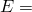 200 GPa and a Poisson's ratio of 0.3, and with uniaxial creep behavior defined by

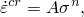

where *A* is 5.0  1012 per hour (stress in MPa) and 3.

### Loading

The load is a constant far-field tension of 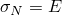/2000 applied to the circular boundary edge of the model by applying concentrated loads (equivalent to a pressure of 100 MPa) to the nodes on the circumference. The load is applied instantaneously and then held constant until steady-state creep conditions are reached. The initial application of the load is assumed to occur so quickly that it involves purely elastic response. This behavior is obtained by using the static procedure. The creep response is then developed in a second step, using the quasi-static procedure.

During the quasi-static step a user-specified tolerance is required to control the time increment choice and, hence, the accuracy of the transient creep solution. A maximum elastic principal stress of 2800 MPa occurs at the crack tip; therefore, errors in stress of about 20 MPa will make a small difference to the creep strain added within an increment. Converting this stress error to a strain error by dividing it by the elastic modulus gives a value for the accuracy tolerance of 1  104. If only an estimate of  is required, a high value for the tolerance can be used. This allows Abaqus to use the largest possible time increments that result in a  value of low accuracy during the transient but reach the steady-state  value at minimum cost. 1000 hours of response are requested, which is sufficient to reach steady-state conditions.

### Results and discussion

[Figure 1.16.6--3](ch01s16ach126.md#sxmctint-disp) shows the displaced shape of the mesh near the crack tip at steady state.

The -integral is only path independent in the limiting case when steady-state conditions are reached. The path dependence of  during transient creep is shown in [Figure 1.16.6--4](ch01s16ach126.md#sxmctint-distance). The figure shows the variation of  with the radius of the contour, *r*, measured at different times during the early part of the creep history (before the transition time, 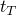, defined at the end of this discussion, is reached). We define the radius for the *n*th contour, *r*, as the distance from the crack tip to the outer ring of nodes of the *n*th ring of elements surrounding the crack tip. Path independence is reached as time increases. The difference between the second and fifth contour values is less than 4% at . This difference decreases further until the values become path independent at steady state.

[Figure 1.16.6--5](ch01s16ach126.md#sxmctint-time) compares the  values predicted by Abaqus (Line 4) with the steady-state  value, as well as with two approximate models available in literature. Since  is defined only on a contour of infinitesimal dimension around the crack tip at early times (before steady-state conditions apply), it is necessary to estimate its value by extrapolating the values provided by the Abaqus contour integral to a contour with zero radius. As explained in ["Contour integral evaluation," Section 11.4.2 of the Abaqus Analysis User's Guide](../usb/usb-link.md#usb-anl-acontintegral), each contour integral evaluation in Abaqus is made by applying a uniform virtual perturbation to the nodes within a ring of elements surrounding the crack tip. Therefore, in a plane strain case such as this, the only contribution from the *n*th contour integral comes from the *n*th ring of elements, counting outward from the crack tip. For the purpose of this extrapolation we use the same definition of radius for the *n*th contour integral as described in the previous paragraph. We ignore the first contour in the extrapolation, since experience has shown that the first contour is of significantly lower accuracy than the other contours. The  values shown in [Figure 1.16.6--5](ch01s16ach126.md#sxmctint-time) are then based on a least-squares fit of a second-order polynomial 

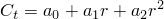

to the four remaining contour integral values provided by Abaqus at each time point and recording the value provided by this curve fit at 0. We have not investigated the accuracy of this extrapolation technique.

The  value shown in [Figure 1.16.6--5](ch01s16ach126.md#sxmctint-time) is also obtained by using another technique in Abaqus. By interpreting strains and displacements as their rate counterparts and *J* as , the fully plastic solutions obtained from a power law hardening material can be applied directly to find  values for an equivalent power law creep model. In other words, power law creep is analogous to the fully plastic limit of power law hardening plasticity, so

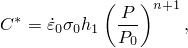

where  is a reference stress;  is the creep strain rate at the reference stress;  is a dimensionless function of the power law exponent, *n*, and of geometric parameters; *P* is the loading; and 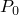 is the limit load. For this particular example, however, the applied far-field tension, , is insufficient to cause a fully plastic zone to develop; therefore, the *J* value cannot be directly interpreted as 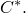 To obtain the  value from an equivalent Ramberg-Osgood material model in such a case, the following procedure is followed: The structure is loaded until a fully plastic zone exists in a zone surrounding the crack tip. For this purpose a fully plastic static analysis is used to monitor the progress of the solution in the element set containing the 11 rings of radially focused elements ([Figure 1.16.6--3](ch01s16ach126.md#sxmctint-disp)). A fully plastic solution is obtained at a load of 66.3 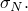 The *J* value obtained at this load is then used to evaluate the calibration function , which, in turn, is used to obtain  at a load of  This value is shown as Line 1 in [Figure 1.16.6--5](ch01s16ach126.md#sxmctint-time).

[Figure 1.16.6--5](ch01s16ach126.md#sxmctint-time) also shows the Riedel and Rice (1980) approximation. They proposed the following relation between  and the stress intensity factor  for small-scale creep:

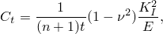

where *n* is the power law constant and *E* and  are elastic constants. This approximation is shown as Line 2 in [Figure 1.16.6--5](ch01s16ach126.md#sxmctint-time).

The remaining curve in [Figure 1.16.6--5](ch01s16ach126.md#sxmctint-time), Line 3, represents the interpolation between short and long time behavior proposed by Riedel (1981):

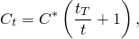

where the transition time from small-scale creep to extensive creep is given by 

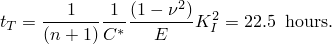

### Input files

[ctintegral_cpe8r.inp](../eif/ctintegral_cpe8r.inp)

CPE8R elements.

[ctintegral_cstar.inp](../eif/ctintegral_cstar.inp)

Used to obtain the  value. The model uses the Ramberg-Osgood deformation plasticity law.

[ctintegral_cpe8rh.inp](../eif/ctintegral_cpe8rh.inp)

CPE8RH elements.

[ctintegral_cpe8r_systemc.inp](../eif/ctintegral_cpe8r_systemc.inp)

Same as ctintegral_cpe8r.inp except that the [*NGEN](../key/key-link.md#usb-kws-mngen) option with the SYSTEM=C parameter is included.

### References

Bassani,  J. L., and F. A. McClintock, “Creep Relaxation of Stress Around a Crack Tip,” International Journal of Solids and Structures, vol. 17, pp. 479–492, 1981.

Riedel,  H., “Creep Deformation at Crack Tips in Elastic-Viscoplastic Solids,” Journal of Mechanics and Physics of Solids, vol. 29, pp. 35–50, 1981.

Riedel,  H., and J. R. Rice, “Tensile Cracks in Creeping Solids,” Fracture Mechanics: Twelfth conference, ASTM STP 700, American Society for Testing of Materials, pp. 112–130, 1980.

### Figures

**Figure 1.16.6–1** Geometry for edge-crack specimen under plane strain and constant nominal stress conditions.

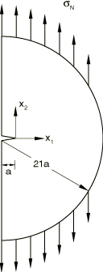

**Figure 1.16.6–2** Mesh for portion of model outside the 11 rings of radially focused elements.

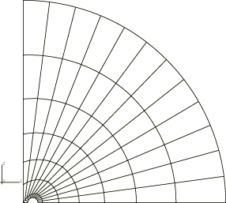

**Figure 1.16.6–3** Displaced shape showing the 11 rings of focused elements near the crack tip.

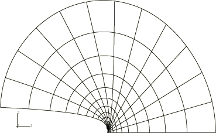

**Figure 1.16.6–4** Normalized  values (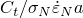) versus normalized distance from crack face (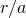).

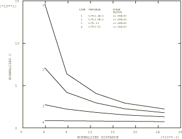

**Figure 1.16.6–5** Normalized  values () versus normalized time (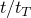).

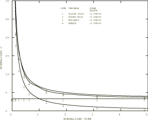

