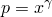
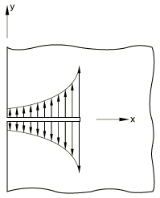

# 1.16.7 Nonuniform crack-face loading and J-integrals

### 1.16.7 Nonuniform crack-face loading and *J*-integrals

**Product: **Abaqus/Standard  

### Problem description

For the two-dimensional case an edge crack of length 1 m is modeled in a linear elastic specimen. The results are effectively for an infinitely long plate. The geometry is symmetric about the crack line, so only the top half is modeled. The geometry is meshed using CPE8R elements. The crack faces are loaded in five steps. In the first step a load of constant magnitude 1 MPa is applied. In all subsequent steps the load is zero at the surface of the specimen and has magnitude 1 MPa at the crack tip. The load varies linearly in Step 2, quadratically in Step 3, cubically in Step 4, and quartically in Step 5.

For the three-dimensional case the model from [3DDoubleEdgedNotchC3D20_model.py](../eif/3DDoubleEdgedNotchC3D20_model.py) in ["Contour integral evaluation: two-dimensional case," Section 1.16.1](ch01s16ach121.md), is modified to apply a uniform crack-face loading via user subroutine [`DLOAD`](../sub/sub-link.md#sub-xsl-dload).

### Results and discussion

Results for the two-dimensional and three-dimensional analyses are discussed in the following sections.

#### Two-dimensional results

Abaqus results are compared with the results taken from page 8.8 of *The Stress Analysis of Cracks Handbook* by H. Tada, P. C. Paris, and G. R. Irwin. The crack-face loading is given by  MPa. Results for the *J*-integral in Pa are presented in [Table 1.16.7--1](ch01s16ach127.md#table-jintresults).

#### Three-dimensional results

The results should be the same as those shown in ["Contour integral evaluation: two-dimensional case," Section 1.16.1](ch01s16ach121.md). The results are within a difference of 0.1%.

### Python scripts

### Input files

The input files listed below are provided for users who prefer to use the Abaqus keyword interface instead of Abaqus/CAE. The meshes created in these input files are different from those created by using the Python scripts; however, the results are of the same accuracy.

[pjinnu2d.inp](../eif/pjinnu2d.inp)

Checks the nonuniform loads applied to plane strain elements via user subroutine [`DLOAD`](../sub/sub-link.md#sub-xsl-dload). 

[pjinnu2d.f](../eif/pjinnu2d.f)

User subroutine [`DLOAD`](../sub/sub-link.md#sub-xsl-dload) used in pjinnu2d.inp.

[pjinnu3d.inp](../eif/pjinnu3d.inp)

Uses subroutine [`DLOAD`](../sub/sub-link.md#sub-xsl-dload) and, therefore, “nonuniform” load types, to apply a uniform load to the crack faces.

[pjinnu3d.f](../eif/pjinnu3d.f)

User subroutine [`DLOAD`](../sub/sub-link.md#sub-xsl-dload) used in pjinnu3d.inp.

### Table

**Table 1.16.7–1** *J*-integral results in Pa.
|  | 0 | 1 | 2 | 3 | 4 |
| --- | --- | --- | --- | --- | --- |
| Tada et al. | 17.98 | 6.67 | 3.94 | 2.78 | 2.27 |
| Abaqus | 18.57 | 6.81 | 4.01 | 2.81 | 2.16 |

### Figure

**Figure 1.16.7–1** Crack model.

