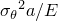
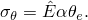
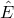
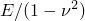
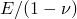
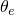
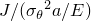
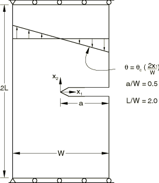
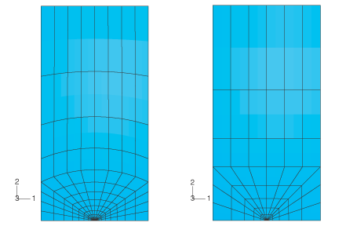

# 1.16.8 Single-edged notched specimen under a thermal load

**Product: **Abaqus/Standard  

Thermal loading is of major concern in many components, especially in process and power plants and high-performance engines. The purpose of this example is to illustrate analysis procedures for evaluating the *J*-integral in flawed structures subjected to severe thermal events, such as thermal shocks. The example shows how Abaqus can be used to generate temperature solutions that can then be used for *J*-integral analysis.

### Problem description

The problem is the case for which Shih et al. (1986) provide results. The example is a single-edged notched specimen, restrained against axial motion at its ends and subjected to a linear temperature variation across its width. The particular geometry studied is cracked halfway through its thickness; the total length of the specimen (2*L*) is 2.032 m (80 in), and the total width is 508 mm (20 in). The geometry and thermal loading are shown in [Figure 1.16.8--1](ch01s16ach128.md#sxmthermload-geom).

The material is isotropic and linear elastic, with a Young's modulus 207 GPa (30  106 lb/in2), a Poisson's ratio 0.3, and a thermal expansion coefficient 1.35  105 per C (7.5  106 per F).

The temperature gradient is given about a mean temperature change of zero. If the mean temperature change were nonzero, the fixed axial end restraints and, in the plane strain case, the thickness direction constraint would induce severe thermal straining.

The two focused meshes that are used are shown in [Figure 1.16.8--2](ch01s16ach128.md#bmk-singleedged-curvedflatmeshes). Although using elements with curved edges is not recommended in *J*-integral calculations, the error for this fine a mesh is negligible. The coarser mesh does not contain any curved elements. Due to symmetry, only the top half of the specimen is modeled. In the coarse mesh model there are six rings of elements around the crack tip; thus, *J*-integral values on at most six contours can be obtained. In the fine mesh model with nine rings of elements around the crack tip, *J*-integral output can be obtained for nine contours.

The relative path independence of the *J*-integral values does not prove that the mesh is adequate. In a linear problem approximate path independence of *J*-integral values can be achieved before the requirements of mesh convergence are met. Mesh convergence is best checked by reanalysis with a finer mesh.

The temperature distribution is obtained by solving a steady-state heat transfer problem, using a mesh of equivalent heat transfer elements, and prescribing the surface temperatures on the two vertical edges of the specimen. Abaqus makes it straightforward to read such temperature solutions into stress analysis models: this technique of thermal-stress analysis is illustrated in ["Quenching of an infinite plate," Section 1.6.4](ch01s06ach56.md). The procedure shown in that case could be used to analyze this specimen for the case of a thermal shock, if required.

The heat transfer and thermal-stress analysis can also be done simultaneously with the thermally coupled analysis procedure. This is convenient in the sense that only a single run needs to be made but has the disadvantage that the analysis cost of a thermally coupled analysis can be considerably higher than the cost of sequentially running a heat transfer and thermal-stress analysis, particularly for more complex problems.

### Results and discussion

Plane stress and plane strain solutions are obtained using both meshes. The plane stress solutions are calculated with element type CPS8R. The results for mesh 1 are duplicated using element type S8R5 to verify the thermal *J*-integral capability for shells. Results are also obtained for a single layer of three-dimensional elements (type C3D20R) using mesh 2.

[Table 1.16.8--1](ch01s16ach128.md#table-thermload-results-compare) shows the values predicted for the *J*-integral, normalized by , where

Here  is  for the plane stress case, where *E* is Young's modulus and  is Poisson's ratio, or is  for plane strain;  is the coefficient of thermal expansion; and  is the temperature at the edge of the specimen. In both cases the results from the two meshes used are quite similar, although the finer model shows a higher degree of path independence for the values of the *J*-integral. The results of Shih et al. are given in the last two columns of the table. There is reasonable agreement between all of the solutions.

In addition to the *J*-integral, the stress intensity factors and the *T*-stress can be determined.

### Python scripts

### Input files

The input files listed below are provided for users who prefer to use the Abaqus keywords interface instead of Abaqus/CAE. The meshes created in these input files are different from those created by using the Python scripts; however, the results are of the same accuracy.

[jintegraltherm_heatmesh1.inp](../eif/jintegraltherm_heatmesh1.inp)

Heat transfer analysis using mesh 1.

[jintegraltherm_cpe8rmesh1.inp](../eif/jintegraltherm_cpe8rmesh1.inp)

Stress analysis with plane strain elements using mesh 1. This file uses the results file from jintegraltherm_heatmesh1.inp as input for the temperature field.

[jintegraltherm_cps8rmesh1.inp](../eif/jintegraltherm_cps8rmesh1.inp)

Stress analysis with plane stress elements. This file uses the results file from jintegraltherm_heatmesh1.inp as input for the temperature field.

[jintegraltherm_s8r5mesh1.inp](../eif/jintegraltherm_s8r5mesh1.inp)

Stress analysis with shell elements. This file uses the results file from jintegraltherm_heatmesh1.inp as input for the temperature field.

[jintegraltherm_cps8rmesh1_exp.inp](../eif/jintegraltherm_cps8rmesh1_exp.inp)

Plane stress model including temperature dependence of the expansion coefficient. This job uses the results file from jintegraltherm_heatmesh1.inp as input for the temperature field.

[jintegraltherm_heatmesh2.inp](../eif/jintegraltherm_heatmesh2.inp)

Heat transfer analysis using mesh 2.

[jintegraltherm_cpe8r.inp](../eif/jintegraltherm_cpe8r.inp)

Stress analysis with plane strain elements using mesh 2. This job requires the results file from jintegraltherm_heatmesh2.inp as input for the temperature field. A plane stress model for mesh 2 is obtained by changing the element type in this data file.

[jintegraltherm_cpe8rt.inp](../eif/jintegraltherm_cpe8rt.inp)

Analysis with coupled temperature-displacement plane strain elements using mesh 2. This job does not require the results of a heat transfer analysis.

[jintegraltherm_3dheat.inp](../eif/jintegraltherm_3dheat.inp)

Three-dimensional version of the heat transfer analysis using mesh 2.

[jintegraltherm_c3d20r.inp](../eif/jintegraltherm_c3d20r.inp)

Three-dimensional version of the stress analysis using mesh 2. This file uses the results file from jintegraltherm_3dheat.inp as input for the temperature field.

### Reference

Shih,  C. F., B. Moran, and T. Nakamura, “Energy Release Rate Along a Three-Dimensional Crack Front in a Thermally Stressed Body,” International Journal of Fracture, vol. 30, pp. 79–102, 1986.

### Table

**Table 1.16.8–1** Comparison of results for  for models with reduced-integration plane strain elements.
| Contour | Mesh 1 | Mesh 2 | Shih et al. | Shih et al.* |
| --- | --- | --- | --- | --- |
| 1 | 0.723 | 0.726 | 0.6366 | 0.6408 |
| 2 | 0.702 | 0.702 | 0.6618 | 0.6900 |
| 3 | 0.706 | 0.706 | 0.6712 | 0.6923 |
| 4 | 0.706 | 0.707 | 0.6759 | 0.6954 |
| 5 | 0.706 | 0.707 | 0.6800 | 0.7004 |
| 6 | 0.706 | 0.707 | 0.6827 | 0.7033 |
| 7 | 0.706 |  | 0.6848 | 0.7113 |
| 8 | 0.706 |  | 0.6869 | 0.7253 |
| 9 | 0.706 |  | 0.6899 | 0.7503 |
| Average | 0.708 | 0.709 | 0.6744 | 0.7010 |
| *Values obtained by analyzing equivalent problem with crack face traction. |

### Figures

**Figure 1.16.8–1** Geometry of cracked specimen.

**Figure 1.16.8–2** Mesh 1 (left) and mesh 2 (right).

