# 1.18.2 Sensitivity of the stress concentration factor around a circular hole in a plate under uniaxial tension

**Products: **Abaqus/Standard  Abaqus/Design  

The design sensitivity analysis capability in Abaqus is illustrated for a uniaxially loaded plate with a hole. In particular, the sensitivity of the stress concentration to a change in the shape of the hole from circular to elliptical is studied. Since an analytical solution exists, the results are easily verified.

### Problem description

Taking advantage of symmetry, a quarter of a linear elastic square plate with a circular hole is modeled with CPS4 elements. The radius of the hole is 10 units. To simulate an infinite sheet, the plate width is set to 40 times the radius of the hole. A uniaxial tensile pressure *P* equal to 100 units is applied to the plate in the 2-direction during a linear static step in Abaqus/Standard. The finite element model is shown in [Figure 1.18.2--1](ch01s18ach131.md#sxmdsastress-mesh). The linear static step is followed by a static perturbation step where the load is perturbed by 50 units. Since this problem is linear, the perturbation should produce a sensitivity that is scaled by half.

We wish to study the effect of changing the shape of the hole from circular to elliptical on the maximum absolute stress, 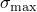; therefore, the nodal coordinates need to be related to the shape of the hole. Based on experience, the effect of a perturbation in the shape of the hole on the nodal coordinates lying outside the shaded region (shown in [Figure 1.18.2--1](ch01s18ach131.md#sxmdsastress-mesh)) can be neglected. The circular hole can be regarded as a special case of an ellipse with its major axis lying along the *x*-axis. Let *a* and *b* represent the semi-major and semi-minor axes, respectively; and consider a point with coordinates  lying on a circle concentric to the hole. The coordinates of this point can be parameterized as 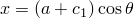 and 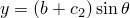, where  and  are constants and  represents the angle (measured from the positive *x*-axis) of the position vector to the point from the center of the circle. If the point lies on the boundary of the hole, 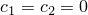. Positive values of  and  move the point into the interior of the plate. The dependence of the nodal coordinates on the parameter *a* is specified by providing the gradients of *x* and *y* with respect to *a* for the parameter shape variation. The gradients are given as

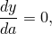

and 

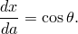

### Results and discussion

The maximum absolute stress, , in an infinite plate with an elliptical hole subjected to uniaxial tension  perpendicular to the major axis is given by 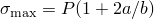 and is the 22-component at the end of the major axis of the ellipse (point M in [Figure 1.18.2--2](ch01s18ach131.md#sxmdsastress-nomin)). The contour of  in the vicinity of the hole is shown in [Figure 1.18.2--3](ch01s18ach131.md#sxmdsastress-s22) (shaded elements in [Figure 1.18.2--1](ch01s18ach131.md#sxmdsastress-mesh)). The finite element model gives a maximum stress of 299.3 units, which is close to the expected value of 300 units.

The sensitivity of  at M with respect to *a* is given by 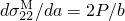. The value of 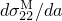 obtained from Abaqus/Design is 19.99 units and compares well with the analytical result of 20 units. [Figure 1.18.2--4](ch01s18ach131.md#sxmdsastress-dhs22) shows the contours of  near the hole. As expected,  is most sensitive to the variation in the semi-major axis at points nearest to the region of stress concentration. The value of  in the perturbation step is 9.995 units, exactly half the value in the linear static step as expected.

### Input file

[dsastressconcsens.inp](../eif/dsastressconcsens.inp)

Quarter plate model using CPS4 elements.

### Figures

**Figure 1.18.2–1** Quarter model using CPS4 elements.

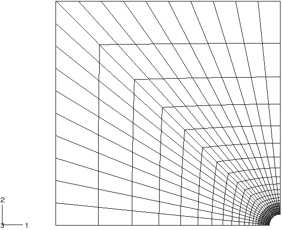

**Figure 1.18.2–2** Mesh details near the hole.

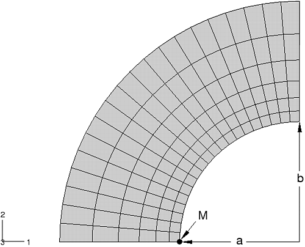

**Figure 1.18.2–3** Variation of  near the circular hole.

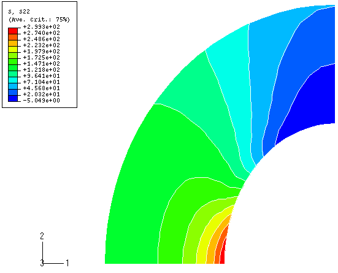

**Figure 1.18.2–4** The variation of the sensitivity 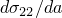 near the circular hole.

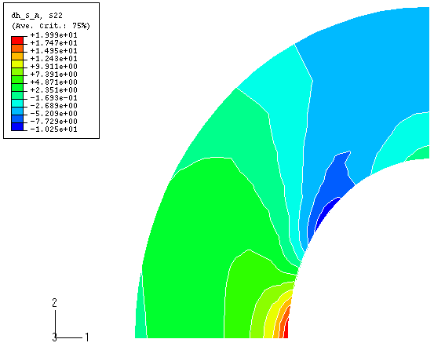

